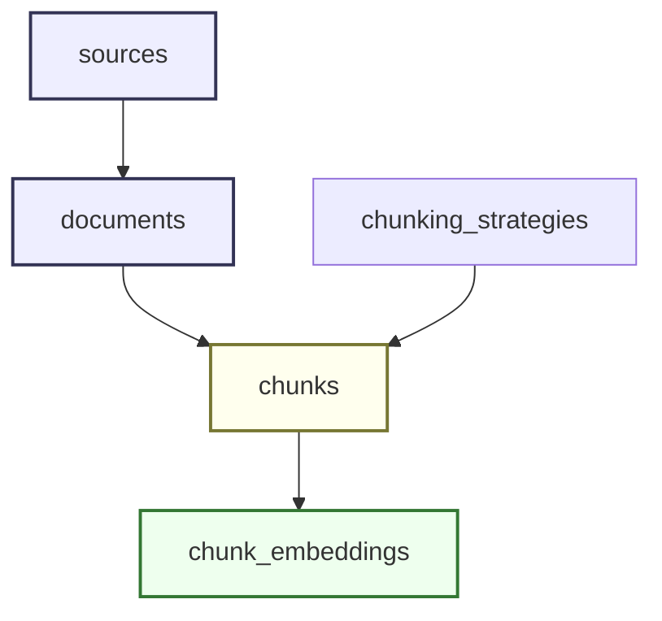
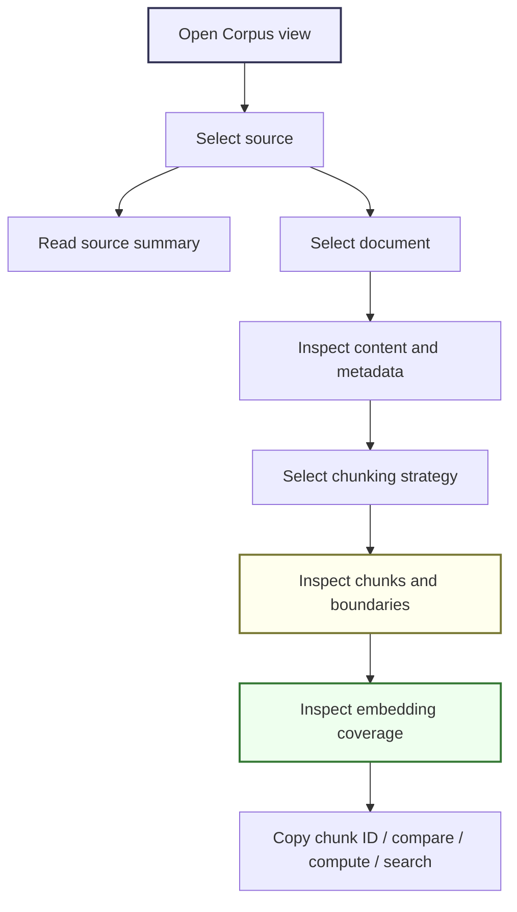

# Corpus Explorer and Pipeline Visualization Implementation Guide

## Executive summary

The RAG Evaluation System now has enough backend and corpus infrastructure to support a meaningful website experience. It can import sources, store documents, chunk documents under named strategies, compute embeddings through Geppetto/Pinocchio profiles, store vectors in SQLite, report embedding coverage by source, and compare stored embeddings with cosine similarity. It also has a realistic The Tree Center corpus imported from a WordPress/WooCommerce dump: 483 articles, 19 guides, and 2,594 products, with a bounded 255-chunk sample and source-balanced OpenAI embedding smoke data.

The current website does not yet expose that pipeline in a way that helps a user learn, experiment, and validate. The Pipeline view lists sources and documents. The Embeddings view can compute embeddings and compare chunks, but it does not show how content moved through the system. The user cannot easily answer these questions from the UI:

- What content did we ingest?
- Which source did this document come from?
- What did raw or normalized content become inside the app database?
- How was this document split into chunks?
- Where are chunk boundaries and overlaps?
- Which chunks have embeddings for a selected provider/model?
- Which chunks are missing embeddings?
- How can I copy a chunk ID and validate similarity or future search results?
- What part of the RAG pipeline is complete, pending, or not yet implemented?

This ticket designs a website improvement centered on those user intents. The recommended feature is a new **Corpus Explorer** view inside the existing React app, supported by a small set of backend corpus summary/detail endpoints. The design deliberately leaves visual freedom to a designer. It specifies the information architecture, data contracts, technical boundaries, and validation goals without prescribing a rigid final visual style.

## Intended reader

This guide is written for a new intern joining the project. You should be able to read this document and understand:

1. what the RAG Evaluation System is trying to do;
2. what backend data already exists;
3. what the website currently exposes;
4. what user intents the new UI must serve;
5. which files to read first;
6. which endpoints to add;
7. which frontend components to build;
8. how to validate the implementation without needing to understand every previous ticket.

The guide assumes you know Go, React, TypeScript, SQL, and HTTP at an intermediate level. It does not assume you know the project history.

## Problem statement

A RAG evaluation system is useful only when users can inspect the intermediate artifacts. Retrieval quality depends on many earlier decisions: corpus acquisition, normalization, document identity, chunking strategy, chunk boundaries, overlap, embedding provider, model dimensions, freshness, and search/reranking configuration. If a user only sees the final search result, they cannot diagnose whether a bad answer came from the source data, chunking, embeddings, indexing, retrieval, or evaluation logic.

The current website has a working shell but does not yet teach the pipeline. It exposes fragments:

- `PipelineView` lists sources and documents.
- `EmbeddingsView` lets a user choose a strategy, provider, model, dimensions, compute a bounded embedding batch, select chunks from one document, and compare stored vectors.
- `SearchView` and `EvaluationView` are placeholders.

The next website improvement should not start as a dashboard of charts. It should start as an explanatory explorer. The user should be able to pick a source, inspect documents, open a document, see its extracted content, see chunk boundaries, inspect embedding coverage, and understand what can be tested next.

The key design principle is: **the website should show the transformations, not only the outputs**.

## Current system overview

The system is a Go backend with SQLite persistence, Glazed CLI commands, HTTP endpoints, and a React frontend. It currently uses a service-layer architecture: CLI commands and HTTP handlers should call shared services instead of duplicating behavior.

Important repository path:

```text
/home/manuel/workspaces/2026-05-27/rag-evaluation-system/2026-05-27--rag-evaluation-system
```

Important implemented backend files:

| File | Why it matters |
|---|---|
| `internal/db/db.go` | Defines migrations for sources, documents, chunks, embeddings, search/eval tables. |
| `internal/db/queries.go` | Typed SQLite queries for documents, chunks, embeddings, coverage, similarity inputs. |
| `internal/services/source/service.go` | Source creation and filesystem scanning behavior. |
| `internal/services/document/service.go` | Document list/get/chunks behavior. |
| `internal/services/chunking/service.go` | Applies chunking strategies and persists strategy-aware chunks. |
| `internal/services/embedding/service.go` | Computes embeddings, skips fresh rows, and reports coverage. |
| `internal/services/embedding/similarity.go` | Computes stored cosine similarity. |
| `internal/api/handlers.go` | HTTP routes used by the frontend. |

Important implemented frontend files:

| File | Why it matters |
|---|---|
| `web/src/App.tsx` | Switches between top-level views. |
| `web/src/components/retro/MacMenuBar.tsx` | Defines the visible view navigation. |
| `web/src/services/api.ts` | RTK Query types and endpoint bindings. |
| `web/src/components/pipeline/PipelineView.tsx` | Current source/document overview. |
| `web/src/components/embeddings/EmbeddingsView.tsx` | Current embedding compute/similarity inspector. |
| `web/src/index.css` | Retro macOS styling and reusable CSS classes. |

Important corpus workflow files:

| File | Why it matters |
|---|---|
| `ttmp/2026/05/28/RAGEVAL-002--.../scripts/03-export-mysql-to-sqlite.py` | Exports WordPress/WooCommerce content into normalized corpus SQLite. |
| `ttmp/2026/05/28/RAGEVAL-002--.../scripts/04-import-corpus-into-rageval.py` | Imports normalized corpus rows into `data/rag-eval.db` documents. |
| `ttmp/2026/05/28/RAGEVAL-002--.../scripts/05-chunk-ttc-sample.sh` | Creates a bounded 3-guide/3-article/3-product chunk sample. |

## Current data model

The app database is `data/rag-eval.db`. The canonical RAG tables are:

```text
sources
documents
chunking_strategies
chunks
chunk_embeddings
```

The current pipeline state can be described as:



A document belongs to one source. A chunk belongs to one document and one strategy. An embedding belongs to one chunk, strategy, provider, model, and dimensions tuple.

The identity rules matter for the UI. If a user changes the selected provider from OpenAI to Ollama, the embedding coverage changes. If a user changes the chunking strategy, the chunks change. If a user changes the source, the document list and coverage counts change. The interface must keep these identities visible rather than hiding them behind ambiguous labels.

## Current API surface

`internal/api/handlers.go` currently registers these relevant routes:

```http
GET  /api/v1/health
GET  /api/v1/sources
POST /api/v1/sources
POST /api/v1/sources/{id}/scan
GET  /api/v1/documents
GET  /api/v1/documents/{id}
GET  /api/v1/documents/{id}/chunks
POST /api/v1/documents/{id}/chunk
GET  /api/v1/chunking-strategies
POST /api/v1/embeddings/compute
POST /api/v1/embeddings/coverage
POST /api/v1/embeddings/similarity
```

These endpoints are enough for basic pages, but not enough for a good Corpus Explorer. The missing API capabilities are:

- list documents by `source_id`;
- include chunk counts and embedding counts in document list rows;
- return a document with content text and metadata for inspection;
- return chunk embedding status per chunk;
- return source summary with document/word/chunk/embedding counts;
- return a transformation-oriented document detail payload.

The new feature should add `corpus` endpoints rather than overloading the current generic document endpoints. The generic endpoints can remain stable and simple.

## User intents

The design must begin from user intent, not from tables. The primary users are people learning, experimenting with, and validating the RAG pipeline.

### Intent 1: Learn what the pipeline does

The user wants to understand the sequence of transformations. They need an interface that explains:

```text
source -> document -> chunks -> embeddings -> similarity/search/evaluation
```

The UI should answer:

- What stage am I looking at?
- What data exists at this stage?
- What operation produced it?
- What operation can happen next?

### Intent 2: Inspect what was ingested

The user wants to know what content entered the system. For the TTC corpus, they need to distinguish:

- scraped guide Markdown from Defuddle;
- dump-derived articles;
- dump-derived guides;
- dump-derived products.

The UI should make source identity and corpus scale visible immediately.

### Intent 3: Validate normalization quality

The user wants to check whether the content text is good enough for chunking and retrieval. A product record may have a title and post content, but important facts may live in metadata. The UI should help identify whether `content_text` is missing important fields.

The UI should show:

- title;
- URL;
- source ID;
- metadata JSON fields, rendered readably;
- extracted text preview;
- raw HTML when useful;
- word count.

### Intent 4: Understand chunking

The user wants to verify whether chunking is sensible. They need to see chunk boundaries, overlap, text previews, and neighboring chunks. They should be able to inspect a specific chunk and copy its ID.

The UI should show:

- strategy ID;
- chunk index;
- start and end offsets;
- token estimate;
- text preview;
- overlap between neighboring chunks;
- full chunk text on selection.

### Intent 5: Validate embedding coverage

The user wants to know what has embeddings and what does not. Coverage should be visible at source, document, and chunk levels.

The UI should show:

- coverage by source;
- coverage by document;
- coverage strip across chunks;
- provider/model/dimensions tuple;
- missing count;
- computed count;
- stale count later, when implemented.

### Intent 6: Experiment safely

The user wants to run small actions without accidentally triggering large provider jobs. The UI should default to bounded operations and show cost-relevant counts before compute.

The UI should make limits explicit:

- source filter;
- strategy;
- provider profile;
- batch size;
- chunk limit;
- current missing count.

### Intent 7: Validate retrieval behavior

Once search exists, the user will want to ask why a result appeared. The Corpus Explorer should already prepare for that by making chunk IDs, document IDs, source IDs, and coverage visible. Search results should eventually link back into the Corpus Explorer.

## Product principle

The Corpus Explorer is not an admin table. It is an explanation and validation surface.

A table tells the user that documents exist. An explorer shows what those documents became. A good designer has freedom to improve the visual layout, hierarchy, typography, and interaction model, but the page must preserve these technical requirements:

- source identity must be visible;
- transformation stages must be explicit;
- chunk boundaries and overlap must be inspectable;
- embedding coverage must be visible before compute;
- every action that can call a provider must be bounded by default;
- IDs must be copyable because CLI and API workflows depend on them;
- errors must be displayed as actionable configuration or data-state problems.

## Proposed top-level information architecture

Add a new top-level view:

```text
Corpus
```

The current menu is defined in `web/src/components/retro/MacMenuBar.tsx`:

```ts
const views = [
  { id: 'pipeline', label: 'Pipeline' },
  { id: 'embeddings', label: 'Embeddings' },
  { id: 'search', label: 'Search' },
  { id: 'evaluation', label: 'Evaluation' },
];
```

Add:

```ts
{ id: 'corpus', label: 'Corpus' }
```

Then add a new switch case in `web/src/App.tsx`:

```tsx
case 'corpus':
  return <CorpusExplorerView />;
```

Recommended frontend file structure:

```text
web/src/components/corpus/CorpusExplorerView.tsx
web/src/components/corpus/SourceSummaryPanel.tsx
web/src/components/corpus/DocumentBrowser.tsx
web/src/components/corpus/DocumentInspector.tsx
web/src/components/corpus/ChunkTimeline.tsx
web/src/components/corpus/ChunkList.tsx
web/src/components/corpus/EmbeddingCoverageStrip.tsx
web/src/components/corpus/MetadataPanel.tsx
```

This split lets a designer improve each surface independently. The first implementation can put several components in one file if speed matters, but the target structure should separate responsibilities.

## Proposed user flow

The default Corpus view should guide the user through a left-to-right or top-to-bottom sequence:

1. Choose a source.
2. Choose a document.
3. Inspect content and metadata.
4. Inspect chunks under a strategy.
5. Inspect embedding coverage under a provider/model/dimensions tuple.
6. Copy a chunk ID or open similarity/search actions.



The UI should not require the user to understand SQL table names. It should use plain labels such as Source, Document, Chunks, Embeddings, and Coverage. It should still expose exact IDs in copyable controls.

## Suggested page layout

A strong first layout is a three-level explorer.

```text
┌────────────────────────────────────────────────────────────────────┐
│ Corpus Explorer                                                     │
│ Purpose: inspect how ingested content becomes chunks and vectors.   │
├───────────────────────┬────────────────────────────────────────────┤
│ Sources               │ Source summary and document browser         │
│                       │                                            │
│ ttc-dump-articles     │ Filters: source, status, words, coverage    │
│ ttc-dump-guides       │                                            │
│ ttc-dump-products     │ Document table                              │
│ thetreecenter-guides  │                                            │
├───────────────────────┴────────────────────────────────────────────┤
│ Selected document inspector                                         │
│ Metadata | Extracted text | Chunk timeline | Chunk list | Coverage  │
└────────────────────────────────────────────────────────────────────┘
```

This can be implemented with existing `MacWindow` components. A designer can later improve density, spacing, empty states, and visual hierarchy.

The first slice should prefer clarity over animation. If the user can answer the validation questions quickly, the design is working.

## Proposed backend endpoints

Add corpus-specific endpoints in `internal/api/handlers.go` and supporting query/service code. Keep them read-oriented at first.

### Endpoint 1: source summaries

```http
GET /api/v1/corpus/sources?strategy_id=fixed-1200-150&provider_type=openai&model=text-embedding-3-small&dimensions=1536
```

Response:

```json
{
  "items": [
    {
      "source_id": "ttc-dump-articles",
      "source_name": "TTC dump articles",
      "source_type": "sqlite-corpus",
      "document_count": 483,
      "word_count": 605850,
      "chunk_count": 162,
      "embedded_count": 10,
      "missing_embedding_count": 152
    }
  ],
  "embedding_identity": {
    "strategy_id": "fixed-1200-150",
    "provider_type": "openai",
    "model": "text-embedding-3-small",
    "dimensions": 1536
  }
}
```

This endpoint supports the top-level source list. If no embedding identity is supplied, return document and word counts with `chunk_count` where possible and omit embedding counts or return `null`.

### Endpoint 2: document list by source

```http
GET /api/v1/corpus/documents?source_id=ttc-dump-articles&strategy_id=fixed-1200-150&provider_type=openai&model=text-embedding-3-small&dimensions=1536&limit=100&offset=0
```

Response:

```json
{
  "items": [
    {
      "id": "ttc-article-6737",
      "source_id": "ttc-dump-articles",
      "external_id": "ttc-article-6737",
      "title": "Crape Myrtle Varieties and Guide",
      "url": "https://www.thetreecenter.com/crape-myrtle-varieties-and-guide/",
      "word_count": 18000,
      "status": "chunked",
      "chunk_count": 59,
      "embedded_count": 10,
      "missing_embedding_count": 49,
      "created_at": "...",
      "updated_at": "..."
    }
  ],
  "page": {
    "limit": 100,
    "offset": 0
  }
}
```

This endpoint should support source filtering from day one. The current `GET /api/v1/documents` is fixed at `Limit: 50, Offset: 0` and has no source filter. The Corpus Explorer needs a better endpoint.

### Endpoint 3: document detail with chunks

```http
GET /api/v1/corpus/documents/{id}?strategy_id=fixed-1200-150&provider_type=openai&model=text-embedding-3-small&dimensions=1536&include_text=true
```

Response:

```json
{
  "document": {
    "id": "ttc-article-6737",
    "source_id": "ttc-dump-articles",
    "title": "Crape Myrtle Varieties and Guide",
    "url": "https://www.thetreecenter.com/...",
    "word_count": 18000,
    "status": "chunked",
    "metadata": {
      "wp_id": 6737,
      "kind": "article",
      "slug": "crape-myrtle-varieties-and-guide"
    },
    "content_text": "...",
    "content_html_preview": "..."
  },
  "chunks": [
    {
      "id": "chk-b16aa790147ae371",
      "strategy_id": "fixed-1200-150",
      "chunk_index": 0,
      "start_offset": 0,
      "end_offset": 1200,
      "token_count": 300,
      "text": "...",
      "embedding": {
        "present": true,
        "provider_type": "openai",
        "model": "text-embedding-3-small",
        "dimensions": 1536,
        "text_hash": "...",
        "updated_at": "..."
      }
    }
  ]
}
```

This is the most important endpoint. It should provide everything needed for a document inspector and chunk timeline in one request.

### Endpoint 4: optional transformation summary

This can be implemented later:

```http
GET /api/v1/corpus/documents/{id}/pipeline
```

Response:

```json
{
  "steps": [
    { "name": "imported", "status": "done", "detail": "Imported from ttc-corpus.sqlite" },
    { "name": "document", "status": "done", "detail": "Stored in documents" },
    { "name": "chunked", "status": "done", "detail": "59 chunks with fixed-1200-150" },
    { "name": "embedded", "status": "partial", "detail": "10/59 chunks embedded" },
    { "name": "indexed", "status": "pending", "detail": "Search index not built" }
  ]
}
```

The first implementation can derive this in the frontend from document/chunk/coverage data. A dedicated endpoint is only needed if the derivation becomes complex.

## Backend implementation plan

Create a new service package:

```text
internal/services/corpus/service.go
internal/services/corpus/service_test.go
```

Why a service? The project rule is that CLI and HTTP should be thin adapters over services. Even if the first consumer is only HTTP, a corpus service keeps query logic out of handlers and leaves room for a future `rag-eval corpus ...` CLI group.

### Service types

Suggested Go types:

```go
type EmbeddingIdentity struct {
    StrategyID   string `json:"strategy_id"`
    ProviderType string `json:"provider_type"`
    Model        string `json:"model"`
    Dimensions   int    `json:"dimensions"`
}

type SourceSummaryRequest struct {
    Embedding EmbeddingIdentity
}

type SourceSummary struct {
    SourceID              string `json:"source_id"`
    SourceName            string `json:"source_name"`
    SourceType            string `json:"source_type"`
    DocumentCount         int    `json:"document_count"`
    WordCount             int    `json:"word_count"`
    ChunkCount            int    `json:"chunk_count"`
    EmbeddedCount         int    `json:"embedded_count"`
    MissingEmbeddingCount int    `json:"missing_embedding_count"`
}

type DocumentBrowserRequest struct {
    SourceID  string
    Embedding EmbeddingIdentity
    Limit     int
    Offset    int
}

type CorpusDocumentRow struct {
    ID                    string `json:"id"`
    SourceID              string `json:"source_id"`
    Title                 string `json:"title"`
    URL                   string `json:"url"`
    WordCount             int    `json:"word_count"`
    Status                string `json:"status"`
    ChunkCount            int    `json:"chunk_count"`
    EmbeddedCount         int    `json:"embedded_count"`
    MissingEmbeddingCount int    `json:"missing_embedding_count"`
}
```

### Source summary query pseudocode

```sql
SELECT
  s.id,
  s.name,
  s.type,
  COUNT(DISTINCT d.id) AS document_count,
  COALESCE(SUM(d.word_count), 0) AS word_count,
  COUNT(c.id) AS chunk_count,
  SUM(CASE WHEN ce.chunk_id IS NULL THEN 0 ELSE 1 END) AS embedded_count
FROM sources s
LEFT JOIN documents d ON d.source_id = s.id
LEFT JOIN chunks c ON c.document_id = d.id AND c.strategy_id = :strategy_id
LEFT JOIN chunk_embeddings ce ON ce.chunk_id = c.id
  AND ce.strategy_id = c.strategy_id
  AND ce.provider = :provider_type
  AND ce.model = :model
  AND ce.dimensions = :dimensions
GROUP BY s.id, s.name, s.type
ORDER BY s.id;
```

If no strategy or embedding identity is supplied, the query should still return document and word counts. The first implementation may require the identity for simplicity, because the current use case is embedding coverage visualization.

### Document browser query pseudocode

```sql
SELECT
  d.id,
  d.source_id,
  d.title,
  d.url,
  d.word_count,
  d.status,
  COUNT(c.id) AS chunk_count,
  SUM(CASE WHEN ce.chunk_id IS NULL THEN 0 ELSE 1 END) AS embedded_count
FROM documents d
LEFT JOIN chunks c ON c.document_id = d.id AND c.strategy_id = :strategy_id
LEFT JOIN chunk_embeddings ce ON ce.chunk_id = c.id
  AND ce.strategy_id = c.strategy_id
  AND ce.provider = :provider_type
  AND ce.model = :model
  AND ce.dimensions = :dimensions
WHERE d.source_id = :source_id
GROUP BY d.id
ORDER BY d.word_count DESC, d.id
LIMIT :limit OFFSET :offset;
```

### Document detail query pseudocode

Fetch the document:

```sql
SELECT id, source_id, external_id, title, url, content_type,
       content_text, content_html, word_count, metadata_json, status,
       created_at, updated_at
FROM documents
WHERE id = :id;
```

Fetch chunks and embedding status:

```sql
SELECT
  c.id,
  c.document_id,
  c.strategy_id,
  c.chunk_index,
  c.text,
  c.token_count,
  c.start_offset,
  c.end_offset,
  ce.text_hash,
  ce.updated_at
FROM chunks c
LEFT JOIN chunk_embeddings ce ON ce.chunk_id = c.id
  AND ce.strategy_id = c.strategy_id
  AND ce.provider = :provider_type
  AND ce.model = :model
  AND ce.dimensions = :dimensions
WHERE c.document_id = :document_id
  AND c.strategy_id = :strategy_id
ORDER BY c.chunk_index;
```

### Tests

Use temporary SQLite databases, following the pattern in existing service tests:

```text
internal/services/source/service_test.go
internal/services/chunking/service_test.go
internal/services/document/service_test.go
internal/services/embedding/service_test.go
```

Test cases:

1. Source summary returns document/word/chunk counts.
2. Source summary returns embedded/missing counts for one identity.
3. Document browser filters by source and paginates.
4. Document detail returns content metadata, chunk rows, and embedding presence.
5. Missing document returns a typed not-found error or `nil` result that HTTP maps to `404`.

## Frontend implementation plan

### RTK Query additions

Extend `web/src/services/api.ts` with types and endpoints.

Types:

```ts
export interface CorpusSourceSummary {
  source_id: string;
  source_name: string;
  source_type: string;
  document_count: number;
  word_count: number;
  chunk_count: number;
  embedded_count: number;
  missing_embedding_count: number;
}

export interface CorpusDocumentRow {
  id: string;
  source_id: string;
  title: string;
  url: string;
  word_count: number;
  status: string;
  chunk_count: number;
  embedded_count: number;
  missing_embedding_count: number;
}

export interface CorpusChunk {
  id: string;
  strategy_id: string;
  chunk_index: number;
  start_offset: number;
  end_offset: number;
  token_count: number;
  text: string;
  embedding?: {
    present: boolean;
    provider_type: string;
    model: string;
    dimensions: number;
    text_hash?: string;
    updated_at?: string;
  };
}

export interface CorpusDocumentDetail {
  document: Document & {
    metadata?: Record<string, unknown>;
    content_text?: string;
    content_html_preview?: string;
  };
  chunks: CorpusChunk[];
}
```

Endpoints:

```ts
listCorpusSources: builder.query<CorpusSourceSummary[], CorpusIdentityArgs>({ ... })
listCorpusDocuments: builder.query<CorpusDocumentRow[], CorpusDocumentArgs>({ ... })
getCorpusDocument: builder.query<CorpusDocumentDetail, CorpusDocumentDetailArgs>({ ... })
```

Tag types:

```ts
tagTypes: ['Sources', 'Documents', 'Chunks', 'Strategies', 'Embeddings', 'Corpus']
```

### Component structure

Recommended first slice:

```tsx
export const CorpusExplorerView: React.FC = () => {
  const [identity, setIdentity] = useState(defaultIdentity);
  const [sourceID, setSourceID] = useState('');
  const [documentID, setDocumentID] = useState('');

  const sources = useListCorpusSourcesQuery(identity);
  const docs = useListCorpusDocumentsQuery({ sourceID, ...identity });
  const detail = useGetCorpusDocumentQuery({ documentID, ...identity }, { skip: !documentID });

  return (
    <div className="corpus-explorer">
      <CorpusIdentityBar value={identity} onChange={setIdentity} />
      <SourceSummaryPanel sources={sources.data} selected={sourceID} onSelect={setSourceID} />
      <DocumentBrowser documents={docs.data} selected={documentID} onSelect={setDocumentID} />
      <DocumentInspector detail={detail.data} />
    </div>
  );
};
```

Keep the first implementation straightforward. The designer can later reshape the visual arrangement while preserving the data flow.

## Component responsibilities

### `CorpusIdentityBar`

Lets the user choose the identity used for chunk/embedding inspection:

- strategy ID;
- provider type;
- model;
- dimensions.

Defaults should reflect current OpenAI smoke data:

```text
strategy_id: fixed-1200-150
provider_type: openai
model: text-embedding-3-small
dimensions: 1536
```

This is not the only valid identity, but it gives the current TTC corpus a meaningful default.

### `SourceSummaryPanel`

Shows source-level counts.

Columns:

| Source | Documents | Words | Chunks | Embedded | Missing |
|---|---:|---:|---:|---:|---:|

Clicking a source updates the document browser.

### `DocumentBrowser`

Shows documents for the selected source.

Columns:

| Title | Words | Chunks | Embedded | Missing | Status |
|---|---:|---:|---:|---:|---|

Filters for later:

- title substring;
- minimum/maximum word count;
- only missing embeddings;
- only chunked documents;
- product/article/guide kind if source grouping changes.

### `DocumentInspector`

Shows selected document details. It should have tabs or panels:

- Overview;
- Metadata;
- Extracted Text;
- Chunks;
- Embeddings.

The Overview should answer: what is this document and where did it come from?

The Chunks panel should answer: how did this document get split?

The Embeddings panel should answer: which chunks have vectors for the selected identity?

### `ChunkTimeline`

Visualizes chunk boundaries. A simple first version can be a list with ranges:

```text
#0  0–1200      embedded
#1  1050–2250   embedded
#2  2100–3300   missing
```

A better designer-led version can draw proportional bars. The technical requirement is that `start_offset` and `end_offset` remain visible.

### `EmbeddingCoverageStrip`

Shows chunk-level embedding state in a compact strip:

```text
✓ ✓ ✓ ✓ ✓ · · · · ·
```

Legend:

- `✓` = embedding present;
- `·` = embedding missing;
- `!` = stale, once stale detection exists.

This strip is valuable because it shows whether partial embedding jobs only covered the beginning of a document.

## Visual design freedom

The current app uses retro macOS styling. The Corpus Explorer should fit the app but should not be constrained to a literal table-only interface. A designer has freedom to improve:

- layout density;
- color hierarchy;
- chunk boundary visualization;
- empty states;
- source cards;
- document cards;
- metadata presentation;
- responsive behavior;
- icons for pipeline stage status;
- side-by-side content/chunk comparison.

The design must preserve technical clarity. A visually refined version is successful only if a user can still identify the exact source, document ID, strategy, chunk ID, provider, model, and dimensions involved.

## Suggested first implementation slice

Do not build the full explorer at once. Implement in slices.

### Slice 1: read-only Corpus Explorer

Backend:

- `GET /api/v1/corpus/sources`
- `GET /api/v1/corpus/documents`
- `GET /api/v1/corpus/documents/{id}`

Frontend:

- add Corpus menu item;
- source summary table;
- document table;
- document inspector with chunk list and coverage strip.

Validation:

- source counts match SQLite validation commands;
- selecting `ttc-dump-articles` shows 483 documents;
- selecting `Crape Myrtle Varieties and Guide` shows chunks and OpenAI coverage.

### Slice 2: action links

Add:

- copy document ID;
- copy chunk ID;
- open chunk in Embeddings view;
- compare selected chunk with top candidates;
- compute embeddings for selected source with a small limit.

This slice should reuse existing embedding endpoints rather than duplicate compute logic.

### Slice 3: transformation-focused UX

Add:

- raw HTML vs extracted text tab;
- chunk boundary highlighting in extracted text;
- overlap visualization;
- metadata-to-text warning for product documents.

### Slice 4: search integration

After BM25 exists, search results should link to Corpus Explorer with selected document and chunk. The Corpus Explorer should become the place where a user investigates why a search result matched.

## Validation checklist for the intern

Before starting:

```bash
GOMAXPROCS=2 GOMEMLIMIT=1024MiB go test ./internal/db ./internal/ingest ./internal/chunking ./internal/services/source ./internal/services/chunking ./internal/services/document ./internal/services/embedding -count=1 -timeout 60s
GOMAXPROCS=2 GOMEMLIMIT=1024MiB go build ./cmd/rag-eval
cd web && npm run build
```

After adding backend corpus service:

```bash
GOMAXPROCS=2 GOMEMLIMIT=1024MiB go test ./internal/services/corpus ./internal/api -count=1 -timeout 60s
GOMAXPROCS=2 GOMEMLIMIT=1024MiB go build ./cmd/rag-eval
```

After adding frontend:

```bash
cd web && npm run build
```

Manual API checks:

```bash
curl 'http://localhost:8080/api/v1/corpus/sources?strategy_id=fixed-1200-150&provider_type=openai&model=text-embedding-3-small&dimensions=1536' | jq .

curl 'http://localhost:8080/api/v1/corpus/documents?source_id=ttc-dump-articles&strategy_id=fixed-1200-150&provider_type=openai&model=text-embedding-3-small&dimensions=1536&limit=10' | jq .

curl 'http://localhost:8080/api/v1/corpus/documents/ttc-article-6737?strategy_id=fixed-1200-150&provider_type=openai&model=text-embedding-3-small&dimensions=1536&include_text=true' | jq .
```

Manual UI checks:

1. Open the website.
2. Click Corpus.
3. Confirm source summary shows TTC dump sources.
4. Select `ttc-dump-articles`.
5. Confirm document table shows article rows.
6. Select `Crape Myrtle Varieties and Guide` or another chunked document.
7. Confirm chunk list shows ranges and IDs.
8. Confirm coverage strip shows present/missing embeddings.
9. Copy a chunk ID and use it in `rag-eval embedding similarity`.

## Accessibility and agent-readability notes

This UI will often be used by humans, but it should also be easy for agents to inspect through the browser accessibility tree. Prefer semantic HTML:

- real buttons for actions;
- tables for tabular data;
- labels on inputs;
- headings for sections;
- `aria-label` for compact icon controls;
- visible text for IDs and statuses.

Avoid encoding important state only in color. Coverage strips should have text labels or tooltips that expose present/missing status.

## Open questions

1. Should product metadata be copied into `documents.content_text` during corpus import, or should Corpus Explorer show that metadata is outside searchable text?
2. Should Corpus Explorer read only from `data/rag-eval.db`, or should it also attach `data/corpus/ttc-dump/ttc-corpus.sqlite` for richer taxonomy/product metadata?
3. Should source grouping remain split by `ttc-dump-articles`, `ttc-dump-guides`, and `ttc-dump-products`, or should the UI eventually model one `ttc-dump` source with kind filters?
4. Should embedding coverage compute stale counts now, or is present/missing enough for the first visual slice?
5. Should the Corpus Explorer include write actions in the first release, or remain read-only until users trust the visualization?

## Recommended design stance

Give the designer freedom to make the page feel exploratory and coherent. The page does not need to look like a database admin tool. It should feel like an instrument for understanding the pipeline.

The technical constraints are strict, but the visual treatment is open. A strong design will make the pipeline legible without requiring the user to read SQL or CLI output. It will show scale at the source level, transformation at the document level, boundaries at the chunk level, and readiness at the embedding level.

The first successful version should let a user say:

- I know what content was ingested.
- I know what happened to this document.
- I know how it was chunked.
- I know which chunks are embedded.
- I know what I can test next.

That is the user value of the Corpus Explorer.
