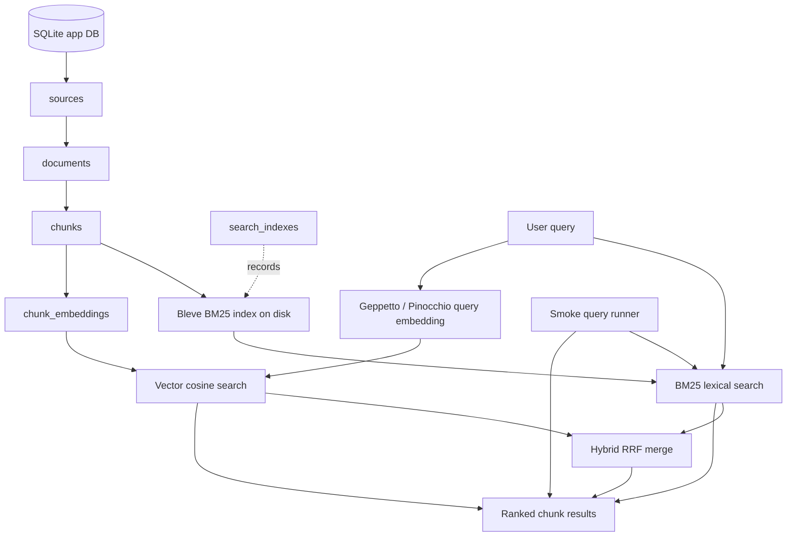

# Retrieval Status, Measurements, and UX Implementation Guide

## Executive summary

RAGEVAL-004 moved the RAG Evaluation System from corpus inspection into working retrieval. The system can now build a BM25 index over persisted chunks, run BM25 lexical queries, embed a live user query and compare it to stored chunk embeddings, merge BM25 and vector results with reciprocal-rank fusion, and run a lightweight BM25 smoke-query suite.

The implementation is good enough to run real queries. It is not yet good enough to claim retrieval quality. The current results show that the retrieval paths execute correctly, but they also expose expected weaknesses: the indexed sample is small, embedding coverage is sparse, product `content_text` is missing structured facts, smoke checks are permissive, and hybrid ranking is intentionally simple.

The next phase should improve retrieval quality in this order:

1. compose product text from structured product metadata;
2. re-import and inspect product documents before embedding;
3. chunk broader source-balanced samples;
4. build separate and combined BM25 indexes;
5. run 15–25 manual real-query inspections;
6. expand embeddings in bounded batches;
7. strengthen smoke checks;
8. promote reviewed queries into labeled benchmark candidates;
9. add grouping/deduplication and result-context controls;
10. expose search/indexing state in the web UI.

This document records what exists, what was measured, what the measurements mean, how to implement the next features, and what a UX designer can now build into the webpage.

## Current implemented retrieval system

The current retrieval stack has three retrievers and one smoke-test path.



### Implemented files

| Layer | Files |
|---|---|
| Search DB helpers | `internal/db/search_queries.go` |
| Shared search types/defaults | `internal/services/search/service.go` |
| BM25 indexing/query service | `internal/services/search/bm25.go` |
| Query-vector service | `internal/services/search/vector.go` |
| Hybrid RRF service | `internal/services/search/hybrid.go` |
| Search unit tests | `internal/services/search/service_test.go` |
| Search CLI root | `cmd/rag-eval/cmds/search/root.go` |
| BM25 index CLI | `cmd/rag-eval/cmds/search/index.go` |
| BM25 query CLI | `cmd/rag-eval/cmds/search/query.go` |
| Vector query CLI | `cmd/rag-eval/cmds/search/vector.go` |
| Hybrid query CLI | `cmd/rag-eval/cmds/search/hybrid.go` |
| Smoke query CLI | `cmd/rag-eval/cmds/search/smoke.go` |
| API handlers | `internal/api/handlers.go` |
| Seed smoke suite | `eval/ttc-smoke.yaml` |
| Primary design guide | `ttmp/2026/05/28/RAGEVAL-004--end-to-end-search-retrieval-foundation/design-doc/01-end-to-end-search-retrieval-implementation-guide.md` |
| Diary | `ttmp/2026/05/28/RAGEVAL-004--end-to-end-search-retrieval-foundation/reference/01-implementation-diary.md` |

### Implemented CLI commands

```bash
rag-eval search index
rag-eval search query
rag-eval search vector
rag-eval search hybrid
rag-eval search smoke
```

### Implemented HTTP endpoints

```http
POST /api/v1/search/indexes
POST /api/v1/search/query
POST /api/v1/search/vector
POST /api/v1/search/hybrid
```

### Important commits

| Commit | Description |
|---|---|
| `c24d8a5` | `feat: add BM25 search service and CLI` |
| `7912b59` | `docs: record BM25 search implementation diary` |
| `314f4ed` | `feat: add BM25 search HTTP endpoints` |
| `73c418b` | `docs: record BM25 HTTP endpoint diary` |
| `952b4ab` | `feat: add vector query search` |
| `a4157a5` | `docs: record vector search diary` |
| `5fd061a` | `feat: add hybrid retrieval and smoke checks` |
| `5ac5365` | `docs: record hybrid retrieval diary` |
| `6651474` | `docs: record retrieval foundation validation` |

## What has been measured

The current measurements are smoke-level measurements. They are not benchmark metrics. They answer whether retrieval paths execute and whether returned chunks are plausible enough to inspect.

### BM25 index build measurement

The first validated BM25 index was built with:

```bash
GOMAXPROCS=2 GOMEMLIMIT=1024MiB ./rag-eval search index \
  --strategy-id fixed-1200-150 \
  --source-ids ttc-dump-guides,ttc-dump-articles \
  --index-id bm25-ttc-guides-articles-fixed-1200-150 \
  --force \
  --output table
```

Measured output:

| Index ID | Strategy | Sources | Documents | Chunks |
|---|---|---|---:|---:|
| `bm25-ttc-guides-articles-fixed-1200-150` | `fixed-1200-150` | `ttc-dump-articles,ttc-dump-guides` | 6 | 204 |

Interpretation: this index is a small retrieval validation index. It proves the BM25 path works on real TTC chunks. It does not represent the full TTC corpus.

### BM25 real-query measurements

Three direct BM25 queries were run against the index.

#### Query: `crape myrtle varieties`

Top result family:

- document: `ttc-article-6737`
- title: `Crape Myrtle Varieties and Guide`
- source: `ttc-dump-articles`

Interpretation: this is the clean lexical case. The query terms match title/body text in an indexed article. BM25 returned the expected document family.

#### Query: `how to plant arborvitae`

Top result family included:

- `How to Plant Japanese Maples`
- `How To Plant a Privacy Screen`

Interpretation: the result is partially plausible because the indexed chunks contain planting language and privacy-screen material. It is also weak because the top result is not arborvitae-specific. This may be an index coverage issue, a corpus text issue, or a ranking issue. It should not be treated as a BM25 implementation failure until the relevant arborvitae material is confirmed to be present in indexed chunks.

#### Query: `hydrangea pruning`

Top result family included weak matches from unrelated documents such as Japanese maples and Crape Myrtle.

Interpretation: this is a warning. The bounded indexed sample does not appear to contain focused hydrangea pruning content, or BM25 cannot find it. This query should become an inspection target before it becomes a benchmark query.

### Vector query measurement

A live OpenAI query-vector smoke was run with:

```bash
GOMAXPROCS=2 GOMEMLIMIT=1024MiB ./rag-eval search vector \
  --query "which trees make a good privacy screen" \
  --strategy-id fixed-1200-150 \
  --source-ids ttc-dump-articles,ttc-dump-guides,ttc-dump-products,thetreecenter-guides \
  --profile openai-embedding-small \
  --profile-registries ~/.config/pinocchio/profiles.yaml \
  --limit 5 \
  --candidate-limit 80 \
  --preview-runes 140 \
  --output table
```

Top results included:

| Rank | Source | Document | Example |
|---:|---|---|---|
| 1 | `ttc-dump-products` | `Leyland Cypress` | screening tree / fast-growing product text |
| 2 | `ttc-dump-products` | `Leyland Cypress` | hedge/screen text |
| 3 | `ttc-dump-products` | `Leyland Cypress` | zone/growth text |
| 5 | `ttc-dump-articles` | `Crape Myrtle Varieties and Guide` | screening-related article chunk |

Interpretation: this is a good vector smoke result. It shows semantic retrieval over stored product/article embeddings. It also reminds us that vector search can only search chunks that already have embeddings.

### Hybrid retrieval measurement

A live hybrid query was run with:

```bash
GOMAXPROCS=2 GOMEMLIMIT=1024MiB ./rag-eval search hybrid \
  --query "which trees make a good privacy screen" \
  --index-id bm25-ttc-guides-articles-fixed-1200-150 \
  --strategy-id fixed-1200-150 \
  --source-ids ttc-dump-articles,ttc-dump-guides,ttc-dump-products,thetreecenter-guides \
  --profile openai-embedding-small \
  --profile-registries ~/.config/pinocchio/profiles.yaml \
  --limit 5 \
  --bm25-limit 20 \
  --vector-limit 20 \
  --candidate-limit 80 \
  --preview-runes 120 \
  --output table
```

Observed result mix:

| Contribution | Example result |
|---|---|
| Vector rank 1 | `Leyland Cypress`, product chunk |
| BM25 rank 1 | `How To Plant a Privacy Screen`, guide chunk |
| BM25 ranks 2–3 | More `How To Plant a Privacy Screen` chunks |

Interpretation: hybrid retrieval is showing complementary evidence. Vector search finds product chunks about screening trees. BM25 finds guide chunks whose text directly mentions privacy screens. This is exactly why hybrid retrieval should exist, but the current RRF merge is still basic.

### Smoke suite measurement

The seed smoke suite is:

```text
eval/ttc-smoke.yaml
```

It was run with:

```bash
./rag-eval search smoke \
  --file eval/ttc-smoke.yaml \
  --index-id bm25-ttc-guides-articles-fixed-1200-150 \
  --limit 5 \
  --output table
```

Measured smoke output:

| Query ID | Query | Status | Matched terms | Top title | Interpretation |
|---|---|---|---|---|---|
| `crape-myrtle-varieties` | `crape myrtle varieties` | pass | `crape,myrtle` | `Crape Myrtle Varieties and Guide` | Good lexical sanity result. |
| `arborvitae-planting` | `how to plant arborvitae` | pass | `plant` | `How to Plant Japanese Maples` | Too permissive; top result is generic planting content. |
| `emerald-green-spacing` | `emerald green arborvitae spacing` | pass | `emerald,green,arborvitae` | `Thuja Green Giant Guide` | Plausible but needs product/document inspection. |
| `hydrangea-pruning` | `hydrangea pruning` | warn | none | `How to Plant Japanese Maples` | Weak result; likely missing indexed evidence. |
| `privacy-screen-trees` | `fast growing trees for privacy screen` | pass | `privacy,screen` | `How To Plant a Privacy Screen` | Good guide-level result. |

Interpretation: the smoke runner is useful, but intentionally permissive. It should not be used as a benchmark. Its job is to flag obviously broken or weak retrieval conditions.

## Why quality is not great yet

The current quality problems are mostly expected. They arise from corpus coverage, text composition, embeddings coverage, and minimal ranking configuration.

### The index is a small sample

The validated BM25 index contains 204 chunks from 6 documents. The normalized TTC corpus contains thousands of primary documents, but only a bounded subset has been chunked and indexed for the first retrieval validation. Queries whose answers live outside that subset cannot succeed.

### Embedding coverage is sparse

The vector retriever searches stored embeddings only. The current embedded set is a small source-balanced smoke sample, not full-corpus coverage. Sparse vector coverage is enough to validate code paths and inspect a few queries; it is not enough to judge semantic retrieval quality.

### Product text composition is incomplete

Product documents are the biggest quality risk. Structured product facts exist in the normalized corpus, but not all facts are composed into the app `documents.content_text`. Product retrieval depends on fields such as hardiness zone, mature height, mature width, sunlight, soil, drought tolerance, botanical name, categories, tags, and product attributes.

If those fields are not in chunk text, BM25 cannot match them. If those fields are not in chunk text, embeddings cannot represent them reliably either. Full product embeddings should wait until product text composition is improved.

### Chunk text may lack retrieval context

A chunk can contain body text without the document title, source kind, section heading, product category, or neighboring context. This affects vector search especially. The stored chunk text may be display-oriented rather than retrieval-input-oriented.

A future improvement should distinguish:

- display text: the exact chunk text shown to users;
- retrieval text: deterministic text used for indexing/embedding, including title/source/metadata context.

### BM25 is using a minimal query model

The current BM25 query searches `text` and boosted `title`. It does not yet have explicit field mappings for product facts, category/tags, botanical names, exact product names, or phrase matching. That is acceptable for a baseline but not enough for a tuned search engine.

### Smoke tests are not strict enough

`arborvitae-planting` passed because `plant` appeared in top results. That is useful for showing that BM25 returned generic planting content, but it is not a strong relevance signal. Smoke tests need stricter modes before they become benchmark candidates.

### Hybrid RRF is basic

Hybrid search currently uses simple reciprocal-rank fusion. It does not yet account for document diversity, duplicate neighboring chunks, source preferences, query intent, or whether both retrievers found the same document family.

## Detailed implementation guide for next retrieval features

This section describes the implementation work that should happen next.

## Feature 1: product text composition

### Goal

Make product documents searchable by structured product facts, not only body prose.

### Files to inspect first

```text
ttmp/2026/05/28/RAGEVAL-002--extract-the-tree-center-content-dump-into-ordered-sqlite-corpus/scripts/03-export-mysql-to-sqlite.py
ttmp/2026/05/28/RAGEVAL-002--extract-the-tree-center-content-dump-into-ordered-sqlite-corpus/scripts/04-import-corpus-into-rageval.py
data/corpus/ttc-dump/ttc-corpus.sqlite
internal/db/db.go
internal/db/queries.go
```

### Desired composed product text

A product document should have deterministic text like:

```text
Title: Leyland Cypress
Content kind: product
Botanical name: Cupressus × leylandii
Categories: Evergreen Trees; Privacy Trees; Fast Growing Trees
Tags: privacy; evergreen; screening
Hardiness zones: 6-10
Mature height: 40-60 feet
Mature width: 15-25 feet
Sunlight: Full sun to partial shade
Soil: Well-drained soil
Drought tolerance: Moderate
Growth rate: Fast

Summary:
...

Description:
...
```

This should be built from normalized corpus fields and metadata. Missing values should be omitted, not printed as noisy empty fields.

### Pseudocode

```python
def compose_product_text(item, product_meta, terms):
    sections = []
    sections.append(f"Title: {item.title}")
    sections.append("Content kind: product")

    facts = []
    add_fact(facts, "Botanical name", product_meta.botanical_name)
    add_fact(facts, "Hardiness zones", product_meta.hardiness_zone)
    add_fact(facts, "Mature height", product_meta.mature_height)
    add_fact(facts, "Mature width", product_meta.mature_width)
    add_fact(facts, "Sunlight", product_meta.sunlight)
    add_fact(facts, "Soil", product_meta.soil)
    add_fact(facts, "Drought tolerance", product_meta.drought_tolerance)
    add_fact(facts, "Growth rate", product_meta.growth_rate)

    categories = terms_for(item.id, taxonomy="product_cat")
    tags = terms_for(item.id, taxonomy="product_tag")
    add_fact(facts, "Categories", join_terms(categories))
    add_fact(facts, "Tags", join_terms(tags))

    sections.extend(facts)

    if item.excerpt:
        sections.append("\nSummary:\n" + clean_text(item.excerpt))
    if item.content_text:
        sections.append("\nDescription:\n" + clean_text(item.content_text))

    return "\n".join(sections)
```

### Acceptance checks

Pick 10 product documents and verify:

- hardiness zone appears in `content_text` when present in metadata;
- mature size appears when present;
- categories/tags appear;
- botanical name appears;
- raw HTML is removed or limited to intentionally retained content;
- text is readable enough for chunking;
- word counts update.

### Validation commands

Use SQLite and app commands to inspect product text before chunking/embedding:

```bash
sqlite3 data/rag-eval.db '
SELECT id, title, substr(content_text, 1, 1000)
FROM documents
WHERE source_id = "ttc-dump-products"
LIMIT 5;
'
```

Then inspect in Corpus Explorer.

## Feature 2: broader chunking and index coverage

### Goal

Create enough chunks per source to run meaningful retrieval inspection while staying bounded.

### Suggested source-specific chunking plan

| Source | Initial target | Why |
|---|---:|---|
| `ttc-dump-guides` | all 19 docs | Small and high-value care content. |
| `ttc-dump-articles` | 50 docs | Enough for article/discovery queries. |
| `ttc-dump-products` | 100 docs after text composition | Enough for product-selection queries. |
| `thetreecenter-guides` | existing 19 docs | Useful external extraction comparison. |

### Acceptance checks

For each source:

- chunk count is known;
- document count is known;
- sample chunks look readable;
- no runaway output;
- no unbounded full-corpus embedding job starts accidentally.

### Index builds

Build separate indexes first:

```bash
./rag-eval search index \
  --strategy-id fixed-1200-150 \
  --source-ids ttc-dump-guides \
  --index-id bm25-ttc-guides-fixed-1200-150 \
  --force

./rag-eval search index \
  --strategy-id fixed-1200-150 \
  --source-ids ttc-dump-articles \
  --index-id bm25-ttc-articles-fixed-1200-150 \
  --force

./rag-eval search index \
  --strategy-id fixed-1200-150 \
  --source-ids ttc-dump-products \
  --index-id bm25-ttc-products-fixed-1200-150 \
  --force
```

Then build a combined sampled index:

```bash
./rag-eval search index \
  --strategy-id fixed-1200-150 \
  --source-ids ttc-dump-guides,ttc-dump-articles,ttc-dump-products \
  --index-id bm25-ttc-sampled-all-fixed-1200-150 \
  --force
```

## Feature 3: stricter smoke query checks

### Goal

Make smoke checks distinguish strong evidence from weak generic matches.

### Current problem

The current smoke runner can pass if any expected term appears in top-K results. This is too weak for queries where one term is generic, such as `plant`.

### Proposed YAML schema extension

```yaml
queries:
  - id: arborvitae-planting
    text: how to plant arborvitae
    intent: care-guide
    expected_terms: [plant, arborvitae]
    required_terms_any_result: [arborvitae]
    required_terms_same_result: [plant, arborvitae]
    expected_source_ids: [ttc-dump-guides, ttc-dump-articles, ttc-dump-products]
    weak_terms: [plant, tree, care]
    notes: Should not pass only because generic planting content appears.
```

### Status logic

```text
fail:
  no results, or no required terms anywhere

warn:
  generic/weak terms match but required terms do not co-occur

pass:
  at least one top-K result contains required evidence terms or known relevant document/chunk
```

### Implementation files

```text
cmd/rag-eval/cmds/search/smoke.go
eval/ttc-smoke.yaml
```

### Future benchmark bridge

Add optional relevance IDs without making them required yet:

```yaml
known_relevant_documents:
  - ttc-guide-405509
known_relevant_chunks:
  - chk-...
```

Once these are filled by manual review, they become benchmark labels.

## Feature 4: source-balanced embedding expansion

### Goal

Increase vector coverage enough to compare BM25, vector, and hybrid retrieval without paying for full-corpus embeddings prematurely.

### Rules

- Check coverage before every embedding run.
- Use source filters.
- Use small batch sizes.
- Use explicit limits.
- Do not run live providers in unit tests.

### Commands

```bash
./rag-eval embedding coverage \
  --strategy-id fixed-1200-150 \
  --provider-type openai \
  --model text-embedding-3-small \
  --dimensions 1536 \
  --output table
```

Then run bounded batches:

```bash
GOMAXPROCS=2 GOMEMLIMIT=1024MiB ./rag-eval embedding compute \
  --strategy-id fixed-1200-150 \
  --source-ids ttc-dump-products \
  --profile openai-embedding-small \
  --profile-registries ~/.config/pinocchio/profiles.yaml \
  --batch-size 5 \
  --limit 50 \
  --output table
```

Repeat separately for guides/articles. Do not mix everything until coverage and cost are visible.

## Feature 5: benchmark candidate creation

### Goal

Promote manually inspected smoke queries into a small labeled benchmark set.

### Rule

A benchmark query needs known relevant documents or chunks. Expected terms are not enough.

### Proposed schema

```yaml
queries:
  - id: privacy-screen-trees
    query: fast growing trees for privacy screen
    intent: product-discovery
    relevant_documents:
      - ttc-guide-405509
      - ttc-product-3701
    relevant_chunks:
      - chk-6cb63747847a4ae7
      - chk-18620b039f4bbd83
    notes: Should retrieve guide advice and product recommendation evidence.
```

### Implementation sequence

1. Keep `eval/ttc-smoke.yaml` for permissive smoke checks.
2. Create `eval/ttc-retrieval-dev.yaml` for manually labeled dev queries.
3. Add `rag-eval eval retrieval` only after labels exist.
4. Compute metrics:
   - recall@5;
   - recall@10;
   - MRR;
   - NDCG later if graded labels are added.

## Feature 6: result grouping and deduplication

### Goal

Separate raw debugging retrieval from RAG context selection.

### Problem

Raw search can return many neighboring chunks from the same document. That is useful for debugging. It is not always useful for answer context assembly.

### Proposed flags

```text
--max-chunks-per-document 2
--group-by-document
--include-neighbors 1
--source-quota ttc-dump-guides=3,ttc-dump-products=5
```

### Design rule

Keep two modes:

| Mode | Behavior |
|---|---|
| Debug retrieval | Raw ranked chunks with scores and previews. |
| Context retrieval | Grouped/diversified chunks suitable for RAG prompt assembly. |

Do not remove raw search. It is required for debugging ranking behavior.

## UX design opportunities for the webpage

The webpage can now do more than show corpus state. It can become a retrieval inspection environment. The designer should focus on making query execution, index coverage, retriever comparison, and result diagnosis visible.

## UX feature 1: Search Workbench

### User intent

The user wants to ask a real question and compare BM25, vector, and hybrid results.

### Suggested UI

Add or replace the current placeholder Search view with a Search Workbench.

Controls:

- query text box;
- retriever selector:
  - BM25;
  - vector;
  - hybrid;
- BM25 index selector;
- strategy selector;
- source filters;
- provider/profile selector for vector/hybrid;
- result limit;
- candidate limit;
- preview length;
- run button.

Result list should show:

- rank;
- title;
- source ID;
- chunk ID;
- document ID;
- chunk index;
- preview;
- score;
- retriever;
- BM25 rank/score when hybrid;
- vector rank/score when hybrid;
- link to Corpus Explorer detail.

### API endpoints to use

```http
POST /api/v1/search/query
POST /api/v1/search/vector
POST /api/v1/search/hybrid
GET  /api/v1/corpus/documents/{id}
```

### Why this matters

The user needs to see not just the final ranked list, but which retrieval method produced it and what evidence chunk was returned.

## UX feature 2: Index Manager

### User intent

The user wants to know which indexes exist, what they cover, and whether a query is being run against the intended corpus subset.

### Backend gap

Current API can build/query an index, but there is no list endpoint yet.

Add:

```http
GET /api/v1/search/indexes
GET /api/v1/search/indexes/{id}
DELETE /api/v1/search/indexes/{id}
```

### UI fields

For each index:

- index ID;
- index type (`bm25`);
- strategy ID;
- source IDs if recorded in config later;
- document count;
- chunk count;
- index path;
- last rebuild time;
- status;
- rebuild action.

### Implementation note

The current `search_indexes` table does not record source IDs. Add a config JSON column or encode source IDs in the index metadata before the UI depends on it.

## UX feature 3: Result Inspector

### User intent

The user wants to understand why a result appeared and whether it is useful evidence.

### Interaction

Clicking a search result opens an inspector panel with:

- full chunk text;
- neighboring chunks;
- document metadata;
- source metadata;
- chunk offsets;
- embedding presence;
- BM25/vector component evidence;
- copy buttons for chunk/document IDs;
- open-in-Corpus-Explorer link.

### Backend support

Existing Corpus Explorer endpoint can provide document/chunk context:

```http
GET /api/v1/corpus/documents/{id}?strategy_id=...&provider_type=...&model=...&dimensions=...&include_text=true
```

The frontend can locate the selected chunk in that payload.

## UX feature 4: Smoke Test Dashboard

### User intent

The user wants to run the current smoke suite and see which queries are weak before benchmarks exist.

### Backend gap

The smoke runner currently exists only as CLI. Add an API endpoint later:

```http
POST /api/v1/search/smoke
```

Request:

```json
{
  "index_id": "bm25-ttc-guides-articles-fixed-1200-150",
  "file": "eval/ttc-smoke.yaml",
  "limit": 5
}
```

UI should show:

- query ID;
- query text;
- intent;
- status: pass/warn/fail;
- matched terms;
- top title;
- top chunk;
- message;
- button to inspect full top-K.

### Design requirement

The UI must label this as smoke testing, not benchmark scoring. Do not show aggregate scores as if they were retrieval quality metrics.

## UX feature 5: Coverage-aware Search screen

### User intent

The user wants to know whether vector/hybrid search is meaningful for the selected corpus.

### UI behavior

When vector or hybrid is selected, show coverage:

- selected strategy;
- provider/model/dimensions;
- source-level chunk count;
- embedded count;
- missing count;
- warning if coverage is sparse.

Use existing endpoint:

```http
POST /api/v1/embeddings/coverage
```

If coverage is low, show text like:

```text
Vector search will only compare 35 embedded chunks. Results validate plumbing, not full-corpus quality.
```

This prevents users from over-interpreting vector results.

## UX feature 6: Corpus Explorer search overlays

### User intent

The user wants to see how search results relate to corpus structure.

### Improvements to current Corpus Explorer

Add optional overlays:

- show whether each chunk is present in the selected BM25 index;
- show whether each chunk has an embedding for the selected model;
- highlight chunks that appeared in the last search result;
- show rank badges on chunks from the last query;
- show neighboring chunks around a search hit.

### Data needed

Search result state can live in frontend Redux/RTK state. Corpus detail already returns chunk IDs, so result highlighting can be client-side.

For index membership, add a future endpoint:

```http
GET /api/v1/search/indexes/{id}/chunks?document_id=...
```

or include index membership in Corpus Explorer only when needed.

## UX feature 7: Benchmark Builder, later

### User intent

After inspecting search results, the user wants to turn a query into a labeled benchmark item.

### UI flow

1. Run search.
2. Inspect top results.
3. Mark relevant documents/chunks.
4. Save as benchmark candidate.
5. Add notes.

### Backend gap

The schema has `eval_queries`, `eval_runs`, and `eval_results`, but the current retrieval label workflow is not implemented.

Future endpoints:

```http
POST /api/v1/eval/queries
GET  /api/v1/eval/queries
POST /api/v1/eval/runs
GET  /api/v1/eval/runs/{id}
```

Do not build this before the search workbench and result inspector are useful.

## Recommended UX build order

The designer and frontend implementer should build in this order:

1. **Search Workbench, BM25 only.** Query a selected index and show ranked chunk results.
2. **Result Inspector.** Click a result to inspect full chunk/document context.
3. **Hybrid result columns.** Add component ranks/scores and retriever badges.
4. **Coverage warning panel.** Show embedding coverage before vector/hybrid queries.
5. **Index Manager.** Show index metadata and rebuild actions after index list API exists.
6. **Smoke Test Dashboard.** Visualize pass/warn/fail query checks.
7. **Corpus Explorer overlays.** Highlight chunks that appeared in recent search results.
8. **Benchmark Builder.** Let users save relevance labels only after inspection workflows are mature.

## Backend implementation order that supports UX

To support the UI work, implement backend additions in this order:

1. `GET /api/v1/search/indexes`
2. `GET /api/v1/search/indexes/{id}`
3. record index config/source IDs in `search_indexes` metadata or a sidecar JSON field;
4. `POST /api/v1/search/smoke`;
5. stricter smoke schema and status logic;
6. product text composition and re-import;
7. grouped/deduplicated retrieval options;
8. eval query CRUD and retrieval run storage.

## Definition of done for the next phase

The next phase is done when:

1. product documents include structured facts in searchable text;
2. separate BM25 indexes exist for guides, articles, and products;
3. a combined sampled BM25 index exists;
4. smoke checks distinguish weak generic matches from strong evidence;
5. vector coverage has been expanded in bounded source-balanced batches;
6. 15–25 real queries have been manually inspected across BM25/vector/hybrid;
7. the Search Workbench shows ranked results with component evidence;
8. result clicks open chunk/document context;
9. at least 10 manually reviewed queries are ready to become benchmark candidates.

## Final recommendation

Do not treat the current smoke output as a score. Treat it as a diagnostic trace. The search engine now returns enough information to identify the layer that failed. The next work should improve the corpus text and coverage first, then improve smoke checks, then build UX around result inspection, and only then promote reviewed queries into benchmarks.
