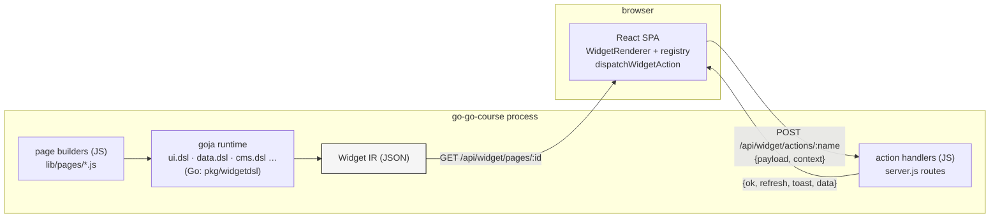
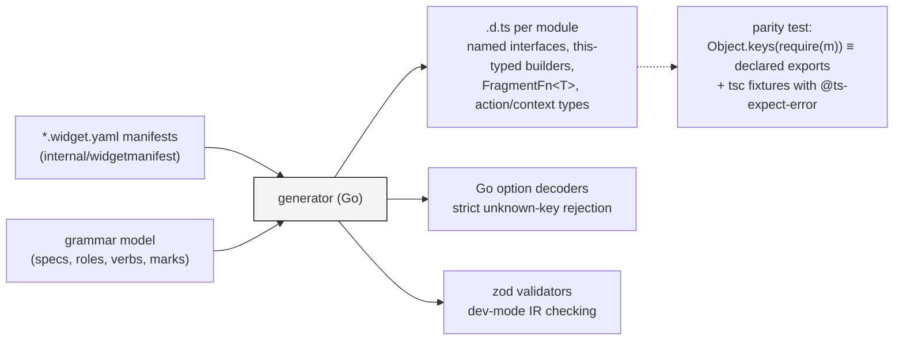

# Rag Evaluation System DSL Overhaul Design and Implementation Guide

## Executive summary

This document designs the second generation of the rag-evaluation-system authoring DSLs — all five modules — plus the IR and renderer changes they need. It is the synthesis the four preceding documents were building toward: the catalogue (01) supplied the pattern inventory, the self-assessment (02) named the root cause (the IR wire format was used as the authoring API) and verified five silent-failure modes, the independent assessment (03) supplied the layer architecture and the facet model, and the deep dive (04) settled the four open mechanics (optional lambdas, typed specs, DTS parity, operator argument discipline).

The design in one paragraph: **authors talk to typed Go builders; builders mutate typed intent specs; specs validate with accumulated, path-addressed issues; terminals compile specs to Widget IR; the IR stays a JSON wire format and gains exactly two things — a `callback` action kind and a `ValidationIssues` node.** The authoring surface is two-tier: a defaulted, no-lambda fluent chain for the common case, and optional lambda configurators plus `.use(fragment)` for composition. JavaScript lambdas become legal as action handlers because they never cross the wire: the builder registers them in a runtime-side registry under deterministic ids, the IR carries only the id, and the renderer dispatches the id back over the existing server-action channel with a rebuild-and-retry protocol for staleness. Domain modules (`cms`, `course`, `context_window`) shrink to schemas and marks. Declarations and option decoders are generated from the widget manifests that already exist, and a geppetto-style parity test plus TypeScript fixtures keep the three surfaces (runtime exports, `.d.ts`, decoders) from drifting.

## 1. Problem statement

Design-docs 01–03 establish the defects in detail; the operational summary:

1. **Authoring is untyped.** Every helper returns `map[string]any`. Five silent-failure modes are verified against the running binary (02 §3): typo'd arrangements, typo'd field options, wrong marker objects, unknown verbs, and out-of-range enums all produce wrong output with no signal.
2. **Validation is panic-or-nothing** in a request-scoped DSL where a panic is a 500.
3. **Declarations hide mistakes.** `Props = Record<string, any>` gives authors — increasingly LLM agents whose only feedback channels are the `.d.ts` and runtime errors — nothing to check against.
4. **Composition is a string switch.** `arrange: "table" | "master-detail"` is a closed compiler, not a grammar; domain recipes (`mediaLibrary`, `contextDiagram`) bypass the grammar entirely, so "domain modules = schemas + marks" is unproven.
5. **Lambdas do not exist.** Handlers are named server actions wired in `server.js` by hand; the DSL cannot accept a function, and nothing defines how one would survive the renderer↔runtime boundary.

What must be preserved: the intent vocabulary (`section`, `schema`, `record`, `collection`, URL selection, form-post binding) proven by the CMS page rebuild; the no-client-state architecture; the IR as a serializable wire format; and the existing pages, which must keep working through a compat layer during migration.

## 2. The system, for the intern who has not seen it

Three processes matter, and the boundary between the last two is the crux of this design.



- **The React package** (`packages/rag-evaluation-site`): ~90 design-system components; `WidgetRenderer` renders IR nodes via a registry of widget adapters; `src/widgets/ir.ts` holds the *precise* TypeScript types for every node and prop; `src/widgets/actions.ts` dispatches declarative `ActionSpec`s (`navigate | download | server | event | copy`, each with optional `confirm`). A `server` action POSTs `{payload, context}` to `/api/widget/actions/:name`; a `{refresh: true}` response fires a popstate, which makes `useWidgetPage` refetch the page.
- **The Go DSL package** (`pkg/widgetdsl`): five goja modules built from helper maps (`module.go`), the Phase-0 grammar (`grammar.go`), declaration strings (`typescript.go`).
- **The consumer** (go-go-course): page builders return IR per request; named action handlers live in `server.js`. State lives in the URL; mutations are server actions or native form posts.
- **Already exists and matters for v2**: `internal/widgetmanifest` — a Go loader/validator for the 80+ `*.widget.yaml` manifests (type, module, helper, props type name, slots, actions). Today it only validates; in v2 it becomes the codegen source.

The key invariant to internalize: **everything that crosses the wire is data.** A page is JSON; an action is JSON. A JavaScript function in the page-builder runtime can never be sent to the browser. Any lambda story is therefore a *registration* story: the function stays in the runtime, an identifier crosses the wire, and dispatch routes the identifier back to the function.

## 3. Goals and non-goals

**Goals.**

- One opinionated authoring surface: typed builders, two tiers (defaulted simple chain; optional lambda configurators), one way to do each thing.
- Every author mistake caught at the earliest possible layer: TypeScript when the `.d.ts` can express it, a thrown Go error with a path when it cannot, an accumulated validation issue when it needs cross-field context — and *never* silence.
- Lambdas as handlers and fragments, with precisely defined boundary semantics.
- Domain modules reduced to schemas + marks; recipes become one-line wrappers over grammar sentences.
- The wire format and renderer stay small: IR v2 is IR v1 plus two additions.

**Non-goals.**

- No client-side state system. Selection stays in the URL; the sanctioned exceptions (input value, diagram view toggle) stay exceptions.
- No streaming/partial IR updates in this revision; `refresh: true` full-page refetch remains the update model (a `patch` response is left as a marked extension point).
- No new module. The five `require()` ids survive; surfaces change inside them.
- The low-level `component(type, props)` escape hatch survives, documented as such.

## 4. Design principles (ratified from docs 01–04)

These are the decision records of docs 02–04, restated as the rules this design obeys; the intern should treat them as constraints, not suggestions.

1. **Builders in, IR out.** The authoring API is typed builders over typed Go specs; `map[string]any` appears only in terminal output (04 §2.4).
2. **Two-tier API.** The shortest sentence produces a valid, defaulted object; lambdas refine, never gate (04 §1, rule 1).
3. **Optional ≠ silently tolerant.** Missing/`undefined`/`null` callback → defaults. Present-but-not-a-function → error naming the argument (04 rule 2, codesign's `applyBuilderCallback`).
4. **Strict argument decoding.** Every options object decodes against a schema: unknown keys are errors with suggestions, enums are validated, required keys are enforced (emrichen `ParseArgs` discipline, 04 §4.4).
5. **Accumulated validation with a rendering channel.** Builders collect `Issue{Severity, Code, Path, Message}`; `page()` renders issues as an error panel instead of failing the request (02 §4-4, 03 layer 1).
6. **Marks and arrangements are typed operators**, with declared role requirements, validated before compile (03 layer 3; emrichen operator model).
7. **Hidden-ref handles for everything authors pass around** — schemas, selections, bindings, actions, marks — via a shared `fluent` substrate extracted from the bleve pattern (01 decision 1).
8. **One source of truth for types.** Manifests + grammar model → generated Go decoders, `.d.ts`, and dev-mode IR validators; a DTS parity test plus `@ts-expect-error` fixtures enforce it (04 §3).
9. **Field facets under role shortcuts.** `f.primary()` survives as sugar; underneath, storage type, semantic role, editor, summary, and layout are separable facets (03 §4-improvement).
10. **Hyperscript for trees, builders for specs.** Structure nesting keeps `section(..., ...children)` shape; builders own stateful configuration (02 §5.3).

## 5. Module layout after the overhaul

| Module | v2 role | Gains | Loses (to compat layer) |
|---|---|---|---|
| `ui.dsl` | structure grammar + primitives + actions | `section` (kept), `page` terminal with issue rendering, `actions` namespace (named handlers, callback registration), typed action builders | loose `action.*` map factories |
| `data.dsl` | the data grammar | typed `schema`/`f` facets, `record`/`collection` builders, `marks` (table, recordForm, metadataGrid), `arrangements` (masterDetail, table, tiles host), selections/bindings | options-bag `record`/`collection` (compat wrappers) |
| `cms.dsl` | schemas + marks | `schemas.asset`, `schemas.article`, `marks.assetTiles`, `marks.articleRows` | direct-to-panel recipes (become wrappers) |
| `course.dsl` | schemas + marks | `schemas.lesson`, `marks.lessonCard`, document marks | markdownArticle/richArticle (already aliased to ui) |
| `context_window.dsl` | schemas + marks + scales | `schemas.snapshot`, `marks.{strip,stack,treemap,budgetBar}`, `paletteStyleSet` promoted into shared `data.scale.*` presets | style helpers as module-private concepts |

Compat rule: every v1 helper keeps working for two releases, implemented as a wrapper that decodes strictly (so latent typos in existing pages surface as issues, not silence) and logs one deprecation line per name per process.

## 6. The authoring surface

### 6.1 Schemas: facets under role shortcuts

```js
const data = require("data.dsl");

// Tier 1 — role shortcuts (the Phase-0 vocabulary, kept):
const agenda = data.schema("agenda", s => s
  .key("id")
  .short("number", { label: "Time", width: "8ch" })
  .short("duration", { width: "8ch" })
  .primary("title", { required: true, maxLength: 160 })
  .prose("description", { rows: 4, maxLength: 800 }));

// Tier 2 — explicit facets when a field doesn't fit one role:
const asset = data.schema("asset", s => s
  .key("id")
  .field("size", f => f.number().summary(data.cells.bytes()).label("Size"))
  .field("status", f => f.enum(["draft", "published", "archived"])
                         .summary(data.cells.status()).editor(data.editors.select()))
  .field("preview", f => f.media().summary(data.summary.elide())));
```

Go side, the builder mutates a typed spec; the schema handle is a hidden-ref wrapper:

```go
type SchemaSpec struct {
    Name   string
    Fields []FieldSpec           // ordered; captured via Object.Keys discipline
    issues []validate.Issue
}
type FieldSpec struct {
    Name     string
    Storage  StorageType          // string | number | bool | enum | media | href
    Role     FieldRole            // shortcut provenance, kept for marks
    Editor   EditorSpec           // control kind + options
    Summary  SummarySpec          // cell kind | elide
    Layout   LayoutSpec           // gridable, width
    Rules    []RuleSpec           // required, maxLength, …
}
```

`schema()` without a configurator is an error (`schema needs fields`) — the one place tier 1 requires a lambda, because an empty schema is never valid. Every `s.*`/`f.*` method validates its options strictly: `s.primary("title", {maxLenght: 160})` throws `data.dsl schema "agenda" field "title": unknown option "maxLenght" (did you mean "maxLength"?)`.

### 6.2 Collections and records: the two tiers

```js
// Tier 1 — defaults do the work:
data.collection(rows).schema(agenda).edit().masterDetail().toIR()

// Tier 2 — configurators and fragments:
const destructiveRows = a => a
  .reorder(ui.actions.named("admin-reorder-course-agenda"))
  .remove(ui.actions.named("admin-delete-agenda-item")
            .confirm(c => c.text("Delete agenda item “").value("row.title").text("”?")));

data.collection(rows)
  .schema(agenda)
  .select(data.selection.urlParam("agenda", query.agenda))
  .edit(e => e
    .submit(data.binding.formPost("/settings/agenda-item"))
    .create("New agenda item")
    .actions(destructiveRows))
  .arrange(a => a.masterDetail(md => md
    .summary(data.marks.table())
    .detail(data.marks.recordForm())))
  .toIR()
```

Contracts the intern must implement exactly:

- Every method returns the builder (`this`-typed in the `.d.ts`); every method with an options object decodes strictly; every method taking a callback applies rule 3 (§4).
- `select` takes a **typed selection handle**; passing a `formPost` binding there is a typed error naming both kinds (`expected UrlParamSelection, got FormPostBinding`) via `getTypedRef`.
- `toIR()` runs semantic validation first (schema/mark role compatibility, edit-without-submit, select-without-key-field). Issues of severity `error` compile to a `ValidationIssues` node *in place of* the collection (§8.2); warnings attach as a dev-mode side channel.
- `validate()` is available separately and returns `{issues: [{severity, code, path, message}]}` — path-addressed, e.g. `collection.arrange.masterDetail.detail: mark recordForm requires a submit binding in edit mode`.
- Confirm prompts are **template parts** (`.text()/.value()`), not `${}` strings; parts carry their own encoding semantics, closing the class of bug fixed in commit 9c91539. Raw `${}` templates survive only on the low-level escape hatch.

### 6.3 Marks: the operator contract that shrinks domain modules

```go
type Mark interface {
    Kind() string
    RequiredRoles() []FieldRole                    // validated against the schema pre-compile
    Compile(ctx CompileCtx, c *CollectionSpec) (ir.Node, error)
}
```

Domain modules export mark factories; the grammar owns selection, actions, create/remove, empty states — marks own only appearance:

```js
data.collection(assets)
  .schema(cms.schemas.asset())
  .manage(m => m
    .upload(ui.actions.named("admin-upload-course-material").payload({ kind: "media" }))
    .remove(ui.actions.named("admin-delete-course-material")
              .confirm(c => c.text("Delete ").value("row.filename").text("?"))))
  .select(data.selection.urlParam("asset", query.asset))
  .arrange(a => a.tiles(cms.marks.assetTiles()))
  .toIR()
// cms.recipes.mediaLibrary(opts) remains, reimplemented as exactly this sentence.
```

The acceptance test for the whole architecture (03 §7, 04 §5-rule-5): `mediaLibrary` and `contextDiagram` re-expressed this way with no feature loss. Multi-view marks generalize `contextDiagramPanel({views})`: `a.toggle(cw.marks.stack(), cw.marks.strip())`.

### 6.4 Sections and pages

```js
ui.page("admin-course-cms", p => p
  .section("Agenda", s => s.anchor("agenda").caption("…").child(agendaEditor))
  .section("Media library", s => s.anchor("media").child(mediaLibrary)))
  .toIR()
```

`page()` is where accumulated issues become rendering (§8.2), and where callback registration commits (§7.3). `section(title, opts?, ...children)` keeps its hyperscript children — structure is a tree; builders stop at the spec boundary (§4 rule 10).

## 7. Actions, lambdas, and the renderer ↔ runtime contract

This is the part the user flagged, so it is specified to the wire.

### 7.1 Action taxonomy v2

| Kind | Crosses the wire as | Handler location | New? |
|---|---|---|---|
| `navigate`, `download`, `copy`, `event` | full spec | browser | no |
| `server` | `{kind:"server", name, payload?, confirm?}` | named JS handler behind an express route | no |
| **`callback`** | `{kind:"callback", id, payload?, confirm?}` | **JS lambda in the runtime callback registry** | **yes** |

A lambda never serializes. `ui.actions.callback(fn)` — or a bare function anywhere an action is accepted — registers `fn` and emits only the id.

### 7.2 The dispatch path

```mermaid
sequenceDiagram
    participant B as Browser (dispatchWidgetAction)
    participant H as Host (express route)
    participant R as goja runtime (owner loop)
    B->>H: POST /api/widget/actions/__callback {payload:{id}, context}
    H->>R: registry.lookup(id)
    alt id known
        R->>R: invoke fn(ctx) on the runtime owner
        R-->>H: {refresh?, toast?, data?} or thrown error
        H-->>B: {ok:true, refresh, toast, data} | {ok:false, error:{code,message}}
        B->>B: refresh → popstate → page refetch
    else id unknown (restart / never built here)
        H-->>B: 409 {ok:false, error:{code:"callback_not_found"}, rebuild:true}
        B->>H: GET /api/widget/pages/:id   (rebuild re-registers callbacks)
        B->>H: retry POST once; then give up with toast
    end
```

Reuses the existing route surface (`__callback` is one more action name) and the existing response contract `{ok, refresh, toast, data}` — the renderer change is ~40 lines in `actions.ts` (dispatch `callback` kind; honor `rebuild: true` with a single refetch-and-retry) plus surfacing `toast`/`error` (today only `refresh` is read; v2 must render both).

### 7.3 Registration semantics — the rules that make lambdas safe

1. **Two tiers of handler.** *Named handlers* (`ui.actions.handler("agenda.delete", async ctx => {...})` at module scope) register once at server start under a stable name — this is the durable tier, equivalent to today's `server.js` handlers but declared in the DSL with a lambda. *Inline lambdas* (`.remove(ctx => …)`) are page-build-scoped sugar.
2. **Deterministic inline ids.** During a page build, the module keeps a build context (the runtime is single-threaded; a module-level current-build pointer is safe). Inline callbacks get `id = pageId + "#cb" + ordinal` in encounter order. `page().toIR()` **commits** the build's callback set atomically, replacing the page's previous set. Two renders of the same page yield the same ids as long as the page structure is deterministic — which the no-client-state architecture already requires.
3. **Staleness is a protocol, not a bug.** After a restart, ids from an open browser tab are unknown → the 409/rebuild/retry path above. After a redeploy that reorders callbacks, a stale id can hit the *wrong* lambda; to fail closed, the id embeds a short hash of the callback's declaration site (`pageId#cb3@a1f2`), so reorder → unknown id → rebuild path.
4. **Closure discipline (documented, lint-checked later).** Inline lambdas run against the closure from the *most recent build*, not the build the browser saw. They must therefore read current state from their `ctx` and services, never from captured per-request data. Named handlers don't have this hazard and are the default recommendation in docs.
5. **Runtime ownership.** Callbacks are invoked on the runtime owner (the same loop that runs routes today), matching the goja-dbus correctness model from catalogue §5.1. Handlers may be async; the host awaits settlement with the request context and a timeout.
6. **Context is typed.** The dispatch context (`{row?, rowKey?, files?, value?, componentType}`) gets a declared TS interface (`RowActionContext<T>` et al.) generated into every module's `.d.ts`, and a Go-side decoded struct for handler authors.

### 7.4 What stays intentionally simple

`refresh: true` full refetch remains the only update mechanism. Handlers return `{refresh, toast, data}`; a future `patch` field is reserved in the response type but explicitly not implemented — partial IR updates are a renderer-diffing project this overhaul must not swallow.

## 8. IR v2 and renderer changes

The wire format is deliberately almost untouched — the overhaul is in the authoring layer.

### 8.1 Envelope and versioning

Pages gain `schemaVersion: 2` in the page envelope. The renderer accepts 1 and 2 (v1 pages contain nothing v2 renderers can't handle); the DSL emits 2.

### 8.2 Two new node/spec forms

1. `ActionSpec` union gains `CallbackActionSpec {kind:"callback", id, payload?, confirm?}` (`ir.ts` + dispatch in `actions.ts`).
2. New `ValidationIssues` component (`type: "ValidationIssues"`, props `{issues: Issue[], source: string}`) with a design-system `ErrorPanel` rendering — the channel that lets accumulated validation *replace* a broken region instead of 500-ing the page. Renders path, code, message per issue in the house style.

### 8.3 Dev-mode IR validation

Generated zod validators (from the same manifest+grammar model as the `.d.ts`, §9) run in `WidgetRenderer` behind a dev flag: a malformed node renders an inline `ValidationIssues` box naming the path. Production skips validation entirely. This closes the last silent gap: hand-written `component()` escape-hatch nodes.

### 8.4 Explicit non-changes

Node kinds (`text | element | component`), the registry/adapters, `useWidgetPage`, URL-state navigation, and the form-post pattern are unchanged. Existing v1 pages render byte-identically.

## 9. The type system: one source of truth, three generated surfaces



- Manifests gain a `propsSchema` section (field names/types/enums) so they can drive decoders and zod, not just name a TS type. `internal/widgetmanifest` already discovers and validates them; the generator is a new command beside it.
- The `.d.ts` models builders precisely on the codesign pattern: `interface CollectionBuilder<T> { schema(s: Schema<T>): this; edit(fn?: FragmentFn<EditBuilder<T>>): this; … validate(): ValidationResult; toIR(): WidgetNode }`, `type FragmentFn<T> = (b: T) => void | T`, plus `FieldRole`, `CollectionVerb`, discriminated `ActionSpec`, and `RowActionContext<T>`.
- The parity test follows geppetto's algorithm (04 §3.4) per module and per namespace (`f`, `cells`, `marks`, `actions`, `recipes`); type fixtures compile known-good pages and assert known-bad ones fail with `// @ts-expect-error`.

## 10. Implementation plan

Each phase is independently shippable and keeps every existing page working. File paths are the actual targets.

**Phase 1 — the fluent substrate and strict decoding (no API change).**
- New `pkg/widgetdsl/fluent/`: `attachRef`/`getTypedRef[T]`/`newWrapper` (lifted from bleve), `applyConfigurator` (codesign semantics: absent→ok, non-function→error), `Decode(options, into, schema)` with unknown-key + enum + suggestion errors, `validate.Issue`/`Result`.
- Retrofit `grammar.go` and the helper factories to decode through it. Acceptance: the five silent failures from doc 02 §3 all produce errors; all existing pages still build (fix any latent typos this surfaces).
- Tests: table-driven decode tests; the doc-02 failure cases as regression tests.

**Phase 2 — typed intent specs under the existing surface.**
- New `pkg/widgetdsl/spec/`: `SchemaSpec`, `FieldSpec` (facets), `CollectionSpec`, `RecordSpec`, `SectionSpec`, `PageSpec`, each with `Validate() []Issue` and `ToIR() map[string]any` producing today's exact output (golden-tested against current `grammar_test.go` snapshots).
- v1 grammar functions become thin decoders into these specs. Markers (`schema`, `urlParam`, `formPost`) become hidden-ref handles; shape-compatible raw maps are still accepted by the compat layer with a deprecation log.

**Phase 3 — the v2 builder surface + callback actions.**
- Builders (`data.collection(rows)` chain, `ui.page`, `ui.actions.*`) over the Phase-2 specs; template-part confirm builder; `ValidationIssues` node emission in `page().toIR()`.
- React side: `CallbackActionSpec` in `ir.ts`, dispatch + rebuild/retry + toast/error surfacing in `actions.ts`, `ErrorPanel` component + adapter + stories.
- Host side: callback registry keyed `pageId → {id → fn}` with atomic per-build replacement; `__callback` handling in the widget-actions route (go-go-course `server.js` first; extract to a shared host helper when a second consumer appears).
- Acceptance: the admin CMS agenda rewritten in v2 syntax with one inline-lambda action, exercised end-to-end including the restart→409→rebuild→retry path (kill the server between render and click in the smoke test).

**Phase 4 — marks, and the domain-module shrink.**
- `Mark` interface + built-ins (`table`, `recordForm`, `metadataGrid`); `cms.marks.assetTiles` + `cms.schemas.asset`; **reimplement `cms.recipes.mediaLibrary` as the grammar sentence** (the architecture's acceptance test); then `context_window.marks.{strip,stack,treemap,budgetBar}` + `schemas.snapshot` + scale promotion, with `recipes.contextDiagram` as a wrapper; `arrange.toggle(...)` for multi-view.
- Acceptance: media library and context visualize pages pixel-compared before/after.

**Phase 5 — codegen and enforcement.**
- Manifest `propsSchema` extension + generator command (`cmd/widgetdsl-gen` or `go:generate` in `pkg/widgetdsl`); generated `.d.ts`/decoders/zod; DTS parity test per module; `tsc --noEmit` fixture suite; deprecation warnings on the compat layer; docs rewrite of `doc/02-widget-dsl-js-api-reference.md` around the two-tier surface.

Sequencing rationale: 1–2 are pure safety and shippable this week; 3 is the visible new surface and the callback machinery; 4 proves the architecture on the hardest existing widgets; 5 locks the gates so the system cannot regress into Pattern C. Doc 03's warning applies: do not start Phase 4 features before Phase 1–2 validation exists.

## 11. Design decisions

1. **Callbacks ride the server-action channel with deterministic ids and fail-closed hashes** — over: WebSocket sessions (new infra, breaks statelessness), per-render UUIDs (breaks determinism and multi-tab), and closures-serialized-as-source (unsafe, un-lintable). Consequence: the rebuild/retry protocol and the closure-discipline rule are part of the public contract.
2. **Named handlers are the recommended tier; inline lambdas are sugar** — because inline closures have the staleness hazard and named handlers match the existing operational model. The docs and examples lead with named.
3. **Issues render; requests do not fail** — a UI DSL has a channel config DSLs lack; a broken collection should cost its region, not the page (over: panic → 500, and silent best-effort).
4. **Manifests are the schema source** — over: hand-authoring the TS model in `typescript.go` (drifts; is what failed), and parsing `ir.ts` (TS-side parsing in a Go build is fragile). Manifests already exist, already have a Go loader, and sit next to each component.
5. **Keep five modules, keep IR JSON, keep refresh-based updates** — the overhaul spends its complexity budget on the authoring layer, where the measured failures are.

## 12. Open questions

1. Should the callback registry be bounded (LRU per page) or is atomic-replace-per-build sufficient? (Proposed: replace-per-build; revisit if page count grows.)
2. Payload merging when an inline callback also carries `payload` and the dispatch context has `row` — precedence rule needs one paragraph in the API reference (proposed: context wins on conflict, both delivered).
3. Do compat-layer deprecation logs go to the server log only, or also as dev-mode `ValidationIssues` warnings? (Proposed: both, warnings only in dev.)
4. `FragmentFn<T>` returning a *different* builder (codesign allows `void | T`) — allow or forbid? (Proposed: allow `void` only; returning values invites confusion with immutable-builder semantics we did not adopt.)
5. Where does the shared host helper for `__callback` live once a second consumer exists — `pkg/xgoja/providers/widgetsite` or go-go-goja's http provider?

## References

- This ticket: design-docs 01 (catalogue + patterns), 02 (self-assessment + verified failure modes), 03 (independent assessment + layer architecture), 04 (lambda/typed-IR/parity/operator mechanics).
- RAGEVAL-UI-GRAMMAR ticket (`ttmp/2026/07/04/…`): the audit, the Phase-0 grammar design, and the diary documenting what shipped.
- Comparators: `researchctl/pkg/gojamodules/{codesign,researchctl}` (typed specs, optional configurators, fragments, precise DTS), `goja-bleve/pkg/api_types.go` (hidden refs), `geppetto .../dts_parity_test.go` (parity), `go-emrichen/pkg/emrichen/parser.go` (strict argument parsing).
- Current implementation under change: `pkg/widgetdsl/{module,grammar,typescript}.go`, `packages/rag-evaluation-site/src/widgets/{ir.ts,actions.ts,WidgetRenderer.tsx}`, `internal/widgetmanifest/`, `go-go-course/cmd/go-go-course/{server.js,lib/pages/admin-course-cms.js}`.
