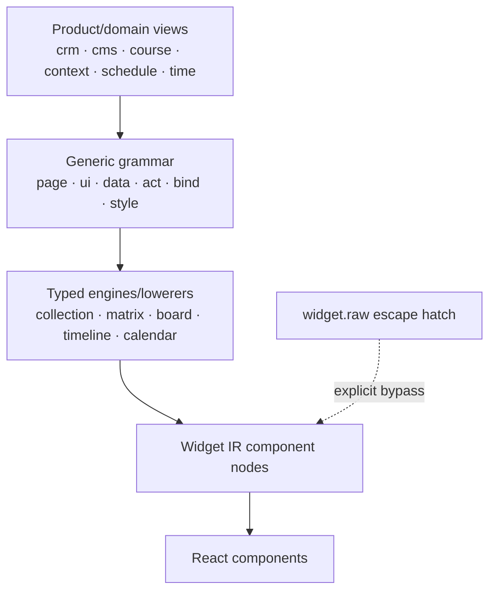
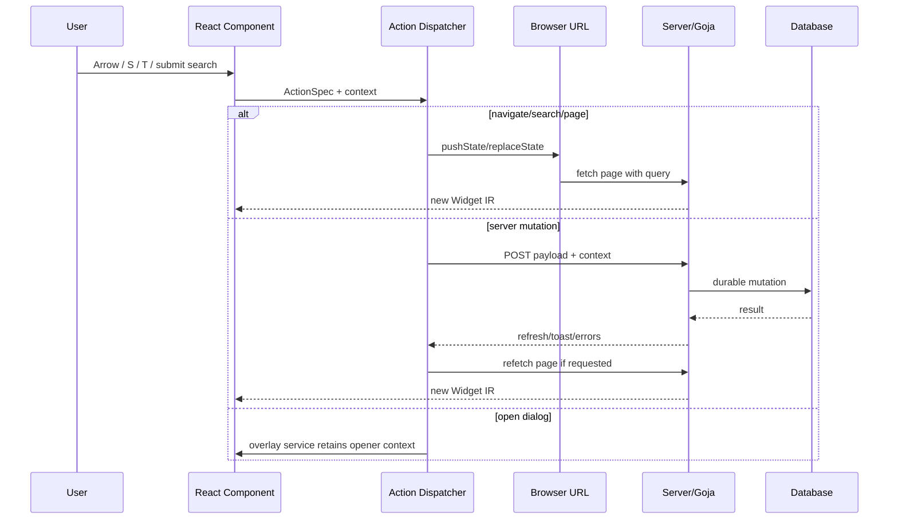
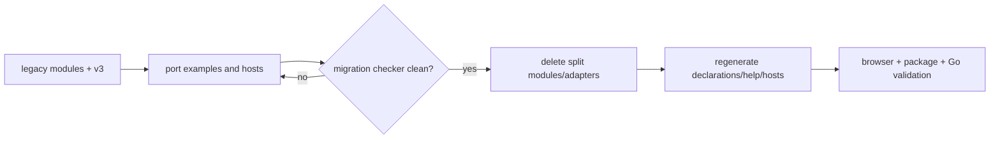

# Widget DSL v3 Full Feature Analysis, Design, and Intern Implementation Guide

## Executive Summary

Widget DSL v3 already proves the main architectural direction: one `require("widget.dsl")` module, typed namespaces, Go-backed builders, serializable actions and bindings, semantic domain views, stable Widget IR, and React-owned rendering. It also has substantial real coverage: 41 golden examples, an xgoja preview host, CRM/schedule/time views, a provider package, TypeScript declarations, Storybook regressions, and a migration checker.

It is not yet a complete replacement for the legacy split modules. The legacy modules expose broad component-level access—41 generic UI helpers, 20 context helpers, 11 course helpers, 14 CMS helpers, direct DataTable cells, and recipes. V3 exposes a smaller, better-shaped semantic vocabulary, but several stable capabilities still require `widget.raw.component(...)`. More importantly, new collection interactions requested by real applications—keyboard row commands, an add-tag dialog, progressive search, server pagination with page-size selection, conditional styles, and browser presentation state—do not yet exist as complete React/IR/DSL contracts.

Because v3 has not been publicly released, this ticket chooses a **hard cutover** rather than another compatibility layer. The target is one coherent language and one provider module. We may rename, move, or remove current v3 methods when that produces a cleaner grammar. We do not preserve old split-module APIs, and we do not preserve awkward v3 names solely because they exist in unreleased examples.

The design is opinionated:

- Product scripts describe pages, collections, domain views, slots, and intents.
- React component names are lowering details, not the default authoring vocabulary.
- Complex configuration uses scoped builder lambdas; reusable policy uses `.use(fragment)`.
- Goja lambdas run during authoring and never cross into browser Widget IR.
- Browser-time values use `widget.bind`; interactions use `widget.act` or domain intents.
- URL state owns submitted selection/search/pagination; React owns transient drafts, focus, dialogs, and disclosure; servers own durable mutations.
- Every public capability must exist in runtime exports, typed specs, descriptors, declarations, docs, goldens, stories, and browser tests.
- `widget.raw` remains available but should be rare, explicit, and checked.

The recommended implementation is a sequence of vertical slices. First build complete descriptors and parity checks. Then stabilize generic UI/content/form primitives. Next extend actions and renderer state for structured navigation, overlays, notifications, and form contexts. Then make `data.collection` the complete center of search, pagination, keyboard commands, table/card/master-detail arrangements, and conditional semantics. Promote the domain-blind ActivityFeed to `widget.data`. Finally migrate examples and hosts, remove legacy provider modules, regenerate help/declarations, and run browser-backed release validation.

A realistic estimate is **30–45 engineering days** for one engineer, depending on how deeply descriptor generation and browser interaction testing are automated. The work should land in small phases; do not attempt one large rewrite.

## 1. Problem Statement

### 1.1 What exists today

The system is a server-driven React UI stack:

1. xgoja selects provider modules at build time.
2. Goja JavaScript imports `widget.dsl` or legacy modules.
3. JavaScript builders produce JSON-compatible Widget IR.
4. an HTTP route serves a `WidgetPage` object;
5. `RagEvaluationSiteApp` fetches page JSON and reacts to URL changes;
6. `WidgetRenderer` resolves component nodes through `defaultWidgetRegistry`;
7. Widget adapters turn serialized props/actions into typed React props/callbacks;
8. React design-system components own DOM, CSS, accessibility, focus, and local interaction state;
9. actions navigate, dispatch events, copy/download, or POST to server handlers;
10. successful server actions may trigger page refresh and toast events.

The architecture is sound. The problem is incomplete and inconsistent authoring coverage.

### 1.2 Why legacy breadth cannot simply be copied

The split modules grew by attaching component factories to domain modules. This made every registered component reachable but produced an authoring language organized by implementation history rather than user intent. Generic pagination and search lived in `cms.dsl`; upload lived in `context_window.dsl`; Markdown article renderers lived in `course.dsl`; forms and collections had multiple dialects.

Copying all helper names into v3 would produce a single import but preserve the old conceptual disorder. A full-feature v3 must preserve behavior while reorganizing vocabulary.

### 1.3 Why semantic v3 alone is not yet enough

V3 correctly provides task-level calls such as:

```js
widget.cms.mediaLibrary(assets, builder => ...)
widget.course.handouts(bundle, builder => ...)
widget.context.workspace(session, builder => ...)
widget.schedule.availabilityPoll(poll, builder => ...)
widget.crm.pipelineBoard(pipeline, deals, builder => ...)
```

However, real applications also need reusable generic capabilities: Markdown documents, upload controls, app shells, tabs, scroll regions, compact summaries, search panels, pagers, dialogs, activity timelines, and sophisticated collections. These are not all domain views. The language needs a disciplined generic layer beneath domain views.

### 1.4 Scope

This ticket designs and plans:

- complete v3 public vocabulary and namespace ownership;
- typed Go specs and builders;
- descriptor/declaration/help parity;
- generic UI/content/form parity;
- full collection shaping and arrangements;
- keyboard navigation and row commands;
- overlay/FormDialog lifecycle and form context;
- progressive search;
- server pagination and page-size selection;
- semantic conditional styles and column preferences;
- generic activity timeline ownership;
- domain-view completion;
- hard-cutover migration and legacy deletion;
- test, Storybook, browser, and release validation.

This document does not implement code. It provides the implementation contract.

## 2. Intern Orientation: The System from Host to DOM

### 2.1 End-to-end architecture

```mermaid
flowchart LR
    YAML["xgoja.yaml\nprovider/module selection"] --> Host["Generated xgoja host"]
    Host --> Goja["Goja runtime"]
    Goja --> DSL["widget.dsl\nGo native module"]
    DSL --> Specs["Typed Go specs\nand builder handles"]
    Specs --> Lower["Validation + lowering"]
    Lower --> IR["WidgetPage / Widget IR JSON"]
    IR --> HTTP["/api/widget/pages/:id"]
    HTTP --> App["RagEvaluationSiteApp"]
    App --> Renderer["WidgetRenderer"]
    Renderer --> Registry["defaultWidgetRegistry"]
    Registry --> Adapter["Widget adapter"]
    Adapter --> React["React design-system component"]
    React --> DOM["Accessible DOM + CSS Modules"]
    DOM --> Action["Action context"]
    Action --> App
    App -->|server action| HTTP
```



### 2.2 Provider and module selection

`pkg/xgoja/providers/widgetsite/provider.go` packages runtime modules for generated xgoja binaries. Today it registers seven modules: `ui.dsl`, `data.dsl`, `data.v2.dsl`, `widget.dsl`, `context_window.dsl`, `course.dsl`, and `cms.dsl`. It also embeds five help documents.

The hard-cutover target is simpler:

```text
rag-widget-site provider
  ├── module: widget.dsl
  └── help source: widget-dsl
```

First-party hosts should select only `widget.dsl`. The legacy modules and their declarations disappear after migration.

### 2.3 Native module runtime

`pkg/widgetdsl/module.go` implements `modules.NativeModule` loaders. Legacy modules use helper maps that translate names directly to component types. V3 takes a different path: `installWidgetV3` installs namespaces (`raw`, `act`, `bind`, `ui`, `data`, `crm`, `cms`, `course`, `context`, `schedule`, `time`, `style`).

The runtime boundary matters:

- JavaScript functions may configure a builder because they execute immediately in Goja.
- The result must be plain JSON-compatible data before it reaches HTTP.
- A Goja closure cannot be sent to the browser.

### 2.4 Typed specs and lowering

The typed data grammar lives under `pkg/widgetdsl/v2/spec`. Despite the directory name, v3 already reuses it for fields and collections. `types.go` defines `CollectionSpec`, `SchemaSpec`, `TableSpec`, `ActionSpec`, and related value types. `validate.go` emits stable validation codes, paths, messages, and hints. `lower.go` converts typed specs into current Widget IR components.

This is the core pattern to extend:

```text
v3 builder calls
    ↓ mutate
Go spec
    ↓ Validate()
validation issues
    ↓ ToNode()/ToWidgetPage()
Widget IR
```

Do not bypass this pattern for complex new behavior by mutating arbitrary prop maps in unrelated helper functions.

### 2.5 Widget IR

Widget IR has three node kinds:

```ts
type WidgetNode =
  | { kind: "text"; text: string }
  | { kind: "element"; tag: string; attrs?: JsonObject; children?: WidgetNode[] }
  | { kind: "component"; type: string; props?: JsonObject; children?: WidgetNode[] };
```

The IR is intentionally semantic and JSON-compatible. It does not contain React elements or JavaScript callbacks.

Component props are declared in `packages/rag-evaluation-site/src/widgets/ir`. Important files:

- `core.ts`: nodes, component names, JSON values;
- `actions.ts`: action union and templates;
- `cells.ts`: DataTable cell specs;
- `props.ts`: component Widget props;
- `engines.ts`: matrix, board, record fields, activity feed, time engines.

### 2.6 Registry and adapters

`defaultRegistry.ts` registers 87 component adapters. Adapters are the boundary between serialized Widget props and React callbacks. For example, `DataTable.widget.tsx` resolves cell specs and dispatches row actions; `ActivityFeed.widget.tsx` converts renderable values and dispatches activity IDs; `Pagination.widget.tsx` dispatches the requested page.

A component existing in React does not automatically mean it has a good DSL API. Four levels must be distinguished:

1. React component exists;
2. Widget adapter and IR props exist;
3. v3 typed helper/spec exists;
4. intent-level domain view exists.

### 2.7 Application shell and action handling

`App.tsx` reads page ID and query state from the browser URL, fetches Widget IR, renders default or course shells, and dispatches actions. Server actions POST `{payload, context}` and may request a refresh or toast.

This makes state ownership explicit:

| State | Owner | Examples |
|---|---|---|
| durable domain state | server/database | starred job, status, tag, note |
| submitted navigation state | URL | selected row, query, filters, page, page size |
| transient browser state | React | search draft, dialog open, focused row, expanded advanced panel |
| authoring-time configuration | Goja/Go specs | columns, commands, field schema, intents |

## 3. Current-State Evidence and Gaps

### 3.1 Legacy helper breadth

`module.go:36-184` defines direct helper maps and recipe lists. The generated inventory records 87 direct component helpers across legacy module families. The legacy API provides broad reach but weak organization.

### 3.2 Current v3 namespace shape

`v3.go` and `v3_crm.go` currently expose:

- `widget.ui`: 17 generic helpers;
- `widget.data`: fields, collection, selection, item, cell, matrix;
- semantic CMS/course/context/schedule/time views;
- CRM fields, pipeline, board, record fields, activity, tasks, stats, funnel;
- common actions and bindings.

The design direction is good. Coverage and consistency are incomplete.

### 3.3 Descriptor incompleteness

`v3_descriptors.go` calls itself the “first descriptor-backed source of truth,” but only selected domain views are listed. Runtime exports, TypeScript declarations, descriptors, docs, and examples can still drift.

Evidence of drift:

- `widget.crm.activityFeed` exists in runtime and TypeScript declarations;
- golden example `24-activity-feed.js` still uses `widget.raw.component("ActivityFeed", ...)`;
- CRM record and board examples similarly use raw components despite typed helpers;
- the migration checker reports 11 raw findings.

A full cutover needs enforceable parity, not a best-effort descriptor list.

### 3.4 Collection limitations

Current `CollectionSpec.ToNode()` emits create button, DataTable, and optional detail. It does not model:

- search/filter controls;
- total count or server pagination;
- page-size selection;
- keyboard navigation;
- row commands;
- card/tile arrangement;
- conditional style rules;
- column preferences;
- activity/detail slots;
- browser-local interaction policy.

### 3.5 Action/runtime limitations

Current action kinds are navigate, download, server, event, and copy. Navigate accepts a target string and optional opaque params; it does not structurally build query parameters. There is no open/close overlay action. Form values are not a standardized action context outside native form submission. The renderer can emit a toast event, but field errors, optimistic patches, undo, and modal validation are not first-class.

### 3.6 UI helper gaps

Stable React adapters exist for pagination, search, Markdown, upload, tabs, sidebars, scroll regions, lists, metrics, and more, but many require raw v3 calls. The complete inventory and disposition are in `reference/01-legacy-to-v3-feature-parity-inventory.md`.

## 4. Language Design Principles

### 4.1 One module, organized namespaces

The public module remains:

```js
const widget = require("widget.dsl");
```

Target namespaces:

```text
widget.page       page/document builder
widget.raw        explicit IR escape hatch
widget.act        transport/browser actions
widget.bind       serializable value access
widget.ui         generic presentational grammar
widget.data       schemas, collections, engines, shaping, timelines
widget.crm        CRM product views and intents
widget.cms        editorial product views and intents
widget.course     teaching/presentation views and intents
widget.context    context/transcript/annotation views and intents
widget.schedule   availability/booking views and intents
widget.time       calendar/time views and intents
widget.style      shared semantic styles and predicates
```

### 4.2 Public grammar tiers



Domain views own product defaults and context translation. Generic grammar owns reusable concepts. Engines own arrangements and mechanics. Raw is not a substitute for missing design work.

### 4.3 Builder lambdas and fragments

Use scoped builders for non-trivial configuration:

```js
widget.data.collection("jobs", result.rows, collection => collection
  .schema(jobFields)
  .search(search => configureSearch(search, query, result))
  .paginate(pager => pager.use(standardPageSizes).current(result.page))
  .table(table => table.use(keyboardTriage).command(...)));
```

A fragment is an ordinary author-time function:

```js
const standardPageSizes = pager => pager.sizes(20, 50, 100);
const compactTable = table => table.density("compact").stickyHeader(true);
```

Builder callbacks and fragments mutate one typed spec. There must be one validation and lowering path regardless of whether a compact options overload is supported.

### 4.4 Named slots, not arbitrary renderer callbacks

Slots are deliberate extension seams on semantic views:

```js
widget.cms.mediaLibrary(assets, media => media
  .asset((ctx, h) => h.card(...))
  .details((ctx, h) => ...));
```

Slot lambdas run during Goja lowering. They return serializable nodes. Domain descriptors document slot names and context shapes.

Do not expose every underlying React prop as a slot.

### 4.5 Intent actions over engine context

Generic actions remain available:

```js
widget.act.server("set-status", { payload: {...} });
```

Domain intents translate engine context into product vocabulary:

```js
widget.crm.intent.moveDeal(...)
widget.schedule.intent.toggleAvailability(...)
widget.data.intent.paginate(...)
```

The public script should not need to remember that an engine uses `rowKey`, `colId`, or `cardId` when a domain concept can name the value more clearly.

### 4.6 Semantic styling only

Public style rules use semantic tones, decoration, emphasis, and predicates. They do not accept arbitrary CSS strings or class names.

```js
field.style(rule => rule
  .when(widget.bind.field("status").equals("rejected"))
  .tone("muted")
  .decoration("line-through"));
```

React/CSS Modules continue to own actual CSS.

## 5. Target Public API

## 5.1 Page and UI

Illustrative API:

```ts
interface PageBuilder {
  id(value: string): this;
  meta(key: string, value: JsonValue): this;
  density(value: "default" | "compact"): this;
  breadcrumb(label: WidgetChild, href?: string): this;
  shell(configure: Fragment<AppShellBuilder>): this;
  section(title: string, configure: Fragment<SectionBuilder>): this;
  use(fragment: Fragment<PageBuilder>): this;
  validate(): ValidationIssue[];
  toPage(): WidgetPage;
}

interface UINamespace {
  text(value: WidgetChild, options?: TextOptions): WidgetNode;
  caption(valueOrOptions: unknown, ...children: WidgetChild[]): WidgetNode;
  code(value: WidgetChild, options?: CodeOptions): WidgetNode;
  status(status: string, label?: WidgetChild, options?: StatusOptions): WidgetNode;
  badge(label: WidgetChild, options?: BadgeOptions): WidgetNode;
  divider(options?: DividerOptions): WidgetNode;

  stack(options?: StackOptions, ...children: WidgetChild[]): WidgetNode;
  inline(options?: InlineOptions, ...children: WidgetChild[]): WidgetNode;
  card(options?: CardOptions, ...children: WidgetChild[]): WidgetNode;
  callout(options?: CalloutOptions, ...children: WidgetChild[]): WidgetNode;
  splitPane(left: WidgetChild, right: WidgetChild, options?: SplitOptions): WidgetNode;
  scroll(options: ScrollOptions, ...children: WidgetChild[]): WidgetNode;
  tabs(items: TabItem[], configure?: Fragment<TabsBuilder>): WidgetNode;

  metadata(values: Record<string, JsonValue>, options?: MetadataOptions): WidgetNode;
  summary(items: SummaryItem[], options?: SummaryOptions): WidgetNode;
  checkList(items: CheckItem[], options?: ListOptions): WidgetNode;
  stepList(items: StepItem[], options?: ListOptions): WidgetNode;
  markdownArticle(source: string, configure?: Fragment<ArticleBuilder>): WidgetNode;
  richArticle(blocks: ArticleBlock[], configure?: Fragment<ArticleBuilder>): WidgetNode;

  form(configure: Fragment<FormBuilder>): WidgetNode;
  formRow(label: WidgetChild, control: WidgetNode, options?: FormRowOptions): WidgetNode;
  textInput(options: TextInputOptions): WidgetNode;
  textareaInput(options: TextareaOptions): WidgetNode;
  selectInput(options: SelectOptions): WidgetNode;
  upload(configure: Fragment<UploadBuilder>): WidgetNode;
  formDialog(id: string, configure: Fragment<FormDialogBuilder>): WidgetNode;
  emptyState(options: EmptyStateOptions): WidgetNode;
}
```

This is not a mandate to expose every registry adapter directly. It is the minimum coherent generic vocabulary required by real pages.

## 5.2 Data collection as the center of record UIs

```ts
interface CollectionBuilder {
  id(value: string): this;
  schema(schema: FieldSchema): this;
  empty(message: WidgetChild): this;
  select(selection: SelectionSpec): this;
  search(configure: Fragment<SearchBuilder>): this;
  paginate(configure: Fragment<PaginationBuilder>): this;
  table(configure?: Fragment<TableBuilder>): this;
  cards(configure?: Fragment<CardCollectionBuilder>): this;
  masterDetail(configure?: Fragment<MasterDetailBuilder>): this;
  edit(configure?: Fragment<EditorBuilder>): this;
  use(fragment: Fragment<CollectionBuilder>): this;
  validate(): ValidationIssue[];
  toNode(): WidgetNode;
}
```

### Backing spec

```go
type CollectionSpec struct {
    Name        string
    Rows        []JSONObject
    Schema      SchemaSpec
    Mode        CollectionMode
    Selection   *SelectionSpec
    Shaping     CollectionShapingSpec
    Arrangement ArrangementSpec
    Actions     CollectionActions
    Empty       string
}

type CollectionShapingSpec struct {
    Search     *SearchSpec
    Pagination *PaginationSpec
    Sort       *SortSpec
}

type ArrangementSpec struct {
    Kind         ArrangementKind // table | cards | master-detail | board
    Table        *TableSpec
    Cards        *CardSpec
    MasterDetail *MasterDetailSpec
}
```

Search and pagination are collection shaping. Keyboard commands are table mechanics. This distinction allows future card views to reuse filters and paging.

## 5.3 Keyboard table and row commands

```js
widget.data.collection("jobs", rows, collection => collection
  .table(table => table
    .keyboard(keys => keys
      .mode("rows")
      .selection("manual")
      .vimAliases(true))
    .command("star", command => command
      .key("s")
      .label("Toggle star")
      .action(toggleStar))
    .command("reject", command => command
      .key("r")
      .label("Reject")
      .danger(true)
      .action(rejectJob))
    .command("tag", command => command
      .key("t")
      .label("Add tag")
      .action(widget.act.openOverlay("add-tag")))));
```

React DataTable owns roving focus and key handling. The DSL declares policy and actions. Commands never fire from editable descendants or while a modal is open.

## 5.4 Overlay and FormDialog

New action kinds:

```ts
type ActionSpec =
  | ExistingActions
  | { kind: "openOverlay"; target: string }
  | { kind: "closeOverlay"; target?: string };
```

Form dialog declaration:

```js
widget.ui.formDialog("add-tag", dialog => dialog
  .title(widget.bind.template("Add tag to ${row.title}"))
  .initialFocus("tag")
  .body((ctx, h) => h.formRow(
    "Tag",
    h.textInput({ name: "tag", required: true }),
  ))
  .submit(widget.act.server("add-tag", {
    payload: {
      jobId: widget.bind.context("row.jobId"),
      tag: widget.bind.context("form.tag"),
    },
  })));
```

The renderer owns open state, opener element, and frozen action context. Submission extends context with serialized `form` values. Failed validation keeps the dialog open; success closes and restores focus.

## 5.5 Progressive search

```js
collection.search(search => search
  .value(state)
  .query("q", field => field
    .label("Search jobs")
    .placeholder("Title, description, skills, or notes…"))
  .select("status", field => field.options(statusOptions))
  .boolean("starred", field => field.label("Starred"))
  .tags("tag", field => field.suggestions(knownTags))
  .number("minFit", field => field.range(0, 100))
  .select("sort", field => field.options(sortOptions))
  .expandWhenFiltered(true)
  .resultCount(result.totalItems)
  .submit(searchIntent)
  .clear(clearIntent));
```

SearchPanel owns draft form and disclosure state. The submitted state is encoded in URL query parameters. Search filters are ordered specs so author order survives Goja export.

## 5.6 Pagination and line count

```js
collection.paginate(pager => pager
  .current(result.page)
  .size(result.pageSize)
  .total(result.totalItems)
  .sizes(20, 50, 100)
  .position("bottom")
  .onChange(widget.data.intent.paginate("/pages/jobs", intent => intent
    .preserve("q", "status", "tag", "sort", "view"))));
```

The collection lowerer emits Pagination around the active arrangement. The server supplies only the active page through `COUNT`, deterministic ordering, `LIMIT`, and `OFFSET`. Changing search or page size resets to page 1.

## 5.7 Activity timelines

ActivityFeed is registered in `dataWidgetRegistry` and is domain-blind, even though the v3 helper currently lives under CRM. Move it:

```js
widget.data.activityFeed(activities, feed => feed
  .groupByDay(true)
  .glyph("note", "📝")
  .styleSet(activityStyles)
  .onOpen(openActivity)
  .onLoadMore(loadEarlier));
```

CRM may provide a preset only if it adds CRM-specific kinds or intents. Do not maintain two identical helpers after hard cutover.

## 5.8 Structured navigation

Hand-concatenating many query parameters is error-prone. Extend navigate actions:

```ts
interface NavigateAction {
  kind: "navigate";
  to: string;
  query?: Record<string, BindingSpec | BindingSpec[]>;
  preserveQuery?: string[];
  omitEmpty?: boolean;
  replace?: boolean;
}
```

The browser uses `URL` and `URLSearchParams`; it does not interpolate raw ampersand strings.

## 5.9 Action result policy

```ts
interface ServerActionResult {
  ok: boolean;
  refresh?: boolean;
  toast?: string;
  error?: string;
  fieldErrors?: Record<string, string>;
  patch?: JsonObject;
  undo?: ActionSpec;
  data?: JsonObject;
}
```

The app needs a notification/live-region service and form/dialog error routing. Start with confirmed server updates. Add optimistic patching only after rollback is designed.

## 6. Descriptor and Generation Architecture

### 6.1 Current weakness

Descriptors currently name namespaces and selected views, while runtime methods and TypeScript declarations are still substantially handwritten. This allows drift.

### 6.2 Target descriptor model

```go
type NamespaceDescriptor struct {
    Name        string
    Description string
    Exports     []ExportDescriptor
}

type ExportDescriptor struct {
    Name        string
    Kind        ExportKind // function | builder | namespace | intent | engine | raw
    Signature   TypeRef
    Description string
    Stability   Stability
    Lowering    LoweringRef
    Builder     *BuilderDescriptor
    Slots       []SlotDescriptor
    Context     *ContextDescriptor
    Examples    []string
}

type BuilderDescriptor struct {
    GoSpecType string
    Methods    []MethodDescriptor
    SupportsUse bool
}
```

Descriptors should generate or verify:

- namespace inventory;
- TypeScript declarations;
- help reference tables;
- runtime export parity tests;
- builder method inventory;
- action context documentation;
- migration aliases only during development, never in final public module;
- example coverage requirements.

Semantic lowerers remain handwritten. Do not generate complex runtime behavior from a weak descriptor language. Generate inventories and declarations; test runtime parity.

### 6.3 Parity test

Pseudocode:

```go
for each descriptor namespace:
    load widget.dsl in Goja
    assert every declared export exists
    assert every runtime public export is described or explicitly internal
    generate TypeScript and compile fixtures
    generate API reference and compare checked-in help snapshot

for each builder descriptor:
    create builder
    assert methods match descriptor
    run minimal callback
    validate spec
    compare golden IR
```

## 7. React and Browser-State Design

### 7.1 Component layer rules

Follow `packages/rag-evaluation-site/GUIDELINES.md`:

- stabilize React component and stories first;
- correct layer hierarchy;
- API-free package components;
- CSS Modules and tokens;
- `data-rag-*` identity;
- Widget IR only after the React API is stable.

### 7.2 Renderer services

Today `WidgetRenderer` constructs a render context with render and action functions. Extend this through services rather than global DOM manipulation:

```ts
interface RenderServices {
  overlays: OverlayController;
  notifications: NotificationController;
  focus: FocusRestorationController;
  preferences: PreferenceStore;
}

interface RenderContext {
  // existing render/action helpers
  services: RenderServices;
}
```

The application root owns provider instances. Individual adapters request services through context.

### 7.3 State ownership flow



## 8. Decision Records

### Decision: Hard cut over to one provider module

- **Context:** V3 is not publicly released; preserving split modules would institutionalize multiple dialects.
- **Options considered:** Permanent coexistence; compatibility facade; one hard-cutover module.
- **Decision:** Migrate first-party code, then remove legacy module registrations, declarations, docs, and tests.
- **Rationale:** One language is easier to teach, validate, and evolve.
- **Consequences:** Migration must be coordinated and browser-tested; no long-lived aliases.
- **Status:** accepted for this ticket.

### Decision: Full feature means explicit disposition, not one helper per component

- **Context:** The registry has 87 adapters and legacy exposes 87 direct helpers.
- **Options considered:** Mirror every adapter; expose only domain views; classify each capability.
- **Decision:** Every stable capability receives a disposition: typed primitive, engine, domain view, internal lowering, or removal.
- **Rationale:** Completeness without recreating a component catalog.
- **Consequences:** The parity inventory becomes a release gate.
- **Status:** accepted.

### Decision: Extend typed collection specs

- **Context:** Search, pagination, keyboard commands, and arrangements all concern collections.
- **Options considered:** New work-queue widget; raw sibling components; independent recipes; richer CollectionSpec.
- **Decision:** Extend CollectionSpec with shaping and arrangement sub-specs.
- **Rationale:** One validator and one lowering path preserve composability.
- **Consequences:** CollectionSpec must avoid becoming a monolith; use nested specs with clear ownership.
- **Status:** proposed.

### Decision: Client services own transient interaction state

- **Context:** Goja cannot know open dialogs, focused rows, or input drafts.
- **Options considered:** URL-control all state; server sessions; injected DOM scripts; renderer services.
- **Decision:** Overlay, notification, focus, and preference services live in React renderer context.
- **Rationale:** Correct lifecycle and accessibility without leaking app services into presentational components.
- **Consequences:** Renderer context expands and needs integration tests.
- **Status:** proposed.

### Decision: URL owns submitted collection state

- **Context:** Server Goja must read selection, search, sort, page, and page size.
- **Options considered:** localStorage; hidden React state; URL.
- **Decision:** Submitted state is canonical URL state; local state is only draft/presentation.
- **Rationale:** Shareable, back/forward compatible, server-visible.
- **Consequences:** Structured navigation and parser/serializer round-trip tests are mandatory.
- **Status:** proposed.

### Decision: Promote ActivityFeed to data

- **Context:** React documents ActivityFeed as domain-blind and registers it with data widgets; v3 places it under CRM.
- **Options considered:** Keep CRM-only; duplicate aliases; move to data with optional CRM preset.
- **Decision:** Make `widget.data.activityFeed` the generic helper and remove the generic CRM duplicate before release.
- **Rationale:** Namespace communicates ownership and supports Upwork/audit/workflow histories.
- **Consequences:** Update CRM examples, declarations, descriptors, and help.
- **Status:** proposed.

### Decision: Descriptors verify all public surfaces

- **Context:** Runtime, declarations, docs, and examples have already drifted.
- **Options considered:** Continue hand maintenance; generate runtime completely; descriptor-driven inventories/declarations plus handwritten lowerers.
- **Decision:** Descriptors become complete public API inventory and drive/verify declarations/docs; semantic runtime remains handwritten.
- **Rationale:** Reduces drift without forcing complex behavior into declarative metadata.
- **Consequences:** Add parity tests and descriptor review requirements.
- **Status:** proposed.

### Decision: Semantic style rules, no arbitrary CSS

- **Context:** Conditional row/title styling is needed, but arbitrary classes/styles would undermine the design system.
- **Options considered:** raw CSS/class bindings; app-precomputed display strings; semantic predicates.
- **Decision:** Add validated semantic predicates and style effects.
- **Rationale:** Themeable, accessible, serializable, reviewable.
- **Consequences:** Predicate grammar must stay small and be shared by rows/cells/commands.
- **Status:** proposed.

## 9. Implementation Plan

## Phase 0: Baseline, contract lock, and ticket fixtures

**Goal:** Make current behavior measurable before refactoring.

Tasks:

1. Keep the generated inventory script and add a Go-native parity test later.
2. Run migration checker over v3 examples and first-party hosts.
3. Snapshot provider modules, runtime exports, descriptors, declarations, help, goldens, and registry types.
4. Add a representative “full-feature collection” golden fixture that is expected to fail until later phases.
5. Record baseline commands and outputs in the diary.

Files:

- `pkg/widgetdsl/module.go`
- `pkg/widgetdsl/v3*.go`
- `pkg/widgetdsl/typescript.go`
- `pkg/widgetdsl/v3_descriptors.go`
- `pkg/widgetdsl/testdata/v3/`
- `cmd/widgetdsl-migration-checker/`

Exit criteria:

- generated inventory is deterministic;
- raw/legacy findings are classified;
- no code behavior changes yet.

## Phase 1: Complete descriptor and typed-spec kernel

**Goal:** Establish one source of public API truth before adding breadth.

Tasks:

1. Expand descriptors to every public namespace/export/builder method/intent/context.
2. Add `Fragment<T>` and `.use(fragment)` consistently to builders.
3. Separate typed spec packages by concern while retaining shared node/action/value types.
4. Add runtime/declaration/help parity tests.
5. Define public/internal/experimental stability markers.
6. Fail CI when an undescribed public runtime export appears.

Suggested package shape:

```text
pkg/widgetdsl/spec/
  core.go
  action.go
  page.go
  ui.go
  data.go
  collection.go
  domain.go
  validate.go
  lower.go
```

A physical move from `v2/spec` is appropriate during hard cutover; do not leave the final v3 implementation branded as v2.

Exit criteria:

- all v3 exports are described;
- declarations compile fixtures;
- docs regenerate deterministically;
- existing goldens still pass.

## Phase 2: Generic UI and content parity

**Goal:** Eliminate genuine raw uses for stable generic components.

Implement/reorganize:

- `ui.text`, `ui.code`, `ui.divider`;
- `ui.scroll`, `ui.tabs`;
- `ui.markdownArticle`, `ui.richArticle`;
- compact summary/list helpers;
- general app/sidebar shell policy;
- generic `ui.upload`;
- coherent form helpers.

Rewrite stale examples to typed helpers. Add stories only when React components lack adequate states.

Exit criteria:

- raw Markdown/upload/form findings removed;
- generic helper names are documented and non-overlapping;
- no domain namespace exports generic primitives.

## Phase 3: Action IR v3 and renderer services

**Goal:** Support rich browser interactions declaratively.

Tasks:

1. Add structured navigate query bindings.
2. Add open/close overlay actions.
3. Add FormDialog Widget IR and adapter.
4. Add overlay, notification, focus restoration, and preference services to renderer context.
5. Standardize `context.form` serialization.
6. Extend server result handling with errors and field errors.
7. Add accessible toast/live region.
8. Preserve existing action confirmation behavior.

Exit criteria:

- dialog opens/closes/restores focus;
- server validation stays in dialog;
- structured navigation round-trips repeated/empty query values;
- action contexts are documented and tested.

## Phase 4: Collection shaping and pagination

**Goal:** Make collections server-scalable and URL-driven.

Tasks:

1. Add nested SearchSpec, PaginationSpec, and SortSpec.
2. Implement `.search(...)` and `.paginate(...)` builders.
3. Extend Pagination with rows-per-page selection.
4. Implement stable lowering order: search, arrangement, pagination, detail.
5. Add page-result reference contract and example server store.
6. Add deterministic sorting guidance.
7. Add active-filter summary and responsive SearchPanel.

Exit criteria:

- only active page rows enter IR;
- page size 20/50/100 works;
- browser Back/Forward restores search and page;
- changing filters/page size resets page correctly.

## Phase 5: Keyboard collections and semantic row behavior

**Goal:** Deliver fast accessible triage.

Tasks:

1. Add roving row focus to DataTable.
2. Add `aria-selected`, focused styling, and stable-key restoration.
3. Add TableKeyboardSpec and RowCommandSpec.
4. Add command builders, predicates, and editable-target guards.
5. Add semantic row/cell style rules.
6. Add command help/discovery surface.
7. Add Playwright scenarios for Arrow/Enter/S/R/T.

Exit criteria:

- one row is tabbable;
- shortcuts target focused row;
- no shortcut fires while typing;
- refresh/reorder preserves focus by key;
- rejected/starred/shortlisted semantics render without Unicode hacks.

## Phase 6: Activity and data-engine reorganization

**Goal:** Put generic record/history/engine concepts under data.

Tasks:

1. Move activity helper to `data.activityFeed`.
2. Add builder methods for glyphs, style set, open, load more, grouping, labels.
3. Decide which CRM helpers wrap generic data engines versus remain CRM tasks.
4. Complete low-level cell specs needed by collection arrangements.
5. Add card/tile arrangement if required by CMS and generic collections.
6. Rewrite activity/CRM raw examples.

Exit criteria:

- Upwork-like activity data maps without CRM-specific assumptions;
- CRM uses generic timeline cleanly;
- no duplicate generic helper names.

## Phase 7: Domain view completion

**Goal:** Ensure CMS/course/context/schedule/time/CRM can express first-party applications without raw internals.

For each domain:

1. inventory task-level pages;
2. define stable views, named slots, intents, and contexts;
3. keep engine-level pieces internal unless advanced authors need them;
4. add object/builder examples only if both normalize to one spec;
5. add validation rules;
6. add golden and Storybook/browser coverage.

Exit criteria:

- complete admin dashboard, course, handout, transcript, CRM, scheduling, and calendar examples use typed v3 APIs;
- raw usage is zero or explicitly justified as experimental.

## Phase 8: First-party migration and hard deletion

**Goal:** Remove all legacy split-module dependencies.

Tasks:

1. Migrate example hosts and go-go-course page modules to native v3.
2. Remove transitional adapters as call sites disappear.
3. Run parser-backed migration checker with `--fail-on-findings`.
4. Remove legacy module specs/loaders/provider entries.
5. Remove legacy declarations, help sections, recipes, and tests.
6. Rename/move residual `v2` packages to final v3 names.
7. Regenerate xgoja hosts and assets.



Exit criteria:

- provider exposes only `widget.dsl`;
- no first-party legacy imports;
- no compatibility adapter;
- docs teach one language.

## Phase 9: Release readiness

Run:

```bash
go test ./... -count=1
GOWORK=off go test ./... -count=1
pnpm --dir packages/rag-evaluation-site typecheck
pnpm --dir packages/rag-evaluation-site build-storybook
xgoja doctor -f examples/xgoja-widgetdsl-v3/xgoja.yaml
xgoja build -f examples/xgoja-widgetdsl-v3/xgoja.yaml
```

Also run:

- declaration fixture compilation;
- all golden examples;
- provider tests;
- migration checker over first-party source;
- Playwright page and interaction suites;
- screenshot review for dense/narrow/empty/error states;
- npm release playbook only when release is requested.

## 10. File-Level Implementation Map

### Go DSL runtime

- `pkg/widgetdsl/module.go`: remove legacy module installation after migration; retain v3 loader.
- `pkg/widgetdsl/v3.go`: split large runtime into focused namespace adapters.
- `pkg/widgetdsl/v3_crm.go`: move generic activity ownership and preserve CRM-specific intent.
- `pkg/widgetdsl/v3_descriptors.go`: replace partial inventory with complete descriptors.
- `pkg/widgetdsl/typescript.go`: generate from descriptors or reduce to descriptor-driven output.
- `pkg/widgetdsl/v2/spec/*`: rename/reorganize into final typed spec kernel.
- `pkg/widgetdsl/migrationcheck/*`: enforce hard-cutover source policy.

### Provider and docs

- `pkg/xgoja/providers/widgetsite/provider.go`: eventually register only `widget.dsl`.
- `pkg/xgoja/providers/widgetsite/provider_test.go`: update module expectations.
- `pkg/xgoja/providers/widgetsite/doc/*`: replace migration-era docs with final v3 tutorials/reference.

### Widget IR and renderer

- `packages/rag-evaluation-site/src/widgets/ir/actions.ts`: structured navigation and overlays.
- `packages/rag-evaluation-site/src/widgets/ir/props.ts`: SearchPanel, FormDialog, expanded Pagination/DataTable.
- `packages/rag-evaluation-site/src/widgets/ir/engines.ts`: generic activity/collection engine contracts.
- `packages/rag-evaluation-site/src/widgets/actions.ts`: query binding, overlay dispatch integration.
- `packages/rag-evaluation-site/src/widgets/WidgetRenderer.tsx`: renderer services.
- `packages/rag-evaluation-site/src/app/App.tsx`: service providers, server result handling, live notifications.
- `packages/rag-evaluation-site/src/widgets/defaultRegistry.ts`: register stabilized new adapters.

### Components

- `components/molecules/DataTable/*`: keyboard navigation, row commands, semantic styles.
- `components/molecules/Pagination/*`: page-size selector.
- `components/molecules/SearchField/*`: retained simple field used by SearchPanel.
- new `components/organisms/SearchPanel/*`.
- new `components/organisms/FormDialog/*`.
- `components/layout/DialogShell/*`: labeling/focus review.
- `components/molecules/ActivityFeed/*`: generic timeline improvements.

### Examples/tests

- `pkg/widgetdsl/testdata/v3/examples/*`: eliminate stale raw usages and add full interaction declarations.
- `pkg/widgetdsl/testdata/v3/golden/*`: update reviewed IR.
- `examples/xgoja-widgetdsl-v3/*`: canonical preview host.
- `examples/xgoja/workshop-crm-site/*`: real domain host validation.
- `packages/rag-evaluation-site/src/widgets/WidgetRenderer.v3-regressions.stories.tsx`.

## 11. Testing Strategy

### 11.1 Go spec tests

Test each builder/spec independently:

- required fields and duplicate IDs;
- ordered field/filter methods;
- invalid page sizes and command key collisions;
- unsupported style predicates;
- overlay target uniqueness;
- selection/search/pagination interactions;
- deterministic lowering.

### 11.2 Goja runtime tests

Boot runtime and `require("widget.dsl")`:

- every descriptor export exists;
- scoped builders mutate the correct spec;
- `.use(fragment)` composes policy;
- slot lambdas lower to nodes;
- no lambda survives JSON export;
- errors include helper path and actionable hints.

### 11.3 TypeScript tests

Compile positive and `@ts-expect-error` fixtures:

- namespace/method discoverability;
- action and binding types;
- slot contexts;
- command/search/pagination builder signatures;
- no removed legacy module declarations.

### 11.4 Golden IR tests

Goldens prove:

- scripts execute;
- stable IR shapes;
- expected lowerings;
- descriptor examples remain runnable.

They do not prove browser correctness.

### 11.5 React component and adapter tests

- DataTable roving focus, commands, reorder/removal;
- SearchPanel draft/submitted state;
- Pagination page-size contexts;
- FormDialog focus/error lifecycle;
- ActivityFeed grouping/load more;
- structured navigation query serialization.

### 11.6 Storybook

Every public component needs default, empty, dense/overflow, selected/focused, disabled/error, and narrow states where applicable. Add interaction tests for keyboard and dialogs.

### 11.7 Browser tests

Required end-to-end scenarios:

1. Arrow through a table and select with Enter.
2. Star/reject/tag via keyboard.
3. Open tag dialog, submit, and restore focus.
4. Simple search, advanced filters, Clear, Back/Forward.
5. Change page and page size; verify totals and URL.
6. Reject the final row on a page; move to valid page.
7. Upload a file through generic upload.
8. Render Markdown and rich article content.
9. Navigate course/CMS/context/CRM/schedule pages.
10. Verify no console errors and no unknown widgets.

## 12. Risks and Mitigations

| Risk | Mitigation |
|---|---|
| CollectionSpec becomes a monolith | Nested shaping/arrangement specs and focused builders. |
| Descriptor system becomes a second runtime | Generate/verify metadata; keep semantic lowerers handwritten. |
| Hard cutover breaks hidden first-party scripts | Parser migration scan, host inventory, staged deletion, browser tests. |
| Raw escape hatch masks missing APIs | CI reports raw uses; require explicit justification/budget. |
| Keyboard actions fire while typing | Editable-target, composition, modifier, modal, and handled-event guards. |
| Focus disappears after refresh | Restore by stable key only if table previously contained focus. |
| Search/pagination URL drift | One parser/serializer schema and round-trip tests. |
| Dialog submits wrong row | Freeze opener action context when opening. |
| Arbitrary styling leaks into DSL | Semantic style rules only. |
| Generic/domain ownership remains ambiguous | Apply namespace ownership tests and parity inventory review. |
| Browser bundle becomes stale during validation | Rebuild SPA and xgoja host in integration workflow. |
| Docs/declarations drift again | Complete descriptors and generated parity checks. |

## 13. Alternatives Rejected

### Keep legacy modules forever

Rejected because it preserves multiple dialects and requires every feature to be added repeatedly.

### Mirror all React components one-to-one in v3

Rejected because it recreates a component catalog instead of an intent-level language. Stable generic primitives are appropriate; domain internals should remain lowerings or slots.

### Build a new `workqueue.dsl`

Rejected because search, pagination, selection, commands, and details are collection concepts. A new module would split the grammar again.

### Inject application JavaScript into rendered pages

Rejected because it races React, bypasses typed actions, weakens accessibility, and creates an unreviewable browser extension layer.

### Put all state in the URL

Rejected for transient input drafts, dialog lifecycle, and focus. URL state is for submitted/server-visible state.

### Put all state in localStorage

Rejected because server Goja cannot read it on initial fetch and URLs become unshareable. Use preferences only for presentation choices.

### Generate runtime implementations entirely from descriptors

Rejected for semantic views and complex lowerers. Descriptors should drive inventory/declarations/docs and verify runtime parity, not replace readable Go implementation.

## 14. Open Questions

1. Should table selection follow focus by default, or require Enter? Recommended: manual by default, opt-in follow-focus.
2. Should reject use confirmation or Undo? Recommended: confirmation first, Undo after result policy exists.
3. Should the generic activity name be `data.activityFeed` or `data.timeline`? Recommended: `activityFeed` for continuity unless a second timeline shape appears.
4. Should `ui.badge` or `ui.tag` be canonical? Choose one before migration; `tag` is more data-specific, `badge` more visual.
5. Should generic app shell/navigation live under page builder only, or `ui.appShell`? Prefer page builder policy.
6. Should SearchSpec permit arbitrary field kinds or a closed initial union? Prefer a closed union with deliberate additions.
7. Should card/tile arrangement ship in the first collection expansion? Implement only if CMS migration requires it.
8. How strict should raw-use CI be? Recommended: zero in committed product examples, allow documented experimental fixtures.
9. Should descriptors generate builder Go installation eventually? Not in this ticket unless repetition proves safe.
10. Which first-party repositories outside this checkout select legacy provider modules? Run workspace-wide migration scans before deletion.

## 15. Intern Starting Checklist

Before changing code:

1. Read this document and the parity inventory.
2. Read `AGENTS.md` and `packages/rag-evaluation-site/GUIDELINES.md`.
3. Run baseline Go tests, package typecheck, and v3 goldens.
4. Run the migration checker on examples and hosts.
5. Pick one vertical phase; do not mix descriptor, renderer, and domain rewrites without a working checkpoint.
6. Add failing tests before extending a public contract.
7. Update runtime, spec, descriptor, declaration, docs, example, and browser fixture together.
8. Record failures and commands in the ticket diary.
9. Run Biome for TS/CSS changes and Go formatting/tests for Go changes.
10. Do not add compatibility shims unless this ticket is explicitly revised.

## 16. Definition of Done

The ticket is implementation-complete when:

- one `widget.dsl` module represents every approved stable capability;
- namespaces are consistent and ownership is documented;
- complex APIs use typed specs/builders/validation;
- actions/bindings cover browser interaction without injected scripts;
- collections support search, pagination, page size, keyboard commands, semantic styles, and multiple arrangements;
- FormDialog/overlay and notifications are accessible and tested;
- generic ActivityFeed lives in the correct namespace;
- all first-party hosts use native v3;
- provider no longer exposes legacy modules;
- declarations/help/examples are generated or parity-tested;
- migration checker is clean;
- Go tests, TypeScript checks, Storybook, xgoja builds, and Playwright pass;
- no unexplained raw-component calls remain;
- release documentation teaches only the final language.

## References

### Core implementation

- `pkg/widgetdsl/module.go`
- `pkg/widgetdsl/v3.go`
- `pkg/widgetdsl/v3_crm.go`
- `pkg/widgetdsl/v3_descriptors.go`
- `pkg/widgetdsl/typescript.go`
- `pkg/widgetdsl/v2/spec/types.go`
- `pkg/widgetdsl/v2/spec/validate.go`
- `pkg/widgetdsl/v2/spec/lower.go`
- `pkg/widgetdsl/migrationcheck/`

### React and Widget IR

- `packages/rag-evaluation-site/GUIDELINES.md`
- `packages/rag-evaluation-site/src/widgets/ir/`
- `packages/rag-evaluation-site/src/widgets/actions.ts`
- `packages/rag-evaluation-site/src/widgets/WidgetRenderer.tsx`
- `packages/rag-evaluation-site/src/widgets/defaultRegistry.ts`
- `packages/rag-evaluation-site/src/app/App.tsx`
- `packages/rag-evaluation-site/src/components/molecules/DataTable/`
- `packages/rag-evaluation-site/src/components/molecules/Pagination/`
- `packages/rag-evaluation-site/src/components/molecules/SearchField/`
- `packages/rag-evaluation-site/src/components/molecules/ActivityFeed/`
- `packages/rag-evaluation-site/src/components/layout/DialogShell/`

### Provider, docs, and examples

- `pkg/xgoja/providers/widgetsite/provider.go`
- `pkg/xgoja/providers/widgetsite/provider_test.go`
- `pkg/xgoja/providers/widgetsite/doc/`
- `pkg/widgetdsl/testdata/v3/examples/`
- `pkg/widgetdsl/testdata/v3/golden/`
- `examples/xgoja-widgetdsl-v3/`
- `examples/xgoja/workshop-crm-site/`

### Prior design material

- `ttmp/2026/07/04/RAGEVAL-UI-GRAMMAR--composable-ui-design-system-grammar-for-the-widget-dsls-cms-admin-page-readability-overhaul-and-cross-dsl-section-list-form-primitives/`
- `ttmp/2026/07/05/GOJA-DSL-PLAYBOOK--goja-fluent-builder-dsl-playbook-base-research-and-resource-catalogue/`
- `ttmp/2026/07/06/RAGEVAL-SCHEDULE-WIDGETS--calendar-scheduling-widgets-on-generic-base-engines/design-doc/03-a-composition-grammar-for-the-widget-dsl.md`
- `ttmp/2026/07/06/RAGEVAL-SCHEDULE-WIDGETS--calendar-scheduling-widgets-on-generic-base-engines/design-doc/04-full-widget-dsl-redesign-typed-builders-slots-fragments-and-domain-views.md`
- `ttmp/2026/07/06/RAGEVAL-SCHEDULE-WIDGETS--calendar-scheduling-widgets-on-generic-base-engines/reference/06-widget-dsl-v3-integration-and-migration-guide.md`

### Ticket evidence

- `reference/01-legacy-to-v3-feature-parity-inventory.md`
- `reference/02-investigation-diary.md`
- `sources/01-generated-runtime-inventory.md`
- `sources/02-v3-example-migration-check.txt`
- `sources/03-v3-host-migration-check.txt`
