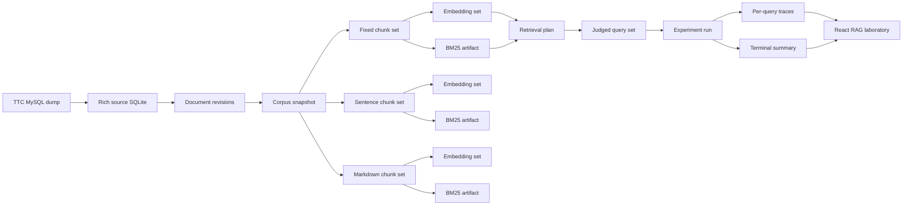
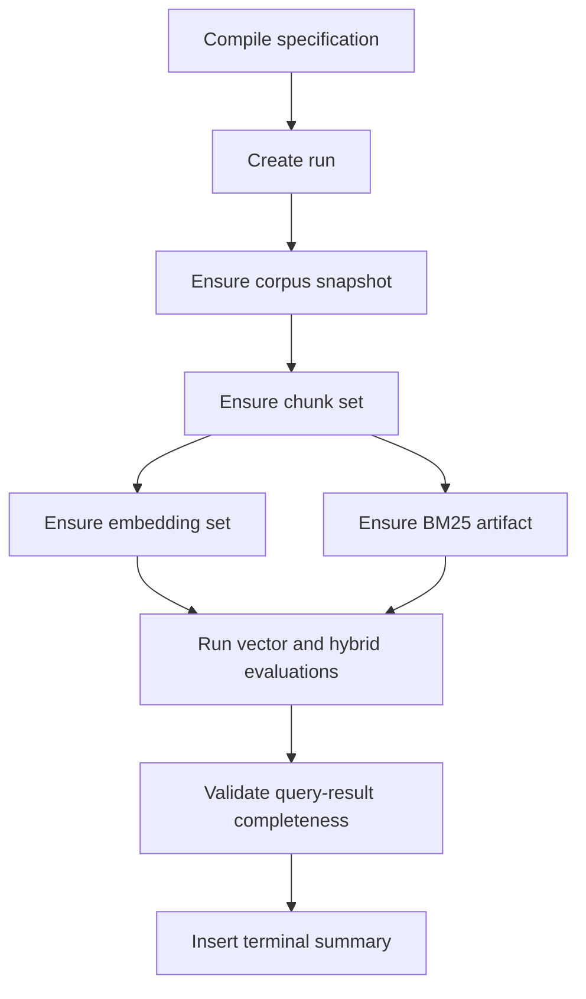

# TTC RAG laboratory baseline and immutable experiment runs

## 1. Executive summary

This ticket turns the maintained `rag-evaluation-system` application into the first reproducible TTC RAG laboratory. It covers two connected deliverables:

1. Build a small but complete TTC baseline that can be exercised from the web UI.
2. Introduce immutable experiment specifications, runs, artifacts, query traces, and evaluation results before the laboratory grows additional representations and retrieval techniques.

The baseline deliberately excludes generated summaries and synthetic questions. It first establishes a trustworthy raw-text comparison across fixed-size, sentence-aware, and Markdown-heading chunking; BM25, vector, and hybrid reciprocal-rank-fusion retrieval; and a small human-judged TTC query set. Summary and question representations can be added after this ticket because the experiment identity and evidence contracts will already exist.

The key architecture decision is to preserve the existing application as the service and UI host while replacing mutable research state with content-addressed objects for the new experiment path. A corpus snapshot, document revision, chunk plan, chunk set, embedding plan, embedding set, retrieval plan, evaluation dataset, and experiment specification each receive a deterministic SHA-256 identity. Executing the same specification creates a new run identifier but reuses validated content-addressed artifacts. It never overwrites an earlier run or index.

The rebuilt TTC source export is available now:

```text
path:          data/ttc-wordpress-rag.sqlite
size:          264,314,880 bytes
sha256:        c55953ee0d9289577062ac11001c25f63c0286ace45dbc6b4b056c11b0ea6db4
source dump:   /home/manuel/code/ttc/ttc/ttc_dev_dump.sql.bz2
source sha256: 593cbf30a09a02d0d46f5ae2f5549789cf78adbd78fbc43bfa0971ededd91abf
```

Validation produced the historical expected counts:

| Relation | Rows |
|---|---:|
| `documents` | 3,258 |
| `document_terms` | 123,457 |
| `product_details` | 2,600 |
| `product_variants` | 12,179 |
| `document_meta` | 59,212 |
| `view_products` | 2,600 |
| `view_documents` | 658 |

`PRAGMA integrity_check` returned `ok`, and the FTS query for `cypress` returned 198 rows. This database is a source artifact, not the operational RAG database. The implementation must import a deterministic subset into `data/rag-eval.db` through an explicit corpus-snapshot command.

## 2. Reading guide for a new intern

Read the system in the following order. Do not begin with the UI.

1. Read `docs/guides/ttc-data-handbook.md` to understand the TTC source schema and the distinction between `search_text`, `search_markdown`, normalized product facts, and WordPress metadata.
2. Read `internal/db/db.go:40-241` to understand the current operational tables and why their update behavior is insufficient for reproducible experiments.
3. Read `internal/chunking/chunker.go:11-337` and `internal/services/chunking/service.go:22-124` to understand current chunk generation and persistence.
4. Read `internal/services/embedding/service.go:21-170` and `internal/services/search/vector.go:12-109` to understand embedding identity and the current bounded cosine scan.
5. Read `internal/services/search/bm25.go:27-210` and `internal/services/search/hybrid.go:9-96` to understand current Bleve and RRF behavior.
6. Read `internal/workflow/submit.go:17-320` and `internal/workflow/intake_runner.go` to understand durable operation scheduling.
7. Read `web/src/components/pages/SearchWorkbenchPage/SearchWorkbenchPage.tsx:26-289`, `web/src/services/api.ts`, and `web/src/App.tsx:11-95` to understand the current laboratory shell.
8. Read the transcript prototype's `rag.js`, `bleve-rag.js`, and `evaluation.js` under `../2026-07-09--transcript-rag-sol2/ttmp/2026/07/10/TRANSCRIPT-RAG-SUMMARIZATION--multi-representation-transcript-rag-with-summaries/scripts/playground/verbs/`. These files demonstrate source-preserving chunks, representation parents, channel-local collapse, RRF, evidence hydration, plan fingerprints, and ranking metrics.

The transcript prototype is reference code. It is not a dependency of the maintained application. Port its invariants and tested algorithms; do not import its transcript-specific identifiers or stale generation lifecycle verb unchanged.

## 3. Scope

### 3.1 In scope

- Rebuild and validate the rich TTC WordPress/WooCommerce SQLite export.
- Import a deterministic, source-balanced TTC baseline snapshot into the application.
- Preserve exact document revisions and both plain-text and Markdown content variants.
- Compare three raw-evidence chunk plans.
- Compute one real 768-dimensional Ollama embedding baseline.
- Retain an offline deterministic embedding provider for tests only.
- Build content-addressed BM25 artifacts.
- Run bounded exhaustive cosine vector retrieval as a correctness baseline.
- Run BM25 plus vector hybrid retrieval with document-local collapse and RRF.
- Create at least 20 graded TTC queries across multiple intent classes.
- Compute Precision@K, Recall@K, HitRate@K, MRR, and nDCG@K.
- Record per-query ranked traces, component ranks, latency, embedding work, cache activity, and artifact bytes.
- Add experiment creation, execution, inspection, and comparison APIs.
- Add a React/Redux/RTK Query laboratory UI for building and comparing experiments.
- Store immutable specifications, terminal run summaries, and artifacts.
- Execute long-running experiment work through the existing durable workflow engine.

### 3.2 Explicitly out of scope

- Summary and synthetic-question representations.
- Answer generation and citation-faithfulness scoring.
- LLM reranking or LLM-as-judge evaluation.
- HyDE, query rewriting, or contextual retrieval.
- Full-corpus production indexing.
- A stable public JavaScript DSL.
- Distributed execution.
- A backwards-compatibility adapter between old mutable experiment tables and the new schema.

The old search endpoints may remain temporarily while the new path is implemented, but the new experiment code must not dual-write old and new tables. Once the bounded baseline passes, the web laboratory should use the new APIs directly.

## 4. Workspace and repository layout

The active workspace is not itself a Git repository. It contains several repositories and worktrees:

```text
/home/manuel/workspaces/2026-07-13/rag-eval-ttc/
├── .ttmp.yaml
├── rag-evaluation-system/              # active Git worktree, branch task/rag-eval-ttc
├── 2026-07-09--transcript-rag-sol2/    # JavaScript research reference
├── geppetto/                           # local dependency checkout
├── go-go-goja/                         # local JavaScript host/runtime checkout
├── glazed/                             # CLI framework checkout
└── pinocchio/                          # profile/CLI checkout
```

The workspace `.ttmp.yaml` points at `rag-evaluation-system/ttmp`. Run docmgr with that explicit storage root when invoking it from the workspace root:

```bash
docmgr --root rag-evaluation-system/ttmp status --summary-only
```

Run Git commands against the application worktree:

```bash
git -C rag-evaluation-system status --short --branch
```

Generated data under `rag-evaluation-system/data/` is ignored by Git. Ticket documents and ticket-local scripts live under `rag-evaluation-system/ttmp/2026/07/13/RAGEVAL-TTC-LAB-001--.../` and are committed.

## 5. Current-state architecture

### 5.1 TTC source database

The rich export is built by the existing `RAGEVAL-TTC-SQLITE-EXPORT` ticket. Its primary script is:

```text
ttmp/2026/06/02/RAGEVAL-TTC-SQLITE-EXPORT--export-ttc-wordpress-data-to-sqlite-for-rag-querying/scripts/07-export-ttc-wordpress-to-sqlite.py
```

The exporter creates semantic tables rather than mirroring WordPress. `view_products` contains product facts and text. `view_documents` contains posts, pages, FAQs, and guides. Both expose plain text and Markdown. The source export also has `documents_fts`, but that FTS index is only a source-level sanity baseline. The laboratory must build indexes from explicit corpus and chunk identities.

The older `RAGEVAL-002` ticket contains `04-import-corpus-into-rageval.py`, but that script targets the older `data/corpus/ttc-dump/ttc-corpus.sqlite` schema. It must not be pointed at the rich database. The new import command should be implemented against `view_products`, `view_documents`, and the normalized fact tables.

### 5.2 Operational database

`internal/db/db.go` currently creates:

- `sources`
- `documents`
- `chunks`
- `chunking_strategies`
- `chunk_embeddings`
- `chunk_enrichments`
- `document_processing_artifacts`
- `search_indexes`
- `eval_queries`
- `eval_runs`
- `eval_results`

These tables were sufficient for manual operations, but several are mutable:

- `InsertDocument` upserts content by document ID (`internal/db/queries.go:29-60`).
- `InsertChunkingStrategy` overwrites configuration under an existing strategy ID (`internal/db/queries.go:102-117`).
- chunk application deletes and recreates a document/strategy pair (`internal/services/chunking/service.go:86-113`).
- embedding computation upserts vectors under the same identity when text changes (`internal/db/queries.go:426-439`).
- search index metadata is overwritten by `UpsertSearchIndex` (`internal/db/search_queries.go:163-187`).
- `BuildBM25` deletes an existing index when `Force` is set (`internal/services/search/bm25.go:112-119`).

An evaluation run that stores only `config_json` cannot later prove which document bytes, chunk rows, vector bytes, or Bleve directory it used.

### 5.3 Chunking

`internal/chunking/chunker.go` implements:

- fixed rune windows with rune overlap;
- sentence accumulation with rune overlap;
- Markdown-heading sections with a fixed-size fallback.

The implementation calls the budgets “characters,” but converts the source to `[]rune`. Experiment schemas must call the unit `runes`.

The fixed chunker preserves a direct source slice. The sentence and Markdown chunkers call `strings.TrimSpace` while retaining offsets calculated from untrimmed input. Their `chunk.Text` can therefore differ from the declared source range. This is unsuitable for exact evidence hydration. The new chunk-set builder must validate:

```text
chunk.text == runeSlice(documentRevision[inputVariant], startRune, endRune)
```

If a strategy intentionally normalizes text, it must store normalized retrieval text separately from the immutable evidence range. It must not claim normalized text is an exact source slice.

### 5.4 Embeddings

`internal/services/embedding/service.go` already provides valuable behavior:

- provider/model/dimension validation;
- batch generation;
- source and document filters;
- content hashing;
- fresh-vector skipping;
- encoded float32 storage.

`internal/services/embedding/provider.go` resolves Geppetto embedding profiles and cache configuration. The application `go.mod` currently references Geppetto `v0.13.3`; before live baseline execution, update it to the released `v0.13.5` so profile YAML cache settings use the fixed decoder.

The UI is inconsistent today. `EmbeddingsView.tsx:16-18` defaults to Ollama `nomic-embed-text` at 768 dimensions, while `SearchWorkbenchPage.tsx:28-33` defaults to OpenAI `text-embedding-3-small` at 1,536 dimensions. Experiment specifications must replace page-local identity defaults.

### 5.5 Retrieval

BM25 is implemented as a disposable Bleve index over chunks. The current derived index ID includes the strategy and normalized source IDs, but omits `DocumentIDs` (`internal/services/search/service.go:111-115`). Two different bounded document selections can therefore derive the same index ID.

Vector retrieval embeds the query and loads stored embeddings from SQLite. It scans the returned rows using cosine similarity. The default `CandidateLimit` is 500 (`internal/services/search/vector.go:12`), and the database query applies that limit before scoring. On a corpus with more than 500 chunks, this is not exhaustive search; it is a deterministic prefix scan. The baseline runner must either:

- load every vector in the bounded embedding set; or
- explicitly label the algorithm as prefix-limited and reject it for correctness comparisons.

The first baseline chooses the former because a 200-document snapshot is intentionally small.

Hybrid retrieval runs BM25 and vector search separately, then fuses `ChunkID` values using:

```text
score(chunk) = 1 / (k + bm25_rank) + 1 / (k + vector_rank)
```

The implementation is deterministic on score ties, but it does not collapse multiple chunks from one document before fusion. The baseline evaluation is document-oriented, so each channel must retain only its highest-ranked chunk per document before RRF. The returned result still points to the winning chunk for evidence inspection.

### 5.6 Durable workflows

The workflow subsystem uses the scraper scheduler and a separate workflow-state SQLite database. `SubmitIntakeWorkflow` creates preprocessing, chunk, enrichment, embedding, and BM25 operations. This is an appropriate execution substrate for experiments because it already provides:

- operation dependencies;
- named CPU, LLM, embedding, and index queues;
- retries;
- results and errors;
- cancellation;
- workflow visibility in the web UI.

Workflow state is operational and may change. Experiment truth must remain separate. The experiment runner appends immutable domain events as work progresses and inserts one terminal summary after validation.

### 5.7 HTTP API and web UI

`internal/api/handlers.go:29-90` registers source, document, chunk, embedding, search, workflow, artifact, and corpus routes. There are no evaluation or experiment routes.

The React app already has Search, Corpus, Workflows, Pipeline, Embeddings, Evaluation, and DSL navigation. The Search Workbench can execute one retriever at a time and inspect result chunks. The Corpus Explorer can display documents, chunks, embeddings, and enrichments. The Evaluation page explicitly says “coming soon” (`web/src/components/pages/EvaluationPage/EvaluationPage.tsx:17-33`).

The existing UI is a strong shell. The laboratory work should add app-connected containers in `web/` and place only reusable, API-free panels in `packages/rag-evaluation-site` according to `packages/rag-evaluation-site/GUIDELINES.md`.

### 5.8 Transcript-RAG reference implementation

The transcript prototype contributes five tested concepts:

1. **Exact source chunks.** `rag.js:284-358` checks that every chunk equals its source rune slice and records byte/rune positions.
2. **Plan fingerprints.** `rag.js:772-783` serializes component descriptions and fingerprints the plan.
3. **Parent-aware retrieval.** `bleve-rag.js:195-237` searches named channels, deduplicates parents per channel, applies RRF, and hydrates original evidence after ranking.
4. **Ranking metrics.** `evaluation.js:22-56` implements Precision@K, Recall@K, HitRate@K, reciprocal rank, and graded nDCG.
5. **Generation manifests.** `generations.js` demonstrates content-derived generation IDs, manifests, atomic writes, validation, and activation.

The generation helper is partly stale relative to the later representation index. Use its lifecycle ideas but write the application implementation against the new experiment contracts below.

## 6. Gap analysis

| Required capability | Current state | Required change |
|---|---|---|
| Rich TTC source export | Rebuilt and validated | Keep as immutable input artifact and record its checksum |
| TTC import into app DB | Only older-schema Python bridge exists | Add a Glazed command for the rich export |
| Corpus snapshot | No snapshot table | Add content-addressed revisions and explicit membership |
| Chunk plan identity | Mutable row keyed by caller name | Fingerprint canonical strategy config and implementation version |
| Exact citation ranges | Fixed chunk works; sentence/Markdown can trim | Enforce source-slice invariant and explicit units |
| Embedding artifact identity | Vector rows can be upserted | Create immutable embedding sets keyed by chunk set and plan |
| BM25 identity | Derived ID omits document selection; force overwrites | Content-addressed directory and atomic publication |
| Vector correctness baseline | Prefix-limited scan by default | Scan complete bounded embedding set |
| Hybrid comparison | Chunk-level RRF | Per-channel document collapse followed by RRF |
| Judgments | Tables exist but no workflow | Add versioned datasets and graded judgments |
| Evaluation metrics | Schema fields only | Port metric implementation and per-query traces |
| Experiment identity | `eval_runs.config_json` only | Canonical spec fingerprint plus separate run ID |
| Run immutability | Status/result records mutable or absent | Append events and insert terminal summary once |
| Experiment API | Absent | Add compile, submit, inspect, trace, and compare routes |
| Laboratory UI | Search works; Evaluation placeholder | Add spec builder, parallel results, runs, and comparisons |

## 7. Target architecture



The execution boundary is:

```text
React UI
  -> RTK Query API client
  -> experiment HTTP handlers
  -> specification compiler
  -> durable workflow submission
  -> experiment operation runners
  -> immutable domain store + content-addressed artifact store
  -> trace/comparison APIs
  -> React UI
```

The workflow database answers “what is running?” The experiment database answers “what exactly was requested and what immutable result was produced?” The artifact directory contains index bytes addressed by fingerprints.

## 8. Baseline corpus definition

### 8.1 Source artifact

The source artifact manifest records:

```json
{
  "schema": "rag-eval-source-artifact/v1",
  "kind": "ttc-wordpress-rag-sqlite",
  "sha256": "c55953ee0d9289577062ac11001c25f63c0286ace45dbc6b4b056c11b0ea6db4",
  "bytes": 264314880,
  "sourceDumpSha256": "593cbf30a09a02d0d46f5ae2f5549789cf78adbd78fbc43bfa0971ededd91abf",
  "exporter": "RAGEVAL-TTC-SQLITE-EXPORT/07-export-ttc-wordpress-to-sqlite.py",
  "documentCount": 3258
}
```

The absolute local path is operational metadata and is not part of the semantic fingerprint.

### 8.2 Bounded snapshot

The first snapshot is exactly 200 documents:

| TTC kind | Count | Selection policy |
|---|---:|---|
| `ttc_guide` | 19 | all guides |
| `faq` | 35 | all FAQs |
| `post` | 48 | judgment seeds, then deterministic stratified fill |
| `product` | 80 | judgment seeds, then deterministic product-category/attribute fill |
| `page` | 18 | policy and informational judgment seeds, then stable fill |

Selection is a two-step process:

1. Include every document referenced by a baseline relevance judgment.
2. Fill the remaining quota deterministically within kind and declared strata. Sort candidates by `sha256(doc_id)` and store the final ordered document IDs in the snapshot manifest.

Do not rerun a random sampler. The manifest itself is the membership contract.

### 8.3 Document revisions

A stable document ID such as `wp:3699` identifies the WordPress object. A revision ID identifies immutable imported content:

```text
documentRevisionId = sha256(canonical JSON of source artifact ID,
                            stable document ID,
                            title,
                            URL,
                            kind,
                            content text,
                            content Markdown,
                            selected semantic metadata)
```

Store:

- stable document ID and WordPress ID;
- source artifact ID;
- kind, title, slug, URL, timestamps;
- `content_text`;
- `content_markdown`;
- `search_text`;
- `search_markdown`;
- normalized product facts and taxonomy metadata;
- content and metadata hashes.

The chunk plan selects an explicit input variant. Fixed and sentence baselines use `search_text`. Markdown-heading uses `search_markdown`.

## 9. Canonical identities

### 9.1 Canonical JSON rules

Implement canonicalization once in `internal/experiments/canonical.go` and test it independently.

Rules:

- Objects are encoded with keys sorted by UTF-8 byte order.
- Arrays retain order unless the owning contract declares them to be a set. Set-valued fields are normalized before canonical encoding.
- Strings remain exact UTF-8 strings. Field-specific trimming occurs before canonicalization and is part of validation.
- Integers are encoded as base-10 integers.
- Floating-point values must be finite and use a deterministic representation. Prefer scaled integers for weights when practical.
- `null` and an omitted field are different unless the schema normalizer defines a default and removes the distinction.
- Timestamps, labels, local paths, API keys, cache directories, and UI state do not enter semantic fingerprints.
- Schema and implementation-version fields do enter fingerprints.

Pseudocode:

```text
function fingerprint(schema, value):
    normalized = normalizeAccordingToSchema(schema, value)
    canonicalBytes = encodeCanonicalJSON(normalized)
    return "sha256:" + sha256(canonicalBytes)
```

### 9.2 Identity hierarchy

```text
sourceArtifactId   = hash(export checksum + exporter identity)
documentRevisionId = hash(source artifact + stable document + imported content)
corpusSnapshotId   = hash(ordered document revision IDs + selection plan)
chunkPlanId        = hash(strategy + units + input variant + implementation version)
chunkSetId         = hash(corpus snapshot ID + chunk plan ID)
embeddingPlanId    = hash(provider + model + dimensions + normalization + implementation)
embeddingSetId     = hash(chunk set ID + embedding plan ID)
indexArtifactId    = hash(chunk/embedding set + index plan)
retrievalPlanId    = hash(channels + collapse + fusion + limits + implementation)
evaluationDatasetId = hash(ordered queries + judgments + metric schema)
experimentSpecId   = hash(all referenced component identities)
runId              = new ULID for each execution attempt
```

An experiment spec ID answers “is this the same scientific configuration?” A run ID answers “which execution attempt produced this observation?” Do not derive run IDs from the spec.

### 9.3 Secrets and profiles

Store resolved, non-secret provider identity:

- provider type;
- engine/model;
- dimensions;
- endpoint class when semantically relevant;
- input normalization version;
- package version;
- profile slug for diagnosis.

Do not store API keys in specifications, events, manifests, or traces. Profile-registry file paths are operational locators, not semantic identity. The resolved model configuration is semantic identity.

## 10. Proposed persistence model

The following schema is a design contract. Names may be adjusted once Go query types are implemented, but the ownership boundaries and immutability rules must remain.

### 10.1 Corpus tables

```sql
CREATE TABLE source_artifacts (
    id TEXT PRIMARY KEY,
    schema_version TEXT NOT NULL,
    kind TEXT NOT NULL,
    checksum_sha256 TEXT NOT NULL,
    byte_size INTEGER NOT NULL,
    manifest_json TEXT NOT NULL,
    created_at TEXT NOT NULL
);

CREATE TABLE document_revisions (
    id TEXT PRIMARY KEY,
    stable_document_id TEXT NOT NULL,
    source_artifact_id TEXT NOT NULL REFERENCES source_artifacts(id),
    kind TEXT NOT NULL,
    title TEXT NOT NULL,
    url TEXT NOT NULL,
    content_text TEXT NOT NULL,
    content_markdown TEXT NOT NULL,
    search_text TEXT NOT NULL,
    search_markdown TEXT NOT NULL,
    metadata_json TEXT NOT NULL,
    content_hash TEXT NOT NULL,
    created_at TEXT NOT NULL
);

CREATE TABLE corpus_snapshots (
    id TEXT PRIMARY KEY,
    schema_version TEXT NOT NULL,
    source_artifact_id TEXT NOT NULL REFERENCES source_artifacts(id),
    selection_json TEXT NOT NULL,
    manifest_json TEXT NOT NULL,
    document_count INTEGER NOT NULL,
    created_at TEXT NOT NULL
);

CREATE TABLE corpus_snapshot_documents (
    snapshot_id TEXT NOT NULL REFERENCES corpus_snapshots(id),
    ordinal INTEGER NOT NULL,
    document_revision_id TEXT NOT NULL REFERENCES document_revisions(id),
    PRIMARY KEY (snapshot_id, ordinal),
    UNIQUE (snapshot_id, document_revision_id)
);
```

Insert these rows once. If an ID already exists, compare the canonical bytes and return “reused” only when they are identical. Never issue `ON CONFLICT DO UPDATE` for semantic objects.

### 10.2 Chunk tables

```sql
CREATE TABLE chunk_plans (
    id TEXT PRIMARY KEY,
    schema_version TEXT NOT NULL,
    strategy TEXT NOT NULL,
    input_variant TEXT NOT NULL,
    config_json TEXT NOT NULL,
    implementation_json TEXT NOT NULL,
    created_at TEXT NOT NULL
);

CREATE TABLE chunk_sets (
    id TEXT PRIMARY KEY,
    corpus_snapshot_id TEXT NOT NULL REFERENCES corpus_snapshots(id),
    chunk_plan_id TEXT NOT NULL REFERENCES chunk_plans(id),
    manifest_json TEXT NOT NULL,
    chunk_count INTEGER NOT NULL,
    created_at TEXT NOT NULL
);

CREATE TABLE experiment_chunks (
    id TEXT PRIMARY KEY,
    chunk_set_id TEXT NOT NULL REFERENCES chunk_sets(id),
    document_revision_id TEXT NOT NULL REFERENCES document_revisions(id),
    chunk_index INTEGER NOT NULL,
    evidence_text TEXT NOT NULL,
    retrieval_text TEXT NOT NULL,
    text_hash TEXT NOT NULL,
    start_rune INTEGER NOT NULL,
    end_rune INTEGER NOT NULL,
    start_byte INTEGER NOT NULL,
    end_byte INTEGER NOT NULL,
    heading_path_json TEXT NOT NULL,
    boundaries_json TEXT NOT NULL,
    UNIQUE (chunk_set_id, document_revision_id, chunk_index)
);
```

`evidence_text` must equal the source slice. `retrieval_text` may equal evidence or contain an explicitly declared normalization. The baseline uses equal values.

### 10.3 Embedding and index tables

```sql
CREATE TABLE embedding_plans (
    id TEXT PRIMARY KEY,
    schema_version TEXT NOT NULL,
    provider TEXT NOT NULL,
    model TEXT NOT NULL,
    dimensions INTEGER NOT NULL,
    config_json TEXT NOT NULL,
    implementation_json TEXT NOT NULL,
    created_at TEXT NOT NULL
);

CREATE TABLE embedding_sets (
    id TEXT PRIMARY KEY,
    chunk_set_id TEXT NOT NULL REFERENCES chunk_sets(id),
    embedding_plan_id TEXT NOT NULL REFERENCES embedding_plans(id),
    manifest_json TEXT NOT NULL,
    vector_count INTEGER NOT NULL,
    created_at TEXT NOT NULL
);

CREATE TABLE experiment_embeddings (
    embedding_set_id TEXT NOT NULL REFERENCES embedding_sets(id),
    chunk_id TEXT NOT NULL REFERENCES experiment_chunks(id),
    text_hash TEXT NOT NULL,
    embedding BLOB NOT NULL,
    PRIMARY KEY (embedding_set_id, chunk_id)
);

CREATE TABLE index_artifacts (
    id TEXT PRIMARY KEY,
    schema_version TEXT NOT NULL,
    artifact_kind TEXT NOT NULL,
    input_set_id TEXT NOT NULL,
    plan_json TEXT NOT NULL,
    relative_path TEXT NOT NULL,
    checksum_sha256 TEXT NOT NULL,
    byte_size INTEGER NOT NULL,
    manifest_json TEXT NOT NULL,
    created_at TEXT NOT NULL
);
```

Artifacts live under:

```text
data/artifacts/<artifact-kind>/<first-two-digest-bytes>/<full-digest>/
```

Build into a sibling temporary directory, validate counts and checksums, then atomically rename. If the final directory exists, validate and reuse it. Do not support `force` overwrite on immutable artifact APIs.

### 10.4 Evaluation tables

```sql
CREATE TABLE evaluation_datasets (
    id TEXT PRIMARY KEY,
    schema_version TEXT NOT NULL,
    name TEXT NOT NULL,
    version TEXT NOT NULL,
    manifest_json TEXT NOT NULL,
    query_count INTEGER NOT NULL,
    created_at TEXT NOT NULL
);

CREATE TABLE evaluation_queries_v2 (
    dataset_id TEXT NOT NULL REFERENCES evaluation_datasets(id),
    query_id TEXT NOT NULL,
    ordinal INTEGER NOT NULL,
    query_text TEXT NOT NULL,
    intent TEXT NOT NULL,
    notes TEXT NOT NULL,
    PRIMARY KEY (dataset_id, query_id),
    UNIQUE (dataset_id, ordinal)
);

CREATE TABLE relevance_judgments (
    dataset_id TEXT NOT NULL,
    query_id TEXT NOT NULL,
    document_revision_id TEXT NOT NULL,
    relevance_level TEXT NOT NULL CHECK (relevance_level IN (
        '0_NOT_RELEVANT',
        '1_PARTIAL',
        '2_SUBSTANTIAL',
        '3_AUTHORITATIVE'
    )),
    relevance_rank INTEGER NOT NULL CHECK (relevance_rank BETWEEN 0 AND 3),
    rationale TEXT NOT NULL,
    evidence_json TEXT NOT NULL,
    adjudication_json TEXT NOT NULL,
    PRIMARY KEY (dataset_id, query_id, document_revision_id),
    FOREIGN KEY (dataset_id, query_id)
      REFERENCES evaluation_queries_v2(dataset_id, query_id),
    CHECK (
        (relevance_level = '0_NOT_RELEVANT' AND relevance_rank = 0) OR
        (relevance_level = '1_PARTIAL' AND relevance_rank = 1) OR
        (relevance_level = '2_SUBSTANTIAL' AND relevance_rank = 2) OR
        (relevance_level = '3_AUTHORITATIVE' AND relevance_rank = 3)
    )
);
```

Relevance levels are named to keep their meaning visible in source data, APIs, and the UI:

- `0_NOT_RELEVANT`: unrelated, contradictory, or unsupported for the information need;
- `1_PARTIAL`: related but missing a material required facet;
- `2_SUBSTANTIAL`: materially answers the primary need and counts as a binary relevant hit;
- `3_AUTHORITATIVE`: direct, complete, and ideal corpus evidence for the query.

Each evaluation-dataset manifest declares `binaryRelevantAtOrAbove: 2_SUBSTANTIAL`. The full authoring, evidence, adjudication, and versioning contract is in `design-doc/02-evaluation-dataset-authoring-and-adjudication-protocol.md`.

### 10.5 Experiment tables

```sql
CREATE TABLE experiment_specs (
    id TEXT PRIMARY KEY,
    schema_version TEXT NOT NULL,
    canonical_json TEXT NOT NULL,
    created_at TEXT NOT NULL
);

CREATE TABLE experiment_runs_v2 (
    id TEXT PRIMARY KEY,
    spec_id TEXT NOT NULL REFERENCES experiment_specs(id),
    requested_by TEXT NOT NULL,
    code_identity_json TEXT NOT NULL,
    environment_json TEXT NOT NULL,
    created_at TEXT NOT NULL
);

CREATE TABLE experiment_run_events (
    run_id TEXT NOT NULL REFERENCES experiment_runs_v2(id),
    sequence INTEGER NOT NULL,
    event_type TEXT NOT NULL,
    payload_json TEXT NOT NULL,
    occurred_at TEXT NOT NULL,
    PRIMARY KEY (run_id, sequence)
);

CREATE TABLE experiment_query_results (
    run_id TEXT NOT NULL REFERENCES experiment_runs_v2(id),
    query_id TEXT NOT NULL,
    retrieval_plan_id TEXT NOT NULL,
    latency_ns INTEGER NOT NULL,
    ranked_results_json TEXT NOT NULL,
    metrics_json TEXT NOT NULL,
    PRIMARY KEY (run_id, query_id, retrieval_plan_id)
);

CREATE TABLE experiment_run_summaries (
    run_id TEXT PRIMARY KEY REFERENCES experiment_runs_v2(id),
    terminal_status TEXT NOT NULL,
    aggregate_metrics_json TEXT NOT NULL,
    resource_usage_json TEXT NOT NULL,
    artifact_manifest_json TEXT NOT NULL,
    failure_json TEXT NOT NULL,
    completed_at TEXT NOT NULL
);
```

There are no UPDATE or DELETE operations in the experiment repository. Status is derived from the latest appended event until the one terminal summary is inserted. A failed run remains inspectable.

## 11. Experiment specification

### 11.1 Draft and canonical forms

The UI edits a draft. The server validates and compiles it into a canonical specification. Expensive work never starts from an uncompiled draft.

```json
{
  "schema": "rag-eval-experiment-draft/v1",
  "name": "ttc baseline fixed 1200",
  "corpus": {
    "snapshotId": "sha256:..."
  },
  "chunking": {
    "strategy": "fixed",
    "inputVariant": "search_text",
    "maxRunes": 1200,
    "overlapRunes": 150
  },
  "embedding": {
    "provider": "ollama",
    "model": "nomic-embed-text",
    "dimensions": 768,
    "normalization": "none"
  },
  "retrievals": [
    { "name": "bm25", "kind": "bm25", "limit": 10 },
    { "name": "vector", "kind": "vector", "limit": 10 },
    {
      "name": "hybrid",
      "kind": "rrf",
      "channels": ["bm25", "vector"],
      "overfetch": 50,
      "rankConstant": 60,
      "collapse": "document",
      "limit": 10
    }
  ],
  "evaluation": {
    "datasetId": "sha256:...",
    "cutoffs": [1, 3, 5, 10]
  }
}
```

The compiled response includes every component identity and the complete canonical JSON:

```json
{
  "specId": "sha256:...",
  "corpusSnapshotId": "sha256:...",
  "chunkPlanId": "sha256:...",
  "chunkSetId": "sha256:...",
  "embeddingPlanId": "sha256:...",
  "embeddingSetId": "sha256:...",
  "retrievalPlanIds": ["sha256:..."],
  "evaluationDatasetId": "sha256:...",
  "canonical": {}
}
```

### 11.2 Go API sketch

```go
type SpecCompiler interface {
    Compile(ctx context.Context, draft DraftSpec) (*CompiledSpec, error)
}

type RunRepository interface {
    CreateRun(ctx context.Context, run ExperimentRun) error
    AppendEvent(ctx context.Context, event RunEvent) error
    InsertQueryResult(ctx context.Context, result QueryResult) error
    InsertTerminalSummary(ctx context.Context, summary RunSummary) error
}

type ExperimentRunner interface {
    Run(ctx context.Context, runID string) error
}

var _ SpecCompiler = (*Compiler)(nil)
var _ RunRepository = (*SQLiteRunRepository)(nil)
var _ ExperimentRunner = (*Runner)(nil)
```

Use `context.Context` for compilation operations that read persistence and for all execution operations. Wrap errors with `github.com/pkg/errors` at boundary transitions. Use `errgroup` only where channel searches or independent validation work are intentionally parallel.

## 12. Chunking baseline

### 12.1 Plans

The three initial plans are:

```text
fixed-1200-150-runes
  input: search_text
  maximum: 1200 runes
  overlap: 150 runes

sentence-1200-150-runes
  input: search_text
  target: 1200 runes
  overlap: whole source spans selected to approach 150 runes

markdown-heading-2400-runes
  input: search_markdown
  section boundary: Markdown headings
  maximum: 2400 runes
  oversized fallback: source-preserving paragraph/line/rune packing
```

Sentence overlap should not begin in the middle of a sentence. The current suffix-rune overlap must be replaced for the immutable experiment path. Markdown fallback must preserve absolute offsets into `search_markdown`.

### 12.2 Chunk-set construction

```text
for document revision in snapshot order:
    source = revision.variant(chunkPlan.inputVariant)
    spans = chunker.split(source, chunkPlan.config)
    for span in spans:
        require 0 <= startRune < endRune <= runeCount(source)
        require text == source[startRune:endRune]
        derive byte offsets from the same source
        require sourceBytes[startByte:endByte] decodes to text
        insert immutable chunk row

manifest.chunkCount = inserted count
manifest.documentCount = distinct document revisions
manifest.totalRunes = sum evidence rune lengths
manifest.overlapRunes = measured duplicate coverage
publish chunk set only after validation
```

Store diagnostic boundary information such as heading path, paragraph ordinal, sentence ordinals, oversized status, and chunker implementation version. These fields make the Chunk Lab useful and make unexpected retrieval behavior explainable.

## 13. Embedding baseline

The first real plan is:

```text
provider:   ollama
model:      nomic-embed-text
dimensions: 768
profile:    resolved through Geppetto/Pinocchio
```

Use Geppetto `v0.13.5` or later. The run manifest records the resolved provider/model/dimensions and package version. It records cache hits and misses, but cache location is not part of semantic identity.

Offline tests use a deterministic provider with a clear name such as `deterministic-hash-smoke-only`. The compiler emits a warning if it appears in a run intended for scientific comparison. It must never be labeled semantic.

Embedding-set construction:

```text
expected = every chunk ID in chunk set
for chunk batches in deterministic chunk ID order:
    generate vectors for retrieval_text
    require vector count equals batch count
    require every vector dimension equals plan dimensions
    insert vectors keyed by embedding set + chunk
require stored vector IDs exactly equal expected
insert embedding-set manifest
```

Do not update individual vectors. A changed text, provider identity, model, dimensions, or normalization creates a different set ID.

## 14. Retrieval baseline

### 14.1 BM25

Build one Bleve document per chunk with stored fields:

- chunk ID;
- chunk set ID;
- document revision ID;
- stable document ID;
- TTC kind;
- title;
- URL;
- chunk index;
- evidence/retrieval text;
- source offsets;
- heading path.

Use explicit field mappings. Boost title separately from chunk text. Record the analyzer and mapping version in the index plan.

### 14.2 Vector

The first vector algorithm is a complete cosine scan over the bounded embedding set. It is a correctness oracle, not the final performance architecture.

```text
queryVector = embed(query)
require dimensions(queryVector) == plan.dimensions
for every vector in embeddingSet:
    score = cosine(queryVector, storedVector)
sort by descending score, then ascending chunk ID
return overfetch candidates
```

Record vector load time, query-embedding time, scoring time, sort time, and candidate count separately.

### 14.3 Channel-local document collapse

For each channel, retain only the highest-ranked chunk from each document before hybrid fusion:

```text
function collapseChannelToDocuments(chunkHits):
    seen = set()
    documentHits = []
    for hit in rank order:
        if hit.documentRevisionId in seen: continue
        seen.add(hit.documentRevisionId)
        documentHits.append(hit with documentRank = len(documentHits) + 1)
    return documentHits
```

This prevents a long document with many related chunks from receiving several RRF contributions from one retrieval signal.

### 14.4 RRF

```text
RRF(document) = sum over configured channels c of
                channelWeight(c) / (rankConstant + rank_c(document))
```

The baseline uses equal weights and `rankConstant = 60`. Component scores are retained for diagnosis but not compared across BM25 and cosine scales.

```text
candidates = map documentRevisionId -> fused result
for channel in channels:
    documentHits = collapseChannelToDocuments(search(channel, query, overfetch))
    for hit in documentHits:
        candidate.score += 1 / (60 + hit.documentRank)
        candidate.components[channel] = {
            rank, rawScore, winningChunkId, retrievalPlanId
        }

sort by descending fused score, then documentRevisionId
hydrate winning original chunk and document metadata
take limit
```

The result trace must include channel results before collapse, the winning chunk per document, document-local ranks, RRF contributions, final rank, and hydrated evidence.

## 15. Evaluation dataset

### 15.1 Query strata

Create at least 20 queries across:

- exact plant/product attributes;
- product discovery;
- product comparison;
- planting and care;
- pruning and maintenance;
- hardiness and climate suitability;
- taxonomy/category navigation;
- FAQ and order policy;
- editorial guide retrieval;
- negative or unanswerable queries.

Use structured TTC facts to discover candidate queries, but do not treat generated or template-derived questions as ground truth. A capable language model may draft source-grounded cards, pools, and provisional labels, but a human reviewer must verify every query and named relevance level against exact source evidence before a dataset is frozen. Follow `design-doc/02-evaluation-dataset-authoring-and-adjudication-protocol.md`.

### 15.2 Metrics

For cutoff `K`:

```text
Precision@K = relevant retrieved in top K / K
Recall@K    = relevant retrieved in top K / total relevant
HitRate@K   = 1 if any relevant document appears in top K, else 0
MRR         = reciprocal rank of first relevant document
nDCG@K      = DCG@K / ideal DCG@K using relevance ranks 0..3
```

Use gain `2^relevance_rank - 1` and discount `log2(rank + 1)`, matching the transcript prototype. Binary metrics use the immutable dataset's declared named-level threshold.

Also record:

- p50 and p95 query latency;
- query embedding latency;
- candidate generation latency;
- fusion and hydration latency;
- embedding vectors computed and reused;
- embedding cache hits/misses;
- index build duration;
- index and vector byte size;
- failures and incomplete queries.

### 15.3 Result identity

Metrics are computed against document revision IDs, not mutable stable document IDs and not chunk IDs. A query result includes the winning evidence chunk, but relevance applies to the immutable document revision.

## 16. Durable experiment execution

### 16.1 Operation graph



“Ensure” means validate-and-reuse or build-and-publish. It never means overwrite.

### 16.2 Event vocabulary

Initial events:

```text
run.created
artifact.reused
artifact.build.started
artifact.build.completed
query.started
query.completed
query.failed
run.validation.started
run.completed
run.failed
```

Every event has monotonically increasing `sequence` within one run. Append it in the same transaction as the domain state change when possible.

### 16.3 Terminal validation

Before inserting a successful summary, require:

- compiled spec exists and matches the run;
- corpus snapshot membership validates;
- all referenced artifact manifests validate;
- every evaluation query has one result per retrieval plan;
- all metric values are finite;
- latency and byte counts are nonnegative;
- the terminal artifact manifest contains checksums;
- no prior terminal summary exists.

If validation fails, append `run.failed` and insert a failed terminal summary with a structured failure. Do not delete partial query results; they are diagnostic evidence.

## 17. HTTP API

Add focused handler files rather than expanding `internal/api/handlers.go` further:

```text
internal/api/corpus_snapshot_handlers.go
internal/api/experiment_spec_handlers.go
internal/api/experiment_run_handlers.go
internal/api/evaluation_handlers.go
```

Proposed routes:

```text
POST /api/v1/corpus-snapshots/ttc/compile
GET  /api/v1/corpus-snapshots
GET  /api/v1/corpus-snapshots/{id}

POST /api/v1/experiment-specs/compile
GET  /api/v1/experiment-specs/{id}

POST /api/v1/experiment-runs
GET  /api/v1/experiment-runs
GET  /api/v1/experiment-runs/{id}
GET  /api/v1/experiment-runs/{id}/events
GET  /api/v1/experiment-runs/{id}/query-results
GET  /api/v1/experiment-runs/{id}/query-results/{queryId}

GET  /api/v1/evaluation-datasets
GET  /api/v1/evaluation-datasets/{id}
POST /api/v1/evaluation-datasets/{id}/judgments

POST /api/v1/experiment-comparisons
```

Example run submission:

```json
POST /api/v1/experiment-runs
{
  "specId": "sha256:...",
  "name": "fixed vs sentence baseline",
  "requestedBy": "web-lab"
}
```

Response:

```json
{
  "runId": "01J...",
  "specId": "sha256:...",
  "workflowId": "rag-experiment-01J...",
  "status": "pending"
}
```

Return structured errors:

```json
{
  "error": {
    "code": "invalid_experiment_spec",
    "message": "chunking.overlapRunes must be smaller than maxRunes",
    "details": { "path": "chunking.overlapRunes" }
  }
}
```

## 18. Web laboratory

### 18.1 Navigation

Keep the existing shell and add or promote these app views:

- **Corpus**: snapshot membership and document revision inspection.
- **Chunk Lab**: side-by-side chunk boundaries for one document across plans.
- **Search**: parallel BM25/vector/hybrid ranked lists and trace inspection.
- **Experiments**: draft editor, compiled identity, run submission, progress, and artifacts.
- **Evaluation**: dataset/judgment editor and run comparison.
- **Workflows**: operational queue and operation diagnosis.

### 18.2 Experiment builder

The builder should expose controlled selections rather than free-form IDs:

- corpus snapshot;
- chunk strategy and inputs;
- embedding plan;
- retrieval plans;
- evaluation dataset and cutoffs.

Display the compiled spec fingerprint before the Run button. Show validation errors next to fields. A “Clone” action creates a new draft; it never edits an existing canonical spec.

### 18.3 Parallel retrieval view

For one query, show BM25, vector, and hybrid columns simultaneously. Each row shows:

- document rank;
- title and kind;
- winning chunk index;
- raw channel score;
- component ranks and RRF contribution;
- evidence preview;
- relevance grade if available.

Selecting a result opens the existing inspector pattern with additional tabs:

- **Evidence**: exact source chunk and offsets;
- **Trace**: pre-collapse hits, collapse winner, and fusion calculation;
- **Document**: full revision and metadata;
- **Judgment**: grade and rationale.

### 18.4 Run comparison

Compare two or more terminal runs with:

- component identity differences;
- aggregate metrics and deltas;
- latency and storage deltas;
- per-query wins, losses, and ties;
- links into ranked traces;
- artifact reuse and cache counts.

Do not make a two-dimensional embedding plot the primary diagnostic. Ranked evidence, component ranks, chunk boundaries, and per-query deltas directly explain retrieval behavior.

### 18.5 Frontend ownership

Use:

- React and TypeScript;
- Redux and RTK Query for server state;
- Bootstrap-compatible controls or the existing design-system components;
- CSS Modules and existing theme tokens;
- Storybook for reusable components.

Candidate reusable components in `packages/rag-evaluation-site`:

```text
ExperimentIdentityPanel
ExperimentMetricTable
RetrievalTracePanel
ArtifactManifestPanel
RunStatusTimeline
RunComparisonMatrix
ChunkBoundaryViewer
```

These components accept DTO-shaped props and callbacks. They do not import RTK Query. App-connected containers remain under `web/src/components/pages`.

## 19. CLI design

Use Glazed for new commands. Proposed command groups:

```text
rag-eval ttc snapshot
rag-eval experiment compile
rag-eval experiment run
rag-eval experiment list
rag-eval experiment show
rag-eval experiment compare
rag-eval evaluation dataset-list
rag-eval evaluation query-list
```

Example:

```bash
go run ./cmd/rag-eval ttc snapshot \
  --source-sqlite data/ttc-wordpress-rag.sqlite \
  --db data/rag-eval.db \
  --manifest data/manifests/ttc-baseline-v1.json \
  --log-level debug
```

Do not read provider settings directly with `os.Getenv`. Resolve profiles through the existing Glazed/Geppetto configuration path. All new experimental commands include `--log-level` and use zerolog.

## 20. File-level implementation guide

### Phase A: Corpus and identity foundation

Create:

```text
internal/experiments/canonical.go
internal/experiments/types.go
internal/experiments/compiler.go
internal/experiments/repository.go
internal/ttccorpus/importer.go
internal/ttccorpus/selection.go
cmd/rag-eval/cmds/ttc/root.go
cmd/rag-eval/cmds/ttc/snapshot.go
```

Update:

```text
internal/db/db.go
internal/db/migrations.go
cmd/rag-eval/main.go
```

Prefer migration constants in focused files if `db.go` becomes harder to review. Tests use temporary SQLite databases and compare exact canonical JSON/fingerprints.

### Phase B: Immutable chunks and embeddings

Create:

```text
internal/experiments/chunksets/builder.go
internal/experiments/chunksets/validate.go
internal/experiments/embeddingsets/builder.go
```

Refactor reusable strategy logic from `internal/chunking`, but do not write the experiment path through mutable `chunking_strategies` and `chunks`. Add exact source-range tests for UTF-8, headings, whitespace, oversized sections, and overlaps.

Update `go.mod` to Geppetto `v0.13.5` or later before the live run.

### Phase C: Content-addressed retrieval

Create:

```text
internal/experiments/retrieval/bm25.go
internal/experiments/retrieval/vector.go
internal/experiments/retrieval/rrf.go
internal/experiments/retrieval/trace.go
internal/experiments/artifacts/store.go
```

Port the parent-collapse and RRF invariants from transcript `bleve-rag.js`, replacing transcript unit identity with TTC document revision identity.

### Phase D: Evaluation and run lifecycle

Create:

```text
internal/experiments/evaluation/metrics.go
internal/experiments/evaluation/dataset.go
internal/experiments/runs/runner.go
internal/experiments/runs/repository.go
internal/workflow/experiment_runner.go
internal/workflow/experiment_submit.go
```

Port metric formulas from transcript `evaluation.js` and add graded/document-level fixtures.

### Phase E: API and UI

Create focused API handlers and extend `web/src/services/api.ts` with typed endpoints. Create app pages:

```text
web/src/components/pages/ExperimentLabPage/
web/src/components/pages/RunInspectorPage/
web/src/components/pages/RunComparisonPage/
web/src/components/pages/ChunkLabPage/
```

Update `web/src/App.tsx` navigation. Add reusable panels to the package only after their prop APIs stabilize in the app and add required stories.

### Phase F: Documentation and baseline execution

Update:

```text
README.md
cmd/rag-eval/README.md
docs/guides/ttc-data-handbook.md
docs/guides/rag-laboratory.md
docs/guides/experiment-artifacts.md
```

Record the first terminal run IDs, spec IDs, metrics, latency, cache statistics, and artifact bytes in this ticket diary. Do not commit generated databases, vectors, or Bleve directories.

## 21. Test strategy

### 21.1 Canonicalization tests

- Different map insertion orders produce the same bytes and fingerprint.
- Different array orders remain different for ordered fields.
- Set-valued fields normalize before hashing.
- Omitted/default fields compile identically.
- Labels, timestamps, paths, and secrets do not change semantic identity.
- Model, dimensions, chunk units, analyzer version, or dataset judgments do change identity.

### 21.2 Corpus tests

- Import a small source fixture twice and receive the same snapshot ID without updates.
- Change one content byte and receive a new document revision and snapshot ID.
- Verify 200-document baseline membership and per-kind quotas.
- Verify every judgment's document revision belongs to the selected snapshot.

### 21.3 Chunk tests

- Fixed, sentence, and Markdown chunks equal source slices.
- Rune and byte offsets agree for ASCII and multibyte Unicode.
- Overlap makes forward progress and obeys configured units.
- Markdown heading paths remain attached to fallback chunks.
- Rebuilding an identical set reuses the same ID.
- Changing one plan field creates a different ID.

### 21.4 Embedding tests

- Deterministic provider produces stable dimensions and vectors.
- Batch count and dimension mismatches fail before publication.
- Complete-set validation detects missing and extra chunk IDs.
- Same set reuses stored vectors.
- A model/dimension change creates a new set.

### 21.5 Retrieval tests

- BM25 index contains exactly the chunk-set count.
- Full vector scan scores every embedding in the bounded set.
- Channel-local document collapse retains one chunk per document.
- RRF component contributions match hand-calculated fixtures.
- Tie ordering is deterministic.
- Hydrated evidence equals the original immutable source range.
- Different document selections cannot share an artifact ID.

### 21.6 Metric tests

Use small hand-computed fixtures for:

- no relevant hit;
- first-rank hit;
- multiple relevant documents;
- graded relevance ordering;
- cutoff smaller than relevant set;
- duplicate document hits before collapse.

### 21.7 Run-lifecycle tests

- Run creation inserts one identity row and first event.
- Event sequence is monotonic and duplicate sequences fail.
- Query results are insert-once.
- Exactly one terminal summary is allowed.
- Failed runs preserve completed query traces.
- Identical specs create distinct run IDs and reuse valid artifacts.

### 21.8 UI tests

- Draft validation and compiled fingerprint display.
- Empty, running, completed, and failed run states.
- Parallel BM25/vector/hybrid columns.
- Trace inspection and exact evidence navigation.
- Metric comparison with positive, negative, and tied deltas.
- Storybook default, dense, empty, overflow, and error states.

## 22. Validation commands

Use focused tests while implementing, then run the project checks:

```bash
go test ./internal/experiments/... -count=1
go test ./internal/ttccorpus/... -count=1
go test ./internal/api/... -count=1
go test ./internal/workflow/... -count=1
go test ./...

pnpm biome check --write .
pnpm --dir web typecheck
pnpm --dir packages/rag-evaluation-site typecheck
pnpm --dir web build
```

Start the server in tmux for interaction:

```bash
tmux new-session -d -s rag-eval-ttc \
  'go run ./cmd/rag-eval serve --db data/rag-eval.db --address 127.0.0.1:8772 --log-level debug'

tmux capture-pane -pt rag-eval-ttc
```

Before restarting, kill the port through the workspace helper required by the project instructions:

```bash
lsof-who -p 8772 -k
```

## 23. Baseline acceptance criteria

The ticket is implementation-complete only when:

1. `ttc-baseline-v1` has an explicit 200-document manifest and stable snapshot ID.
2. All three chunk sets validate exact source ranges and have stable IDs.
3. Ollama `nomic-embed-text` 768D embeddings cover every chunk in the selected embedding set.
4. BM25, complete-scan vector, and document-collapsed RRF retrieval run from the same snapshot/chunk identity.
5. At least 20 human-verified queries have graded document judgments.
6. Every retrieval plan produces all requested metrics and a complete per-query trace.
7. The web UI can compile a spec, submit a run, show progress, compare terminal runs, and navigate from a metric regression to original evidence.
8. Repeating an identical spec creates a new run ID without overwriting the first run and reuses validated artifacts.
9. A changed corpus member, chunk parameter, model identity, retrieval option, or judgment creates the appropriate new fingerprint.
10. Metrics, latency, cache work, and storage bytes appear in the terminal summary.
11. Go tests, TypeScript checks, Biome checks, and the bounded end-to-end smoke pass.
12. CLI/API/operator documentation identifies the run and artifact contracts.

## 24. Architecture decisions

### Decision: Extend the maintained application

- **Context:** The transcript prototype has stronger research semantics, while `rag-evaluation-system` has the maintained Go service, workflow engine, HTTP API, React UI, and component library.
- **Options considered:** Expand the transcript prototype into a web app; build a third application; port the semantics into `rag-evaluation-system`.
- **Decision:** Port the reusable semantics into `rag-evaluation-system` and keep the transcript repository as evidence/reference.
- **Rationale:** This avoids duplicating service, workflow, and UI infrastructure and gives the laboratory an existing operational shell.
- **Consequences:** Transcript-specific JavaScript cannot be copied wholesale. Interfaces must use TTC document/revision identities.
- **Status:** accepted

### Decision: Introduce a direct immutable experiment path

- **Context:** Current documents, chunk strategies, chunks, embeddings, and indexes are mutable and cannot support reproducible comparisons.
- **Options considered:** Add more columns to mutable tables; dual-write old and new tables; create content-addressed experiment tables and cut the laboratory over.
- **Decision:** Create content-addressed experiment tables and artifacts, then move the laboratory to them without a dual-write compatibility adapter.
- **Rationale:** The new path has different invariants and lifecycle semantics. Dual writes would create two sources of truth.
- **Consequences:** Existing development databases are rebuilt for the new path. Old manual endpoints may remain temporarily but are not used by experiment runs.
- **Status:** accepted

### Decision: Separate specification identity from run identity

- **Context:** Repeating an identical experiment is useful for measuring execution variance, but its scientific configuration is unchanged.
- **Options considered:** Use the spec hash as the run ID; use only random run IDs; store both.
- **Decision:** Use a deterministic spec fingerprint and a distinct ULID per execution.
- **Rationale:** This permits artifact reuse and repeated measurements without conflating attempts.
- **Consequences:** Comparison UI must distinguish configuration deltas from execution variance.
- **Status:** accepted

### Decision: Use append-only run events and insert-once terminal summaries

- **Context:** Durable execution needs progress states, while completed scientific results must not change.
- **Options considered:** Mutate a status column; snapshot the entire run repeatedly; append events and materialize one terminal summary.
- **Decision:** Append domain events and insert one terminal summary.
- **Rationale:** Operational progress remains visible and the final result is immutable.
- **Consequences:** The read service derives in-progress status from events and must enforce event sequence and terminal uniqueness.
- **Status:** accepted

### Decision: Start with a bounded complete-scan vector oracle

- **Context:** The current vector service limits candidates before scoring, and ANN adds more variables.
- **Options considered:** Keep prefix-limited scanning; add ANN immediately; scan all vectors in a small snapshot.
- **Decision:** Scan the complete 200-document baseline embedding set.
- **Rationale:** It provides a correct, understandable reference before ANN recall and filter behavior are introduced.
- **Consequences:** The baseline is deliberately bounded. ANN becomes a later retrieval plan compared against this oracle.
- **Status:** accepted

### Decision: Collapse documents within channels before RRF

- **Context:** Evaluation labels documents, while retrievers rank chunks. Long documents can contribute multiple chunks.
- **Options considered:** Fuse chunk ranks directly; collapse only after fusion; collapse each channel before fusion.
- **Decision:** Retain the highest-ranked chunk per document in each channel before RRF.
- **Rationale:** Each independent channel contributes at most once per evaluated document while preserving a winning evidence chunk.
- **Consequences:** Traces must display the discarded same-document chunks and the selected winner.
- **Status:** accepted

### Decision: Defer summaries and the JavaScript DSL

- **Context:** The transcript prototype supports summary/question representations and a fluent builder, but the TTC application lacks a stable immutable experiment model.
- **Options considered:** Port all representations and DSL now; build the raw baseline and contracts first.
- **Decision:** Complete raw baseline and immutable runs first.
- **Rationale:** Later representation experiments need trustworthy comparison identities, evidence hydration, and metrics.
- **Consequences:** The canonical JSON/YAML spec is the initial public contract. A fluent JavaScript builder may later compile to it without changing persisted semantics.
- **Status:** accepted

## 25. Risks and mitigations

### Corpus subset bias

A 200-document subset cannot estimate full-corpus production quality. Mitigate by publishing the exact membership manifest, stratifying kinds, including every judged relevant document, and labeling results “baseline-v1.” Later full-corpus experiments use new snapshot IDs.

### Product metadata dominance

`search_text` contains repeated categories, attributes, facts, and variant summaries. This can improve factual product recall while harming general prose retrieval. Keep product and editorial query strata separate in reports and inspect field contributions before adding boosts.

### Markdown and plain-text mismatch

Comparing chunkers over different source variants changes more than boundary logic. Record `inputVariant` in every chunk plan and treat it as a first-class experimental variable. A fair chunker-only comparison can later run all strategies over the same variant.

### Embedding model availability

Ollama must be available for the live baseline. Offline tests use a deterministic provider, but cannot establish semantic quality. The run should fail clearly if the resolved model identity or dimensions differ.

### Artifact storage growth

Immutability produces multiple indexes and vector sets. Record bytes in manifests, reuse identical fingerprints, and add an explicit garbage-collection design later. Do not add automatic deletion in this ticket.

### Workflow/domain divergence

The scraper workflow database and experiment database can disagree after crashes. Make every operation idempotent by content identity, append events after validated domain transitions, and have terminal validation reconcile expected artifacts/results.

### Premature DSL stabilization

A fluent JavaScript interface built before the JSON contracts stabilize will encode accidental constraints. Keep the canonical spec independent of language. Extract a builder only after several real TTC experiments repeat the same patterns.

## 26. Open questions for implementation review

1. Should the first snapshot include 18 pages or replace some pages with additional products? Resolve before committing the explicit manifest, not in importer code.
2. Should stable document IDs remain `wp:<id>` or be namespaced as `ttc:wp:<id>` in the new tables? Prefer the namespace if multiple WordPress corpora are expected.
3. Should document revisions copy all `search_markdown` bytes into `rag-eval.db`, or should a content-addressed blob store hold large fields? SQLite copying is simpler for the 200-document baseline; measure before generalizing.
4. Which fields should the BM25 mapping boost independently: title only, or title plus product facts/categories? Start with title plus body, then add fielded plans as separate experiments.
5. Should in-progress run events be streamed through polling, server-sent events, or the existing workflow refresh behavior? Polling is sufficient for the first slice unless current workflow APIs already provide a reusable push path.

None of these questions blocks the architecture. Each must be answered explicitly before its implementation task is marked complete.

## 27. References

### Maintained application

- `README.md`
- `AGENTS.md`
- `packages/rag-evaluation-site/GUIDELINES.md`
- `docs/guides/ttc-data-handbook.md`
- `internal/db/db.go`
- `internal/db/queries.go`
- `internal/db/search_queries.go`
- `internal/chunking/chunker.go`
- `internal/services/chunking/service.go`
- `internal/services/embedding/service.go`
- `internal/services/embedding/provider.go`
- `internal/services/search/bm25.go`
- `internal/services/search/vector.go`
- `internal/services/search/hybrid.go`
- `internal/workflow/submit.go`
- `internal/workflow/intake_runner.go`
- `internal/api/handlers.go`
- `cmd/rag-eval/cmds/serve/server.go`
- `web/src/App.tsx`
- `web/src/services/api.ts`
- `web/src/components/pages/SearchWorkbenchPage/SearchWorkbenchPage.tsx`
- `web/src/components/pages/EvaluationPage/EvaluationPage.tsx`

### TTC export

- `ttmp/2026/06/02/RAGEVAL-TTC-SQLITE-EXPORT--export-ttc-wordpress-data-to-sqlite-for-rag-querying/reference/02-ttc-sqlite-export-runbook.md`
- `ttmp/2026/06/02/RAGEVAL-TTC-SQLITE-EXPORT--export-ttc-wordpress-data-to-sqlite-for-rag-querying/scripts/07-export-ttc-wordpress-to-sqlite.py`
- `ttmp/2026/06/02/RAGEVAL-TTC-SQLITE-EXPORT--export-ttc-wordpress-data-to-sqlite-for-rag-querying/scripts/08-validate-ttc-sqlite.sh`
- `ttmp/2026/05/28/RAGEVAL-002--extract-the-tree-center-content-dump-into-ordered-sqlite-corpus/scripts/04-import-corpus-into-rageval.py`

### Transcript research reference

- `../2026-07-09--transcript-rag-sol2/ttmp/2026/07/10/TRANSCRIPT-RAG-SUMMARIZATION--multi-representation-transcript-rag-with-summaries/scripts/playground/verbs/lib/rag.js`
- `../2026-07-09--transcript-rag-sol2/ttmp/2026/07/10/TRANSCRIPT-RAG-SUMMARIZATION--multi-representation-transcript-rag-with-summaries/scripts/playground/verbs/lib/bleve-rag.js`
- `../2026-07-09--transcript-rag-sol2/ttmp/2026/07/10/TRANSCRIPT-RAG-SUMMARIZATION--multi-representation-transcript-rag-with-summaries/scripts/playground/verbs/lib/evaluation.js`
- `../2026-07-09--transcript-rag-sol2/ttmp/2026/07/10/TRANSCRIPT-RAG-SUMMARIZATION--multi-representation-transcript-rag-with-summaries/scripts/playground/verbs/lib/generations.js`
- `../2026-07-09--transcript-rag-sol2/ttmp/2026/07/10/TRANSCRIPT-RAG-SUMMARIZATION--multi-representation-transcript-rag-with-summaries/scripts/playground/verbs/real_corpus.js`

## 28. Immediate next action

Begin with the Glazed TTC snapshot command and canonical fingerprint tests. Do not start the Experiment Lab UI first. Once one explicit 200-document snapshot and its document revisions exist, implement the three immutable chunk sets and expose them read-only to the existing Corpus Explorer. That creates the first reviewable vertical slice and validates the hardest identity and source-range contracts before embeddings or evaluation spend begins.
