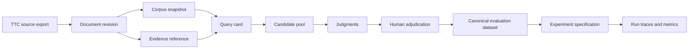

# Evaluation dataset authoring and adjudication protocol

## 1. Executive summary

An evaluation dataset is the fixed truth against which an experiment measures retrieval quality. In this laboratory, that truth is not a list of expected chunks and it is not a transient prompt result. It is a versioned collection of information needs, source-grounded relevance judgments, written rationales, and evidence references bound to immutable TTC document revisions.

This protocol permits a capable language model to do the labor-intensive first pass: discover source facts, write natural-language queries, construct candidate pools, and draft judgments. It does not treat a model's unsupported conclusion as truth. Every positive judgment must point to the exact source evidence that supports it, and a human reviewer must audit the fixed baseline before it is called a benchmark. The model is an author and research assistant; the frozen dataset is a reviewed artifact.

The initial target is `ttc-baseline-eval-v1`, at least 20 queries spanning all intended TTC retrieval intents. It is deliberately small enough for complete human review and rich enough to expose differences among chunking, BM25, vector retrieval, and hybrid RRF. A later dataset version may be larger, but it must not mutate this one.

## 2. Why this protocol is necessary

Retrieval metrics only mean what their relevance judgments mean. A test set assembled by looking at one current retriever will favor that retriever. A test set whose labels refer to mutable document IDs becomes ambiguous after a WordPress export changes. A test set whose labels are only integers forces every reviewer to remember what the numbers mean. A test set generated and judged by the same model without evidence is useful for exploration but is not trustworthy fixed truth.

The existing main design requires a versioned evaluation dataset, document-level labels, per-query result traces, and metrics. This document adds the operational rules needed to construct those objects consistently.

The protocol enforces five properties:

- **Source-first:** A query begins with known TTC evidence or an explicitly unanswerable requirement. It is not inferred from a retrieval result.
- **Pool-complete:** Judgments cover a union of source-discovered documents and results from diverse retrievers, not one result list.
- **Evidence-bearing:** Each positive and contested negative label records a rationale and one or more exact evidence references.
- **Revision-bound:** A label names `document_revision_id`, never only a mutable WordPress ID.
- **Immutable:** After review, canonicalized query cards and judgments receive a dataset ID. Corrections create a new dataset version.

## 3. Vocabulary and relevance levels

### 3.1 Named levels are the stored meaning

Use these names everywhere that a human sees or authors a judgment. The numeric rank is retained solely for metric arithmetic and thresholding.

| Code | Rank | Meaning | Retrieval interpretation |
|---|---:|---|---|
| `0_NOT_RELEVANT` | 0 | The document is unrelated, contradictory, or has no supporting answer for the information need. | Not relevant. |
| `1_PARTIAL` | 1 | The document has related material but misses a required condition, is too vague, or only answers a subordinate part. | Inspectable near-miss; not binary relevant by default. |
| `2_SUBSTANTIAL` | 2 | The document materially answers the primary information need with evidence, although a more direct or complete document may exist. | Relevant for binary metrics. |
| `3_AUTHORITATIVE` | 3 | The document directly, completely, and reliably answers the need; it is an ideal result for the corpus. | Relevant and receives highest graded gain. |

`0_NOT_RELEVANT` does not say that the document itself is bad. It says the document does not satisfy this specific information need. That distinction matters for reusable TTC sources.

### 3.2 Metric conversion is explicit

Each dataset manifest must state:

```yaml
relevanceLevels:
  0_NOT_RELEVANT: 0
  1_PARTIAL: 1
  2_SUBSTANTIAL: 2
  3_AUTHORITATIVE: 3
binaryRelevantAtOrAbove: 2_SUBSTANTIAL
gradedGain: "2^rank - 1"
```

Therefore:

- Precision@K, Recall@K, HitRate@K, and MRR treat `2_SUBSTANTIAL` and `3_AUTHORITATIVE` as relevant.
- `1_PARTIAL` remains visible in result inspection and contributes gain `1` to nDCG, but is not a binary hit.
- `0_NOT_RELEVANT` contributes no gain.
- A later dataset may choose a different threshold only by recording a new metric profile in the experiment specification. It must not reinterpret historical results silently.

## 4. Dataset object model

The following object graph is the contract. A line from one object to another means the downstream object records the immutable ID of its input.



### 4.1 Query card

A query card is an authoring object. It is not yet the frozen truth. It answers four questions before a retrieval system is used:

1. What natural-language information need is being tested?
2. What observable TTC facts make the need answerable or deliberately unanswerable?
3. What document revisions are expected to be at least `2_SUBSTANTIAL`?
4. What superficially similar results should not be promoted to relevance?

Use this source format in the candidate-card document and in the future authoring UI:

```yaml
id: ttc-eval-001
query: "Which trees are suitable for a narrow evergreen privacy screen?"
intent: product-discovery
language: en
answerability: answerable
required_facets:
  - evergreen
  - narrow-or-columnar-growth
  - privacy-or-screen-use
source_seeds:
  - document_revision_id: "sha256:..."
    document_stable_id: "ttc:wp:..."
    title: "..."
    evidence:
      field: search_text
      start_rune: 0
      end_rune: 0
      quote: "..."
expected_levels:
  - document_revision_id: "sha256:..."
    level: 3_AUTHORITATIVE
    rationale: "Explicitly satisfies all required facets."
near_misses:
  - document_revision_id: "sha256:..."
    expected_level: 1_PARTIAL
    rationale: "Evergreen screen candidate, but no narrow-growth evidence."
authoring_notes: "Do not treat a generic cypress-care guide as product discovery evidence."
```

The short-term card draft may use stable TTC source IDs because document revisions do not exist until import. Freezing the dataset resolves each stable ID to its imported revision ID and records the source export checksum. If a resolved revision changes, create a new dataset version.

### 4.2 Evidence reference

Each evidence reference must be reproducible from the source document. Store at least:

```json
{
  "documentRevisionId": "docrev-sha256-...",
  "contentVariant": "search_text",
  "textSha256": "...",
  "startRune": 184,
  "endRune": 284,
  "quote": "verbatim source slice",
  "evidenceRole": "supports-required-facet"
}
```

The importer validates that the rune slice equals `quote`, just as chunk-set validation checks exact source ranges. Evidence cannot silently drift when later processing normalizes whitespace or replaces content.

### 4.3 Candidate pool

The candidate pool is a temporary review set, not a retrieval target. Persist it in the authoring manifest for auditability:

```yaml
pooling:
  sourceSeeds: true
  structuredFactQueries:
    - "..."
  retrievers:
    - plan: bm25-baseline-v1
      topK: 20
    - plan: vector-baseline-v1
      topK: 20
    - plan: hybrid-rrf-baseline-v1
      topK: 20
  deduplicateBy: document_revision_id
  additionalAdversarialDocuments: ["..."]
```

The union protects against system-specific pooling bias. Adding new retrievers later can expose previously unjudged candidates. Those become an explicit evaluation-dataset revision, not stealth edits to v1.

## 5. Authoring workflow

### 5.1 Establish the corpus boundary first

Do not author labels against “whatever is in MySQL today.” Start after the importer creates `ttc-baseline-v1`:

1. Record the rich source export SHA-256.
2. Import the declared 200-document manifest.
3. Create immutable document revisions.
4. Resolve every proposed source ID to a revision ID.
5. Reject a card if any required source is outside the snapshot.

The initial selection policy is deliberately source-balanced: all TTC guides and FAQs, plus a deterministic selection of posts, pages, and products. Seed judgment documents are included before deterministic fill.

### 5.2 Create a query blueprint, not a paraphrase collection

Use two queries per intent stratum in the minimum 20-query set:

| Stratum | Required distinction |
|---|---|
| exact plant/product attributes | one direct fact lookup and one multi-facet lookup |
| product discovery | one constrained discovery and one broad-but-bounded discovery |
| product comparison | distinguish explicit comparison from two unrelated lookups |
| planting/care | distinguish a procedure from a fact lookup |
| pruning/maintenance | test timing, method, or condition |
| hardiness/climate | test an explicit zone/climate constraint |
| taxonomy/category navigation | test membership, not generic keyword overlap |
| FAQ/order policy | test policy language and an operational question |
| editorial guide retrieval | test a guide-level need rather than a product fact |
| unanswerable | require an absent fact or unsupported condition |

Avoid twenty surface forms of the same product lookup. Each card must specify a different failure mode a retriever could exhibit: lexical miss, semantic paraphrase, multi-facet conjunction, long-document dilution, policy versus product confusion, or an answerability false positive.

### 5.3 Source-first model-assisted discovery

A capable language model may draft cards using structured TTC facts and direct source text. The authoring prompt must require evidence and forbid completing missing facts from general horticultural knowledge.

Pseudocode:

```text
for each desired intent stratum:
    candidates = inspectStructuredFactsAndSourceDocuments(stratum)
    for candidate in candidates:
        card = proposeQueryFromExplicitFacts(candidate)
        card.requiredFacets = factsExplicitlyNeededByQuery(card.query)
        card.sourceSeeds = citeExactSourceSlices(candidate)
        card.nearMisses = findDocumentsThatMatchOnlySomeFacets(card)
        reject card unless every required facet has source evidence
        reject duplicate information needs
```

The model should also create a counterfactual: “What result would look plausible but fail this query?” This produces useful `1_PARTIAL` and `0_NOT_RELEVANT` examples before retrieval systems shape the labels.

### 5.4 Pool candidates without seeing metrics

Before any experiment comparison is interpreted, form the union of:

- source seed documents;
- structured SQL/fact-table lookups;
- deterministic keyword queries over the source FTS table;
- top-K output from at least BM25, vector, and hybrid plans after they exist;
- manually selected near misses and counterexamples.

Do not expose aggregate metrics while labeling. A labeler who knows which system is “winning” can unconsciously favor its results.

### 5.5 Write judgments from evidence

For every candidate document, the author writes a named level and rationale. At minimum, each `2_SUBSTANTIAL`, `3_AUTHORITATIVE`, and disputed `0_NOT_RELEVANT` needs an evidence reference. `1_PARTIAL` must identify the missing required facet.

```text
function judge(card, document):
    facts = extractOnlyCitedFacts(document)
    satisfied = compare(card.requiredFacets, facts)

    if contradictsNeed(facts, card) or satisfied.count == 0:
        return 0_NOT_RELEVANT with reason
    if missingPrimaryFacet(satisfied) or answerIsTooIndirect(facts):
        return 1_PARTIAL with missing-facet reason
    if satisfiesAllPrimaryFacets(facts) and isDirect(facts):
        if primaryOrOfficialSourceForNeed(document, card):
            return 3_AUTHORITATIVE with evidence
        return 2_SUBSTANTIAL with evidence
```

“Authoritative” means authoritative within this corpus and information need. A TTC product page can be `3_AUTHORITATIVE` for its own listed attributes, while a TTC guide can be `3_AUTHORITATIVE` for a care instruction. It does not claim scientific authority outside the corpus.

## 6. Human adjudication protocol

### 6.1 Required review scope for v1

Review all 20 minimum query cards, not merely a statistical sample. The dataset is intentionally small enough to permit full review.

For each query, the reviewer confirms:

1. The wording tests a real TTC information need and is not leading.
2. Every required facet is explicit and reasonable.
3. Every `2_SUBSTANTIAL` and `3_AUTHORITATIVE` judgment cites supporting text.
4. `3_AUTHORITATIVE` is reserved for the clearest corpus answer, not every relevant document.
5. Each `1_PARTIAL` rationale names what is absent.
6. Unanswerable cards truly have no supporting source in the declared snapshot.
7. No document is scored based on title, URL, or external knowledge alone.

The reviewer may alter a model draft, but records the adjudication decision and reason. A disagreement is not discarded; it becomes dataset provenance.

### 6.2 Blindness and conflict handling

The review interface should hide the retrieval system that surfaced a candidate and hide its rank/score until after the judgment is saved. Show title, source type, text, linked facts, and candidate-card requirements.

When author and reviewer disagree:

```text
if evidence resolves the disagreement:
    record final level + adjudication rationale
else if query has ambiguous intent:
    rewrite or retire the query card before freezing v1
else:
    retain both interpretations in review history and choose a conservative final level
```

Do not resolve ambiguity by broadening the grade until every weakly related document becomes relevant. Rewrite the query to make its information need testable.

### 6.3 Adversarial validation

Each card needs at least one intentional near-miss when the corpus makes that possible. For example:

- a product satisfying one but not all requested attributes;
- a care guide mentioning the plant but not the requested procedure;
- a policy page that has order-related vocabulary but not the requested rule;
- a document with an outdated or contradictory condition;
- a generic article that is semantically related but cannot answer the constrained query.

This is how the dataset tests precision rather than only recall.

## 7. Freeze and version the fixed truth

### 7.1 Canonical representation

After adjudication, compile cards into canonical JSON. Sort queries by declared ordinal, candidate judgments by `(queryId, documentRevisionId)`, and evidence references by `(documentRevisionId, contentVariant, startRune, endRune)`. Normalize strings exactly according to the experiment canonical-JSON rules.

```json
{
  "schemaVersion": "ttc-evaluation-dataset-v1",
  "name": "ttc-baseline-eval",
  "version": "v1",
  "sourceExportSha256": "c55953ee...",
  "corpusSnapshotId": "snapshot-sha256-...",
  "relevanceLevels": {
    "0_NOT_RELEVANT": 0,
    "1_PARTIAL": 1,
    "2_SUBSTANTIAL": 2,
    "3_AUTHORITATIVE": 3
  },
  "binaryRelevantAtOrAbove": "2_SUBSTANTIAL",
  "queries": ["..."],
  "judgments": ["..."],
  "adjudication": {
    "authoringMethod": "source-first model-assisted draft",
    "humanReview": "all v1 cards reviewed",
    "reviewProtocolVersion": "ttc-eval-authoring-v1"
  }
}
```

The dataset ID is `sha256(canonical JSON)`. Persist that JSON unmodified. The UI may render a friendly view, but must not be able to edit the frozen object.

### 7.2 Corrections are versions, never edits

| Change | Required result |
|---|---|
| Typo in a draft card before freeze | edit draft; no dataset exists yet |
| Change in frozen query wording | create `v2` and a new ID |
| New or corrected judgment | create `v2` and a new ID |
| Source document content changes | import new revision; create a new snapshot and dataset version if used |
| Additional pooled candidate | create `v2` if its judgment affects coverage or truth |
| New metric cutoff only | retain dataset; use a new retrieval/evaluation plan in the experiment spec |

Historical experiment runs continue to reference the frozen evaluation dataset ID they used.

## 8. Schema and API changes to the main design

Replace the anonymous `grade INTEGER` API surface with an explicit name plus numeric rank. This repository has not merged the new schema, so this is a direct design correction, not a compatibility layer.

```sql
CREATE TABLE relevance_judgments (
    dataset_id TEXT NOT NULL,
    query_id TEXT NOT NULL,
    document_revision_id TEXT NOT NULL,
    relevance_level TEXT NOT NULL CHECK (
        relevance_level IN (
            '0_NOT_RELEVANT',
            '1_PARTIAL',
            '2_SUBSTANTIAL',
            '3_AUTHORITATIVE'
        )
    ),
    relevance_rank INTEGER NOT NULL CHECK (relevance_rank BETWEEN 0 AND 3),
    rationale TEXT NOT NULL,
    evidence_json TEXT NOT NULL,
    adjudication_json TEXT NOT NULL,
    PRIMARY KEY (dataset_id, query_id, document_revision_id),
    CHECK (
        (relevance_level = '0_NOT_RELEVANT' AND relevance_rank = 0) OR
        (relevance_level = '1_PARTIAL' AND relevance_rank = 1) OR
        (relevance_level = '2_SUBSTANTIAL' AND relevance_rank = 2) OR
        (relevance_level = '3_AUTHORITATIVE' AND relevance_rank = 3)
    )
);
```

Suggested API payload:

```json
{
  "documentRevisionId": "docrev-sha256-...",
  "relevanceLevel": "2_SUBSTANTIAL",
  "relevanceRank": 2,
  "rationale": "Addresses all required facets; a more direct product page is also present.",
  "evidence": [{"contentVariant":"search_text","startRune":184,"endRune":284,"quote":"..."}],
  "adjudication": {"status":"human-reviewed","reviewer":"manual","reviewedAt":"..."}
}
```

`POST /api/v1/evaluation-datasets/{draftId}/compile` validates and freezes a draft. `POST /api/v1/evaluation-datasets/{id}/judgments` is allowed only for a mutable draft. There is no endpoint that changes a frozen dataset.

## 9. Automated validation before freeze

The compile command rejects a candidate dataset if any of these checks fail:

```text
assert queryCount >= 20
assert every required intent stratum has >= 2 queries
assert unique normalized query text
assert every query belongs to declared corpus snapshot
assert every judgment refers to a document revision in snapshot
assert level code maps to its required rank
assert every 2_SUBSTANTIAL/3_AUTHORITATIVE has >= 1 valid source slice
assert every 1_PARTIAL names a missing or insufficient facet
assert every unanswerable query has no 2_SUBSTANTIAL/3_AUTHORITATIVE judgment
assert at least one 0_NOT_RELEVANT or 1_PARTIAL exists for each answerable query where a near miss is available
assert binary threshold is a declared level code
assert canonical JSON reproduces the claimed dataset ID
```

The validation output should be saved with the dataset draft and displayed in the web UI. It is a scientific audit report, not only a developer test failure.

## 10. Implementation plan

### Phase 1: Draft artifacts and authoring review

1. Create the candidate-card reference document and store source-grounded draft cards.
2. Implement source-ID-to-document-revision resolution during corpus import.
3. Build a draft dataset loader that accepts YAML/JSON cards but does not insert a frozen dataset.
4. Add source-slice validation and named-level/rank validation.
5. Run model-assisted authoring, then a human adjudication pass over every card.

### Phase 2: Immutable persistence and metrics

1. Add the new evaluation tables and named level codec.
2. Implement canonical JSON compilation and dataset SHA-256 identity.
3. Bind runs to `evaluation_dataset_id`.
4. Adapt metrics: binary relevance threshold from manifest; graded nDCG from rank.
5. Persist evidence and adjudication provenance in trace inspection API responses.

### Phase 3: Laboratory UI

1. Add a Dataset Drafts page with query cards, pool provenance, and validation status.
2. Add a blinded judgment view with document text and evidence-selection controls but no retriever/rank information.
3. Add a read-only frozen dataset view with dataset hash, revision membership, rubric, and change history.
4. Make “clone as draft” the only way to revise a frozen dataset.

## 11. Test cases

Unit tests:

- level code/rank pairs reject mismatches;
- `2_SUBSTANTIAL` is a binary hit and `1_PARTIAL` is not;
- nDCG uses ranks 0–3;
- source evidence rune ranges reproduce their quote;
- an absent revision, duplicate query ID, or duplicate judgment fails compilation;
- canonical ordering creates stable dataset IDs.

Integration tests:

- import a tiny source fixture, create cards, resolve revisions, and compile a dataset;
- attempt to update a frozen dataset and receive a conflict;
- create a revised dataset and prove that an old experiment still resolves its original labels;
- run the same retrieved order against v1 and v2 and show that results name their dataset IDs.

## 12. Non-goals and cautions

- This is an information-retrieval relevance dataset, not an answer-generation benchmark.
- It does not measure citation faithfulness, factual correctness outside TTC, or customer satisfaction.
- Synthetic questions may be useful drafts, but never receive truth status solely because a model generated them.
- Do not train or tune retrieval parameters against the only fixed set without reserving a later holdout. The first v1 set is a fast regression suite, not a final generalization claim.
- Do not use production click behavior as a label without recording its collection conditions and bias; that is a separate dataset family.

## 13. References

- `design-doc/01-ttc-rag-laboratory-baseline-and-immutable-experiment-runs-design-and-implementation-guide.md`, especially sections 10, 15, 16, and 21.
- `reference/02-ttc-baseline-evaluation-dataset-v1-candidate-cards.md` for the reviewed draft cards.
- `docs/guides/ttc-data-handbook.md` for source fields and TTC document kinds.
- `internal/services/search/hybrid.go` for the retrieval path whose outputs must eventually be pooled and evaluated.
