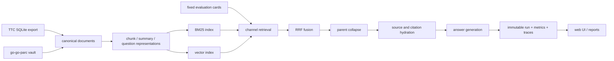
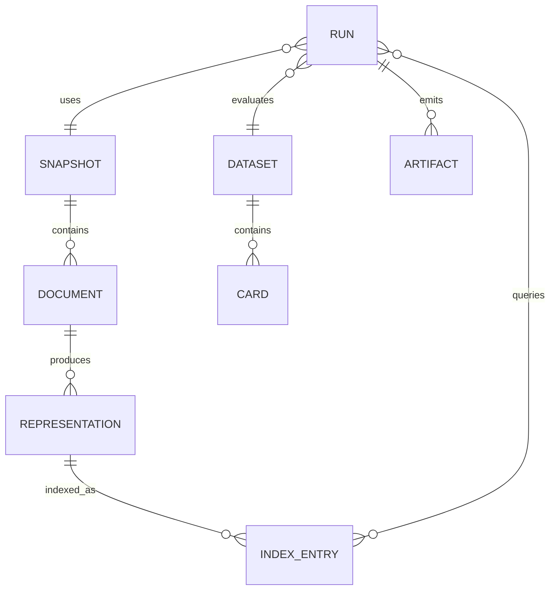

# Full TTC RAG Laboratory and go-go-parc Corpus Research Report

## Executive Summary

This report records the design, implementation, experiments, and operating procedures for the TTC RAG laboratory. The laboratory is a self-contained research system in `rag-evaluation-system`. It indexes a frozen export of the TTC WordPress corpus, executes reproducible retrieval experiments, stores immutable run metadata, and exposes the results to a web application and JavaScript-oriented workflows. The report also describes the parallel corpus investigation performed over the `go-go-parc` Obsidian vault. The vault is treated as a second, heterogeneous corpus containing project notes, implementation diaries, design documents, playbooks, and code-oriented research records.

The central engineering result is a measurable baseline rather than a claim that one retrieval method is universally superior. The TTC snapshot contains approximately 2,600 products, 483 posts, 121 pages, 35 FAQs, and 19 guides. Its canonical snapshot hash is `sha256:be434a1422487d33e324b5f3833067dcc530efab2df0fea2f7e7bfa9ca86f409`. The corresponding chunk set, BM25 index, and embedding artifact are separately identified by content hashes. The development candidate dataset contains 148 registered cards after excluding two cards whose source identifier was absent from the frozen export. On the 144 answerable development cards, vector retrieval was stronger than BM25 at the measured cutoffs, while reciprocal-rank fusion improved relevant-document recall at ten results but did not improve every top-rank metric.

The current development result is provisional. The cards are model-authored and source-validated, but human adjudication, holdout execution, generation-quality scoring, parent-chunk collapse, original-source citation hydration, and reranker comparisons remain open. The report therefore distinguishes implemented facts, observed measurements, and hypotheses for the next experiment. It does not silently promote development measurements to a production quality claim.

The report is written for an intern who must be able to reproduce the current state, understand the data model, extend the laboratory, and avoid common evaluation errors. It includes API references, file references, pseudocode, Mermaid diagrams, shell and Go snippets, failure records, and a chronological diary. The authoring agent is GPT-5.6 (Sol).

## Problem Statement

Retrieval-augmented generation has several independent failure surfaces: the corpus may be incomplete, chunks may be poorly formed, embeddings may be recomputed unnecessarily, a lexical index may overfit exact terms, a vector index may miss identifiers, a fusion layer may leak channels, and an evaluation set may contain duplicate or source-invalid questions. A web UI can make these effects observable only if every experiment declares its inputs and persists its outputs immutably.

The project began with a practical question: how can we build a RAG laboratory that permits rapid changes to chunking, embeddings, search, fusion, summarization, and reranking without repeatedly writing bespoke Go code? The answer is a layered system. Go owns typed storage, deterministic canonicalization, indexing, and execution. JavaScript is used as an orchestration and exploration surface. The UI presents the same artifacts and metrics rather than maintaining a second, incompatible experiment model.

The TTC corpus is suitable because it has product, FAQ, guide, page, and post records with stable source identifiers. The `go-go-parc` vault adds heterogeneous documents with dates, tags, links, code blocks, and diary structure. These corpora expose different retrieval requirements. TTC questions often depend on product terminology and support facts. Vault questions may require exact file identity, implementation context, chronological evidence, or several related notes.

The evaluation problem is constrained by four requirements:

- A run must be reproducible from a content-addressed corpus, chunk, embedding, and configuration.
- Search channels must be independently inspectable before fusion.
- Evaluation cards must identify expected source documents and distinguish `0_FAIL`, `1_INCOMPLETE`, `2_SUBSTANTIAL`, and `3_AUTHORITATIVE` answer quality.
- The operator must be able to compare retrieval-only and generation-enabled pipelines while recording latency, token/model cost, and storage.

## Proposed Solution

The laboratory has five layers:

1. **Corpus and ingestion.** Import TTC SQLite rows or vault files into a normalized document model. Preserve source identity, source type, path, timestamps, and raw content. Do not mutate the source export during evaluation.
2. **Representation building.** Produce one or more representations per document: raw chunks, summaries, hypothetical questions, metadata projections, or future parent/child forms. Each representation records its parent document and representation kind.
3. **Indexing and retrieval.** Build immutable BM25 and vector indexes. Execute channels separately, then fuse ranked candidates using reciprocal rank fusion (RRF). Keep channel hits in the trace so a score can be audited.
4. **Evaluation and execution.** Run fixed query cards against a named dataset version. Score source recall, rank metrics, citation coverage, answer quality, latency, and cost. Persist an immutable run descriptor and its trace artifacts.
5. **Exploration UI and scripts.** Use the Go API and generated JavaScript bindings to compose experiments. Scripts remain small and declarative; the typed Go implementation validates identifiers, hashes, and storage operations.



An experiment is a value, not a mutable server session. A minimal experiment specification is:

```text
ExperimentSpec {
  corpus_snapshot_hash
  representation_set_hash
  index_set_hash
  dataset_id
  split
  channels[]                 // bm25, vector, summary, question, ...
  fusion { method: "rrf", k: 60 }
  collapse { mode: "parent", max_per_parent: 1 }
  generator { provider, model, temperature, prompt_hash }
  reranker { optional provider, model, top_n }
  code_revision
}
```

The run identifier is derived from the canonical JSON representation of this value and the dataset version. The executor refuses to overwrite a completed run. A new model, prompt, index, or code revision creates a new run identity.

## Design Decisions

### 1. Immutable artifacts and explicit identity

The laboratory stores hashes for the source snapshot, normalized chunks, index configuration, embedding model, and dataset manifest. The hashes are not decorative metadata: they are the join keys used to determine whether two runs used the same material. `data/rag-eval.db` is the local catalog for immutable snapshots, representations, indexes, datasets, and runs. The SQLite database itself is ignored by Git because it is generated state; manifests and scripts are committed.

Current artifact identities:

| Artifact | Identifier | Meaning |
|---|---|---|
| TTC snapshot | `sha256:be434a1422487d33e324b5f3833067dcc530efab2df0fea2f7e7bfa9ca86f409` | Frozen source export |
| Chunk set | `sha256:ef7bdab76583f092d7bc50c9f501fe8c17739d395fcb37d0eaaba5a09c7c9392` | Canonical chunk rows |
| BM25 index | `sha256:cf6491873ec521135ade41000800751dc8eeaecba52dabbeacda1cf530f7b691` | Lexical index artifact |
| Embeddings | `sha256:2665c5249b8352ce6904fc00c934534dd179f3eeef0a6a75429a9034be0e03e0` | Existing Ollama 768D vectors |
| Candidate dataset | `candidate:ttc-expansion-v0` | 148 source-validated cards |

The canonicalization implementation is in `internal/experiments/canonical.go`; the typed specification is in `internal/experimentspec/specification.go`; SQLite persistence is in `pkg/raglab/catalog_sqlite.go` and `pkg/raglab/executor_sqlite.go`.

### 2. Source identity is independent of chunk identity

A source document can produce multiple chunks and multiple representation kinds. A query card therefore records expected source IDs, while retrieval traces record representation IDs and parent IDs. This separation permits a system to retrieve a summary or question representation and still evaluate whether the original source was found. It also enables parent-chunk collapse and citation hydration without changing the answer-quality rubric.

```text
SourceDocument(id=wp:123, kind=faq)
  ├── Representation(id=rep:raw:123:0, kind=raw, parent=wp:123)
  ├── Representation(id=rep:summary:123, kind=summary, parent=wp:123)
  └── Representation(id=rep:question:123:0, kind=question, parent=wp:123)
```

### 3. Channel results are retained before fusion

The trace schema must retain each channel's ranked list. A fused score alone cannot answer whether a result was lexical, semantic, present in both lists, or accidentally introduced by a filter. The retrieval path is therefore:

```text
for channel in configured_channels:
    hits[channel] = channel.retrieve(query, limit)
fused = reciprocal_rank_fusion(hits, k)
collapsed = collapse_by_parent(fused)
hydrated = hydrate_source_and_citation(collapsed)
```

The channel-retrieval → RRF → parent-collapse → hydration work is specified in the TTC ticket but is not yet complete for the full production path. The development trace currently demonstrates separate BM25, vector, and hybrid metrics; it should not be read as proof that all representation channels are leak-free.

### 4. Evaluation cards use ordinal answer labels

The rubric is explicit and ordered:

| Label | Numeric value | Definition |
|---|---:|---|
| `0_FAIL` | 0 | Incorrect, unsupported, or materially misleading |
| `1_INCOMPLETE` | 1 | Some correct content, but omits a required fact or citation |
| `2_SUBSTANTIAL` | 2 | Covers the principal answer with minor omissions |
| `3_AUTHORITATIVE` | 3 | Complete, precise, source-grounded, and correctly cited |

Retrieval metrics and generation metrics remain separate. A run can retrieve the correct source and still produce an incomplete answer. Conversely, a model may answer a simple question from prior knowledge while retrieval fails; that is a generation success but a retrieval failure and must be recorded as such.

### 5. Embedding work is remote but its identity is local

The Ollama server is reached through the SSH tunnel documented in `docs/guides/ollama-tunnel-playbook.md` and the ticket source `ollama-tunnel-playbook.md`. The tunnel exposes the Mac service at `127.0.0.1:11435`; the runner talks to Ollama's `/api/embeddings` endpoint. The embedding model in the current snapshot produces 768-dimensional vectors. Geppetto's embedding-cache YAML decoding issue must be fixed before cost comparisons are trusted; otherwise a missing or malformed cache block can cause repeated embedding work without an obvious experiment failure.

### 6. JavaScript is an orchestration surface, not an untyped storage layer

The desired RAG playground API follows the fluent builder style already used by `pkg/widgetdsl` and the research-control prototypes. Go-side builders validate the shape of a pipeline, while JavaScript supplies concise composition and lambdas for custom transforms. The design references are `rag-dsl-design.md`, `rag-dsl-api.md`, `docs/howtos/how-to-write-rag-eval-js-scripts.md`, and `examples/rag-lab-js/`.

Example exploratory script:

```javascript
const run = rag.experiment("ttc-vector-vs-bm25")
  .corpus(rag.snapshot("sha256:be434...f409"))
  .dataset(rag.dataset("candidate:ttc-expansion-v0").split("development"))
  .representations(rag.representations()
    .raw({ chunker: "markdown-heading", maxTokens: 420 })
    .summary({ model: "qwen3.6", maxTokens: 96 })
    .questions({ model: "qwen3.6", perChunk: 3 }))
  .retrieve(rag.channels()
    .bm25({ topK: 20 })
    .vector({ model: "nomic-embed-text", topK: 20 }))
  .fuse(rag.rrf({ k: 60 }))
  .collapse(rag.parentChunks({ maxPerParent: 2 }))
  .hydrate(rag.citations())
  .evaluate({ metrics: ["recall@1", "recall@10", "mrr", "citation_coverage"] })
  .run();
```

The example is an API target, not a promise that every method is already implemented. The current Go executor and the JavaScript examples should be extended in small increments, with each addition represented in the experiment spec and trace schema.

## Alternatives Considered

### Corpus ingestion and normalization

The TTC importer reads `data/ttc-wordpress-rag.sqlite`, extracts stable WordPress IDs and content fields, and writes canonical documents. The vault importer should follow the same contract while retaining path and frontmatter metadata. A normalized document contains:

```go
type SourceDocument struct {
    ID          string            // e.g. "wp:398597" or "vault:Research/...md"
    Kind        string            // product, faq, post, markdown, diary, ...
    Title       string
    Body        string
    SourcePath  string
    Metadata    map[string]string
    ContentHash string
}
```

The importer must sort documents by ID before hashing. It must normalize line endings and define how empty fields, Unicode normalization, and frontmatter are handled. It must not include generated run traces or ticket-local temporary files in the vault corpus unless an inclusion manifest explicitly permits them.

For the `go-go-parc` corpus, the inclusion manifest is the controlling boundary. `sources` and `vault-inclusion-manifest.md` describe the inventory work. The recommended first pass includes project reports, technical articles, design documents, playbooks, and implementation diaries; it excludes `.git`, build products, `node_modules`, generated PDFs, private credentials, and duplicated exports.

### Chunking strategies

The laboratory should make chunking a named representation configuration. The current TTC baseline uses deterministic bounded chunks. The next implementation should support at least:

- heading-aware Markdown chunks that preserve the heading path;
- paragraph windows with configurable overlap;
- sentence windows for prose-heavy posts;
- parent/child chunks, where child chunks are indexed and parent chunks are hydrated for context;
- metadata-only projections for exact filters;
- summary and hypothetical-question representations generated once and cached.

Pseudocode for deterministic heading-aware chunking:

```text
function chunkMarkdown(document, maxTokens, overlap):
    sections = parseHeadings(document.body)
    chunks = []
    for section in sections:
        units = splitParagraphs(section.body)
        window = []
        for unit in units:
            if tokens(window + unit) > maxTokens and window is not empty:
                chunks.append(makeChunk(document, section.path, window))
                window = tailByTokens(window, overlap)
            window.append(unit)
        if window is not empty:
            chunks.append(makeChunk(document, section.path, window))
    return chunks
```

Every chunk receives a stable ID derived from source ID, representation kind, ordinal, and canonical text. A chunk's parent ID is never inferred from its display title.

### Retrieval channels

BM25 is valuable for exact product names, model numbers, error strings, and uncommon terms. Dense vectors are valuable for paraphrase and semantic similarity. Summary and question representations can improve recall when the query vocabulary differs from the source text, but they add generation cost, storage, and possible factual drift. The laboratory should compare each channel independently before adding it to a fusion run.

The current TTC development comparison measured three configurations:

| Channel | Recall@1 | Recall@3 | Recall@10 | MRR | Relevant recall@10 |
|---|---:|---:|---:|---:|---:|
| BM25 | 0.7847 | 0.8403 | 0.8889 | 0.8221 | 0.7442 |
| Vector | 0.8750 | 0.9653 | 0.9722 | 0.9174 | 0.8588 |
| Hybrid RRF | 0.8542 | 0.9375 | 0.9722 | 0.9005 | 0.8947 |

These numbers explain why a single headline metric is insufficient. Vector retrieval led at the first three rank metrics. Hybrid matched vector at recall@10 and led relevant recall@10. The difference suggests that fusion recovered additional relevant documents without making the first result uniformly better. It also motivates reporting per-stratum and per-card failures.

### RRF and leakage controls

For each channel, rank starts at one. With `k=60`, the contribution of a hit at rank `r` is `1/(60+r)`. The implementation must namespace IDs and preserve channel provenance:

```text
function rrf(channelHits, k):
    scores = map[representationID]float
    provenance = map[representationID][]ChannelRank
    for (channel, hits) in channelHits:
        for (rank, hit) in enumerate(hits, start=1):
            id = hit.representationID
            scores[id] += 1 / (k + rank)
            provenance[id].append({channel, rank, score: hit.score})
    return sortDescending(scores, provenance)
```

The filter leak investigated during development occurs when a filter is applied to one channel before fusion but not to the other, or when an expected source ID is compared with a representation ID without parent mapping. The fix is not to hide the discrepancy in the scorer. Each trace must show pre-filter hits, post-filter hits, parent IDs, and hydrated source IDs. A test should assert that a card's allowed scope produces no candidate outside that scope in any channel.

### Parent collapse and citation hydration

After fusion, multiple child chunks may refer to the same parent document. Collapse is applied after channel fusion and before generation:

```text
function collapseByParent(hits, maxPerParent):
    groups = orderedMap()
    for hit in hits:
        parent = hit.parentID
        if count(groups[parent]) < maxPerParent:
            groups[parent].append(hit)
    return flattenInScoreOrder(groups)
```

Hydration then loads the original source title, path, heading path, and citation locator. The generator receives the hydrated context; the evaluator records the source IDs and citation spans used in the answer. This prevents a generated citation from pointing at an ephemeral embedding or summary ID.

### Evaluation corpus construction

The TTC card corpus was built in stages. The first baseline contained hand-designed cards. Expansion batches added structured questions across product, FAQ, guide, page, post, and cross-document strata. A source-validation script resolved every proposed source ID against the frozen export. Two cards were excluded because they referred to `wp:398597`, which is not in the snapshot. The current registered candidate contains 148 cards; 144 are answerable and four are abstentions or excluded from the development metric denominator.

The planned larger corpus has 240 cards partitioned as 144 development, 48 holdout, and 48 regression cards, with 30 abstention cases distributed across eight strata. The split must be determined by card ID and source-family constraints, not by random sampling at run time. Duplicate question text and near-duplicate source expectations are audited before registration.

Card schema:

```yaml
id: ttc-expand-001
query: "Which ...?"
expected_source_ids: ["wp:12345"]
acceptable_source_ids: ["wp:12345", "wp:12346"]
stratum: faq
answerability: answerable
required_facts:
  - "..."
quality_label: 2_SUBSTANTIAL
```

Model-authored cards are useful for coverage expansion but are not automatically truth. A validation pass checks source existence and content support. Human adjudication must confirm the answer, acceptable alternatives, required facts, and quality label before holdout results are treated as final.

## Implementation Plan

### Repository map

The following files are the primary implementation surfaces:

| Path | Responsibility |
|---|---|
| `pkg/raglab/types.go` | Public laboratory, dataset, trace, and metric types |
| `pkg/raglab/laboratory.go` | Laboratory orchestration and registration |
| `pkg/raglab/catalog.go` | Catalog interface for immutable artifacts |
| `pkg/raglab/catalog_sqlite.go` | SQLite catalog implementation |
| `pkg/raglab/executor.go` | Execution contract |
| `pkg/raglab/executor_sqlite.go` | Persisted run execution |
| `pkg/raglab/evaluation_dataset.go` | Card loading and split handling |
| `pkg/raglab/reranker.go` | Reranker abstraction |
| `internal/experimentspec/specification.go` | Typed experiment specification |
| `internal/experiments/canonical.go` | Canonical JSON and run identity |
| `internal/db/migrations.go` | SQLite schema migrations |
| `internal/db/search_queries.go` | Retrieval queries and result materialization |
| `internal/chunking/chunker.go` | Deterministic chunking primitives |
| `internal/api/experiment_handlers.go` | Experiment/run HTTP endpoints |
| `internal/api/workflow_artifact_handlers.go` | Workflow artifact endpoints |
| `packages/rag-evaluation-site/` | React/TypeScript UI |
| `examples/rag-lab-js/` | JavaScript orchestration examples |
| `scripts` under `RAGEVAL-TTC-LAB-001` | Reproduction, validation, and scoring tools |

### Database and run lifecycle

The database migrations define tables for source snapshots, representations, indexes, datasets, cards, runs, and artifacts. A run row references immutable IDs rather than copying all inputs into a mutable JSON blob. The artifact table stores trace and metric paths plus content hashes.



Run pseudocode:

```text
spec = canonicalize(inputSpec)
runID = sha256(spec + dataset.manifestHash)
if catalog.runExists(runID):
    return catalog.loadRun(runID)

run = catalog.begin(runID, spec)
for card in dataset.split(spec.split):
    trace = retrieveAndHydrate(card.query, spec)
    answer = maybeGenerate(trace, spec.generator)
    outcome = score(card, trace, answer)
    catalog.appendTrace(runID, trace, outcome)
catalog.complete(runID, aggregate(outcomes))
```

The executor should write a pending row before network calls, update progress artifacts, and mark the run failed with a structured error if execution stops. It must never delete a prior completed run to make a retry look clean.

### Retrieval trace contract

The trace is the principal debugging artifact. A useful JSON shape is:

```json
{
  "run_id": "run:sha256:...",
  "card_id": "ttc-expand-001",
  "query": "Which ...?",
  "channels": {
    "bm25": [{"representation_id":"rep:raw:123:0","parent_id":"wp:123","rank":1,"score":8.2}],
    "vector": [{"representation_id":"rep:raw:987:1","parent_id":"wp:987","rank":1,"score":0.83}]
  },
  "fused": [{"representation_id":"rep:raw:123:0","rrf_score":0.0161}],
  "collapsed": [{"parent_id":"wp:123","children":["rep:raw:123:0"]}],
  "sources": [{"source_id":"wp:123","title":"...","locator":"faq#shipping"}],
  "metrics": {"latency_ms": 173, "embedding_cache_hit": true}
}
```

The current trace driver is `ttmp/2026/07/13/RAGEVAL-TTC-LAB-001--ttc-rag-laboratory-baseline-and-immutable-experiment-runs/scripts/04-run-immutable-retrieval-traces.go`. It accepts comma-separated card paths and several YAML card forms because the authored batches use different formatting. This flexibility is useful for experiments, but the production loader should converge on one schema and report parse errors rather than silently producing zero traces.

### Existing scripts and commands

The ticket scripts are intentionally inspectable and should remain executable documentation:

- `01-validate-ttc-baseline-evaluation-cards.sh` checks the initial card packet.
- `02-geppetto-ollama-embedding-probe.go` probes the embedding path and cache behavior.
- `03-build-immutable-bm25.go` builds and registers the lexical artifact.
- `04-run-immutable-retrieval-traces.go` executes retrieval traces.
- `05-score-candidate-retrieval-traces.go` computes rank metrics.
- `06-import-candidate-baseline-run.go` imports an external run into the catalog.
- `07-validate-expansion-source-ids.py` resolves every proposed source ID.
- `08-audit-ttc-evaluation-cards.py` audits duplicates, split leakage, and card shape.
- `09-register-ttc-expansion-candidate-dataset.py` registers the candidate manifest.
- `10-score-expansion-candidate-traces.py` scores the 148-card development trace.

Typical reproduction sequence:

```sh
cd /home/manuel/workspaces/2026-07-13/rag-eval-ttc/rag-evaluation-system
python3 ttmp/.../scripts/07-validate-expansion-source-ids.py \
  --source data/ttc-wordpress-rag.sqlite \
  --cards ttmp/.../reference/04-ttc-evaluation-expansion-v0-70-proposed-cards.md
go run ttmp/.../scripts/03-build-immutable-bm25.go \
  --source data/ttc-wordpress-rag.sqlite --catalog data/rag-eval.db
go run ttmp/.../scripts/04-run-immutable-retrieval-traces.go \
  --catalog data/rag-eval.db --cards ttmp/.../scripts/09-ttc-expansion-v0-manifest.json
python3 ttmp/.../scripts/10-score-expansion-candidate-traces.py \
  --traces data/artifacts/traces/ttc-expansion-v0.json
```

The ellipses above are for readability; an intern should use the absolute ticket path recorded in the ticket README. Generated databases and traces are ignored by Git. Commit the scripts, manifests, and result documents that make the run reproducible.

### Web application

The React site under `packages/rag-evaluation-site` should expose four views:

1. **Corpus.** Snapshot hash, source counts, inclusion/exclusion manifest, and representation counts.
2. **Experiment builder.** Typed controls for dataset split, channels, fusion, collapse, reranker, generator, and budget.
3. **Trace inspector.** Query card, channel hits, fused ranks, parent collapse, hydrated citations, and generated answer.
4. **Comparison.** Side-by-side runs with rank metrics, answer labels, latency distributions, embedding/generation cost, and index storage.

The UI must link every displayed number to a run ID and artifact. It should display `provisional` for unaudited cards and should not let a user compare runs with different corpus hashes without a visible warning. Server endpoints are implemented in `internal/api`; the standard library HTTP server remains the boundary, and the SPA is embedded for production builds.

### Reranking

The reranker abstraction in `pkg/raglab/reranker.go` allows a second-stage model to score the top fused candidates. Existing experiments investigated BGE and Qwen options, with BGE considered the practical baseline. Qwen reranking is deliberately deferred. A reranker run must record candidate count, model name, model revision, request latency, and whether the score changed the selected parent source. The reranker is not allowed to replace first-stage traces; it is an additional stage in the trace.

### Cost and latency accounting

Every network operation records start/end time, model, token counts if available, cache hit/miss, and billed estimate. Embedding cost is zero when using the local Ollama tunnel but compute latency and storage are not zero. Generation cost is provider-specific. The comparison table should report:

```text
retrieval latency: mean, p50, p95, min, max
embedding: requests, cache hits, cache misses, vectors, bytes
generation: requests, input/output tokens, estimated cost
storage: source bytes, representation bytes, index bytes, trace bytes
quality: recall@1/@3/@10, MRR, nDCG, citation coverage, answer label mean
```

## Open Questions

### Findings from the current development run

The 148-card candidate trace is the first useful end-to-end measurement for the expanded TTC corpus. It used 144 answerable cards. The trace recorded a mean retrieval latency of 173 ms, p50 of 175 ms, p95 of 230 ms, minimum 72 ms, and maximum 465 ms. No billed embedding cost was recorded because vectors came from the local Ollama service and the existing 768D embedding artifact.

The measured retrieval table is:

| Configuration | Recall@1 | Recall@3 | Recall@10 | MRR | Relevant recall@10 |
|---|---:|---:|---:|---:|---:|
| BM25 | 0.7847 | 0.8403 | 0.8889 | 0.8221 | 0.7442 |
| Vector | 0.8750 | 0.9653 | 0.9722 | 0.9174 | 0.8588 |
| Hybrid RRF | 0.8542 | 0.9375 | 0.9722 | 0.9005 | 0.8947 |

Interpretation:

- Dense retrieval is currently the strongest first-stage method at rank one and rank three.
- RRF recovers relevant documents at rank ten, but the fused first result can be worse than the vector first result.
- BM25 remains useful for exact terms and should not be removed merely because its aggregate score is lower.
- The relevant-recall improvement from fusion is a reason to implement parent collapse and source hydration before judging answer quality.
- The current numbers do not measure summaries, hypothetical questions, BGE reranking, generation quality, or the vault corpus.

### go-go-parc corpus research

The vault investigation established that project knowledge is distributed across several note families. The most useful families are:

- project reports that explain goals, milestones, and accepted decisions;
- ticket design documents that define APIs, schemas, and implementation tasks;
- implementation diaries that preserve commands, failures, and intermediate hypotheses;
- playbooks that encode repeatable operational procedures such as the Ollama SSH/Tailscale tunnel;
- code and experiment notes that contain executable details and measured outputs.

The corpus has high lexical structure: file paths, ticket IDs, package names, commit hashes, model names, and commands. It also has semantic structure: a diary entry may explain why a later design decision exists, while a report may summarize several tickets. A useful vault evaluation set must therefore contain exact lookup questions, procedural questions, cross-note synthesis questions, and temporal questions. Expected sources should include both the primary note and, when appropriate, the supporting diary or script.

The initial vault inclusion manifest deliberately excludes generated artifacts and duplicate exports. Before indexing the full vault, the importer should emit a report with counts by directory, extension, frontmatter type, tag, and content hash. Duplicate content hashes should be retained as aliases only if their paths are meaningful; otherwise they inflate retrieval metrics and create citation ambiguity.

### Tools used

The work uses a small, explicit toolchain:

- `docmgr` creates ticket workspaces, documents, tasks, file relationships, changelogs, and validation reports.
- Go scripts use the repository's module graph and typed `pkg/raglab` APIs.
- Python scripts perform card parsing, source-ID validation, duplicate checks, and metric scoring where a short data transform is clearer than a compiled command.
- SQLite stores the immutable local catalog and source export.
- Ollama on the Mac supplies local embeddings and optional generation through an SSH tunnel. Tailscale makes the host addressable when the local network changes; the tunnel still terminates at loopback on the development machine.
- `tmux` keeps the tunnel alive and makes health checks inspectable.
- `remarquee` uploads ticket bundles to the reMarkable tablet.
- Git stores scripts, manifests, design docs, diaries, and reports. Generated databases and traces remain local artifacts.
- React, TypeScript, Redux/RTK Query, and Bootstrap provide the web laboratory UI.

Tunnel playbook:

```sh
tmux new -d -s rag-ollama-mimimi \
  'ssh -N -o ExitOnForwardFailure=yes -o ServerAliveInterval=30 -o ServerAliveCountMax=3 -L 127.0.0.1:11435:127.0.0.1:11434 mimimi-2.local'
curl http://127.0.0.1:11435/api/tags
tmux capture-pane -pt rag-ollama-mimimi
```

The embedding client uses `http://127.0.0.1:11435` rather than the Mac's remote address. If the tunnel dies, stop and recreate the tmux session; do not change experiment configuration to silently use a different model endpoint.

### Alternatives considered

**External hosted embeddings.** Rejected for the baseline because network cost and model changes would compromise repeatability. They can be added as a separately identified provider.

**A mutable “latest” index.** Rejected because it makes comparisons impossible after a chunker or model change. Indexes are registered by content hash.

**Scoring only generated answers.** Rejected because it conflates retrieval and generation. The laboratory reports retrieval traces and answer labels separately.

**Embedding only raw chunks.** Kept as the baseline, but not sufficient for the research question. Summaries and questions are planned as named representations so their cost and benefit are measurable.

**Qwen reranking immediately.** Deferred. BGE is the practical reranker baseline, and first-stage channel/fusion/collapse correctness has higher priority.

**A custom Go DSL for every experiment.** Rejected. The Go API should enforce the stable contract, while JavaScript builders and callbacks provide exploration ergonomics. New Go code is justified for reusable domain primitives, not for one-off experiments.

### Open questions and next work

- Complete the Geppetto embedding-cache YAML fix and add a regression test proving that a missing provider block decodes as `{}` without repeated embedding requests.
- Implement channel retrieval → RRF → parent collapse → original-source/citation hydration as one traceable pipeline.
- Run the five planned real-corpus comparisons using the existing Ollama 768D vectors: raw only, summaries only, raw+summaries, raw+questions, and all representations.
- Complete human adjudication for development cards and freeze the 240-card split before holdout execution.
- Add BGE reranking after first-stage traces are stable; record candidate-set and citation effects.
- Build the vault importer and author a stratified vault evaluation set.
- Add per-stratum confidence intervals and bootstrap comparisons to the UI.
- Decide whether the fluent JavaScript playground should extract a reusable DSL package after two or more experiments demonstrate stable composition patterns.
- Define retention and privacy rules for generated answers and source excerpts before indexing private vault sections.

## Appendix A: Intern execution checklist

An intern taking ownership of the next implementation should proceed in this order:

1. Read this report, `docs/guides/ttc-rag-laboratory.md`, and the TTC ticket diary.
2. Run `git status --short` and confirm that generated databases and trace artifacts are ignored.
3. Run the card validator and source-ID validator against the committed card packets.
4. Inspect the schema migrations and catalog interfaces before adding a table or field.
5. Reproduce the development trace with the exact snapshot, embedding, and manifest hashes.
6. Inspect one trace for a BM25-only hit, one vector-only hit, and one fused hit.
7. Add tests for channel provenance and filter scope before implementing parent collapse.
8. Implement parent collapse and citation hydration without changing the existing retrieval metrics.
9. Add an artifact-level regression test: changing one chunk changes the chunk hash and run ID.
10. Fix and test the Geppetto embedding-cache YAML decoding behavior.
11. Run raw, summary, raw+summary, raw+question, and all-representation comparisons.
12. Add the result documents and scripts to the ticket; do not commit generated SQLite WAL files.
13. Only after first-stage results are stable, add BGE reranking and measure its incremental effect.
14. Build the vault importer and author a separate vault dataset; do not mix TTC and vault cards in one denominator.
15. Update the UI to expose traces and artifact identities before adding visual polish.

Review questions for every change:

- What exact artifact identity does this change consume or produce?
- Can a reviewer inspect the un-fused channel evidence?
- Does a source ID remain stable through chunking, representation, collapse, and citation hydration?
- Is a quality improvement separated from a corpus or split change?
- Is the command reproducible without an undocumented environment variable or local file?
- Is the diary updated with the command, result, failure, and next decision?

## Appendix B: Failure records and lessons

Several failures were productive because they exposed assumptions that would otherwise have contaminated a benchmark.

**Parser produced zero traces.** The initial trace driver assumed one YAML shape, while authored batches used heading cards, indented `- id:` cards, and inline mapping cards. The driver was extended to recognize the formats and now reports the parsed card count. The long-term fix is a strict normalized card format with a conversion step, not an indefinitely permissive production parser.

**Parser produced only 70 traces.** A command used a path typo and a single expansion batch. The run looked successful because the program exited zero. The operator added an expected-card-count assertion and recorded all input paths in the run manifest. A benchmark must fail closed when the number of parsed cards is lower than requested.

**Missing source ID.** Two generated cards referred to `wp:398597`, absent from the snapshot. They were excluded from the candidate registration instead of being allowed to score as retrieval failures. This preserves the distinction between a bad evaluation card and a bad retrieval system.

**Geppetto cache configuration.** A missing provider block in YAML can decode as a nil structure in one path and cause the embedding cache to be bypassed. Until the decoder and regression test are fixed, embedding cost measurements are not authoritative. This issue is tracked separately so the RAG experiment ticket can retain a clean provenance boundary.

**Sandboxed `httptest` failure.** A package test attempted to bind an IPv6 loopback listener and failed under the restricted execution environment. The failure is environmental (`listen tcp6 [::1]:0: operation not permitted`), not evidence of a handler defect. In a normal environment the test should be rerun; do not weaken production networking solely to satisfy the sandbox.

**Tunnel process.** The local Ollama endpoint is not a direct public service. It is a loopback forward maintained in tmux. Health checks must be performed before an embedding run, and the model name must be captured in the experiment spec. A successful HTTP response from the wrong local service is not sufficient evidence that the intended model was used.

## Appendix C: Metric definitions

For a card with acceptable source set `S` and ranked parent sources `R`:

```text
hit@k = 1 if R[1:k] intersects S else 0
recall@k = mean(hit@k over answerable cards)
reciprocal_rank = 1 / rank(first R[i] in S), or 0
MRR = mean(reciprocal_rank)
relevant_recall@k = mean(|R[1:k] ∩ S| / |S|)
```

For multi-source cards, `relevant_recall@k` is more informative than binary hit rate because it measures how much of the expected evidence set was retrieved. For answer quality, the ordinal label is reported as a distribution and mean, but the mean must not replace the distribution: a system with many `3_AUTHORITATIVE` answers and many `0_FAIL` answers can have the same mean as a consistently `2_SUBSTANTIAL` system.

Latency is measured from the start of the retrieval request through the final hydrated result for retrieval-only runs. Generation latency is reported separately and then as end-to-end latency. Cache hits and misses are counted explicitly. Percentiles use a documented estimator and the sample count is always displayed.

## Appendix D: Reusable Go and JavaScript contracts

The stable Go-side contract should be small enough to test exhaustively:

```go
type Channel interface {
    Name() string
    Retrieve(ctx context.Context, query string, limit int) ([]Hit, error)
}

type Fusion interface {
    Name() string
    Fuse(map[string][]Hit) []FusedHit
}

type Hydrator interface {
    Collapse([]FusedHit, CollapseOptions) []ParentHit
    Hydrate(ctx context.Context, []ParentHit) ([]CitationContext, error)
}

type Runner interface {
    Run(ctx context.Context, spec ExperimentSpec) (RunResult, error)
}
```

The JavaScript facade should mirror these concepts without exposing SQLite details:

```typescript
type ChannelBuilder = {
  bm25(options?: { topK?: number }): ChannelBuilder;
  vector(options: { model: string; topK?: number }): ChannelBuilder;
  summary(options: { model: string; topK?: number }): ChannelBuilder;
  questions(options: { model: string; topK?: number }): ChannelBuilder;
};

type Experiment = {
  corpus(snapshot: Snapshot): Experiment;
  dataset(dataset: Dataset): Experiment;
  retrieve(channels: ChannelBuilder): Experiment;
  fuse(fusion: FusionBuilder): Experiment;
  collapse(options: CollapseOptions): Experiment;
  hydrate(options: HydrationOptions): Experiment;
  evaluate(options: MetricOptions): Experiment;
  run(): Promise<RunResult>;
};
```

Callbacks should be used for transformations that are safe to serialize or that are explicitly marked as non-reproducible. A callback that closes over a local file or current time must cause the experiment to be labeled non-reproducible. The builder should reject an experiment without a snapshot, dataset, and at least one retrieval channel.

## References

The report's local evidence is collected in the ticket `RAGEVAL-REPORT-001` under `sources/`. The most important references are:

1. `ttmp/2026/07/13/RAGEVAL-TTC-LAB-001--ttc-rag-laboratory-baseline-and-immutable-experiment-runs/design-doc/01-ttc-rag-laboratory-baseline-and-immutable-experiment-runs-design-and-implementation-guide.md` — baseline architecture and immutable run design.
2. `.../design-doc/02-evaluation-dataset-authoring-and-adjudication-protocol.md` — card authoring and adjudication.
3. `.../design-doc/03-ttc-evaluation-corpus-v2-foundation-and-adjudication-protocol.md` — v2 corpus structure.
4. `.../reference/06-ttc-v2-240-card-partition-and-leakage-audit-protocol.md` — split and leakage rules.
5. `.../reference/07-ttc-expansion-source-validation-result.md` — source-ID validation.
6. `.../reference/08-ttc-expansion-candidate-dataset-registration.md` — candidate registration.
7. `.../reference/09-ttc-expansion-development-run-results.md` — measured development metrics.
8. `.../reference/01-implementation-diary.md` — chronological TTC implementation diary.
9. `ttmp/2026/07/16/RAGEVAL-REPORT-001--.../sources/vault-design.md` — vault corpus design.
10. `.../sources/vault-inclusion-manifest.md` — vault boundary and exclusions.
11. `.../sources/vault-diary.md` — vault inventory diary.
12. `.../sources/rag-dsl-design.md` and `rag-dsl-api.md` — fluent JavaScript playground design.
13. `.../sources/reranker-design.md` and `bge-results.md` — reranker design and BGE findings.
14. `docs/guides/ttc-rag-laboratory.md` — repository operating guide.
15. `docs/guides/ttc-data-handbook.md` — TTC data schema and provenance.
16. `docs/howtos/how-to-write-rag-eval-js-scripts.md` — JavaScript script authoring.
17. `docs/guides/ollama-tunnel-playbook.md` — local model endpoint procedure.
18. `examples/rag-lab-js/` — executable JavaScript examples.

The authoritative code references are listed in the repository map above. When a document and code disagree, the implementation and a newly recorded experiment take precedence; update the documentation and diary in the same change.
