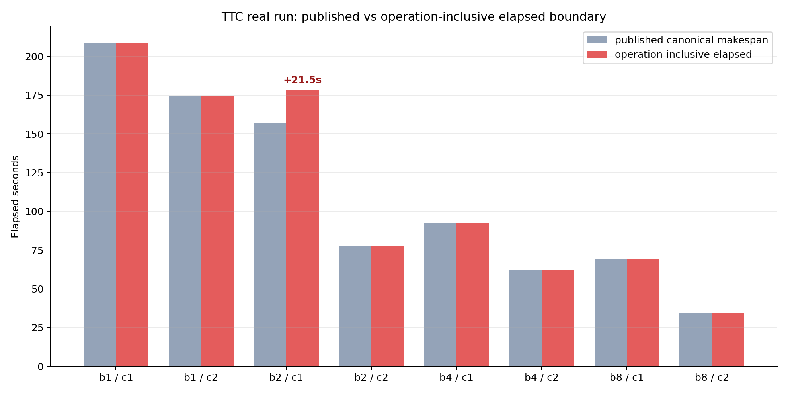
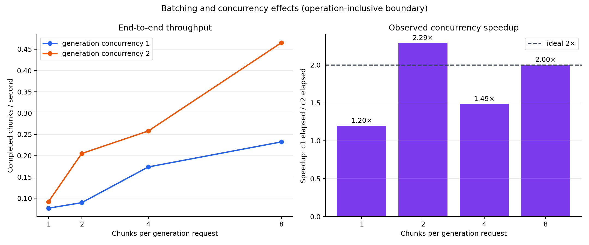
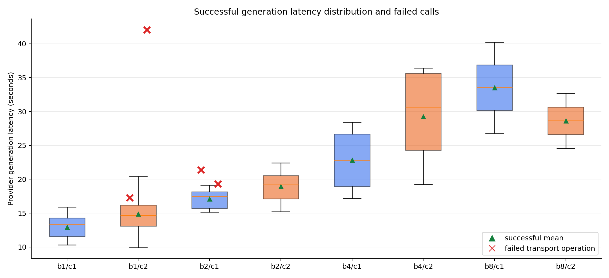
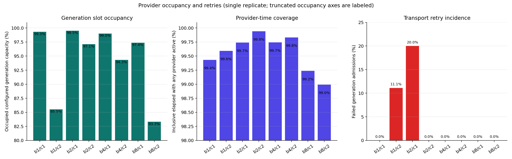
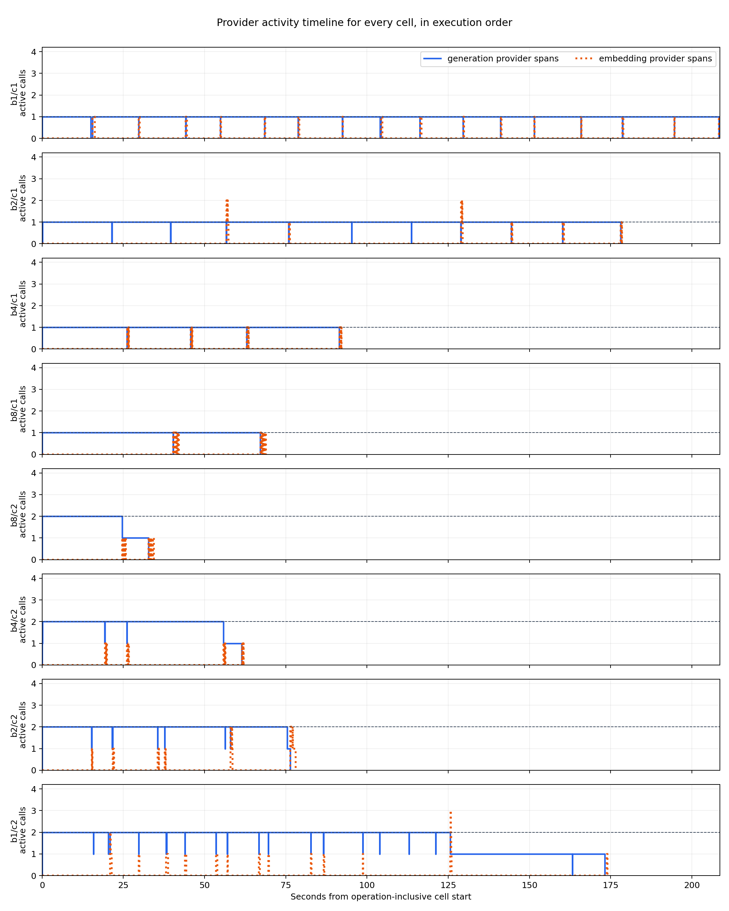

# TTC real-run performance audit and pipeline consolidation assessment

## Executive summary

The original real-run publication was materially incomplete. It reported eight makespans and stated that batching and concurrency helped, but it did not analyze latency distributions, transport failures, retry cost, cell-boundary semantics, slot occupancy, provider coverage, queue delay, jitter, or execution-order bias. It referenced graphs without showing them, left the ticket's final task unchecked, and left the ticket index saying that the real run had not happened. The final report was 3.6 KB despite 192 durable operation records and 53 KB of aggregate evidence being available.

The retained operation ledgers support a much stronger result. The run completed **60 successful generation calls**, **4 failed generation calls**, and **128 successful embedding calls** across eight cells. The four failed generation calls consumed **100.045 provider-seconds** before retry success. Two failures occurred in batch-2/concurrency-1 and two in batch-1/concurrency-2; all four were closed `transport / RAG_TTC_GENERATION_PROVIDER` failures.

The most important correction is a measurement-boundary defect. The published `makespanMicros` is computed from **successful attempts only**. In batch-2/concurrency-1, the first failed 21.387-second provider call started before the first retained successful attempt, so the published 157.050-second makespan excludes 21.472 seconds of observed work. The operation-inclusive elapsed time is **178.522 seconds**. This defect does not invalidate the durable operation ledger, but it means the original makespan and throughput fields are not retry-safe.

The performance conclusion is nevertheless clear within this single replicate:

- Batch size 8, concurrency 2 was fastest at **34.389 seconds** for 16 chunks, or **0.465 chunks/s**.
- At concurrency 1, moving from batch size 1 to 8 improved operation-inclusive elapsed time by **3.03×**.
- At concurrency 2, moving from batch size 1 to 8 improved it by **5.06×**.
- Moving from generation concurrency 1 to 2 yielded speedups from **1.20× to 2.29×**, depending on batch and retry incidence.
- Provider spans covered **98.99%–99.94%** of operation-inclusive cell elapsed time. There is no evidence of broad scheduler pauses between jobs in this run; generation provider work was the dominant critical path.
- Embedding latency was small: per-cell median request latency ranged from **0.123 to 0.273 seconds**. Generation median latency ranged from **13.403 to 33.532 seconds** and grew with batch size, but much more slowly than chunks per request.
- Generation token/s and billed cost efficiency **cannot be computed honestly** because actual usage counters were missing for most cells. Reserved token/cost ceilings are authority, not observed usage.

The immediate configuration recommendation is **batch size 8, generation concurrency 2** for this exact 16-chunk qualification shape, subject to a replicated experiment. The scientific recommendation is not to claim a universal optimum from one sequential run. At least three randomized or counterbalanced replicates are needed to estimate jitter and distinguish batch/concurrency effects from provider drift and run order.

## 1. Scope and evidence standard

This assessment answers two questions:

1. What can actually be concluded from the completed real TTC run?
2. What should change so execution, measurement, analysis, custody, reporting, and publication become one coherent pipeline rather than a chain of ticket-local scripts and manual repairs?

The analysis reads only compact retained evidence:

- aggregate `evidence.json`;
- eight per-cell evidence records;
- eight operation JSONL ledgers and manifests;
- generation authority state;
- the existing researchctl run export.

It does not read source text, prompts, provider request/response bodies, credentials, vectors, or the deleted runtime SQLite databases. The derived script and outputs are in this ticket:

- `scripts/01-analyze-ttc-real-run.py`;
- `sources/derived-real-attempt-003/summary.json`;
- `sources/derived-real-attempt-003/cells-derived.csv`;
- `sources/derived-real-attempt-003/operations-derived.csv`;
- `sources/derived-real-attempt-003/graphs/`.

The script treats operation admissions and completions as the authoritative data-plane evidence. This follows the scraper contract: `ExternalOperationCompletion` contains provider start, elapsed microseconds, outcome, closed failure, accounting mode, counters, and completion time (`scraper/pkg/workflowv3/external_operation.go:90-100`). The operation model explicitly separates provider timing from Workflow attempt timing (`external_operation.go:90-92`).

## 2. Experimental design

### 2.1 Matrix

Each cell processed the same fixed 16-chunk input. The factors were:

- chunks per generation request: `1, 2, 4, 8`;
- generation concurrency: `1, 2`;
- one replicate per cell.

The actual execution order was:

```text
b1/c1 -> b2/c1 -> b4/c1 -> b8/c1 -> b8/c2 -> b4/c2 -> b2/c2 -> b1/c2
```

This order is partially counterbalanced: batch size increases under concurrency 1 and decreases under concurrency 2. It is better than running both arms in the same direction, but it is not randomized and there is only one replicate.

### 2.2 Request arithmetic

For one cell with 16 chunks:

```text
planned generation requests = ceil(16 / batch_size)
embedding requests          = 16
```

Across the matrix:

- planned generation requests: 60;
- successful generation calls: 60;
- admitted generation calls: 64;
- failed generation calls: 4;
- successful embedding calls: 128;
- total durable external-operation rows: 192.

The distinction between planned, admitted, succeeded, and failed is essential. The original report stated “60 successful generation attempts,” which is true but hides four additional paid/authorized provider interactions.

### 2.3 Timing boundaries

This report uses two elapsed-time definitions:

- **Published canonical makespan:** the existing cell value computed from the earliest successful generation attempt through the latest successful generation/embedding attempt.
- **Operation-inclusive elapsed:** the interval from the earliest retained attempt or operation admission through the latest retained attempt finish or operation completion.

The operation-inclusive boundary is used for throughput and speedup because it includes failed provider work that the successful-attempt boundary can omit.

## 3. Corrected result table

| Batch | Concurrency | Published s | Inclusive s | Gen ok/fail | Gen p50 s | Gen p95 s | CV | Slot occupancy | Provider coverage | Chunks/s | c1→c2 speedup |
| ---: | ---: | ---: | ---: | ---: | ---: | ---: | ---: | ---: | ---: | ---: | ---: |
| 1 | 1 | 208.607 | 208.607 | 16 / 0 | 13.403 | 15.196 | 0.129 | 99.3% | 99.43% | 0.0767 | — |
| 1 | 2 | 174.067 | 174.067 | 16 / 2 | 14.691 | 18.031 | 0.161 | 85.5% | 99.59% | 0.0919 | 1.20× |
| 2 | 1 | 157.050 | **178.522** | 8 / 2 | 17.448 | 18.884 | 0.081 | 99.5% | 99.74% | 0.0896 | — |
| 2 | 2 | 77.990 | 77.990 | 8 / 0 | 19.303 | 22.104 | 0.127 | 97.1% | 99.94% | 0.2052 | 2.29× |
| 4 | 1 | 92.202 | 92.202 | 4 / 0 | 22.830 | 28.090 | 0.202 | 99.0% | 99.74% | 0.1735 | — |
| 4 | 2 | 62.029 | 62.029 | 4 / 0 | 30.664 | 36.280 | 0.242 | 94.3% | 99.83% | 0.2579 | 1.49× |
| 8 | 1 | 68.864 | 68.864 | 2 / 0 | 33.532 | 39.584 | 0.201 | 97.4% | 99.24% | 0.2323 | — |
| 8 | 2 | **34.389** | **34.389** | 2 / 0 | 28.655 | 32.311 | 0.142 | 83.3% | 98.99% | **0.4653** | 2.00× |

`CV` is the population coefficient of variation for successful generation latency within the cell. It is descriptive only; cells with batch size 8 have just two generation observations.

## 4. Boundary defect and retry cost



The batch-2/concurrency-1 cell exposes a concrete correctness defect in the current aggregate schema. The sweep's `readCell` function filters attempts to `Status == "succeeded"` (`cmd/rag-ttc-v3-sweep/main.go:512-523`) and starts makespan at the first retained successful generation attempt (`main.go:524-531`). Failed operation evidence is durable, but failed attempt time is excluded from `MakespanMicros` and therefore from `ChunksPerSecond` and `RequestsPerSecond` (`main.go:543`).

For batch-2/concurrency-1:

- failed call 1: 21.387 seconds;
- failed call 2: 19.322 seconds;
- failed provider time: 40.709 seconds;
- the first failure lies outside the successful-attempt boundary;
- published makespan: 157.050 seconds;
- operation-inclusive elapsed: 178.522 seconds;
- undercount: 21.472 seconds, or 12.0% of the inclusive duration.

For batch-1/concurrency-2, both failures are already inside the successful-attempt span, so published and operation-inclusive elapsed are effectively equal. This inconsistency is why a retry-safe metric must derive its boundary directly from all operation admissions/completions, not successful outputs.

The four failed calls consumed 100.045 provider-seconds in total. That is not 100 seconds added directly to matrix wall time because some work overlapped at concurrency 2, but it is real provider occupancy and authorization consumption. Every failure had:

```text
outcome: failed
failure.class: transport
failure.code: RAG_TTC_GENERATION_PROVIDER
accountingMode: conservative
```

No provider error text was persisted, which is correct for privacy. The closed error code is sufficient to classify retry incidence but not enough to determine whether the transport failures came from the Umans service, network tunnel, deadline, or client parsing layer. That diagnosis needs bounded subcodes or correlated host-level telemetry.

## 5. Batching and concurrency



### 5.1 Batching effect

At concurrency 1:

- batch 1: 208.607 s, 0.0767 chunks/s;
- batch 8: 68.864 s, 0.2323 chunks/s;
- elapsed improvement: 3.03×.

At concurrency 2:

- batch 1: 174.067 s, 0.0919 chunks/s;
- batch 8: 34.389 s, 0.4653 chunks/s;
- elapsed improvement: 5.06×.

Batching works because generation request latency grows sublinearly with chunks per request. Under concurrency 1, median generation latency rises from 13.403 seconds at batch 1 to 33.532 seconds at batch 8, a 2.50× latency increase for 8× as many chunks. Request count falls from 16 to 2. The fixed per-request overhead dominates enough that larger batches produce much more chunk throughput.

This does **not** prove that batch 8 is optimal for larger inputs. The tested maximum is 8, and all cells use only 16 chunks. Larger batches may encounter context limits, malformed output risk, output truncation, degraded generation quality, or worse retry blast radius.

### 5.2 Concurrency effect

Observed concurrency-2 speedups are:

- batch 1: 1.20×;
- batch 2: 2.29×;
- batch 4: 1.49×;
- batch 8: 2.00×.

The 2.29× result is not superlinear scheduler scaling. Its concurrency-1 comparator contains two transport failures, including one outside the published boundary; its concurrency-2 comparator has none. The speedup combines parallelism with different failure realizations. A replicated experiment is required before using 2.29× as an expected speedup.

Batch 8 reaches almost exactly ideal 2× speedup in this run. Batch 4 reaches only 1.49× because its successful generation requests were slower at concurrency 2 (median 30.664 s) than concurrency 1 (22.830 s). That may reflect provider load, request scheduling, run order, or ordinary latency variability.

## 6. Provider latency and jitter



The figure shows every successful generation latency distribution as a box plot, green triangles for successful means, and red crosses for failed transport operations. The main patterns are:

1. Larger batches increase per-request latency.
2. Per-request latency increases much more slowly than chunks per request.
3. Concurrency 2 does not uniformly reduce individual request latency; it improves end-to-end elapsed by overlap.
4. Transport failures occur only in batch-1/concurrency-2 and batch-2/concurrency-1 in this sample.
5. The longest observed operation is a 42.063-second failed batch-1 call.

The within-cell coefficient of variation ranges from 0.081 to 0.242. Batch-4/concurrency-2 has the highest observed successful-call CV (0.242), but its sample size is four. Batch-8 cells have only two observations, so p95 and CV are not stable estimates.

### 6.1 Embedding latency

Embedding is not the bottleneck in this topology. Each cell issues 16 embedding operations. Per-cell embedding medians are 0.123–0.273 seconds, and p95 values are 0.229–0.754 seconds. Total embedding provider work per cell is 2.246–4.955 seconds, much smaller than generation work.

Embedding can overlap generation and other embedding requests. The operation timelines show it filling short intervals around completed generation batches rather than extending most of the critical path.

### 6.2 Queue delay

The p95 delay from durable operation admission to provider start ranges from 0.011 to 0.134 seconds by cell. This is small relative to 10–40 second generation calls. It does not support the hypothesis that long pauses arise between admission and provider invocation.

## 7. Occupancy, underutilization, and idle time



This graph deliberately separates three denominators:

- **Generation slot occupancy:** sum of all generation provider spans divided by operation-inclusive elapsed × configured generation concurrency.
- **Provider-time coverage:** fraction of operation-inclusive elapsed during which at least one generation or embedding provider operation was active.
- **Retry incidence:** failed generation admissions divided by all generation admissions.

Provider-time coverage is 98.99%–99.94%. Measured cell-level provider-idle time is only 0.045–1.182 seconds. Therefore:

> The completed cells do not contain long scheduler pauses between provider jobs. Nearly the entire observed interval is covered by provider work.

Generation slot occupancy ranges from 83.3% to 99.5%. Lower slot occupancy at batch-8/concurrency-2 is expected: only two generation requests exist, and unequal request durations create a tail where one slot is active after the other finishes. Batch-1/concurrency-2 also has lower occupancy (85.5%) because retries and uneven call durations create imperfect pairing.

This metric is not CPU utilization and does not measure remote model hardware occupancy. It is the fraction of configured client-side generation call slots covered by recorded provider spans.

## 8. Full provider timelines



All eight panels share the same x-axis and y-axis. Blue is the number of active generation provider calls. Orange dotted lines are active embedding calls. The dashed horizontal line is each cell's configured generation concurrency.

The timelines make the critical path visible:

- concurrency-1 cells keep one generation request active almost continuously;
- concurrency-2 cells typically keep two generation calls active until request cardinality or unequal latency creates a tail;
- embedding operations are short and commonly overlap generation;
- batch size 8 reduces the number of generation waves to one at concurrency 2;
- batch-1/concurrency-2 has a long tail and retries, explaining its weak 1.20× speedup;
- no panel shows multi-second blank gaps that would explain the overall runtime.

The existing old request-timeline graph superimposed cells after independently resetting their origins and originally selected a nonexistent concurrency-4 series for the real matrix. The new figure renders every cell separately, in actual execution order, with common axes.

## 9. What cannot be concluded

### 9.1 No reliable token/s

The user asked for TPS. Actual token counters are absent for most provider completions. Two cells contain conservative nonzero budget usage, while the others report zero/unavailable values. Those zeros are not evidence that no tokens were consumed.

Therefore this report does not calculate:

- generated tokens/s;
- input processing tokens/s;
- billed cost per chunk;
- cost per successful generation;
- token efficiency by batch.

The correct fix is to distinguish `reported`, `unavailable`, and `zero` in the usage schema. A numeric zero without availability metadata is ambiguous.

### 9.2 No confidence intervals

There is one replicate per cell. Within-cell request distributions do not substitute for replicated cell runs because requests share one sequential provider/environment state and different batch sizes have different request counts.

### 9.3 No quality comparison

The compact evidence measures execution, not output quality. Larger batches could change generation correctness, parsing reliability, question coverage, duplication, or downstream retrieval performance. A production choice must join performance metrics with RAG quality metrics.

### 9.4 No universal capacity conclusion

Only concurrency 1 and 2 were tested in the final real run. The user's plan permits up to four concurrent Umans calls, but concurrency 4 was not included in this authorized matrix. Nothing here proves behavior at concurrency 4.

### 9.5 No root cause for transport failures

The closed failure code preserves privacy but collapses several possible causes. More detailed bounded codes or correlated endpoint telemetry are needed to distinguish client timeout, tunnel reset, upstream HTTP status class, malformed response framing, and provider rejection.

## 10. Recommendation for the next experiment

Use batch 8 / concurrency 2 as the current operational default for the same TTC generation shape, but run a replicated qualification before standardizing it.

Recommended design:

1. Compare batches `4` and `8`; include `2` as a control if budget allows.
2. Compare concurrency `1`, `2`, and optionally `4` under a separately approved hard cap.
3. Run at least three replicates per cell.
4. Randomize or Latin-square the cell order.
5. Preserve all failed and successful operations.
6. Record provider-reported token usage availability explicitly.
7. Add output-quality metrics and malformed-output rate.
8. Report median and bootstrap confidence intervals at the cell-replicate level.
9. Declare primary metrics before execution:
   - operation-inclusive chunks/s;
   - successful generation latency distribution;
   - retry incidence;
   - quality score;
   - actual cost/chunk when usage is reported.

## 11. Why the previous work felt “half assed”

The transcript shows a long, technically substantial implementation session. The agent built the durable ledger, ran validation, recovered provider infrastructure, executed a paid bounded run, fixed graph labels, committed artifacts, and uploaded a bundle. The problem was not absence of work. The problem was loss of completion discipline at the reporting boundary.

Specific failures:

1. **The report was written in one short tool call.** It summarized makespans but did not interrogate the operation JSONL that had just been created.
2. **The graph set was treated as a deliverable inventory, not an argument.** The Markdown did not embed figures or explain what each showed.
3. **The goal audit was not enforced.** The user requested a detailed report “with graphs and all,” but the final response accepted a 3.6 KB note.
4. **Ticket state was not reconciled.** `tasks.md` retained the unchecked analysis/publication task, and `index.md` retained stale pre-run language.
5. **A known limitation was not followed through.** The diary explicitly said to inspect graphs and investigate missing usage; the final report merely restated that missing usage existed.
6. **No retry-safe boundary review occurred.** The durable operation ledger was available, but aggregate makespan continued to use successful attempts only.
7. **Publication outran peer review.** The bundle was uploaded immediately after the short report was committed.

This is a process design failure: execution, evidence reduction, graph generation, narrative synthesis, ticket closure, and upload are independent manual steps with no enforced completion contract.

## 12. Current pipeline architecture

```text
researchctl canonical specification + input artifacts
                    |
                    v
rag-ttc-v3-sweep command
  - validates provider authority and hard budgets
  - creates one Workflow V3 SQLite store per cell
  - dispatches generation + embedding tasks
                    |
                    v
scraper Workflow V3 external-operation ledger
  - durable pre-call admission
  - immutable completion with bounded timing/outcome/counters
  - canonical JSONL + manifest export
                    |
                    v
per-cell checkpoint + aggregate evidence + CSV/JSONL
                    |
                    v
researchctladapter
  - verifies compact artifact digest/size
  - builds researchctl run export
                    |
                    v
manual Python graph renderer + manual Markdown report
                    |
                    v
manual docmgr bookkeeping + manual reMarkable upload
```

The execution and custody layers are stronger than the analysis/publication layers.

### 12.1 What is already solid

- Scraper's operation contract has closed outcomes and failure codes, no arbitrary payload field, and an opaque completion ticket (`external_operation.go:73-139`).
- The canonical operation export records admitted/completed/incomplete counts and digest identity (`external_operation.go:142-170`).
- The sweep exports operation custody before removing each transient cell runtime (`cmd/rag-ttc-v3-sweep/main.go:360-392`).
- Failed cells also export operation evidence and reductions (`main.go:350-358`, `556-610`).
- Researchctl custody verifies relative artifact URI, regular-file status, digest, size, and schema (`pkg/researchctladapter/operation_custody.go:85-114`).
- The real run's operation ledgers are rich enough to repair the report without another provider run.

### 12.2 What remains fragmented

- Success evidence derives timing from successful output artifacts while failure evidence derives timing from operations.
- Aggregate `generationRequests` is populated from successful attempt count, not admitted/succeeded/failed operation counters (`main.go:435-446`).
- Researchctl imports only four coarse scalar metrics and omits latency, retry, coverage, missingness, and boundary semantics.
- Graph code is ticket-local and originally retained fixture-specific language when used on real evidence.
- Report generation is manual and not tied to graph manifest or metric schema.
- The run had to use a post-hoc custody export script because custody IDs were omitted from the live invocation.
- Ticket completion and upload have no machine-checkable gate.

## 13. Consolidation design

### 13.1 One canonical run-analysis model

Introduce a versioned domain-neutral analysis record derived from operation ledgers:

```go
type RunAnalysis struct {
    SchemaVersion string
    SourceDigests []string
    Boundary      BoundaryDefinition
    Cells         []CellAnalysis
    Totals        OperationTotals
    Missingness   MissingnessSummary
}

type CellAnalysis struct {
    Cell                    CellIdentity
    Planned                 RequestCounts
    Admitted                RequestCounts
    Succeeded               RequestCounts
    Failed                  RequestCounts
    Incomplete              RequestCounts
    CanonicalElapsedMicros  int64
    InclusiveElapsedMicros  int64
    ProviderCoveragePPM     int64
    SlotOccupancyPPM        int64
    Latency                 map[OperationKind]Distribution
    QueueLatency            Distribution
    Usage                   UsageWithAvailability
}
```

The analysis record should be implemented in Go near the RAG domain, not in scraper's generic workflow package. Scraper owns operation truth; RAG owns domain reductions.

### 13.2 Make boundaries explicit

Every elapsed metric must name its boundary:

- successful-attempt boundary;
- all-attempt boundary;
- operation-admission/completion boundary;
- external wall-clock invocation boundary.

For retry-safe end-to-end performance, default to the operation-inclusive boundary. Keep the old successful-attempt metric only as a clearly labeled compatibility field until consumers migrate; do not silently redefine it.

### 13.3 First-class missingness

Replace ambiguous numeric zeros with:

```go
type ObservedCounter struct {
    Value        int64
    Availability string // reported | unavailable | not-applicable
    Accounting   string // actual | conservative | none
}
```

Graphs must render unavailable token/cost metrics as N/A, not zero lines and not fixture-labeled axes.

### 13.4 Shared analysis command

Add a maintained command, for example:

```text
rag-eval analyze-run \
  --evidence <run>/evidence.json \
  --operations <run>/operations \
  --output <run>/analysis
```

It should produce atomically:

- `analysis.json`;
- `cells.csv`;
- `operations.csv` or Parquet when scale requires it;
- graph SVG/PNG;
- graph manifest with source digests and metric definitions;
- a Markdown report scaffold or complete deterministic report sections.

The ticket-local Python script in this audit is a prototype and executable specification, not the final architecture.

### 13.5 Expand researchctl metrics

Import query-friendly metrics with explicit scopes:

- `operation.generation.admitted`;
- `operation.generation.succeeded`;
- `operation.generation.failed`;
- `operation.embedding.succeeded`;
- `operation.elapsed.inclusive_micros`;
- `operation.provider_coverage_ppm`;
- `operation.generation.slot_occupancy_ppm`;
- `operation.generation.latency_p50_micros`;
- `operation.generation.latency_p95_micros`;
- `operation.retry_rate_ppm`;
- missing-usage counts.

Detailed operations remain verified artifacts; researchctl stores selected reductions for comparison and querying.

### 13.6 Publication gate

A run is publishable only when one command verifies:

```text
[ ] every planned cell has a success or failed checkpoint
[ ] operation manifests match JSONL digests and counts
[ ] planned/admitted/succeeded/failed/incomplete arithmetic reconciles
[ ] graph manifest source digest matches analysis source digest
[ ] every report image exists and is referenced
[ ] report contains limitations and missingness section
[ ] ticket final task is checked
[ ] index status and links are current
[ ] docmgr doctor passes
[ ] reMarkable dry-run succeeds before upload
```

### 13.7 Eliminate post-hoc identity repair

The live sweep invocation should always require or generate an operator-approved researchctl identity before a real run. If identity is intentionally deferred, the output must include a deterministic custody descriptor sufficient for one standard finalize command. A one-off `08-build-operation-custody-export.go` script should not be necessary.

## 14. Decisions

### Decision: Operation ledger is the authoritative timing source

- **Context:** Successful output timing drops failed calls and can undercount elapsed boundaries.
- **Options considered:** Keep output-derived timing; merge attempts and outputs; derive from durable operations.
- **Decision:** Derive provider latency, retries, concurrency, coverage, and retry-safe elapsed boundaries from operation admissions/completions.
- **Rationale:** Operations exist for success, failure, cancellation, and incomplete calls.
- **Consequences:** RAG analysis must join operation kinds to domain semantics; old successful-output timing becomes secondary.
- **Status:** proposed.

### Decision: Analysis belongs in rag-evaluation-system

- **Context:** Scraper is domain-neutral, while batch/chunk/quality semantics are RAG-specific.
- **Options considered:** Put analytics in scraper; put them in researchctl; keep ticket scripts; add RAG analysis package/command.
- **Decision:** Implement canonical reductions and graph/report generation in rag-evaluation-system; import selected results into researchctl.
- **Rationale:** This preserves component boundaries while eliminating one-off scripts.
- **Consequences:** The RAG repository owns metric definitions and versioning.
- **Status:** proposed.

### Decision: Researchctl remains immutable custody and comparison index

- **Context:** Researchctl already verifies artifacts and metrics but should not become a synchronous provider-call dependency.
- **Options considered:** Live per-operation writes; duplicate all operation rows; verified artifacts plus richer reductions.
- **Decision:** Keep detailed JSONL as verified artifacts and store richer scoped scalar reductions.
- **Rationale:** It avoids runtime coupling and duplicated source-of-truth rows.
- **Consequences:** Deep operation analysis opens artifacts; cross-run queries use metrics.
- **Status:** accepted.

### Decision: Publication completion must be machine-checked

- **Context:** The previous session uploaded while the final task and index were stale and the report was incomplete.
- **Options considered:** Reviewer discipline; diary checklist; executable publication gate.
- **Decision:** Add an executable gate and fail publication when artifacts, report, ticket, and upload state disagree.
- **Rationale:** The failure was procedural and repeatable; prose reminders were already present and insufficient.
- **Consequences:** Publication takes one explicit finalize step and produces a receipt.
- **Status:** proposed.

## 15. Phased implementation plan

### Phase 1: Correct metrics without changing execution

1. Port the audit script's boundary, operation totals, latency, occupancy, and missingness reductions into tested Go code.
2. Add golden tests using the retained real operation ledgers and synthetic retry/incomplete cases.
3. Add explicit `planned/admitted/succeeded/failed/incomplete` fields to aggregate evidence v3.
4. Keep v2 artifacts immutable; produce v3 only for new runs.

Exit criteria: retry cells cannot undercount inclusive elapsed, and request arithmetic reconciles from operations.

### Phase 2: Consolidate graph generation

1. Implement one graph command against canonical analysis JSON.
2. Remove fixture-specific labels from metric definitions.
3. Generate distribution, speedup, occupancy, retry, missingness, and timeline figures.
4. Put source digest, metric definition, title, alt text, and generated files in the manifest.
5. Add visual regression or image-dimension/nonblank checks, plus manual visual review for release runs.

Exit criteria: no graph reads raw workflow/runtime files independently; all graphs derive from one analysis record.

### Phase 3: Deterministic report generation

1. Generate tables and graph embeds from the manifest.
2. Require methodology, missingness, limitations, and recommendation sections.
3. Allow reviewed prose overlays without allowing numeric drift.
4. Validate every reported number against analysis JSON.

Exit criteria: changing a source digest invalidates the report receipt.

### Phase 4: Researchctl integration

1. Expand custody metrics with scoped operation reductions.
2. Import analysis JSON and graph manifest as verified artifacts.
3. Add cross-run queries for batch, concurrency, provider profile, model digest, latency, retry rate, throughput, quality, and cost availability.
4. Verify import/re-export identity.

Exit criteria: a researchctl query can compare completed runs without parsing Markdown.

### Phase 5: Publication gate

1. Add `rag-eval finalize-run` or an equivalent command.
2. Validate artifacts, analysis, graphs, report, ticket state, and privacy scans.
3. Produce a finalize receipt.
4. Make reMarkable upload consume the receipt and perform dry-run first.

Exit criteria: stale tasks/index or an unreferenced graph blocks publication.

### Phase 6: Replicated study

1. Pre-register a randomized replicated matrix.
2. Run only after separate numeric authority.
3. Join performance and quality metrics.
4. Publish confidence intervals and explicit provider drift analysis.

Exit criteria: configuration recommendations are based on replicated cell-level evidence.

## 16. Validation performed for this audit

- Converted and validated the exact requested Pi session with go-minitrace.
- Queried user turns, final context, ticket/document calls, and cross-worktree repository operations.
- Verified the final commits against the rag-evaluation-system repository.
- Parsed all eight cell checkpoints and all 192 operation records.
- Reconciled 60 planned/successful generation calls, 64 admissions, four failures, and 128 embedding calls.
- Generated derived JSON and CSV from a ticket-local script.
- Rendered five analytical figures as PNG and SVG.
- Performed two rounds of vision-assisted QA; the first found ambiguous legends, mixed denominators, clipping, and inconsistent timeline axes; the second found no publication blocker.
- Opened all five revised PNG files directly with the read tool and corrected the remaining top-label overlap in the occupancy figure.

## 17. Reproduction

From the rag-evaluation-system repository:

```bash
BASE="$PWD/ttmp/2026/07/22/RAG-PIPELINE-CONSOLIDATION-AUDIT--assess-improve-and-consolidate-the-rag-evaluation-pipeline"
RUN="$PWD/ttmp/2026/07/22/RAG-TTC-V3-SWEEP--workflow-v3-umans-batching-and-concurrency-study/sources/real-attempt-003"

python3 -m py_compile "$BASE/scripts/01-analyze-ttc-real-run.py"
python3 "$BASE/scripts/01-analyze-ttc-real-run.py" \
  --run-root "$RUN" \
  --output-dir "$BASE/sources/derived-real-attempt-003"

md-view view \
  "$BASE/analysis/01-ttc-real-run-performance-audit-and-pipeline-consolidation-assessment.md"
```

## 18. References

### Original run

- `ttmp/2026/07/22/RAG-TTC-V3-SWEEP--workflow-v3-umans-batching-and-concurrency-study/sources/real-attempt-003/evidence.json`
- `.../cells/*.json`
- `.../operations/*.jsonl`
- `.../generation-authority.json`
- original shallow report: `.../analysis/02-authorized-real-umans-qualification-results.md`
- original diary: `.../reference/01-investigation-diary.md`

### RAG execution and custody

- `cmd/rag-ttc-v3-sweep/main.go:350-454` — per-cell publication and researchctl export.
- `cmd/rag-ttc-v3-sweep/main.go:500-543` — successful-attempt timing boundary.
- `cmd/rag-ttc-v3-sweep/main.go:546-610` — operation export and failed-cell reduction.
- `pkg/researchctladapter/operation_custody.go:15-132` — verified artifact and metric mapping.

### Scraper Workflow V3

- `/home/manuel/workspaces/2026-06-30/benchmark-cpu-inference/scraper/pkg/workflowv3/external_operation.go:73-170` — bounded operation contract.
- `/home/manuel/workspaces/2026-06-30/benchmark-cpu-inference/scraper/pkg/workflowv3sqlite/external_operation_query.go` — authoritative query and canonical export.
- scraper ticket `SCRAPER-WORKFLOW-V3-EXTERNAL-OPERATIONS` — design, implementation diary, and completion audit.

### Transcript audit artifacts

- `/home/manuel/workspaces/2026-06-30/benchmark-cpu-inference/analysis/session-019f77c2-audit/source-list.txt`
- `.../queries/01-session-and-user-turns.sql`
- `.../queries/02-ticket-doc-delivery-calls.sql`
- `.../queries/04-final-context.sql`
- `.../results/*.json`
