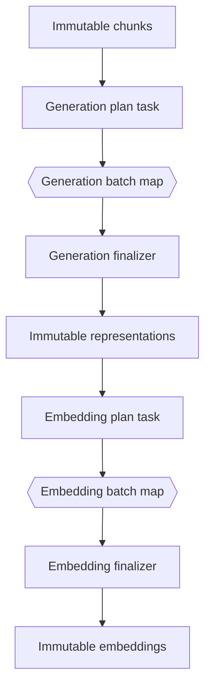

# Minimal Workflow V3 concurrency cleanup design

## Executive summary

RAG preparation currently has overlapping concurrency mechanisms. Representation operators create local worker pools using `GenerationConcurrency`. Provider adapters wrap generation, embedding, and reranking clients in semaphore-based `MaxInFlight` limits. Workflow V3 also has a resource-capacity dispatcher, but current static preparation lowering emits one coarse sequential task per RAG operator. The result is unnecessary concurrency plumbing and ambiguous ownership: Workflow leases one task while that task schedules several provider calls internally and may then wait on another provider semaphore.

This ticket performs the smallest coherent cleanup. Generation and embedding batches become deterministic Workflow V3 map items. Workflow V3 owns normal scheduling, retry, cancellation, operation accounting, and progress for those items. Direct `ragengine` preparation remains as a deliberately serial semantic reference. `GenerationConcurrency`, local worker pools, hidden worker defaults, and duplicate progress coordination are removed. Provider `MaxInFlight` remains only as a host-global safety ceiling until Workflow has a proven global resource governor; startup must reject a Workflow capacity above that ceiling so valid execution does not queue inside the provider wrapper.

This ticket intentionally does not implement the broader TTC scaling study, index sharding, query-stage decomposition, a new RAG capacity-profile schema, or a global scheduling subsystem. Those remain on hold in `TTC-RAG-PARALLELIZATION-STUDY` until this simplification is complete and reviewed.

## 1. Objective

Create one normal scheduling authority for provider-backed preparation while deleting redundant implementation machinery.

The final architecture must satisfy:

```text
Workflow execution:
  deterministic plan
    -> one Workflow map item per provider batch
    -> deterministic finalizer

Direct engine execution:
  deterministic plan
    -> serial one-batch calls
    -> deterministic finalizer

Provider adapter:
  host-global safety ceiling only
```

The same plan, one-batch execution, validation, and finalization code must be shared by both execution paths. Only the executor differs.

## 2. Current implementation

### 2.1 Operator-local generation workers

`pkg/ragoperators/combined_prepare.go` and `pkg/ragoperators/represent.go` read `Environment.GenerationConcurrency`. They create channels, goroutines, wait groups, atomics, cancellation contexts, and first-error coordination. If no value is supplied, a hidden default worker count is used.

The option is propagated through:

- `ragengine.Options`;
- `ragoperators.Environment`;
- `ragproviders.ProviderSet`;
- `ragworkflow.ProviderServices`;
- Workflow provider environment construction;
- fixture and real-provider exports;
- direct parity tests;
- operator tests.

This is a large API surface for one local scheduling choice.

### 2.2 Provider safety semaphores

`pkg/ragproviders/limit.go` wraps each real provider with a buffered-channel semaphore. This applies to generation, embedding, and reranking. It protects calls that do not run through Workflow and can protect a provider shared by multiple workflows.

This mechanism is not deleted by the initial hard cut. It is reclassified as a safety ceiling, not the normal scheduler.

### 2.3 Coarse Workflow preparation

`pkg/ragworkflow/lower.go` currently emits static operators as a sequential chain:

```text
prepare-start
  -> prepare-000
  -> prepare-001
  -> ...
  -> evaluate-queries map
```

Every static task uses `cpu.rag.prepare`. A representation task may make many concurrent generation calls internally, but Workflow sees one lease and one retry domain.

### 2.4 Generic ordinal dispatch

`pkg/ragworkflow/runtime.go` parses node keys such as `prepare-003`, computes a static ordinal, finds the corresponding pipeline node, and invokes its native operator. This is convenient for coarse sequential lowering but cannot represent plan/map/finalize boundaries cleanly.

This ticket removes the superseded coarse representation and embedding uses of that path. It does not need to replace every static operator immediately.

### 2.5 Duplicate progress authority

Representation operators emit periodic local progress using atomic counters and a ticker goroutine. Workflow already owns durable item and attempt state. Once one batch is one map item, local active-worker progress is redundant.

## 3. Problems being removed

### 3.1 Nested scheduling

If Workflow capacity is four and an operator starts four workers, one leased task can produce four provider calls. If several tasks exist later, effective concurrency becomes a multiplication rather than the declared capacity.

### 3.2 Hidden queueing

A Workflow task may hold a resource lease while blocked on the provider semaphore. Workflow cannot distinguish provider execution from waiting inside an adapter.

### 3.3 Coarse retries

A failed call can fail a task that contained several successful calls. Retrying the task may repeat cache checks and provider work instead of retrying only one durable batch.

### 3.4 Duplicate telemetry

Operator active/completed counters overlap with Workflow attempts, map items, and external operations.

### 3.5 Configuration propagation

`GenerationConcurrency` crosses packages that should only carry domain services or semantic execution options.

### 3.6 Ambiguous reference behavior

The direct engine and Workflow path both schedule internally, making parity failures harder to isolate. A serial reference executor is easier to reason about.

## 4. Target architecture



Workflow resource ownership:

```text
generation batch map item -> provider.rag.generate
embedding batch map item  -> provider.rag.embed
plan/finalize tasks        -> cpu.rag.prepare
```

No map item starts another worker pool.

## 5. Shared batch APIs

Existing APIs provide most of the required domain boundary:

```go
ragoperators.PlanCombinedPreparation(chunks, node)
ragoperators.ExecuteCombinedPreparationBatch(ctx, plan, batch, env)
ragoperators.PlanEmbeddingBatches(representations, node)
ragoperators.ExecuteEmbeddingBatch(ctx, plan, batch, env)
```

Add or extract deterministic finalizers if they do not already exist as reusable functions:

```go
FinalizeCombinedPreparation(plan, []CombinedBatchResult) ([]Representation, error)
FinalizeEmbeddingBatches(plan, []EmbeddingBatchResult) ([]EmbeddingRecord, error)
```

Finalizers must:

- verify every expected batch index exactly once;
- reject missing and duplicate results;
- reject records not named by the plan;
- validate parent identities, model identities, dimensions, and counts;
- sort by canonical immutable record ID;
- produce the same result as serial execution.

## 6. Serial direct-engine contract

The direct engine remains useful as a semantic oracle and for small local execution. It no longer accepts a concurrency option.

Pseudocode:

```text
function executeGenerationSerial(chunks, node, environment):
    plan = PlanCombinedPreparation(chunks, node)
    results = []
    for batch in plan.batches in canonical order:
        results.append(ExecuteCombinedPreparationBatch(plan, batch, environment))
    return FinalizeCombinedPreparation(plan, results)
```

Embedding uses the same pattern.

Serial execution intentionally does not attempt to match Workflow timing. It must match semantic outputs, cache identity, usage aggregation, and errors.

## 7. Workflow task contracts

Use closed bounded schemas. Suggested task families:

```text
rag.prepare.generation.plan/v1
rag.prepare.generation.batch/v1
rag.prepare.generation.finalize/v1
rag.prepare.embedding.plan/v1
rag.prepare.embedding.batch/v1
rag.prepare.embedding.finalize/v1
```

### 7.1 Plan task

The plan task:

- reads validated upstream values;
- invokes the existing deterministic planner;
- emits one bounded item descriptor per batch;
- declares a strict maximum item count;
- makes no provider call.

### 7.2 Batch task

The batch task:

- validates its descriptor and parent plan digest;
- executes exactly one batch;
- creates at most one provider external operation on a cache miss;
- validates provider output before success;
- publishes one bounded result;
- has no goroutines or internal scheduler.

### 7.3 Finalizer

The finalizer:

- consumes the complete map-output manifest;
- orders results canonically;
- invokes the shared finalizer;
- publishes the stage result for downstream preparation;
- makes no provider call.

## 8. Concurrency ownership

### 8.1 Normal scheduling

Workflow V3 dispatcher capacity is the only normal scheduling control:

```go
map[string]int{
    "provider.rag.generate": generationSlots,
    "provider.rag.embed": embeddingSlots,
}
```

The dispatcher owns ready-work selection, leases, retries, cancellation, and slot refill.

### 8.2 Provider safety ceiling

`ProviderSpec.Concurrency.MaxInFlight` remains a host-qualified upper bound. It may guard calls from multiple workflows or direct-engine callers.

At runner startup:

```text
if workflowCapacity(providerResource) > providerMaxInFlight:
    reject configuration
```

For valid configuration, the provider wrapper should not be the active queue. This preserves defense against accidental bypass while avoiding two competing normal schedulers.

`ProviderSet.GenerationConcurrency` is removed. Provider authority may continue recording the safety ceiling, but the value must not be copied into operator execution options.

## 9. Deletion plan

### 9.1 Delete fields

Remove `GenerationConcurrency` from:

- `pkg/ragengine/engine.go` options;
- `pkg/ragoperators/types.go` environment;
- `pkg/ragproviders/provider_set.go` provider set;
- `pkg/ragworkflow/provider_package.go` provider services;
- all environment and option literals;
- fixtures, exports, and tests.

### 9.2 Delete worker implementation

Remove from representation operators:

- worker-count calculation;
- default worker constants;
- job channels;
- worker goroutines;
- wait groups used for scheduling;
- local active-worker counters;
- first-error synchronization required only by workers;
- ticker-based worker progress.

Retain deterministic planning, cache handling, validation, usage aggregation, and canonical sorting.

### 9.3 Delete superseded Workflow paths

After parity is proven, remove coarse generation and embedding task execution through the generic static `prepare()` operator invocation. Do not leave a mode flag selecting “coarse” versus “map” execution.

### 9.4 Consolidate command defaults

`cmd/rag-workflow-runner/main.go` and `cmd/rag-workflow-inspect/main.go` currently define different hardcoded capacity maps. Use one helper for supported defaults. Do not add a new RAG-specific profile language in this ticket.

## 10. What remains unchanged

- Researchctl owns scientific cases and run concurrency.
- Workflow V3 owns durable scheduling and attempts.
- RAG owns batch planning and result validation.
- Geppetto remains behind RAG provider adapters.
- Provider credentials remain host-only.
- Batch size remains semantic operator configuration.
- Provider safety ceilings remain host configuration.
- Preparation and query semantic digests remain strict.
- Cache keys continue to bind manifests, prompt/schema identities, parent digest, and effective settings.

## 11. Explicit non-goals

This ticket does not:

- run the TTC scaling experiment;
- freeze a medium TTC corpus;
- add index shards or parallel index merging;
- decompose query embedding, reranking, or answering;
- add a host-global Workflow resource subsystem;
- replace prepared bundles with a new artifact graph;
- add a RAG capacity-profile schema;
- add arbitrary concurrency knobs to JavaScript;
- preserve the old worker-pool path for compatibility;
- change prompts, models, chunking, retrieval, or evaluation semantics.

## 12. Implementation sequence

### Phase 0: baseline

1. Inventory all `GenerationConcurrency` reads and writes.
2. Freeze serial fixture outputs, metrics, operation counts, and prepared digests.
3. Add tests showing existing generation and embedding planners are deterministic.

### Phase 1: shared serial execution

1. Add reusable finalizers.
2. Rewrite direct aggregate operators to plan, execute batches serially, and finalize.
3. Prove existing semantic tests pass without worker pools.

At the end of this phase, direct execution is simpler even before Workflow maps land.

### Phase 2: Workflow generation map

1. Add generation plan, batch, and finalizer schemas/tasks.
2. Lower combined representation generation to the map.
3. Assign `provider.rag.generate` to batch items.
4. Prove one cache-miss item creates one external operation.
5. Delete the old coarse Workflow representation path.

### Phase 3: Workflow embedding map

1. Add embedding plan, batch, and finalizer schemas/tasks.
2. Lower embedding to the map.
3. Assign `provider.rag.embed` to batch items.
4. Prove dimensions, ordering, usage, and operation counts.
5. Delete the old coarse Workflow embedding path.

### Phase 4: hard cut

1. Remove `GenerationConcurrency` from all APIs.
2. Remove worker and progress code.
3. Remove hidden defaults.
4. Consolidate command capacity defaults.
5. Validate Workflow capacities against provider safety ceilings.
6. Update examples and architecture documentation.

### Phase 5: acceptance

Run:

- targeted unit and integration tests;
- direct-versus-Workflow parity;
- repeated map execution;
- race tests;
- cancellation and resume;
- provider retry and operation reconciliation;
- budget exhaustion;
- privacy/redaction checks;
- full suite, lint, GoSec, govulncheck, frontend checks, and built-binary acceptance.

## 13. Correctness invariants

Every implementation phase must preserve:

1. canonical batch membership and order;
2. representation and embedding identities;
3. output schema validation;
4. cache identity and conflict behavior;
5. provider authority binding;
6. usage aggregation;
7. exact missing/duplicate rejection;
8. no provider body in Workflow control rows;
9. retry attempts do not increase scientific replicate count;
10. serial and Workflow final outputs are equivalent for deterministic fixtures.

## 14. Failure behavior

- A malformed batch descriptor fails before a provider call.
- Provider budget exhaustion fails before admission.
- A provider failure fails only that map item attempt.
- Retry creates a distinct external operation when another call is admitted.
- A completed immutable batch is reused on resume.
- Finalization rejects an incomplete map.
- Cancellation stops scheduling new items and propagates to in-flight calls.
- Stale attempt completion cannot overwrite authoritative output.

## 15. Tests to add or update

### Operator tests

- serial planner/executor/finalizer equivalence;
- deterministic ordering;
- cache hit avoids provider call;
- missing/duplicate finalizer results;
- no goroutine-based concurrency assumptions.

### Workflow tests

- generation maximum active items equals declared capacity;
- embedding maximum active items equals declared capacity;
- capacity one matches serial output;
- higher capacity matches serial output;
- one batch retry does not repeat completed siblings;
- interruption/resume reuses completed batches;
- budget and operation counts reconcile.

### Provider tests

- safety wrapper still enforces host ceiling;
- runner rejects capacity above ceiling;
- provider set exposes no operator worker count;
- named generator routing preserves per-provider ceilings.

### Hard-cut guards

```text
rg "GenerationConcurrency" -> no matches
rg "defaultRepresentationGenerationWorkers" -> no matches
```

Add migration checks or repository tests if these symbols are likely to return accidentally.

## 16. Review-critical decisions

### Decision 1: serial direct engine

- **Decision:** Direct preparation is serial.
- **Reason:** It is a semantic reference, not a second scheduler.
- **Consequence:** Callers requiring parallel durable preparation use Workflow V3.
- **Status:** proposed.

### Decision 2: Workflow owns normal provider scheduling

- **Decision:** One map item executes one provider batch.
- **Reason:** Workflow already owns resources, leases, retries, cancellation, and telemetry.
- **Consequence:** Operator worker pools are deleted.
- **Status:** proposed.

### Decision 3: retain provider ceiling temporarily

- **Decision:** Keep provider semaphores as host-global safety ceilings.
- **Reason:** Dispatcher capacity may be scoped to one workflow/dispatcher.
- **Consequence:** Startup validation prevents normal contention at the wrapper.
- **Status:** proposed.

### Decision 4: no compatibility mode

- **Decision:** Delete superseded coarse provider task paths after parity.
- **Reason:** A mode flag would preserve duplicate implementations and test matrices.
- **Consequence:** The cutover must be atomic and fully tested.
- **Status:** proposed.

## 17. Acceptance criteria

The ticket is complete only when:

- [ ] generation and embedding use Workflow plan/map/finalize tasks;
- [ ] direct preparation is deterministic and serial;
- [ ] `GenerationConcurrency` no longer exists;
- [ ] representation operators contain no worker pools;
- [ ] local worker progress machinery is removed;
- [ ] coarse Workflow generation/embedding execution is removed;
- [ ] Workflow capacity above provider safety ceiling is rejected;
- [ ] valid Workflow execution does not rely on provider semaphore queueing;
- [ ] runner and inspector share capacity defaults;
- [ ] deterministic fixture outputs match serial reference outputs;
- [ ] retry, resume, cancellation, budget, operation, race, privacy, and artifact tests pass;
- [ ] no compatibility flag or fallback scheduler remains;
- [ ] broader parallelization study documentation is reviewed and either resumed or revised.

## 18. File map

Primary implementation files:

- `pkg/ragoperators/combined_batch.go`
- `pkg/ragoperators/combined_prepare.go`
- `pkg/ragoperators/embedding_batch.go`
- `pkg/ragoperators/represent.go`
- `pkg/ragoperators/types.go`
- `pkg/ragengine/engine.go`
- `pkg/ragengine/prepared.go`
- `pkg/ragengine/prepared_store.go`
- `pkg/ragproviders/limit.go`
- `pkg/ragproviders/provider_set.go`
- `pkg/ragworkflow/lower.go`
- `pkg/ragworkflow/package.go`
- `pkg/ragworkflow/runtime.go`
- `pkg/ragworkflow/provider_package.go`
- `cmd/rag-workflow-runner/main.go`
- `cmd/rag-workflow-inspect/main.go`

External execution references:

- `/home/manuel/workspaces/2026-06-30/benchmark-cpu-inference/scraper/pkg/workflowv3runtime/dispatcher.go`
- `/home/manuel/workspaces/2026-06-30/benchmark-cpu-inference/scraper/pkg/workflowv3runtime/map_integration_test.go`
- `/home/manuel/workspaces/2026-06-30/benchmark-cpu-inference/scraper/pkg/workflowv3sqlite/expansion.go`

## 19. Final boundary

This cleanup succeeds by deleting schedulers, options, and duplicate telemetry—not by adding more configurable concurrency. Workflow V3 runs independent batches concurrently. RAG operators plan, execute one batch, validate, and finalize. The direct engine executes the same batches serially. Provider wrappers remain only as a host-wide safety boundary until a global Workflow capacity mechanism demonstrably replaces that responsibility.
