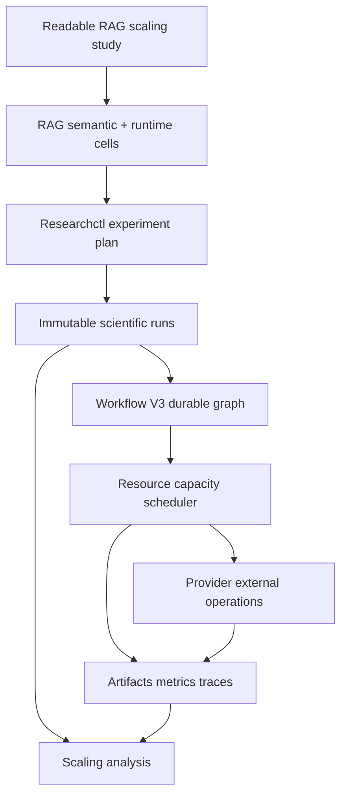
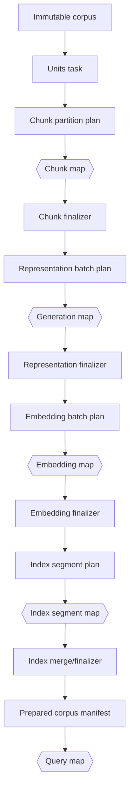

# TTC RAG parallelization study architecture and implementation guide

> [!IMPORTANT]
> **On hold as of 2026-07-24.** Do not implement this broader scaling design yet. First complete `RAG-WORKFLOW-CONCURRENCY-HARD-CUT`, which removes operator-local worker pools and makes Workflow V3 the normal generation and embedding scheduler. After that hard cut, review this document and retain only measurement machinery still required by the simpler runtime.

## Executive summary

This ticket defines the first performance-scaling study after the Researchctl, Workflow V3, and RAG execution convergence. Its purpose is to measure how quickly a realistic but bounded TTC dataset can be prepared, represented, embedded, indexed, and queried as concurrency and batch sizes change. The study must identify where additional parallelism improves throughput, where it stops helping, where it increases failures or cost, and which settings are safe product defaults before the full TTC corpus is processed.

This is not yet the full retrieval-quality benchmark. The main dependent variables are stage elapsed time, throughput, speedup, parallel efficiency, provider request/token/cost usage, queueing, active work, retry/failure rates, artifact sizes, and output equivalence. Retrieval quality remains a guard: every concurrency cell must produce semantically equivalent prepared records, index contents, ranked results, and metrics for identical inputs. A faster cell is rejected if it changes treatment semantics, loses records, duplicates provider work, exceeds budgets, leaks source text, or cannot resume safely.

The current system already contains two forms of parallelism:

1. representation operators use an in-process worker pool controlled by `GenerationConcurrency`;
2. Workflow V3 maps query items and fills compatible resource slots using explicit capacities.

The current lowering also has an important limitation: static preparation operators are emitted as one sequential chain of coarse Workflow nodes. Chunking, representation generation, embedding, and index construction each run as a single task. Combined representation generation may issue several provider calls concurrently inside that task, but the durable Workflow graph does not expose one leased attempt and one bounded external-operation group per preparation batch. Embedding batches are planned by domain code but are not yet lowered into independent Workflow map items. Index construction is one monolithic task. Therefore the study requires a focused preparation-lowering extension before it can honestly measure durable stage parallelization.

The implementation should use deterministic plan/map/finalize boundaries:

```text
corpus snapshot
  -> units
  -> chunk partitions
  -> representation batch map
  -> representation finalizer
  -> embedding batch map
  -> embedding finalizer
  -> index shard/segment map
  -> deterministic index finalizer
  -> immutable prepared-corpus manifest
  -> query map
  -> result reduction
```

The initial dataset should be large enough to create at least 32–128 provider batches and hundreds of query items, but small enough that a complete serial baseline and several repeats fit within the approved time and budget envelope. Final size must be selected from a cost-free sizing pass, not guessed from document count alone.

## 1. Goal and intended reader

This guide is for an engineer who has not worked on the previous cross-repository refactor. It explains:

- what “parallelization” means at each layer;
- which repository owns each control;
- why batch size, worker capacity, and Researchctl concurrency are different variables;
- how current RAG semantics become Workflow V3 work;
- what is parallel today and what remains coarse-grained;
- how to create a medium immutable TTC scaling corpus;
- how to implement durable preparation maps without changing semantic output;
- how to design and analyze a scaling experiment;
- how to avoid provider-rate, SQLite, memory, CPU, disk, cache, and scheduling confounders;
- how to turn the result into product capacity defaults.

The reader should understand Go, JavaScript, JSON, basic RAG stages, concurrency, and elementary statistics. No prior knowledge of Researchctl or Workflow V3 is assumed.

## 2. Research questions

The study answers the following questions.

### 2.1 Preparation

1. How does chunk preparation elapsed time scale with CPU preparation capacity?
2. Which preparation stages remain serial and dominate wall time after provider stages are parallelized?
3. How much overhead comes from deterministic partitioning, artifact publication, leasing, and finalization?

### 2.2 Representation generation

1. How do generation worker counts `1, 2, 4, 8` affect elapsed time and throughput?
2. How do provider batch sizes affect requests, prompt tokens, output tokens, failure rates, and cost?
3. At what point does provider throttling, latency variance, local validation, or output size eliminate speedup?
4. Are in-process workers and durable Workflow batch-map capacity behaviorally equivalent?

### 2.3 Embedding

1. How do embedding batch sizes and concurrent embedding requests interact?
2. At what batch size does per-request overhead stop dominating?
3. At what concurrency does provider throttling, response size, vector validation, memory, or SQLite/artifact publication become limiting?
4. Do all cells produce identical embedding identities, dimensions, ordering, and vector digests for a deterministic provider?

### 2.4 Indexing

1. How does lexical/vector index construction scale with index worker/shard count?
2. Is index construction CPU-, memory-, or disk-bound on the target host?
3. Can independent deterministic segments be built concurrently and merged without changing retrieval results?
4. What is the cost of reopen, compaction, and final manifest publication?

### 2.5 Querying

1. How does query throughput scale with `cpu.rag.query` capacity?
2. How do query count and materialization-ahead bounds affect utilization and memory?
3. At what capacity do shared index reads, query embeddings, reranking, SQLite, CPU, or provider limits saturate?
4. What concurrency is safe for the online product, not merely fastest in an isolated run?

### 2.6 End-to-end

1. Which stage dominates serial execution?
2. What is the maximum useful stage capacity before efficiency drops below an accepted threshold?
3. Does increasing one capacity shift the bottleneck to another stage?
4. What combination minimizes total elapsed time while preserving cost, failure, memory, and quality constraints?

## 3. Non-goals

This study does not:

- process the complete TTC corpus;
- select the best retrieval algorithm or answer prompt;
- treat host oversubscription as product throughput;
- use Researchctl concurrent runs as a substitute for stage concurrency;
- modify provider results to make cells comparable;
- hide retries or exclude failed runs from analysis;
- benchmark fixture-provider speed as real-provider speed;
- publish a universal hardware benchmark;
- change corpus content, chunk semantics, representation prompts, model authority, or relevance judgments between concurrency cells;
- restore deleted legacy engines or script-owned scheduling.

## 4. Ownership map

| Layer | Repository | Owns |
| --- | --- | --- |
| Scientific matrix | Researchctl | cases, factors, replicates, ordering, run identity, resume, cross-run analysis |
| Domain semantics | RAG-eval | chunking, representations, embedding contracts, indexes, retrieval, measurements, lowering |
| Durable execution | Scraper Workflow V3 | maps, leases, resource capacity, retries, effects, artifacts, budgets, cancellation, telemetry |
| Provider implementation | Geppetto behind RAG adapters | actual generation, embedding, and reranking requests |



The dependency direction is one-way. Researchctl does not schedule Workflow nodes. RAG does not create scientific runs. Workflow V3 does not know that a vector belongs to an embedding model. Geppetto does not decide retries, budgets, or experiment factors.

## 5. Five distinct concurrency controls

Concurrency is not one integer. The study must distinguish five independent control planes.

### 5.1 Researchctl run concurrency

```javascript
.execution({ maxConcurrent: 1, failFast: false })
```

This controls how many complete scientific runs execute simultaneously. For host scaling measurements, keep it at `1`. Running two cells simultaneously would make CPU, memory, disk, SQLite, and provider contention uncontrolled. Researchctl parallelism is useful for throughput campaigns after per-cell performance is understood, not for estimating isolated stage speedup.

### 5.2 Workflow resource capacity

```go
Capacities: map[string]int{
    "cpu.rag.prepare": prepareCapacity,
    "provider.rag.generate": generationCapacity,
    "provider.rag.embed": embeddingCapacity,
    "cpu.rag.index": indexCapacity,
    "cpu.rag.query": queryCapacity,
    "cpu.rag.reduce": reduceCapacity,
}
```

Workflow capacity is a durable scheduler constraint. A task can start only if its exact resource class has an available slot. Capacity affects leases, queue depth, active attempts, and cancellation. It must be recorded in run provenance but must not alter semantic artifact identity unless execution order is semantically meaningful.

### 5.3 Provider batch size

Examples from `experiments/real-provider-v2/base.js`:

```javascript
batchSize: 1,   // combined summary/question generation
batchSize: 16,  // embeddings
```

Batch size changes request boundaries, provider token packing, response size, validation scope, cache identity, retry blast radius, and sometimes cost. It is a semantic preparation factor and belongs in the canonical pipeline/operator configuration.

### 5.4 In-task worker count

`ragengine.Options.GenerationConcurrency` and `ragoperators.Environment.GenerationConcurrency` currently control worker pools inside representation operators. This is runtime policy, but today it is host-injected through provider services rather than represented as a closed study factor.

In-process workers are less observable than Workflow map items:

- one task lease covers several concurrent calls;
- a task retry may repeat multiple batches;
- cancellation and partial completion are task-scoped;
- resource capacity cannot distinguish generation from other preparation work;
- map-item queue and attempt telemetry is unavailable.

The target architecture moves provider batches to durable map items. The legacy in-task concurrency path should remain only as an implementation detail for direct-engine execution or be hard-cut after parity.

### 5.5 Internal library concurrency

Bleve, vector math, Go runtime scheduling, filesystem buffering, SQLite WAL, provider clients, and compression may have internal parallelism. If not explicitly controlled, record host and runtime configuration and treat it as fixed environment. Do not claim linear worker scaling when an uncontrolled internal pool changed.

## 6. Current execution path

The current readable real-provider source is:

- `experiments/real-provider-v2/base.js`;
- `experiments/real-provider-v2/study.js`;
- `experiments/real-provider-v2/study-full.js`;
- `experiments/real-provider-v2/product.js`.

The pipeline is:

```text
corpus
 -> identity units
 -> recursive chunks
 -> raw + combined summary/question representations
 -> embeddings
 -> Bleve lexical/vector index
 -> lexical/vector channels
 -> collapse + weighted RRF + collapse
 -> hydration
 -> optional reranking
 -> optional answer
```

Current values include:

- chunk size: 1200 runes;
- generation batch size: 1 chunk;
- questions per chunk: 4;
- generation maximum batch runes: 1200;
- embedding dimensions: 768;
- embedding batch size: 16;
- retrieval top K: 20;
- result count: 5.

## 7. Current lowering and its limitation

`pkg/ragworkflow/lower.go` classifies pipeline nodes as static or query-dependent. Static nodes are emitted as a sequential Workflow node chain:

```go
previous := "prepare-start"
for each static pipeline node:
    node.dependsOn(previous)
    previous = node
```

The chain is approximately:


This ordering is semantically correct: embeddings require representations and indexes require embeddings. The problem is granularity. Each stage is a single task, even when it contains many independent batches.

Existing durable query parallelism is stronger. `evaluate-queries` is a Workflow V3 map with:

```go
MapPolicy{
    PageSize: 8,
    MaxItems: 10_000,
    MaxMaterializedAhead: 8,
}
```

Query map items use `cpu.rag.query`; reductions use `cpu.rag.reduce`.

### Critical design conclusion

A study that only varies `cpu.rag.prepare` capacity against the current graph will not measure preparation parallelism. There is at most one ready preparation node at a time. Capacity values above one cannot accelerate that chain. The implementation must expose independent batch items before measuring preparation capacity.

## 8. Existing operator-level parallelism

### 8.1 Representation generation

`pkg/ragoperators/represent.go` and `combined_prepare.go` use worker pools:

```text
workers = GenerationConcurrency
if workers < 1: workers = default
workers = min(workers, miss/batch count)
start workers
feed deterministic item indexes
cancel on first failure
assemble output in deterministic order
```

This provides real concurrent provider calls, but the calls remain inside one Workflow attempt.

### 8.2 Embedding batching

`pkg/ragoperators/embedding_batch.go` already separates:

- deterministic batch planning;
- one-batch execution;
- response validation.

It sorts by immutable representation ID and partitions by `batchSize`. This is close to the required durable map contract. The missing step is Workflow lowering that emits each `EmbeddingBatch` as a map item and deterministically merges results.

### 8.3 Combined preparation batching

`pkg/ragoperators/combined_batch.go` similarly defines:

- `PlanCombinedPreparation`;
- `CombinedPreparationBatch`;
- `ExecuteCombinedPreparationBatch`.

These APIs were designed for durable execution and should be used rather than reimplementing request partitioning in JavaScript or Workflow code.

### 8.4 Query map

Workflow V3 already materializes query items, leases them under `cpu.rag.query`, and bounds materialization. This is the most mature stage for the first scaling measurements.

## 9. Target durable preparation graph

The target graph separates deterministic planning, concurrent work, and deterministic finalization.



### 9.1 Plan tasks

A plan task:

- validates semantic configuration;
- sorts input identities deterministically;
- computes batch membership;
- emits a bounded item manifest;
- performs no provider call;
- records total item count and estimated request envelope.

### 9.2 Map item tasks

A map item task:

- receives one closed batch descriptor;
- verifies descriptor digest and parent manifest;
- admits provider budget before a real call;
- executes exactly one batch request or index segment build;
- validates output completely;
- publishes one immutable bounded artifact;
- records timing, usage, and external operation evidence;
- throws a typed retryable/non-retryable failure.

### 9.3 Finalizers

A finalizer:

- reads item manifests, not unbounded in-memory maps;
- verifies all expected batch indexes exactly once;
- orders records by canonical identity;
- rejects missing, duplicate, or foreign records;
- publishes a canonical stage manifest;
- records aggregate counts and bytes;
- does not call a provider.

## 10. Proposed resource classes

Use separate exact resource classes so capacities correspond to actual bottlenecks:

| Resource class | Work |
| --- | --- |
| `cpu.rag.prepare` | corpus loading, unit/chunk planning, finalizers |
| `provider.rag.generate` | summary/question generation batch requests |
| `provider.rag.embed` | embedding batch requests |
| `cpu.rag.index` | local lexical/vector segment construction |
| `cpu.rag.query` | local retrieval/hydration and provider-free query work |
| `provider.rag.rerank` | reranking requests, if included |
| `cpu.rag.reduce` | result reductions and publication |

Do not place provider calls in a generic CPU class. Provider capacity has different rate, budget, failure, and privacy constraints.

## 11. Runtime-capacity contract

Capacity is execution policy. It should not be hidden in environment variables or embedded into semantic operator config.

Proposed closed runtime descriptor:

```json
{
  "schemaVersion": "rag-workflow-capacity-profile/v1",
  "profileId": "ttc-medium-scaling-g4-e4-i2-q8",
  "capacities": {
    "cpu.rag.prepare": 1,
    "provider.rag.generate": 4,
    "provider.rag.embed": 4,
    "cpu.rag.index": 2,
    "cpu.rag.query": 8,
    "cpu.rag.reduce": 1
  },
  "materialization": {
    "generationAhead": 8,
    "embeddingAhead": 8,
    "indexAhead": 4,
    "queryAhead": 16
  }
}
```

Validation rules:

- exact schema/version;
- exact known resource keys;
- integer values greater than zero;
- bounded maxima per profile;
- no unknown maps;
- no provider credentials;
- profile digest persisted in attempt environment and run evidence;
- capacities do not enter semantic prepared-corpus digest;
- batch size remains semantic and does enter preparation identity.

## 12. Dataset sizing

“Reasonably small” must be defined by work units, not only document count.

### 12.1 Sizing pass

Run a provider-free sizing command over candidate TTC records:

```text
for each candidate document:
    normalize and validate
    calculate rune count
    calculate unit count
    run deterministic chunk planner
    count chunks
    estimate raw representations
    estimate summary representations
    estimate synthetic questions
    estimate embedding records
    estimate generation batches
    estimate embedding batches
    estimate index bytes
```

No provider call occurs.

### 12.2 Selection targets

The selected medium corpus should satisfy approximately:

- 50–200 documents, depending on TTC record size;
- 500–2,000 chunks;
- 2,000–10,000 representations after generated questions;
- at least 32 generation batches;
- at least 32 embedding batches for the smallest tested batch size;
- enough index content to make build time measurable above setup noise;
- 100–500 evaluation queries for query throughput;
- complete execution at concurrency 1 within the approved budget/time window.

These are target ranges, not fixed facts. The sizing report chooses the exact frozen subset.

### 12.3 Deterministic sampling

Prefer stratified deterministic selection across TTC content types and size buckets:

```text
group records by content type
within each group sort by immutable record ID
bucket by normalized rune count
select fixed count from each bucket using declared seed
publish selected IDs and exclusion counts
```

Never sample after provider output exists. Corpus membership must be identical in every cell.

## 13. Experimental factors

Do not begin with a full Cartesian product. Use staged one-factor and interaction studies.

### 13.1 Fixed semantic baseline

Keep fixed:

- corpus and query manifests;
- unit/chunk operator and chunk size;
- representation kinds, prompt, output schema, and questions per chunk;
- model/provider authority;
- lexical/vector index semantics;
- retrieval channels, collapse, fusion, hydration, top K, and results;
- host, filesystem, Go version, binary commit, and Workflow catalog;
- Researchctl `maxConcurrent: 1`;
- cache policy within each declared cold/warm stratum.

### 13.2 Generation factors

- generation capacity: `1, 2, 4, 8`;
- generation batch size: candidate values such as `1, 2, 4` chunks, constrained by `maxBatchRunes` and provider limits;
- cache state: `cold` for primary scaling; `warm` as a separate reuse study.

### 13.3 Embedding factors

- embedding capacity: `1, 2, 4, 8`;
- embedding batch size: `8, 16, 32, 64` after provider limit qualification.

### 13.4 Index factors

- segment build capacity: `1, 2, 4`;
- deterministic segment count or target items per segment;
- lexical-only, vector-only, and combined may be diagnostic cases, not product candidates.

### 13.5 Query factors

- query capacity: `1, 2, 4, 8, 16`;
- query materialized-ahead bound: fixed initially, then `capacity` versus `2 × capacity` if starvation appears;
- local retrieval only for the first query scaling study;
- reranking in a separate provider-capacity study.

### 13.6 Corpus size factor

Use at least three immutable nested sizes after implementation qualification:

- small: enough to verify behavior and overhead;
- medium: primary scaling insight dataset;
- large-medium: confirms saturation trends without full corpus.

Nested subsets allow stage complexity trends while preserving shared records.

## 14. Phased matrix

### Phase A: fixture correctness and scheduler overhead

- deterministic fixture provider;
- capacities `1, 2, 4, 8`;
- no provider cost;
- byte/digest equivalence required;
- deliberately injected delays make concurrency measurable;
- retry, cancellation, resume, stale completion, and bounded materialization tests.

### Phase B: real representation generation

Hold embedding/index/query fixed. Vary generation capacity and batch size. Start with one replicate to estimate cost, then use three runs for selected cells if provider variability is substantial.

### Phase C: real embeddings

Reuse frozen generated representations. Vary embedding capacity and batch size. Do not regenerate summaries/questions.

### Phase D: local indexing

Reuse frozen embeddings. Vary segment count/capacity. Provider calls must be zero.

### Phase E: local query throughput

Reuse one frozen prepared corpus. Vary query capacity. Provider calls must be zero unless a separate query-embedding provider is explicitly included. Retrieval output must match the serial baseline.

### Phase F: integrated candidate profile

Run selected stage capacities together and compare against all-ones serial baseline. This phase identifies cross-stage resource contention and total elapsed time.

## 15. Why staged studies are necessary

A full Cartesian product such as:

```text
4 generation capacities
× 3 generation batches
× 4 embedding capacities
× 4 embedding batches
× 3 index capacities
× 5 query capacities
= 2,880 cells before corpus sizes and replicates
```

is expensive, difficult to interpret, and mostly measures interactions that cannot occur simultaneously because stages are dependent. Stage-separated studies reduce provider calls and isolate bottlenecks. Integrated confirmation uses only selected candidate profiles.

## 16. Replicates and ordering

### 16.1 Sampling unit

One Researchctl run is one sample. Workflow retries and provider retries remain operational evidence within that run.

### 16.2 Replicate strategy

- fixture correctness: one run per cell plus repeated deterministic stress tests;
- local CPU/disk timing: at least three runs after one warm-up, preferably five if variance is high;
- real provider stages: one qualification run, then three runs for selected capacity cells if cost permits;
- serial baseline should appear at the beginning and end of each block to detect host/provider drift.

### 16.3 Ordering

Use blocked or randomized ordering with an explicit seed. For host timing, a blocked design can alternate capacities within replicate blocks:

```text
replicate 1: capacities in randomized seeded order
replicate 2: capacities in independently derived seeded order
replicate 3: capacities in independently derived seeded order
```

Record host temperature/load observations. Do not execute different cells concurrently.

## 17. Measurements

### 17.1 Stage elapsed time

For each stage, record:

- first ready timestamp;
- first task start;
- last task finish;
- finalizer finish;
- wall elapsed;
- active execution time sum;
- queue wait sum and maximum;
- retry backoff time;
- provider elapsed sum;
- finalization elapsed.

### 17.2 Throughput

```text
chunks_per_second = completed_chunks / stage_wall_seconds
representations_per_second = completed_representations / stage_wall_seconds
vectors_per_second = completed_vectors / embedding_stage_wall_seconds
index_records_per_second = indexed_records / index_stage_wall_seconds
queries_per_second = completed_queries / query_stage_wall_seconds
```

### 17.3 Speedup and efficiency

For capacity `c`:

```text
speedup(c) = median_elapsed(1) / median_elapsed(c)
efficiency(c) = speedup(c) / c
```

Use confidence intervals or bootstrap intervals over run-level values when sample size permits. Do not compute confidence over individual batches as if they were independent runs.

### 17.4 Cost and operations

Record:

- planned requests;
- admitted operations;
- successful operations;
- failed operations;
- incomplete operations;
- input/output/embedding tokens;
- provider cost;
- cache hits/misses;
- retries by failure code;
- request concurrency high-water mark.

### 17.5 Host resources

Record bounded host observations:

- logical CPU count and architecture;
- memory limit;
- Go version and `GOMAXPROCS`;
- filesystem type and available space;
- process CPU time;
- maximum RSS if available;
- bytes read/written if available;
- SQLite busy/lock failures;
- artifact bytes and file counts.

Do not store arbitrary `/proc` dumps or environment variables in scientific evidence.

### 17.6 Correctness equivalence

Every cell compares with capacity 1:

- corpus/unit/chunk manifests identical;
- representation IDs/text digests identical for deterministic providers;
- embedding record IDs/vector digests identical for deterministic providers;
- index manifest and document membership identical;
- query result identities and ranks identical when deterministic;
- retrieval metrics identical;
- planned/admitted request count consistent with batch semantics;
- no missing/duplicate batch indexes.

For nondeterministic providers, freeze the generated artifacts before downstream scaling. Do not demand byte equality from independent generation calls.

## 18. Required telemetry additions

Current Workflow attempts already record node, attempt number, resource class, start, finish, and failure. External operations record admission/completion and usage. Add only missing domain measurements; do not create a parallel telemetry store.

Proposed canonical metrics:

```text
rag.stage.elapsed_milliseconds
rag.stage.queue_wait_milliseconds
rag.stage.active_attempt_milliseconds
rag.stage.items_planned
rag.stage.items_completed
rag.stage.items_per_second
rag.stage.bytes_input
rag.stage.bytes_output
rag.stage.max_active
rag.stage.retry_count
rag.stage.cache_hits
rag.stage.cache_misses
rag.index.segment_count
rag.index.merge_milliseconds
rag.query.completed
workflow.sqlite.busy_failures
```

Each metric requires:

- exact name/version;
- value kind;
- unit;
- scope containing stage and optionally batch/query ID;
- derivation authority;
- bounded metadata.

Prefer deriving queue/active timing from authoritative attempts and node readiness rather than emitting duplicate counters from tasks.

## 19. Analysis specification

Readable analysis pseudocode:

```javascript
research.analysis("ttc-rag-parallel-v1", a => a
  .source({ projectId, experimentId })
  .sampleUnit("run")
  .groupBy([
    "stage",
    "corpusSize",
    "capacity",
    "batchSize",
    "cacheState",
  ])
  .reducers([
    meanCI("stageElapsed", "rag.stage.elapsed_milliseconds", "milliseconds"),
    meanCI("throughput", "rag.stage.items_per_second", "items/second"),
    sum("providerRequests", "provider.requests", "count"),
    sum("providerCost", "provider.cost", "microunits"),
    countFailed("failedRuns"),
    countMissing("missingElapsed", "rag.stage.elapsed_milliseconds"),
  ])
  .compare({ baseline: { capacity: 1 }, measures: ["speedup", "efficiency"] })
  .publish({ table: true, csv: true, report: true, charts: true })
);
```

Exact metric APIs and names must be verified against Researchctl v0.0.3 before implementation.

### 19.1 Recommended charts

- elapsed time versus capacity, log or linear as appropriate;
- throughput versus capacity;
- speedup versus ideal linear speedup;
- efficiency versus capacity;
- provider requests/cost versus batch size;
- failure/retry rate versus capacity;
- p50/p95 batch/provider latency versus active concurrency;
- maximum RSS and artifact bytes versus capacity/batch size;
- stage share of total elapsed for candidate profiles.

## 20. Product selection rule

Do not select the numerically fastest cell automatically. A candidate product default must satisfy:

1. all correctness invariants;
2. no privacy or custody violation;
3. no unexplained missing metrics;
4. provider request/cost within approved envelope;
5. failure/retry rate below threshold;
6. memory/disk high-water marks below operational reserve;
7. parallel efficiency above a declared threshold, or a justified latency benefit;
8. stable behavior across replicates;
9. safe behavior under cancellation and resume;
10. capacity below known provider rate limits.

A reasonable selection heuristic is the smallest capacity within 5–10% of the best median elapsed time. This retains headroom and reduces contention.

## 21. Implementation plan

### Step 1: freeze sizing inputs

Create:

```text
experiments/ttc-parallel/
├── README.md
├── sizing.js or sizing command inputs
├── pipeline.js
├── study.js
├── analysis.js
├── inputs/
│   ├── corpus-small.public.json
│   ├── corpus-medium.public.json
│   ├── corpus-large-medium.public.json
│   ├── queries.public.json
│   └── selection-manifest.json
├── profiles/
│   ├── serial.json
│   ├── generate-*.json
│   ├── embed-*.json
│   ├── index-*.json
│   └── query-*.json
├── scripts/
└── generated/
```

Human source and generated custody follow the separation defined by `TTC-RAG-REAL-STUDY`.

### Step 2: add a closed capacity profile

Primary files:

- `pkg/ragcontract/` for the data-only descriptor if it is domain-visible;
- `pkg/ragworkflow/types.go` for Workflow runner input;
- `pkg/ragworkflow/runtime.go` for binding capacities;
- runner CLI/config source for host binding;
- tests for strict fields, positive bounds, identity behavior, and redaction.

Capacity must be recorded, but changing capacity alone must not change generated semantic outputs.

### Step 3: lower representation batches as a Workflow map

Use `PlanCombinedPreparation` and `ExecuteCombinedPreparationBatch`.

Pseudocode:

```text
represent-plan task:
    chunks = read validated chunk manifest
    plan = PlanCombinedPreparation(chunks, operator)
    assert len(plan.batches) <= maximum
    publish map item descriptor for each batch

represent-map item:
    verify batch descriptor
    begin provider.generate operation
    result = ExecuteCombinedPreparationBatch(...)
    finish operation
    publish batch representation artifact

represent-finalize:
    verify indexes [0..N)
    merge representations
    sort by canonical representation ID
    reject duplicates/missing parents
    publish representation manifest
```

### Step 4: lower embedding batches as a Workflow map

Use `PlanEmbeddingBatches` and `ExecuteEmbeddingBatch`.

Resource class: `provider.rag.embed`.

Each batch must create exactly one provider operation on a cache miss. The finalizer validates dimensions, identity, model digest, and vector digest before publication.

### Step 5: implement deterministic index segments

Investigate Bleve APIs before coding. The accepted design must establish whether separate indexes can be built and queried as a deterministic alias/collection, or whether segments can be merged deterministically.

Options:

1. **Independent shard indexes plus federated query:** build shards concurrently, query all shards, merge with deterministic score/rank rules.
2. **Parallel document preprocessing plus single index writer:** parallelize analysis/vector preparation while serializing Bleve mutation.
3. **Bleve-supported batch/segment mechanism:** use only if lifecycle, close, reopen, merge, and determinism are proven.

Do not claim index parallelism by concurrently writing one index unless Bleve explicitly supports the access pattern.

Decision record required after a focused experiment.

### Step 6: expose query capacity

The query map already exists. Bind `cpu.rag.query` capacity from the closed profile and increase `MaxMaterializedAhead` only through a bounded policy. Keep result reduction capacity fixed initially.

### Step 7: add measurements

Prefer projector-derived metrics from:

- Workflow plan/map metadata;
- attempts;
- external operations;
- artifact manifests;
- RAG result records.

Add task-emitted measures only when no authoritative durable record exists.

### Step 8: fixture acceptance

Before real calls:

- inject deterministic per-batch delays;
- prove max active never exceeds capacity;
- prove expected speedup shape;
- prove outputs identical;
- inject one retry and one cancellation;
- resume without duplicate successful work;
- verify bounded materialization and artifacts;
- run race tests and SQLite contention tests.

### Step 9: execute staged real study

Run generation, embedding, indexing, query, and integrated phases independently. Publish an evidence review after each phase before admitting the next provider budget.

## 22. API references

### RAG authoring

```javascript
rag.pipeline(name, callback)
rag.study(name, callback)
rag.chunks.recursive(config)
rag.representations.combinedSummaryQuestions(config)
rag.embeddings.model(name, config)
rag.indexes.bleveMulti(config)
rag.retrieve.bm25(name, config)
rag.retrieve.vector(name, config)
```

Authoritative declaration:

- `pkg/gojamodules/rag/typescript.go`.

### Batch APIs

```go
ragoperators.PlanCombinedPreparation(chunks, node)
ragoperators.ExecuteCombinedPreparationBatch(ctx, plan, batch, env)
ragoperators.PlanEmbeddingBatches(representations, node)
ragoperators.ExecuteEmbeddingBatch(ctx, plan, batch, env)
```

### Workflow APIs

```go
workflowv3.IRMap
workflowv3.MapPolicy
workflowv3.IRReduce
workflowv3.ReducePolicy
workflowv3runtime.Dispatcher{Capacities: ...}
workflowv3sqlite.Store.LeaseNextWithResources(...)
```

### Researchctl APIs

```javascript
research.experimentPlan(id, plan => plan
  .experiment(experimentId)
  .case(id, c => c.specification(spec).factors(values).replicates(n))
  .ordering({ strategy: "randomized", seed: 42 })
  .execution({ maxConcurrent: 1, failFast: false })
)
```

## 23. File reference map

### RAG-eval

- `experiments/real-provider-v2/base.js` — current real pipeline and batch sizes.
- `experiments/ttc-scripted/` — accepted fixture study pattern.
- `pkg/ragworkflow/lower.go` — current static chain and query map lowering.
- `pkg/ragworkflow/package.go` — task identities and resource classes.
- `pkg/ragworkflow/runtime.go` — RAG task execution.
- `pkg/ragworkflow/provider_package.go` — provider services and operation decoration.
- `pkg/ragoperators/represent.go` — current representation worker pool.
- `pkg/ragoperators/combined_prepare.go` — current combined in-task worker pool.
- `pkg/ragoperators/combined_batch.go` — deterministic combined batch plan/execute API.
- `pkg/ragoperators/embedding_batch.go` — deterministic embedding batch plan/execute API.
- `pkg/ragoperators/index.go` — Bleve index construction/query behavior.
- `pkg/ragengine/prepared.go` — preparation runtime.
- `pkg/ragengine/prepared_store.go` — prepared-corpus custody/reuse.
- `pkg/ragworkflow/projector.go` — domain metric projection.

### Scraper Workflow V3

- `/home/manuel/workspaces/2026-06-30/benchmark-cpu-inference/scraper/pkg/workflowv3/types.go`
- `/home/manuel/workspaces/2026-06-30/benchmark-cpu-inference/scraper/pkg/workflowv3/compiler.go`
- `/home/manuel/workspaces/2026-06-30/benchmark-cpu-inference/scraper/pkg/workflowv3runtime/dispatcher.go`
- `/home/manuel/workspaces/2026-06-30/benchmark-cpu-inference/scraper/pkg/workflowv3runtime/map_integration_test.go`
- `/home/manuel/workspaces/2026-06-30/benchmark-cpu-inference/scraper/pkg/workflowv3sqlite/expansion.go`
- `/home/manuel/workspaces/2026-06-30/benchmark-cpu-inference/scraper/pkg/workflowv3sqlite/reduction.go`
- `/home/manuel/workspaces/2026-06-30/benchmark-cpu-inference/scraper/pkg/workflowv3sqlite/store.go`

### Researchctl

- `/home/manuel/workspaces/2026-06-30/benchmark-cpu-inference/researchctl/pkg/experimentplan/plan.go`
- `/home/manuel/workspaces/2026-06-30/benchmark-cpu-inference/researchctl/pkg/experimentservice/service.go`
- `/home/manuel/workspaces/2026-06-30/benchmark-cpu-inference/researchctl/pkg/experimentanalysis/reduce.go`
- `/home/manuel/workspaces/2026-06-30/benchmark-cpu-inference/researchctl/cmd/researchctl/doc/experiment-plans.md`

## 24. Decision records

### Decision: Keep Researchctl concurrency at one

- **Context:** The measured factors are stage capacities.
- **Options:** Execute cells concurrently for campaign speed; execute one run at a time.
- **Decision:** Use `maxConcurrent: 1` for scaling measurements.
- **Rationale:** Concurrent runs contend for the same host and provider limits, confounding stage speedup.
- **Consequence:** Campaign duration is longer but cell comparisons are interpretable.
- **Status:** proposed.

### Decision: Batch size is semantic; capacity is runtime policy

- **Context:** Both values affect performance but only batch size changes provider request boundaries and retry units.
- **Decision:** Batch size enters pipeline/preparation identity. Capacity enters closed run provenance but not semantic output identity.
- **Consequence:** Capacity cells may reuse identical frozen inputs but must execute separately for timing. Batch-size cells produce different preparation identities.
- **Status:** proposed.

### Decision: Use durable maps for provider batches

- **Context:** Existing in-task pools are concurrent but coarse-grained for retries, telemetry, and capacity.
- **Options:** Benchmark the worker pool only; emit Workflow map items; create another scheduler.
- **Decision:** Lower deterministic provider batches into Workflow V3 maps.
- **Rationale:** Workflow V3 already owns leases, capacities, retries, budgets, cancellation, and operations.
- **Consequence:** Requires new tasks/finalizers and parity tests before real study execution.
- **Status:** proposed.

### Decision: Freeze upstream artifacts between stage studies

- **Context:** Repeating generation for embedding/index/query capacity cells wastes money and introduces variability.
- **Decision:** Each downstream phase consumes one verified immutable upstream manifest.
- **Consequence:** Stage timing excludes upstream work; integrated phase separately measures end-to-end behavior.
- **Status:** proposed.

### Decision: No index concurrency claim before a Bleve design proof

- **Context:** Concurrent mutation of one index may be unsafe or nondeterministic.
- **Decision:** Perform a focused segment/shard/preprocessing experiment and accept one supported design before adding index capacity factors.
- **Consequence:** Initial index baseline may remain serial while generation, embedding, and query studies proceed.
- **Status:** proposed.

## 25. Risks

| Risk | Effect | Mitigation |
| --- | --- | --- |
| Coarse static tasks | Capacity appears ineffective | Implement batch maps before measuring. |
| Provider rate limit | False saturation or failures | Qualify limits, hard budgets, record operation outcomes. |
| Batch size/concurrency confounding | Uninterpretable results | Stage one-factor studies, then selected interactions. |
| Cache contamination | Artificial speedup | Separate cold/warm strata and unique cache manifests. |
| SQLite lock contention | Runtime failures at high capacity | Stress tests, busy evidence, bounded capacities, fix store rather than hiding errors. |
| Memory pressure | Fast median but unsafe product | Record max RSS, artifact sizes, and reserve thresholds. |
| Nondeterministic generated text | Downstream cells differ | Freeze generation output before embedding/index/query studies. |
| Index score drift | Invalid equivalence | Deterministic merge/query tests against serial baseline. |
| Too-small dataset | Setup noise dominates | Require minimum batch/item counts from sizing pass. |
| Too-large dataset | Excess provider cost | Cost model and phased budget approval. |
| Host drift | Biased capacity comparison | Seeded blocked order, repeated serial baselines, host metadata. |
| Retry counted as sample | Invalid confidence | Researchctl run remains sample unit. |

## 26. Acceptance criteria

Implementation is ready for real-provider execution when:

- [ ] medium corpus/query manifests are frozen and verified;
- [ ] capacity profile contract is closed, bounded, and persisted;
- [ ] generation and embedding batches are durable Workflow map items;
- [ ] index concurrency design is accepted or explicitly deferred to serial baseline;
- [ ] query capacity is bound from the profile;
- [ ] fixture cells prove output equivalence;
- [ ] maximum active work never exceeds capacity;
- [ ] retries create distinct operations without duplicate final records;
- [ ] cancellation/resume preserves completed batch artifacts;
- [ ] metrics support elapsed, throughput, speedup, efficiency, cost, failures, and missingness;
- [ ] privacy scans find no corpus/provider bodies in control rows or operation exports;
- [ ] race, lint, security, full suites, and built-binary acceptance pass;
- [ ] worst-case provider request/token/cost envelope is reviewed.

The study is complete when:

- [ ] fixture, generation, embedding, index, query, and integrated phases are published;
- [ ] every requested run is accounted for;
- [ ] failed and missing observations remain visible;
- [ ] analysis regenerates deterministically;
- [ ] selected defaults include host/provider scope and safety headroom;
- [ ] rejected capacities and reasons are documented;
- [ ] the full-corpus study receives explicit capacity and budget recommendations.

## 27. Recommended immediate implementation slice

The first code slice should not call a provider. It should:

1. create `experiments/ttc-parallel/` readable source and generated separation;
2. implement provider-free TTC sizing and freeze candidate record/query IDs;
3. define and validate the closed capacity profile;
4. add delayed fixture generation/embedding map items;
5. prove capacities `1, 2, 4` produce expected active high-water marks and identical outputs;
6. add the minimum stage timing projection;
7. run full cross-repository tests.

Only after that slice is reviewed should real generation or embedding calls begin.

## 28. Final rule

Parallelism is accepted only when it is explicit, bounded, observable, resumable, and output-equivalent. The fastest wall-clock result is not sufficient. The selected product configuration must preserve immutable scientific custody, semantic identity, provider accounting, privacy, failure visibility, and enough operational headroom for production traffic and full-corpus preparation.
