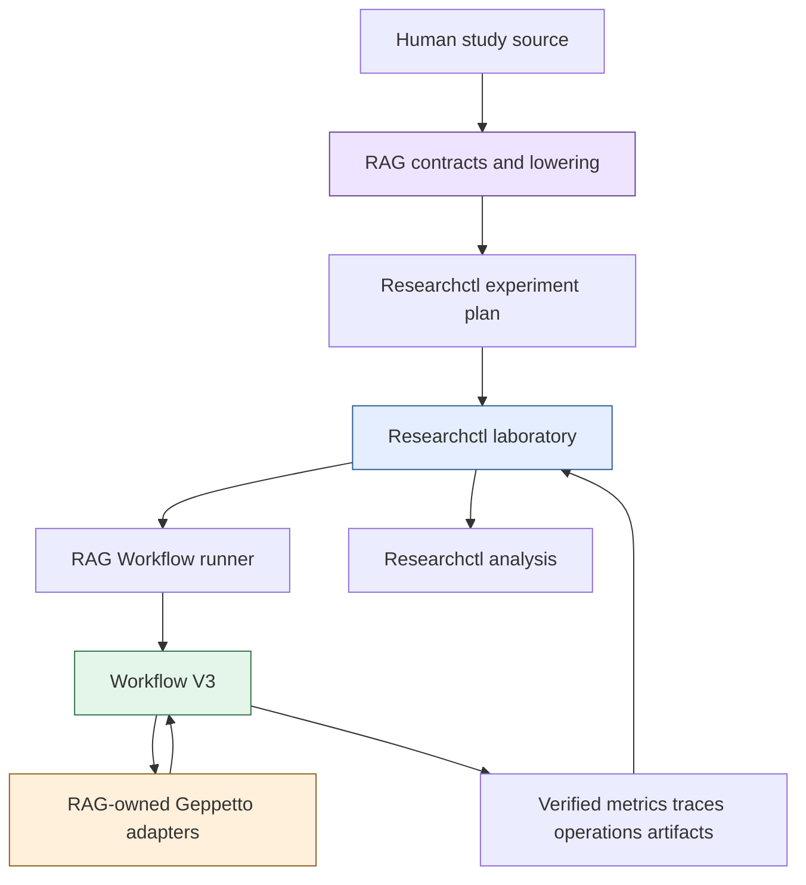
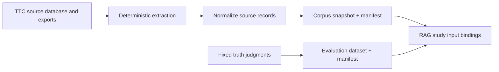
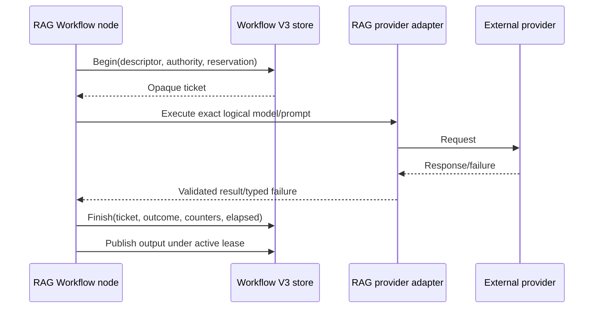

# Real-provider TTC RAG study architecture and implementation guide

## Executive summary

This ticket turns the existing RAG language, Workflow V3 runtime, Researchctl laboratory, fixed-truth TTC data, and real-provider adapters into one readable and executable scientific study. The required components already exist and have passed architecture-level acceptance. The missing deliverable is a consolidated study project whose human-authored source is easy to review, whose inputs are immutable, whose generated plans are clearly separated from authored intent, whose provider costs are bounded before execution, and whose final claims are limited by the quality of the corpus, judgments, replicates, and provider qualification.

The study will compare four retrieval configurations over one frozen TTC corpus and one frozen evaluation dataset:

1. raw BM25;
2. raw hybrid BM25 plus vector retrieval;
3. raw, summary, and synthetic-question hybrid retrieval with weighted reciprocal-rank fusion;
4. the same multi-representation retrieval followed by cross-encoder reranking.

Answer generation is a linked study rather than another retrieval factor. It consumes frozen hydrated retrieval evidence from the selected retrieval configuration, then measures citation validity, support, abstention, provider cost, token usage, and failures. This separation allows retrieval and answer behavior to change independently without rerunning unrelated preparation or silently changing the statistical population.

The implementation proceeds through four bounded phases:

- **P0 structural qualification:** a few documents and queries, one real request per provider capability, and exhaustive evidence inspection;
- **P1 fixed-truth smoke:** the four retrieval cases over a declared evaluation subset with one replicate;
- **P2 candidate study:** the complete frozen candidate dataset, justified replicates, interruption/resume proof, and immutable analysis publication;
- **P3 cited-answer study:** answer generation over frozen hydrated evidence from the accepted retrieval configuration.

No provider call may begin until the Researchctl plan-provenance and validation review findings are fixed, immutable TTC data and public provider manifests are verified, generated artifacts are separated from human sources, and P0 budgets are explicitly approved.

## 1. Purpose and intended reader

This guide is written for a new engineer joining the project. It explains the system in dependency order, from scientific inputs to generated reports. The reader is expected to know Go, JavaScript, JSON, SQLite, and basic retrieval terminology. Prior familiarity with Researchctl, Scraper Workflow V3, Goja, or the RAG DSL is not required.

After reading this document, the engineer should be able to:

- identify which repository owns each class of behavior;
- distinguish human-authored scientific source from generated execution custody;
- explain how corpus records become chunks, representations, embeddings, indexes, retrieved evidence, reranked results, and cited answers;
- identify which work is query-independent and may be reused;
- explain the difference between replicates, Researchctl retries, Workflow retries, and provider requests;
- bind immutable corpus, evaluation, model, prompt, and provider authority identities;
- implement `experiments/ttc-real/` without copying generated plans into authored JavaScript;
- execute P0 without accidental unbounded provider spend;
- inspect Workflow attempts, external operations, artifacts, RAG traces, Researchctl runs, and analysis outputs;
- state which claims are and are not supported by P0, P1, P2, and P3.

## 2. Scientific question and scope

The primary retrieval question is:

> On the frozen TTC corpus and fixed evaluation judgments, how do raw lexical retrieval, raw hybrid retrieval, multi-representation hybrid retrieval, and cross-encoder reranking differ in retrieval quality, latency, provider consumption, storage, and failure behavior?

The linked answer question is:

> Given frozen hydrated evidence from the accepted retrieval configuration, how reliably does the selected answer model produce supported answers with valid source citations, and what latency, token, cost, abstention, and failure profile does it exhibit?

The first candidate study is not intended to establish a universal benchmark. Its claims are limited to:

- the exact TTC corpus snapshot;
- the exact evaluation dataset and relevance target;
- the exact chunking configuration;
- the exact generated-representation models and prompts;
- the exact embedding and reranking models;
- the exact index implementation and configuration;
- the exact provider authorities and study period;
- the declared sampling and analysis design.

### 2.1 In scope

- immutable TTC corpus and evaluation bindings;
- readable pipeline, retrieval, study, product, project, and analysis source;
- real summary and question generation;
- real embedding and query embedding;
- Bleve lexical and vector indexing;
- BM25 and vector retrieval;
- per-channel collapse, weighted reciprocal-rank fusion, final collapse, and source hydration;
- cross-encoder reranking;
- grounded answer generation with required citations;
- Researchctl cases, replicates, ordering, resume, and run custody;
- Workflow V3 leases, retries, budgets, provider operations, cancellation, and artifact custody;
- deterministic analysis and publication;
- privacy, cost, deletion, and reproducibility guards.

### 2.2 Out of scope

- changing PR #3 in this documentation tranche;
- inventing new retrieval algorithms before the baseline matrix is measured;
- mutable source extraction during scientific runs;
- manual retry endpoints;
- hidden provider fallbacks;
- benchmark claims before adjudication and claim review;
- treating generated summaries or questions as source evidence;
- using query count as the replicate count;
- restoring any deleted RAG, Researchctl, or Scraper lifecycle.

## 3. System vocabulary

| Term | Meaning |
| --- | --- |
| Corpus snapshot | Immutable, validated source records and domain manifest used as scientific input. |
| Unit | Semantic relevance target, such as a transcript run or source record. |
| Chunk | Bounded source range produced from a unit for retrieval preparation. |
| Representation | Retrieval material derived from a chunk: raw text, summary, or synthetic question. |
| Embedding | Fixed-dimensional vector produced under an exact model, normalization, and distance contract. |
| Index | Query-independent lexical/vector data structure built from immutable representation records. |
| Query plan | Ordered semantic description of retrieval channels, collapse, fusion, hydration, and result limits. |
| Variant | Named RAG semantic configuration within a study. |
| Factor | Controlled semantic variable expanded by the RAG study compiler. |
| Cell | One concrete variant and factor assignment before Researchctl replicates. |
| Replicate | Independent scientific Researchctl run for one cell. |
| Researchctl attempt | Operational retry of one scientific run. It does not increase sample size. |
| Workflow task attempt | Retry of one node inside one Researchctl attempt. It does not increase sample size. |
| External operation | Durable admission/completion evidence for one actual provider request. |
| Hydration | Recovery of exact source evidence from ranked representation/parent lineage. |
| Prepared corpus | Immutable query-independent result containing chunks, representations, embeddings, and indexes. |
| Candidate study | Executable, evidence-backed study whose data/provider qualification is not yet sufficient for a benchmark claim. |

## 4. Repository ownership and dependency direction

Four repositories participate:

| Repository | Path | Responsibility |
| --- | --- | --- |
| RAG evaluation | `/home/manuel/workspaces/2026-07-13/rag-eval-ttc/rag-evaluation-system` | RAG language, contracts, compiler, lowering, operators, provider adapters, measurements, study source, and TTC inputs. |
| Researchctl | `/home/manuel/workspaces/2026-06-30/benchmark-cpu-inference/researchctl` | Projects, cases, factors, replicates, ordering, runs, attempts, resume, verified evidence, and cross-run analysis. |
| Scraper | `/home/manuel/workspaces/2026-06-30/benchmark-cpu-inference/scraper` | Workflow V3 nodes, leases, task retries, budgets, gates, effects, cancellation, isolation, artifacts, and observations. |
| Geppetto | `/home/manuel/workspaces/2026-07-13/rag-eval-ttc/geppetto` | Provider implementations used behind RAG-owned generation, embedding, and reranking adapters. |

The dependency direction is deliberate:



Researchctl must not import RAG packages. Workflow V3 must not understand MRR, citations, chunk semantics, or RAG factors. RAG must not allocate Researchctl run IDs or directly lease Workflow nodes. Geppetto must not persist scientific runs or Workflow attempts.

## 5. Existing human-authored source

The current readable source is distributed across several directories.

### 5.1 Real-provider candidate

`experiments/real-provider-v2/base.js` defines the core preparation and retrieval semantics:

- corpus input;
- identity units;
- recursive chunks;
- raw plus combined summary/question representations;
- real embeddings;
- lexical/vector Bleve index;
- six retrieval channels;
- per-channel collapse;
- weighted RRF;
- final collapse;
- source hydration.

`experiments/real-provider-v2/study-full.js` adds:

- exact evaluation dataset role;
- one real full variant;
- cross-encoder reranking;
- grounded answer generation;
- retrieval, latency, usage, cost, storage, and failure metrics;
- evidence invariants.

`experiments/real-provider-v2/product.js` binds the selected semantics to an online request/response contract.

### 5.2 General RAG examples

`examples/rag-v2/common.js` presents separate summary and synthetic-question representation APIs. It is useful for understanding dependency between generated representations.

`examples/rag-v2/02-five-variant-study.js` demonstrates variant and factor expansion over raw, summary, and question combinations.

### 5.3 Scripted acceptance

`experiments/ttc-scripted/` is the complete cost-free architecture acceptance. It proves compilation, Workflow execution, two cases, three replicates, resume, metric projection, and deterministic analysis. It intentionally does not prove real provider behavior.

### 5.4 External onboarding article

The Obsidian article:

`/home/manuel/code/wesen/go-go-golems/go-go-parc/Projects/2026/07/24/ARTICLE - RAG Experiment JavaScript - Language API and End-to-End Execution.md`

provides a complete language and execution walkthrough. This guide uses it as an explanatory source, but the repository files and versioned contracts remain authoritative.

## 6. The central cleanup: source versus generated custody

Generated `researchctl-plan.js` files currently embed complete canonical Workflow configurations. The hashes are necessary, but the files are machine custody, not human source. The new study must make that distinction visible in its directory structure and commands.

### 6.1 Proposed directory

```text
experiments/ttc-real/
├── README.md
├── project.js
├── pipeline.js
├── retrieval.js
├── study.js
├── answer-study.js
├── product.js
├── analysis.js
├── answer-analysis.js
├── inputs.json
├── provider-config.example.yaml
├── manifests/
│   ├── README.md
│   ├── corpus.public.json
│   ├── evaluation.public.json
│   ├── models.public.json
│   ├── prompts.public.json
│   └── schemas.public.json
├── scripts/
│   ├── 01-qualify-inputs.sh
│   ├── 02-compile-study.sh
│   ├── 03-run-p0.sh
│   ├── 04-run-p1.sh
│   ├── 05-run-p2.sh
│   ├── 06-run-p3.sh
│   └── 07-verify-custody.sh
└── generated/
    ├── README.md
    ├── manifest.json
    ├── researchctl-plan.js
    └── cases/
        └── <case-id>/
            ├── execution.json
            ├── corpus.json
            ├── queries.json
            └── domain-config.json
```

Human review order:

1. `README.md` — scientific question, status, claim limits, and commands;
2. `pipeline.js` — preparation and index semantics;
3. `retrieval.js` — retrieval/evidence semantics;
4. `study.js` — retrieval cases, factors, replicates, metrics, and invariants;
5. `answer-study.js` — linked cited-answer design;
6. `analysis.js` — sampling unit, reducers, comparisons, and charts;
7. `inputs.json` and public manifests — immutable data and provider identity;
8. `generated/manifest.json` — exact generated custody;
9. generated plans only when debugging lowering or identity.

### Decision: Generated plans are derived custody, not authored examples

- **Context:** The current generated plans contain correct but unreadable minified Workflow configurations and hashes before the small experiment matrix.
- **Options considered:** Keep embedding generated objects in authored files; pretty-print the same giant JavaScript constants; load generated JSON through a bounded manifest-backed mechanism.
- **Decision:** Keep human source separate and treat generated plans/executions as immutable derived custody. Improve the loader/reference contract when implementing the Researchctl review fixes.
- **Rationale:** Scientific review should focus on semantics, factors, inputs, and analysis. Execution review should use manifests and explain tools. Mixing them makes both harder.
- **Consequences:** Generation must be deterministic and path-confined. The plan must durably bind each run to its plan digest and artifact. Manual edits to generated files are forbidden.
- **Status:** proposed; implementation is gated on the deferred PR review work.

## 7. Input qualification

A real study starts from immutable scientific inputs. Source extraction is upstream of the study matrix.



### 7.1 Corpus snapshot requirements

The corpus manifest must bind:

- source snapshot identity;
- extractor identity/version;
- schema version;
- deterministic document/unit ordering;
- document and unit counts;
- source record digests;
- privacy classification;
- artifact digest, size, URI, and media type;
- normalization and redaction policy;
- creation provenance that does not include secrets.

The study may bind a catalog alias during compilation, but compilation must resolve it to an immutable digest. Execution must not resolve a mutable alias again.

### 7.2 Evaluation dataset requirements

The evaluation manifest must bind:

- dataset schema and semantic version;
- query IDs and exact query text custody;
- relevance target (`unit` for the initial study);
- relevance judgments and grades;
- candidate/frozen/adjudicated status;
- split identity;
- inclusion/exclusion criteria;
- adjudication provenance;
- digest, size, URI, and media type.

Failed or incomplete judgments must not be silently converted to non-relevant labels.

### 7.3 Provider public identity

Public provider manifests bind logical names such as:

- `generator-umans-flash`;
- `embedding-primary`;
- `reranker-primary`;
- `generator-primary`;
- `ttc-combined-preparation-v2`;
- `ttc-grounded-answer-v1`.

The public identity includes model/profile/prompt/schema digests and declared dimensions/capabilities. Credentials and endpoint secrets remain in host-only configuration.

### Decision: Freeze data before provider execution

- **Context:** Mutable corpus extraction during a run would allow cases or replicates to observe different source bytes.
- **Options considered:** Extract per run; extract once without a manifest; create and verify immutable corpus/evaluation manifests before study compilation.
- **Decision:** Freeze and validate corpus and evaluation artifacts before any provider call.
- **Rationale:** Cases must differ only in declared semantics. Immutable inputs are required for resume, reuse, analysis, and claim review.
- **Consequences:** Extraction has its own provenance and validation step. Changing the corpus or judgments creates a new study input identity.
- **Status:** proposed.

## 8. Preparation architecture

Preparation is query-independent:

```text
corpus
  -> units
  -> chunks
  -> raw representation
  -> generated summary and question representations
  -> embeddings
  -> lexical/vector indexes
  -> immutable prepared-corpus manifest
```

### 8.1 Units

The initial real-provider plan uses `rag.units.identity()`. If the TTC corpus already contains the desired relevance units, this is correct. If the fixed-truth target refers to a different semantic structure, unit extraction must be changed before P0 and documented as a factor or a new study version.

API:

```javascript
.units(rag.units.identity())
```

Relevant files:

- `experiments/real-provider-v2/base.js`;
- `pkg/gojamodules/rag/module.go`;
- `pkg/ragcompiler/registry.go`;
- `pkg/ragoperators/`.

### 8.2 Chunking

Initial configuration:

```javascript
.chunks(rag.chunks.recursive({
  maxRunes: 1200,
  overlapSpans: 0,
  levels: ["runes"],
}))
```

Chunk size and overlap alter downstream text, generated representations, embeddings, index records, retrieval candidates, storage, and provider cost. They must remain fixed in the initial retrieval matrix. Chunk optimization is a later study, not an incidental edit.

### 8.3 Representations

The initial prepared corpus contains:

- `raw`: exact chunk text for retrieval;
- `summary`: structured provider-generated summary;
- `question`: provider-generated synthetic queries linked to the source chunk.

Initial API:

```javascript
.representations(
  rag.representations.compose(
    rag.representations.raw("raw"),
    rag.representations.combinedSummaryQuestions({
      model: "generator-umans-flash",
      prompt: "ttc-combined-preparation-v2",
      outputSchema: "rag-combined-preparation/v2",
      batchSize: 1,
      questionsPerChunk: 4,
      maxBatchRunes: 1200,
    }),
  ),
)
```

Generated representations are retrieval material. They are never source evidence. Every output must preserve source chunk and parent unit lineage.

### 8.4 Embeddings

Initial API:

```javascript
.embedding(rag.embeddings.model("embedding-primary", {
  dimensions: 768,
  distance: "cosine",
  normalize: "l2",
  batchSize: 16,
}))
```

Validation must reject dimension mismatch, missing authority, unknown model identity, and malformed vectors. Real embedding requests create `provider.embed/v1` external operations. Fixture embeddings create no provider operation and reserve no provider budget.

### 8.5 Indexes

Initial API:

```javascript
.index("representations", rag.indexes.bleveMulti({
  lexical: true,
  vector: {
    distance: "cosine",
    optimizeFor: "recall",
  },
}))
```

The index operator produces immutable index artifacts and manifests. JavaScript never receives a mutable Bleve handle. A prepared-corpus identity must bind its representation, embedding, and index manifests.

### 8.6 Preparation reuse

Preparation should execute once per unique semantic preparation identity and immutable input set. Query variants A–D share preparation where semantics match. Reuse must be digest-verified, not inferred from directory names.

Pseudocode:

```text
preparationKey = digest(
    corpusManifestDigest,
    unitOperator,
    chunkOperator,
    representationOperators,
    embeddingAuthority,
    indexOperator,
)

if immutablePreparedManifest(preparationKey) exists:
    verify every referenced artifact digest
    attach prepared manifest
else:
    execute preparation workflow
    verify complete lineage and provider operations
    publish prepared manifest once
```

### Decision: Reuse immutable preparation across retrieval cases

- **Context:** Rebuilding identical summaries, embeddings, and indexes per retrieval case wastes provider budget and introduces uncontrolled preparation variability.
- **Options considered:** Rebuild for every case; use a mutable cache; publish immutable prepared-corpus artifacts keyed by semantic identity.
- **Decision:** Reuse byte-verified immutable preparation for cases with identical preparation semantics.
- **Rationale:** The initial question compares retrieval and reranking, not preparation randomness. Reuse controls that variable and reduces cost.
- **Consequences:** Preparation generation randomness belongs to a separate study if it needs measurement. Reuse identity and provenance must be visible in each run.
- **Status:** proposed.

## 9. Retrieval architecture

The retrieval pipeline has six possible first-stage channels:

- `raw.lexical`;
- `raw.vector`;
- `summary.lexical`;
- `summary.vector`;
- `question.lexical`;
- `question.vector`.

Each channel returns ranked representation identities, not source evidence.

### 9.1 Case A: raw BM25

Purpose: establish the simplest interpretable baseline.

```javascript
rag.retrieve.bm25("raw.lexical", {
  index: "representations",
  representation: "raw",
  topK: 20,
})
```

### 9.2 Case B: raw hybrid

Purpose: measure the effect of vector retrieval while holding representation content fixed.

Channels:

```text
raw.lexical
raw.vector
```

Fusion uses weighted RRF with equal initial weights unless a previously accepted configuration requires otherwise.

### 9.3 Case C: multi-representation hybrid

Purpose: measure generated retrieval representations before reranking.

Channels:

```text
raw.lexical, raw.vector,
summary.lexical, summary.vector,
question.lexical, question.vector
```

Initial fusion:

```javascript
rag.fusion.weightedRRF({
  rankConstant: 60,
  weights: { "raw.vector": 2 },
})
```

The non-uniform weight must be justified from prior qualification or changed to equal weights for the first clean comparison. This is an open design choice listed later.

### 9.4 Collapse before fusion

Multiple representations from one unit must not receive multiple independent votes in one channel. Collapse therefore occurs independently per channel:

```javascript
.collapseChannels(
  rag.collapse.parent({
    scope: "unit",
    representative: "scoreThenRepresentationId",
  }),
)
```

Final collapse occurs after fusion:

```javascript
.collapseFinal(
  rag.collapse.parent({
    scope: "unit",
    representative: "bestFusionContributionThenId",
  }),
)
```

Per-channel and final collapse solve different problems. Do not combine or reorder them without a new semantic version.

### 9.5 Hydration

```javascript
.hydrate(
  rag.hydration.sourceEvidence({
    selection: "bestContributionThenId",
  }),
)
```

Hydration transforms ranked representation/parent lineage into exact source chunks and ranges. Only hydrated source evidence may be cited or supplied as answer evidence.

### 9.6 Case D: cross-encoder reranking

Case D uses Case C retrieval, then reranks hydrated candidates:

```javascript
.rerank(
  rag.rerank.crossEncoder({
    model: "reranker-primary",
    candidates: 20,
    results: 5,
  }),
)
```

The reranker must preserve first-stage identity, rank, score, and lineage in the trace. It cannot introduce unrelated source records.

## 10. Initial retrieval matrix

| Case | Preparation | Channels | Fusion | Rerank | Main question |
| --- | --- | --- | --- | --- | --- |
| A `raw-bm25` | Shared | raw BM25 | trivial/single channel | none | What does lexical raw retrieval achieve? |
| B `raw-hybrid` | Shared | raw BM25 + vector | RRF | none | What does vector retrieval add without generated text? |
| C `multi-hybrid` | Shared | raw/summary/question BM25 + vector | weighted RRF | none | What do generated representations add? |
| D `multi-reranked` | Shared | same as C | weighted RRF | cross-encoder | What does reranking add after multi-representation retrieval? |

All four cases use:

- the same corpus snapshot;
- the same evaluation dataset;
- the same units and chunks;
- the same prepared representations and indexes;
- the same query set and relevance target;
- the same collapse and hydration semantics;
- the same first-stage top-K where applicable.

## 11. Answer study

Answer generation is linked to, but separate from, retrieval comparison.


Initial API:

```javascript
.generate(
  rag.generation.answer({
    model: "generator-primary",
    prompt: "ttc-grounded-answer-v1",
    citations: "required",
    citationFailurePolicy: "abstain",
    contextBudgetTokens: 6000,
  }),
)
```

P3 consumes frozen hydrated evidence so prompt/model iteration does not rerun retrieval. Its dataset must bind the selected retrieval run/result digest and evidence artifacts.

Answer measures include:

- citation identifier validity;
- citation coverage;
- support against cited evidence;
- abstention rate;
- answer presence/format validity;
- generation elapsed time;
- input/output token usage;
- provider cost;
- provider and validation failure rates.

### Decision: Answer generation is a linked study

- **Context:** Retrieval quality and answer quality have different inputs, costs, failure modes, and iteration rates.
- **Options considered:** Include answer generation in every retrieval case; answer only after selecting retrieval; create a linked answer study over frozen evidence.
- **Decision:** Use a linked P3 study over frozen hydrated evidence from the accepted retrieval configuration.
- **Rationale:** Retrieval comparisons remain interpretable and affordable. Answer prompt/model changes do not invalidate or rerun retrieval.
- **Consequences:** The answer dataset must preserve exact linkage to retrieval runs, result digests, and source evidence. End-to-end latency is measured separately when needed.
- **Status:** proposed.

## 12. Study authoring API

A consolidated retrieval study should resemble:

```javascript
const { rag, pipeline } = require("./pipeline");
const { rawBM25, rawHybrid, multiHybrid } = require("./retrieval");
const inputs = require("./inputs.json");

const study = rag.study("ttc-real-retrieval-v1", (s) =>
  s
    .pipeline(pipeline)
    .dataset(rag.datasets.artifact("evaluation-dataset", {
      split: "candidate",
      status: "candidate",
      relevanceTarget: "unit",
    }))
    .variants((v) => {
      v.add("raw-bm25", (x) =>
        x.selectRepresentations(["raw"]).query(rawBM25));
      v.add("raw-hybrid", (x) =>
        x.selectRepresentations(["raw"]).query(rawHybrid));
      v.add("multi-hybrid", (x) =>
        x.selectRepresentations(["raw", "summary", "question"])
          .query(multiHybrid));
      v.add("multi-reranked", (x) =>
        x.selectRepresentations(["raw", "summary", "question"])
          .query(multiHybrid)
          .rerank(rag.rerank.crossEncoder({
            model: "reranker-primary",
            candidates: 20,
            results: 5,
          })));
    })
    .replicates(REPLICATES_DECIDED_BY_PHASE)
    .metrics((m) => m
      .precisionAt([5])
      .recallAt([5, 10])
      .hitRateAt([5])
      .mrr()
      .ndcgAt([5, 10])
      .latency(["query"])
      .tokenUsage()
      .providerCost()
      .storageBytes()
      .failureRates())
    .invariants((i) => i
      .require("derived-is-not-source-evidence/v1")
      .require("one-vote-per-collapse-key-per-channel/v1")
      .require("source-hydrated-final-hit/v1"))
    .tag("evaluationStatus", "candidate")
    .tag("benchmarkClaim", "false"),
);

module.exports = study.compileStudy(inputs);
```

The actual phase should not be controlled by an untracked environment variable. P0/P1/P2 inputs and replicate policies must produce explicit authored or generated identities.

## 13. Researchctl experiment lifecycle

RAG study expansion creates semantic cells. Researchctl allocates replicates and owns execution order.

```text
RAG study
  -> variants × factors
  -> concrete RAG cells
  -> one Researchctl case per cell
  -> replicate indices
  -> immutable Researchctl runs
  -> operational attempts
```

The distinction is exact:

- three queries inside one run are repeated measurements, not three replicates;
- a Workflow node retry is not a replicate;
- a provider transport retry is not a replicate;
- a Researchctl attempt retry is not a replicate;
- only separately allocated Researchctl runs under distinct replicate indices increase scientific sample count.

### 13.1 PR #3 prerequisite — completed

Commit `1699779` (`fix: preserve experiment plan provenance`) addressed all three review findings:

1. every executed Researchctl attempt now durably records the plan schema, ID, digest, and canonical plan artifact in reserved `researchctlExperimentPlan` environment provenance;
2. the JavaScript case builder preserves factors already present in a compiled specification when `.factors()` is omitted;
3. raw plans and JavaScript builders reject explicit `execution.maxConcurrent: 0` with `EXPERIMENT_PLAN_CONCURRENCY`, while an omitted JavaScript field retains the default of one.

Unit, integration, race, full-suite, and lint tests passed. This prerequisite is no longer a blocker. Existing pre-fix laboratory runs are not retroactively rewritten; new study runs receive the durable provenance.

### 13.2 Ordering and concurrency

Researchctl owns:

```javascript
.ordering({ strategy: "randomized", seed: 42 })
.execution({ maxConcurrent: 2, failFast: false })
```

The initial real study should randomize case execution with a fixed seed if provider-time drift is a concern. If preparation is fully reused and query execution is deterministic/provider-free until reranking, blocked ordering may be more interpretable. The choice must be recorded before P1.

## 14. Workflow V3 execution lifecycle

One Researchctl attempt invokes one Workflow V3 run through `rag-workflow-runner`.

```text
Researchctl run
  -> Researchctl attempt
  -> runner process
  -> Workflow V3 run
  -> Workflow nodes
  -> Workflow task attempts
  -> provider external operations
```

Workflow V3 owns:

- exact task package identities;
- resource classes;
- lease acquisition and renewal;
- retries and backoff;
- budgets and gates;
- cancellation fencing;
- content-addressed output publication;
- external-operation admission/completion;
- canonical observations.

Relevant files:

- RAG `pkg/ragworkflow/`;
- RAG `pkg/ragworkflowops/`;
- RAG `cmd/rag-workflow-runner/`;
- Scraper `pkg/workflowv3/`;
- Scraper `pkg/workflowv3runtime/`;
- Scraper `pkg/workflowv3sqlite/`;
- Scraper `pkg/researchrunner/`.

## 15. Provider operations, budgets, and privacy

Every actual provider call must have a durable operation record. Admission occurs before the call. Completion records outcome, elapsed time, and bounded usage through an opaque ticket.



Durable operation evidence may include:

- operation kind and version;
- provider authority digest;
- attempt and ordinal identity;
- admitted/completed/incomplete state;
- closed outcome and failure code;
- request/token/cost counters;
- elapsed time;
- bounded domain measures.

It must exclude:

- credentials or authorization headers;
- endpoint secrets;
- provider request/response bodies;
- prompts or source text;
- embedding vectors;
- arbitrary metadata maps;
- raw provider errors;
- unrestricted host paths.

### 15.1 P0 budget envelope

Before P0, calculate a worst-case bound:

```text
chunks = qualified document chunks
summaryQuestionRequests = ceil(chunks / generationBatchSize)
embeddingRequests = ceil(representationCount / embeddingBatchSize)
queryEmbeddingRequests = queryCount × vectorEnabledCases
rerankRequests = queryCount × rerankedCases
answerRequests = queryCount × answerCases

maxCost = sum(each request ceiling × maximum request count)
```

P0 uses hard Workflow budget limits and host cumulative ceilings. Exceeding a ceiling fails before another provider call starts.

## 16. Analysis design

Researchctl analysis selects immutable runs and selected attempts into `researchctl-analysis-dataset/v1`. Failed runs remain present. Missing metrics remain missing. Units are checked.

Proposed grouping:

```javascript
groupBy: ["variant"]
```

Proposed reducers:

```javascript
reducers: [
  { name: "runs", kind: "count" },
  { name: "failedRuns", kind: "count-failed" },
  {
    name: "mrr",
    kind: "mean-ci",
    metric: "rag.mrr",
    scopePrefix: "rag.query.",
    withinRun: "mean",
    confidence: 0.95,
    requiredUnit: "ratio",
  },
  {
    name: "recall10",
    kind: "mean-ci",
    metric: "rag.recall_at_10",
    scopePrefix: "rag.query.",
    withinRun: "mean",
    confidence: 0.95,
    requiredUnit: "ratio",
  },
  {
    name: "providerCost",
    kind: "sum",
    metric: "provider.cost",
    requiredUnit: "microunits",
  },
  {
    name: "failedOperations",
    kind: "sum",
    metric: "workflow.external_operations.failed",
    requiredUnit: "count",
  },
]
```

Metric names must be verified against actual projection contracts before implementation. Do not guess names in final source.

### 16.1 Sample unit

Query metrics are aggregated within each run first:

```text
query metrics in run
  -> withinRun mean/ratio as declared
  -> one run-level value
  -> cross-run mean and confidence interval
```

Computing a confidence interval over queries would overstate sample size because queries share one prepared execution and provider configuration.

### 16.2 Missingness

Every row reports:

- runs requested;
- runs succeeded;
- runs failed;
- metric values present;
- metric values missing;
- coverage.

A configuration with better quality among successful runs but a high failure rate must not appear superior without visible failure evidence.

### 16.3 Comparisons

Comparisons use one explicit baseline, initially Case A. Difference, percent change, or speedup requires matching units and an unambiguous baseline factor assignment.

## 17. Phase P0: structural qualification

P0 proves the complete path with minimal spend. It does not estimate benchmark performance.

### 17.1 Inputs

- 2–3 representative TTC documents;
- 3–5 fixed-truth queries;
- exact corpus/evaluation manifests;
- one representation generation batch per bounded group;
- enough data to produce multiple chunks and all representation kinds.

### 17.2 Required behavior

- validate and explain authored source without provider calls;
- compile deterministic generated custody;
- verify all digests and path confinement;
- execute real summary/question generation;
- execute real embeddings and query embeddings;
- construct and reopen lexical/vector indexes;
- run all retrieval channel types;
- hydrate source evidence;
- execute one reranker request;
- execute one cited answer request;
- interrupt and resume at one safe boundary;
- inspect every operation and artifact;
- scan durable storage for canaries and secrets.

### 17.3 P0 acceptance checklist

- [ ] Human source contains no generated Workflow plans or secrets.
- [ ] Generated manifest matches every case artifact.
- [ ] Researchctl run links durably to the exact plan digest/artifact.
- [ ] Workflow run uses exact task package and authority identities.
- [ ] Provider request counts do not exceed calculated ceilings.
- [ ] Every actual provider call has one admitted operation.
- [ ] Fake/local work creates no provider operation.
- [ ] Every successful operation has bounded completion counters.
- [ ] Source text is absent from Workflow control rows and operation exports.
- [ ] Generated summaries/questions are not cited as evidence.
- [ ] Hydrated citations resolve to source chunks/ranges.
- [ ] Index reopen produces identical query behavior.
- [ ] Cancellation and resume leave coherent attempts and no stale publication.
- [ ] Analysis publishes deterministic artifacts, even if confidence bounds are null at `n=1`.

## 18. Phase P1: fixed-truth retrieval smoke

P1 runs Cases A–D over a declared fixed-truth subset with one replicate.

Goals:

- prove all semantic cases compile and execute;
- estimate request, token, time, storage, and cost envelopes for P2;
- detect missing metrics or unit mismatches;
- validate analysis and chart readability;
- identify case-specific failures before multiplying replicates.

P1 does not support confidence claims because each case has one scientific run.

## 19. Phase P2: full candidate retrieval study

P2 uses the complete frozen candidate corpus and evaluation dataset. Replicate count must be justified by nondeterminism and cost. Three replicates are the initial upper-bound proposal, not an automatic requirement.

Before P2:

1. review P1 cost and elapsed evidence;
2. decide whether query and reranker behavior is deterministic given reused preparation;
3. decide which stages require independent replicates;
4. freeze ordering seed and concurrency;
5. approve total provider request/token/cost ceilings;
6. rehearse interruption/resume with the exact command path;
7. verify sufficient disk and artifact capacity.

P2 acceptance:

- all requested runs are accounted for;
- retries do not increase `n`;
- resumed invocation creates no duplicate terminal runs;
- failed runs and missing metrics remain visible;
- provider operations reconcile with budgets;
- analysis regenerates byte-identically;
- report language remains candidate-scoped;
- no benchmark claim is emitted automatically.

## 20. Phase P3: cited-answer study

P3 consumes frozen hydrated evidence from the selected P2 retrieval configuration.

Required inputs:

- P2 project/experiment identity;
- selected retrieval case identity;
- exact successful run/evidence selection policy;
- hydrated evidence artifact digest per query;
- exact answer model, prompt, schema, and provider authority;
- answer evaluation dataset and adjudication status.

P3 does not modify P2 results. It produces a linked project/experiment with explicit provenance.

## 21. Command and script design

The scripts must be thin, inspectable orchestration. They may build binaries, create isolated directories, invoke commands, verify outputs, and enforce guards. They must not contain hidden semantic plans, allocate alternate IDs, directly retry providers, or calculate competing analysis truth.

### 21.1 Qualify inputs

```bash
scripts/01-qualify-inputs.sh \
  --corpus <immutable corpus envelope> \
  --evaluation <immutable evaluation envelope> \
  --public-provider-manifests manifests/
```

Output: verified digests/counts/status only; no provider calls.

### 21.2 Compile

```bash
scripts/02-compile-study.sh \
  --phase p0 \
  --artifact-root "$ARTIFACT_ROOT" \
  --provider-config "$HOST_PROVIDER_CONFIG"
```

Output: `rag-workflow-study-bundle/v1` under the artifact root.

### 21.3 Execute

```bash
scripts/03-run-p0.sh --work-root "$WORK_ROOT"
scripts/04-run-p1.sh --work-root "$WORK_ROOT"
scripts/05-run-p2.sh --work-root "$WORK_ROOT"
scripts/06-run-p3.sh --work-root "$WORK_ROOT"
```

Long-running workers and APIs run in named tmux sessions with logs retained under the work root.

### 21.4 Verify

```bash
scripts/07-verify-custody.sh \
  --project-id "$PROJECT_ID" \
  --experiment-id "$EXPERIMENT_ID" \
  --work-root "$WORK_ROOT"
```

The verifier checks counts, digests, privacy, operations, resume, analysis bytes, and deletion/import guards.

## 22. Implementation phases and file-level guidance

### Phase 0: prerequisites

- Completed in Researchctl commit `1699779`: plan provenance, specification-factor preservation, and explicit-zero concurrency rejection.
- Tests prove durable plan-to-attempt association through exported laboratory records.
- Decide and implement manifest-backed generated execution loading or clearly scoped generated JavaScript custody.
- Re-run Researchctl full/race/lint/build/module/generation checks.

Primary files:

- Researchctl `pkg/experimentservice/service.go`;
- Researchctl `pkg/experimentplan/plan.go`;
- Researchctl `pkg/gojamodules/researchctl/experiment_plan.go`;
- Researchctl laboratory schemas/migrations/query/export paths.

### Phase 1: study source consolidation

- Create `experiments/ttc-real/`.
- Move/adapt readable semantics from `real-provider-v2`.
- Keep old directory until byte/semantic parity is demonstrated, then remove or redirect documentation without runtime aliases.
- Add README, pipeline, retrieval, study, answer study, product, analysis, inputs, manifests, and scripts.
- Add TypeScript declaration parity for every used API, especially `combinedSummaryQuestions`.

### Phase 2: data qualification

- Resolve actual TTC corpus and evaluation manifests.
- Remove placeholder digests.
- Validate counts, schemas, lineage, candidate/adjudication status, and path confinement.
- Record exact public provider identities.

### Phase 3: P0

- Calculate and review the maximum provider envelope.
- Compile with real host-only config.
- Run in tmux.
- Inspect generated bundle before execution.
- Execute and stop on any identity, privacy, lineage, accounting, or citation defect.
- Write a P0 evidence audit before P1.

### Phase 4: P1

- Freeze the P1 subset.
- Execute A–D once.
- Publish deterministic analysis.
- Review quality, failures, cost, storage, and elapsed time.
- Decide P2 replicate design.

### Phase 5: P2

- Freeze full candidate inputs and execution policy.
- Execute with approved ceilings.
- Interrupt and resume deliberately.
- Re-run plan to prove zero duplicate terminal work.
- Publish immutable report and review claim language.

### Phase 6: P3

- Freeze P2 evidence selection.
- Execute cited answers.
- Validate citations and abstentions.
- Publish linked answer analysis.

### Phase 7: closure

- Run full cross-repository validation.
- Complete tasks, diary, changelog, relations, and final acceptance audit.
- Close only with explicit accepted/rejected/inconclusive findings.

## 23. Testing strategy

### 23.1 Authoring and compiler tests

- JS syntax and TypeScript declaration coverage;
- strict unknown-field rejection;
- descriptor type safety;
- deterministic semantic identities;
- variant/case expansion;
- factor substitution;
- generated bundle byte stability;
- generated-vs-human source separation guards.

### 23.2 Data tests

- corpus/evaluation schema validation;
- artifact and domain manifest digests;
- deterministic ordering;
- unit/chunk lineage;
- candidate/adjudication status;
- path traversal and symlink rejection;
- privacy canaries.

### 23.3 Workflow tests

- exact package/catalog identities;
- lease renewal;
- restart, retry, stale completion, and cancellation;
- provider budgets and external operations;
- bounded maps/reductions/materialization;
- artifact digest and size limits;
- index close/reopen;
- no source payload in SQLite control rows.

### 23.4 Scientific tests

- one-vote-per-collapse-key invariant;
- generated-is-not-evidence invariant;
- hydration before citation;
- first-stage lineage through reranking;
- metrics at exact cutoffs;
- failed-run and missingness visibility;
- within-run aggregation before confidence;
- unambiguous baseline and unit checks.

### 23.5 Acceptance commands

At completion, run at minimum:

```bash
# RAG
GOWORK=off go test ./... -count=1 -p=1
GOWORK=off go test -race ./pkg/ragworkflow ./pkg/ragworkflowops \
  ./pkg/ragproviders/... ./pkg/researchctladapter -count=1 -p=1
pnpm --dir web typecheck
pnpm --dir web build

# Researchctl
GOWORK=off go test ./... -count=1 -p=1
GOWORK=off go test -race ./pkg/experimentplan ./pkg/experimentservice \
  ./pkg/experimentanalysis ./pkg/lab/... -count=1 -p=1
make lint

# Scraper
GOWORK=off go test ./... -count=1 -p=1
GOWORK=off go test -race ./pkg/workflowv3... ./pkg/researchrunner -count=1 -p=1
make lint
make build-go
```

Also run module tidiness checks, generation checks, built-binary smokes, ticket scripts, and targeted `docmgr doctor` in each changed repository.

## 24. Observability and inspection workflow

When a run fails, inspect from outer to inner authority:

1. Researchctl plan result: was the case scheduled, resumed, active, or failed?
2. Researchctl run/attempt: did the runner handshake, timeout, or exit incorrectly?
3. Linked Workflow run: which node and attempt failed?
4. Workflow operation ledger: was a provider call admitted and completed?
5. RAG trace/output: did semantic validation, lineage, metrics, or citation validation fail?
6. Analysis dataset: is the failed run and missing metric represented correctly?

Do not diagnose provider behavior from a generated plan file or infer scientific failure from one task log.

## 25. Decision records

### Decision: Four-case retrieval matrix

- **Context:** Existing examples range from one all-real case to a five-representation matrix. The first real study needs interpretable incremental changes.
- **Options considered:** Run all combinations; run only the full pipeline; compare four staged configurations.
- **Decision:** Use raw BM25, raw hybrid, multi-representation hybrid, and multi-representation reranked cases.
- **Rationale:** Each transition answers one clear question and retains a meaningful baseline.
- **Consequences:** Chunking, preparation, collapse, fusion configuration, and data remain fixed. Additional representation/fusion factors require later studies.
- **Status:** proposed.

### Decision: Researchctl run is the sampling unit

- **Context:** Each run emits metrics for many queries and may contain retries.
- **Options considered:** Treat queries, task attempts, provider calls, or Researchctl runs as independent samples.
- **Decision:** Aggregate query metrics within each Researchctl run, then perform cross-run statistics over replicates.
- **Rationale:** Queries and retries within one run share prepared state and execution conditions.
- **Consequences:** Confidence requires enough replicates. P1 has descriptive results only.
- **Status:** accepted by the existing analysis architecture.

### Decision: No benchmark claim by default

- **Context:** Real provider execution does not by itself qualify data, sampling, or claims.
- **Options considered:** Publish benchmark language automatically; publish no interpretation; publish candidate-scoped interpretation with explicit gates.
- **Decision:** All generated study metadata sets `benchmarkClaim: false` until adjudication, holdout, provider freeze, replicate design, and claim review pass.
- **Rationale:** Execution correctness and benchmark validity are separate.
- **Consequences:** Final closure may report accepted, rejected, or inconclusive findings without claiming a benchmark.
- **Status:** accepted.

### Decision: No hidden fallback providers

- **Context:** Provider availability or malformed output could tempt runtime substitution.
- **Options considered:** Fall back to fixtures/local models; skip failed representations; fail explicitly.
- **Decision:** Fail on authority mismatch, unavailable model, malformed output, or exhausted budget. Fixture paths are separate explicit studies.
- **Rationale:** Silent substitution changes the treatment while preserving the case label.
- **Consequences:** Failures remain visible and may reduce metric coverage. P0 must qualify each provider capability.
- **Status:** accepted.

## 26. Risks and mitigations

| Risk | Consequence | Mitigation |
| --- | --- | --- |
| Placeholder or mutable inputs | Irreproducible cases | Freeze manifests and resolve aliases before execution. |
| Preparation repeated per case | Cost amplification and uncontrolled variation | Reuse immutable prepared corpus by semantic digest. |
| Generated plans edited manually | Broken custody | Regenerate from human source; verify bundle conflicts. |
| Provider drift during long study | Time-confounded comparisons | Pin authority, randomize/block with declared seed, record timestamps and operations. |
| Query metrics treated as replicates | Invalid confidence | Aggregate within run first. |
| Failed runs omitted | Biased results | Preserve requested/succeeded/failed/missing counts. |
| Generated text cited | Unsupported answers | Enforce hydration and citation invariants. |
| Secret/source leakage | Privacy/security failure | Closed operation schemas, redacted traces, canary scans, path confinement. |
| Unbounded provider spend | Operational harm | Compute worst-case envelope, Workflow budgets, host cumulative ceilings, phased execution. |
| Disk growth | Failed study or host impact | Compact control rows, external artifacts, bounded maps, preflight capacity, monitoring. |
| PR provenance defects unresolved | Runs cannot be tied to exact plan | Hard gate before P0. |

## 27. Alternatives considered

### One monolithic end-to-end study

Rejected because every retrieval case would also rerun answer generation, making retrieval comparisons more expensive and harder to interpret.

### Continue using `real-provider-v2` unchanged

Rejected as the final form because it contains placeholder digests, splits semantics across candidate files without phased scripts, and does not clearly separate generated custody from human review.

### Use the generated Researchctl plan as the primary source

Rejected because generated Workflow identities and hashes obscure the scientific choices and invite manual edits that break custody.

### Run the complete corpus immediately

Rejected because identity, provider, index, citation, operation, and privacy defects are cheaper and safer to find in P0.

### Rebuild preparation for every replicate

Rejected for the initial retrieval question because it mixes representation-generation variability into retrieval comparisons. A later preparation-variance study can explicitly measure that effect.

## 28. Open questions requiring decisions before implementation

1. Does `rag.units.identity()` match the fixed-truth relevance target, or should TTC-specific unit extraction be explicit?
2. Should the initial multi-representation case keep `raw.vector: 2`, or begin with equal channel weights?
3. Which exact corpus and evaluation manifests are the accepted candidate inputs?
4. Is the evaluation set sufficiently adjudicated for P2, or only candidate-qualified?
5. Which stages are nondeterministic after immutable preparation reuse, and how many replicates are justified?
6. Should reranker execution be reused across answer prompt variants in P3?
7. What are the approved request, token, cost, elapsed, and disk ceilings for each phase?
8. What exact metrics exist in the current domain projector, and which need implementation before P1?
9. What is the generated execution loader design after the Researchctl PR review work?
10. Which answer-support evaluation is automatic, human-adjudicated, or deferred?

## 29. Intern implementation checklist

Before editing code:

- [ ] Read this guide completely.
- [ ] Read the external RAG JavaScript language article.
- [ ] Run the existing `ttc-scripted` acceptance.
- [ ] Validate/explain `real-provider-v2` without provider calls.
- [ ] Inspect one generated bundle manifest and one case domain config.
- [ ] Trace one run through Researchctl, runner, Workflow V3, RAG output, and analysis.
- [x] Confirm PR #3 prerequisites are implemented and tested (`1699779`).

Before P0 provider calls:

- [ ] Review exact source diff.
- [ ] Verify inputs and public provider manifests.
- [ ] Calculate worst-case provider envelope.
- [ ] Set hard budgets and cumulative ceilings.
- [ ] Use an isolated work root and tmux sessions.
- [ ] Confirm no credential is present in source, generated plans, or command logs.
- [ ] Dry-run compilation and inspect generated custody.

Before P1/P2/P3:

- [ ] Write the previous phase evidence audit.
- [ ] Resolve every failure or explicitly reject the phase.
- [ ] Freeze phase-specific inputs and policies.
- [ ] Record approved budget and claim boundary.

## 30. Key API references

### RAG JavaScript

- `rag.pipeline(name, callback)`
- `rag.queryPlan(name, callback)`
- `rag.study(name, callback)`
- `rag.product(name, callback)`
- `rag.inputs.corpus(role)`
- `rag.units.identity()`
- `rag.chunks.recursive(config)`
- `rag.representations.raw(name)`
- `rag.representations.combinedSummaryQuestions(config)`
- `rag.embeddings.model(name, config)`
- `rag.indexes.bleveMulti(config)`
- `rag.retrieve.bm25(channel, config)`
- `rag.retrieve.vector(channel, config)`
- `rag.collapse.parent(config)`
- `rag.fusion.weightedRRF(config)`
- `rag.hydration.sourceEvidence(config)`
- `rag.rerank.crossEncoder(config)`
- `rag.generation.answer(config)`
- `rag.datasets.artifact(role, config)`

Authoritative declaration source:

- `pkg/gojamodules/rag/typescript.go`.

### RAG CLI

```text
rag-eval study validate <study.js> --inputs <inputs.json>
rag-eval study explain <study.js> --inputs <inputs.json>
rag-eval study compile <study.js> --inputs <inputs.json> ...
```

See:

- `cmd/rag-eval/cmds/study/`.

### Researchctl CLI

```text
researchctl experiment validate-plan <plan.js>
researchctl experiment explain-plan <plan.js>
researchctl experiment run-plan <plan.js> ...
researchctl analysis validate <analysis.js>
researchctl analysis run <analysis.js> ...
researchctl analysis show ...
researchctl analysis render ...
```

See:

- Researchctl `cmd/researchctl/cmds/experiment_plan.go`;
- Researchctl `cmd/researchctl/cmds/analysis.go`.

### Workflow V3 product CLI

```text
scraper workflow validate <workflow.js>
scraper workflow explain <workflow.js>
scraper workflow compile <workflow.js>
scraper workflow submit <workflow.js>
scraper workflow run <workflow.js>
scraper workflow runs list|show|follow|cancel
scraper workflow observations <run-id>
scraper worker run
```

RAG studies normally use `rag-workflow-runner` rather than invoking these commands directly, but they are useful for understanding and focused debugging.

## 31. File reference map

### Study source and examples

- `experiments/real-provider-v2/base.js`
- `experiments/real-provider-v2/study.js`
- `experiments/real-provider-v2/study-full.js`
- `experiments/real-provider-v2/product.js`
- `experiments/real-provider-v2/preview.js`
- `experiments/real-provider-v2/README.md`
- `experiments/ttc-scripted/`
- `examples/rag-v2/common.js`
- `examples/rag-v2/02-five-variant-study.js`

### RAG language and semantics

- `pkg/gojamodules/rag/module.go`
- `pkg/gojamodules/rag/typescript.go`
- `pkg/ragmodel/`
- `pkg/ragcontract/`
- `pkg/ragcompiler/normalize.go`
- `pkg/ragcompiler/registry.go`
- `pkg/ragoperators/`
- `pkg/ragengine/`

### Workflow lowering and providers

- `pkg/ragworkflow/`
- `pkg/ragworkflowops/`
- `pkg/ragproviders/`
- `pkg/ragproviders/geppetto/`
- `pkg/researchctladapter/`
- `cmd/rag-workflow-runner/`

### Researchctl

- `/home/manuel/workspaces/2026-06-30/benchmark-cpu-inference/researchctl/pkg/experimentplan/`
- `/home/manuel/workspaces/2026-06-30/benchmark-cpu-inference/researchctl/pkg/experimentservice/`
- `/home/manuel/workspaces/2026-06-30/benchmark-cpu-inference/researchctl/pkg/lab/`
- `/home/manuel/workspaces/2026-06-30/benchmark-cpu-inference/researchctl/pkg/experimentanalysis/`

### Workflow V3

- `/home/manuel/workspaces/2026-06-30/benchmark-cpu-inference/scraper/pkg/workflowv3/`
- `/home/manuel/workspaces/2026-06-30/benchmark-cpu-inference/scraper/pkg/workflowv3runtime/`
- `/home/manuel/workspaces/2026-06-30/benchmark-cpu-inference/scraper/pkg/workflowv3sqlite/`
- `/home/manuel/workspaces/2026-06-30/benchmark-cpu-inference/scraper/pkg/workflowv3observations/`
- `/home/manuel/workspaces/2026-06-30/benchmark-cpu-inference/scraper/pkg/researchrunner/`

## 32. References

- Obsidian: `/home/manuel/code/wesen/go-go-golems/go-go-parc/Projects/2026/07/24/ARTICLE - RAG Experiment JavaScript - Language API and End-to-End Execution.md`
- Obsidian: `/home/manuel/code/wesen/go-go-golems/go-go-parc/Projects/2026/07/24/PROJECT REPORT - Experiment Platform Convergence - Researchctl Workflow V3 and RAG.md`
- Ticket: `TTC-SCRIPTED-EXPERIMENT-ACCEPTANCE`
- Ticket: `RAG-V2-WORKFLOW-LOWERING`
- Ticket: `RAG-V2-EXECUTION-CUTOVER`
- Ticket: `RAG-GEPPETTO-WORKFLOW-OPERATIONS`
- Ticket: `RESEARCHCTL-EXPERIMENT-ANALYSIS`
- Ticket: `SCRAPER-WORKFLOW-V3`
- Ticket: `SCRAPER-WORKFLOW-V3-EXTERNAL-OPERATIONS`

## 33. Final implementation rule

The readable study source is the scientific authority for intended semantics. Generated plans, Workflow configurations, SQLite attempts, operation ledgers, and reports are successive custody and evidence layers. Humans edit the source and inputs, compilers generate custody, Researchctl allocates scientific runs, Workflow V3 executes durable work, RAG validates semantic outputs, and analysis publishes only claims supported by the frozen evidence.
