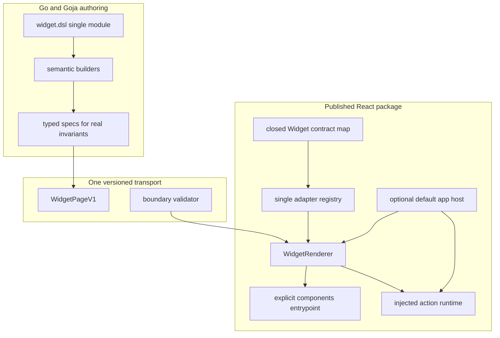
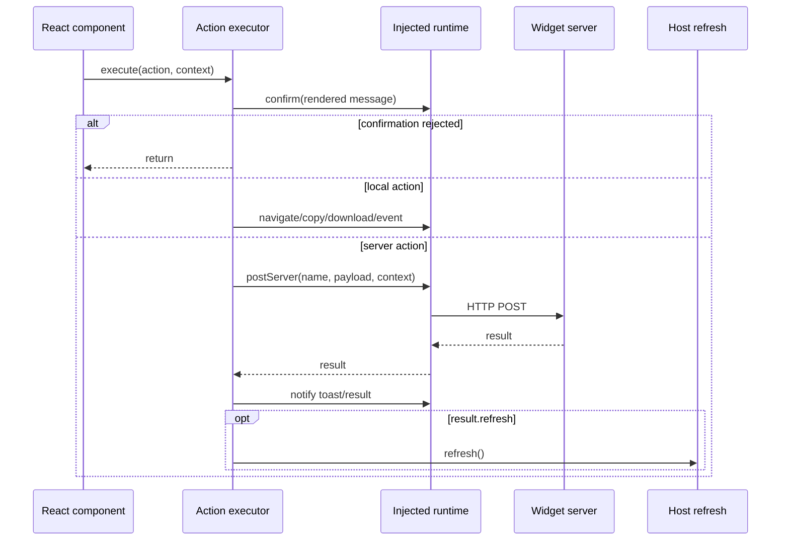

# Rag evaluation site and Widget DSL simplification analysis and hard cutover guide

## 1. Executive summary

The repository has a coherent core architecture: JavaScript authors use `widget.dsl`; Go builders emit JSON-compatible Widget IR; a React renderer resolves component nodes through adapters; and the package supplies both reusable visual components and a default application host. That core is worth preserving. The complexity problem is not the existence of these layers. It is that several completed migrations remain executable, several catalogs repeat the same facts without generating one another, several advertised APIs do no real work, and the published package exposes internal fixtures and experiments as if they were stable product contracts.

The inspected surface is large relative to its current consumer base:

- `packages/rag-evaluation-site/src` contains 603 TypeScript, TSX, and CSS files and approximately 36,421 lines.
- `pkg/widgetdsl` contains 31 Go files and approximately 11,246 lines.
- The frontend registers 90 Widget adapters and carries 85 YAML Widget manifests.
- The package has 126 Storybook stories but no package-local `*.test.*` or `*.spec.*` behavioral test files.
- The Widget DSL keeps 44 JavaScript examples and 44 JSON goldens.
- The npm root currently exports approximately 225 runtime symbols and packs hundreds of files.
- The production intent is one module, `widget.dsl`, but old split modules still exist in code and are globally registered through `init()`.

The most important findings are:

1. **Action confirmation is incorrect today.** The default app confirms non-server actions, then calls a dispatcher that confirms them again.
2. **The DSL hard cutover is incomplete.** `ui.dsl`, `data.dsl`, `data.v2.dsl`, `context_window.dsl`, `course.dsl`, and `cms.dsl` remain implemented, tested, and globally discoverable even though first-party provider registration exposes only `widget.dsl`.
3. **Some public DSL methods are false contracts.** Several domain “slot” methods serialize only `{kind: "slot", registered: true}` and discard the callback output; the React contracts do not consume those markers.
4. **Widget metadata is repeated rather than generated.** A component can be represented in a TypeScript union, props union, adapter, registry import, registry array, YAML manifest, Go helper map or builder, TypeScript declaration string, descriptor table, generated help, stories, and goldens.
5. **The IR type system appears stricter than it is.** `ComponentNode.type` accepts any string, `props` is not correlated with `type`, and base props allow arbitrary keys.
6. **The npm API is broader than observed use.** The root import applies CSS and exports fixtures, palettes, registries, presets, hooks, actions, and every component. Several subpath exports and TypeScript presets are only used by stories.
7. **Compatibility paths have no retirement mechanism.** Legacy course-shell handling, `--mac-*` bridge tokens, raw component construction, old schema versions, and migration checkers remain after the migration that justified them.
8. **Deletion is under-protected.** Storybook provides valuable visual review, but it does not characterize renderer traversal, action execution, page validation, adapter behavior, dialog behavior, or host refresh semantics.

This report recommends a hard cutover in ordered phases. First fix action correctness and add narrow characterization tests. Then remove false and legacy APIs, converge on one page protocol, simplify the adapter registry, delete lint-only catalogs and story-only duplicate APIs, narrow npm exports, and finally perform token namespace cleanup. The result should keep three explicit boundaries:

```text
widget.dsl authoring API
        ↓
versioned Widget Page JSON protocol
        ↓
React renderer + presentational component catalog
```

Everything else must justify itself by generation, validation, runtime use, or a named consumer. Historical behavior belongs in Git history and migration notes, not in production modules and permanent tests.

## 2. Problem statement

The repository grew through several design stages:

- raw Widget IR construction;
- split domain modules such as `ui.dsl` and `course.dsl`;
- a typed `data.v2.dsl` experiment;
- a unified `widget.dsl` v3 namespace;
- colocated React adapters and YAML manifests;
- semantic CRM, CMS, course, context, schedule, and time builders;
- a default browser application that supports both typed shells and older payload shapes.

Each stage added useful information. The repository did not consistently delete the mechanism from the previous stage after the new mechanism replaced it. The current code therefore pays for migration paths as if they were independent products.

The user has stated that there are few consumers and hard cutovers are acceptable. That changes the preferred engineering tradeoff. Compatibility wrappers should not be retained by default. A breaking change may be preferable when it removes a second runtime, a second schema inventory, or an API that cannot be made reliable without additional machinery.

The goal is not to minimize line count mechanically. The goal is to make each remaining layer own one responsibility and to make unsupported paths impossible to invoke.

## 3. Scope and evidence method

### 3.1 In scope

This review covers:

- `packages/rag-evaluation-site` as a published React package;
- component layering and public exports;
- Widget IR nodes, props, actions, registries, adapters, presets, and host code;
- Widget manifests and `widget-codegen` discovery/checking;
- `pkg/widgetdsl`, including legacy and v3 builders;
- `pkg/widgetdsl/spec`, lowering, validation, descriptors, TypeScript declarations, examples, and goldens;
- xgoja provider registration;
- page schema/version artifacts;
- migration checker infrastructure;
- known in-repository and sibling-repository consumers;
- test and release protection needed for hard cutovers.

### 3.2 Out of scope

This report does not redesign the visual language, implement the cleanup, or promise compatibility for unidentified third-party npm users. It also does not recommend deleting a React component solely because no DSL builder emits it. A presentational component may still be valuable directly. The report distinguishes React component value from Widget transport/adaptor value.

### 3.3 Evidence rules

Findings are based on current source, tests, stories, generated artifacts, default migration scans, package builds, and known sibling consumers. Line numbers refer to the current tree at commit `7164b02ce8fedb21697e6d4079e785984007b0b7` plus this ticket workspace.

Repository-only search cannot prove that no external npm consumer exists. For this project, that uncertainty should produce a major-version release note and a short migration window, not permanent compatibility code.

## 4. System orientation for a new intern

### 4.1 Repository boundaries

The relevant source is divided into five parts:

| Boundary | Primary path | Responsibility |
|---|---|---|
| Presentational React package | `packages/rag-evaluation-site/src/components` | Reusable foundation, atoms, layouts, molecules, and organisms. |
| Widget browser runtime | `packages/rag-evaluation-site/src/widgets` and `src/app` | Interpret Widget IR, bind actions, render adapters, fetch pages, and host shells. |
| Widget authoring language | `pkg/widgetdsl` | Install `widget.dsl` in Goja and expose fluent JavaScript builders. |
| Typed intent/lowering | `pkg/widgetdsl/spec` | Represent selected semantic intent, validate it, and lower it to JSON-like Widget IR. |
| Generated host/provider | `pkg/xgoja/providers/widgetsite` | Make `widget.dsl`, declarations, and help available to xgoja-generated binaries. |

There are also two catalog/tooling paths:

- `internal/widgetmanifest` plus `cmd/widget-codegen` discovers and checks YAML manifests.
- `pkg/widgetdsl/migrationcheck` plus `cmd/widgetdsl-migration-checker` scans for old imports and raw component escapes.

### 4.2 The authoring-to-browser path

```mermaid
flowchart LR
    A[JavaScript page verb] -->|require widget.dsl| B[Goja module loader]
    B --> C[Fluent Go builders]
    C --> D[Typed spec and lowering]
    D --> E[Widget Page JSON]
    E -->|HTTP GET /api/widget/pages/id| F[useWidgetPage]
    F --> G[RagEvaluationSiteApp]
    G --> H[WidgetRenderer]
    H --> I[WidgetRegistry lookup by type]
    I --> J[colocated widget adapter]
    J --> K[presentational React component]
    K -->|interaction| L[ActionSpec + context]
    L --> M[action executor]
    M -->|server action| N[HTTP POST /api/widget/actions/name]
    N -->|refresh true| F
```



The boundary between Go and React is serialized JSON. No Goja callback can execute in the browser. That fact is central to evaluating “slot” APIs: a callback must be executed during page construction and converted into JSON, or it cannot be part of the browser contract.

### 4.3 Frontend component layers

`packages/rag-evaluation-site/GUIDELINES.md` defines this dependency direction:

```text
theme tokens
    ↓
foundation
    ↓
atoms
    ↓
layout
    ↓
molecules
    ↓
organisms
    ↓
Widget adapters and WidgetRenderer
```

This hierarchy is generally sound and should remain. The cleanup should reduce duplicate transport and catalog layers around it, not flatten all components into one directory.

Definitions:

- **Foundation** establishes typography and low-level semantic display roles.
- **Atoms** are small controls and visual markers.
- **Layout** arranges regions without domain knowledge.
- **Molecules** implement reusable data or content patterns.
- **Organisms** compose lower layers into domain panels while remaining API-free.
- **Adapters** translate serialized Widget props and actions into React props and callbacks.
- **The host** owns network transport, browser location, refresh, shortcuts, and global toasts.

### 4.4 Widget IR

The core frontend contract lives in `packages/rag-evaluation-site/src/widgets/ir/core.ts:1-126`:

```ts
type WidgetNode = TextNode | ElementNode | ComponentNode;

interface ComponentNode {
  kind: "component";
  type: RagWidgetType | string;
  props?: WidgetProps;
  children?: WidgetNode[];
}
```

This shape permits three node kinds:

1. `text` carries a string.
2. `element` carries an arbitrary HTML tag, attributes, and children.
3. `component` carries a registry lookup key, props, and children.

The renderer in `src/widgets/WidgetRenderer.tsx:57-112` recursively visits these nodes. For a component node it performs `registry.get(node.type)` and calls the adapter. Unknown components render an `ErrorCallout` rather than throwing.

### 4.5 Adapters and registries

An adapter has four current fields in `src/widgets/registry.ts:5-27`:

```ts
interface WidgetAdapter<P> {
  type: string;
  module: "widget.dsl";
  render(props: P, children: ReactNode[], ctx: RenderContext, node: ComponentNode): ReactNode;
}
```

`defaultRegistry.ts` imports 90 adapters and organizes them into six partial registries before merging them into one default registry. Runtime lookup uses only `type`. Every adapter repeats the same module string. Repository consumers use `defaultWidgetRegistry`; the partial registries are not observed as independent product APIs.

### 4.6 The default host

`src/app/App.tsx` is not a small wrapper. It owns:

- location parsing;
- page fetching and refresh;
- page shortcut preferences;
- server action transport;
- result and toast events;
- shell selection;
- top and sidebar navigation;
- route pending UI;
- typed and legacy shell normalization;
- print and presentation URL compatibility;
- a special root `CourseStudioShell` renderer.

This is a legitimate application boundary, but it currently combines current protocol behavior with compatibility behavior. The cleanup should retain the host and make its accepted protocol narrower.

### 4.7 Widget DSL registration

`pkg/widgetdsl/module.go:13-21` names seven modules. `NewLoader` accepts only `widget.dsl`, and `Register` installs only `widget.dsl` into a supplied CommonJS registry (`module.go:203-225`). However, `init()` loops over every `moduleSpec` and calls the global `modules.Register` (`module.go:249-252`). The repository therefore has two different answers to “which modules exist?” depending on the registry path.

The root v3 installation exposes:

```text
page
raw
act
bind
app
ui
data
crm
cms
course
context
schedule
time
style
```

The `style` object is empty. `raw` exposes text, element, component, and fragment construction. Domain namespaces expose semantic builders and intent helpers.

### 4.8 Builder and lowering architecture

`pkg/widgetdsl/v3.go` contains most fluent runtime behavior. Builders usually follow this pattern:

```text
constructor(arguments, optional callback)
    → allocate mutable spec
    → expose methods on a Goja object
    → callback mutates spec
    → toNode/toPage lowers spec to map[string]any
```

`pkg/widgetdsl/spec` holds typed structures for pages, shells, fields, collections, actions, and validation. It is useful where it expresses semantic invariants. It is not yet a universal source of truth: many v3 builders still construct maps directly, and some v3 code retains `v2Ref` handles from the earlier data builder.

### 4.9 Page delivery and actions

The browser hook `src/hooks/useWidgetPage.ts:76-125` fetches JSON and casts it to `WidgetPageResponse`; it does not validate a schema version or node shape. The host then resolves a shell and renders the root.

Action specs are data. A component supplies an interaction context such as:

```json
{
  "row": {"id": "j-1", "status": "new"},
  "rowKey": "j-1",
  "componentType": "DataTable"
}
```

Bindings resolve values from that context. Server actions POST resolved payload plus context. Local actions navigate, copy, download, print, toggle fullscreen, or dispatch events.

## 5. Complexity model used in this review

A layer is warranted when it does at least one of the following:

- establishes a runtime boundary;
- enforces an invariant that tests prove;
- generates another artifact and removes manual synchronization;
- isolates a dependency or side effect;
- provides an API used by a named consumer;
- enables independent replacement of an implementation;
- supplies observability or safety that cannot be achieved more simply.

A layer is unwarranted when it:

- repeats information without generation;
- exists only to preserve completed migration behavior;
- exposes methods that do not reach the runtime;
- claims type safety while admitting arbitrary strings and props;
- has one implementation and no realistic replacement need;
- is tested only to keep old behavior executable;
- publishes fixtures or story conveniences as stable runtime APIs;
- requires more maintenance than the consumers it serves.

The review uses four priority levels:

| Priority | Meaning |
|---|---|
| P0 | Correctness defect or false public contract. Address before broad deletion. |
| P1 | Completed migration residue or high-value hard cutover. |
| P2 | Duplicate catalogs, broad publishing, and story-only product APIs. |
| P3 | High-churn consistency cleanup that should follow protocol stabilization. |

## 6. Findings: correctness and false contracts

### 6.1 P0 — non-server actions can confirm twice

**Evidence**

- `packages/rag-evaluation-site/src/app/App.tsx:87-95` calls `confirmWidgetAction` and then calls `dispatchWidgetAction` for a non-server action.
- `packages/rag-evaluation-site/src/widgets/actions.ts:44-56` calls `confirmWidgetAction` again when no custom handler is supplied.
- Server transport and result/toast handling are duplicated between `App.tsx:96-128` and `actions.ts:114-138`.

**Why this is a defect**

Confirmation belongs to action execution, not both action routing and action execution. A custom host should be able to inject transport without reimplementing payload resolution, confirmation, result events, toast events, and refresh semantics.

**Hard-cut recommendation**

Create one executor with injected host services:

```ts
interface WidgetActionRuntime {
  confirm(message: string): boolean;
  navigate(target: string, replace: boolean, state?: object): void;
  copy(text: string): Promise<void>;
  download(target: string): void;
  emit(name: string, detail: unknown): void;
  postServer(name: string, body: ServerActionRequest): Promise<ServerActionResult>;
  refresh(): void;
}

async function executeWidgetAction(
  action: ActionSpec,
  context: WidgetActionContext,
  runtime: WidgetActionRuntime,
): Promise<void>;
```

Adapters should bind an action to this executor. `RagEvaluationSiteApp` should provide an HTTP runtime configured with `apiBase` and `refresh`. There should be exactly one confirmation call.

**Required tests**

- A confirmed local action calls the confirmation service once.
- A rejected confirmation produces no effect.
- A server action resolves payload/context and posts to the injected base URL.
- `refresh: true` calls the host refresh callback exactly once.
- error and toast results emit one notification.

### 6.2 P0 — domain slot methods advertise behavior the browser never receives

**Evidence**

- Context and CMS builder methods in `pkg/widgetdsl/v3.go:652-695` and `946-1021` serialize markers such as `{kind: "slot", registered: true}`.
- The callback body and rendered output are not represented in the emitted page.
- Example `pkg/widgetdsl/testdata/v3/examples/38-context-empty-state.js` demonstrates the API, while its golden contains only the marker.
- Frontend prop contracts in `src/widgets/ir/props.ts` and adapters such as `MediaLibraryPanel.widget.tsx` and `TranscriptWorkspacePanel.widget.tsx` do not consume those slot fields.

**Why this is unwarranted complexity**

The API creates the appearance of deferred browser rendering without a serialization contract. A server-side function cannot cross the JSON boundary. Keeping the method in descriptors and declarations makes documentation parity pass while product behavior remains absent.

**Hard-cut recommendation**

Delete unsupported slot methods and their example/golden. If a concrete capability is needed, represent it explicitly as serializable data:

```ts
interface EmptyStateSpec {
  title: RenderableValue;
  body?: RenderableValue;
  action?: ActionSpec;
}
```

Use a named `emptyState` property or child Widget node. Do not serialize callback registration markers.

### 6.3 P0 — page schema versions conflict and are not enforced

**Evidence**

- `pkg/widgetdsl/v3.go:47-76` defaults v3 pages to `0.1.0` and permits caller override.
- `pkg/widgetdsl/spec/lower.go:5-10` defaults typed page lowering to `0.2.0`.
- `pkg/widgetschema/schema.go:3` declares `0.1.0` and an incomplete component inventory.
- `WidgetPageResponse` in `src/hooks/useWidgetPage.ts:55-62` has no `schemaVersion` field.
- `useWidgetPage` casts response JSON without validation at `useWidgetPage.ts:100-110`.
- A known sibling compatibility adapter emits another version label, `widget.ir/v1`.

**Why this is unwarranted complexity**

A version that does not gate parsing is a label, not a protocol mechanism. Multiple labels increase migration work without protecting clients.

**Hard-cut recommendation**

Adopt one page envelope discriminator, for example `widget.page/v1`, and reject other values at the browser boundary. Do not allow page authors to override it.

```ts
interface WidgetPageV1 {
  schemaVersion: "widget.page/v1";
  id: string;
  title: string;
  shell: PageShellSpec;
  shortcuts?: PageShortcutsSpec;
  root: WidgetNode;
}
```

The Go package should export one constant used by every page lowerer. Remove `pkg/widgetschema` unless its schema is generated from the actual TypeScript contract and used in validation. The recommended near-term choice is a small hand-written boundary validator, not a second exhaustive component catalog.

## 7. Findings: legacy DSL and migration residue

### 7.1 P1 — split modules remain globally registered

**Evidence**

`pkg/widgetdsl/module.go` retains:

- constants for seven module names at lines 13-21;
- helper catalogs and recipes at lines 36-186;
- `moduleSpecsByName` and legacy loader selection;
- `registerLegacyModulesForTests` at lines 227-237;
- an `init()` function that globally registers every module at lines 249-252.

Production provider registration appears narrower because `Register` installs only `widget.dsl`. A runtime probe through the global native module registry found all historical names present.

**Why this is overengineered**

The code implements both a single-module architecture and a multi-module architecture. Tests keep old builders operational instead of proving old modules are absent. The distinction between explicit registry and global registry is easy for a host author to miss.

**Hard-cut recommendation**

1. Migrate the known sibling `go-go-course` facade.
2. Remove global registration for all old names.
3. Remove old constants, module specs, helper maps, recipes, and loaders.
4. Make the loader parameterless or private because there is one supported module.
5. Retain one negative test proving old module names cannot resolve.

Target provider pseudocode:

```go
const ModuleName = "widget.dsl"

func Register(reg *require.Registry) {
    if reg == nil { return }
    reg.RegisterNativeModule(ModuleName, newModule().Loader)
}
```

No `init()` should mutate a global module catalog merely by importing the package.

### 7.2 P1 — v3 still depends on v2 implementation handles

**Evidence**

- v3 field construction attaches `v2Ref` and uses `v2SchemaValue` in `pkg/widgetdsl/v3.go:1233-1287`.
- v3 collection construction uses `v2Rows`, `attachV2Ref`, `mustV2Ref`, and `v3SelectionToV2` around `v3.go:1295-1337` and `2320-2333`.
- Those helpers live in the 403-line `v2_builders.go`.

**Why this matters**

Deleting the public `data.v2.dsl` module does not currently delete its implementation. The legacy naming also makes new maintainers assume v3 compatibility depends on a public v2 contract.

**Hard-cut recommendation**

Extract only neutral internal concepts:

```go
type schemaHandle struct { spec *spec.FieldSet }
type collectionRows []map[string]any
```

Rename conversion helpers according to current behavior, migrate v3, then delete v2 constructors, TypeScript declarations, and tests. Do not preserve aliases named after v2.

### 7.3 P1 — the raw component escape defeats the catalog

**Evidence**

- `widget.raw.component` accepts any component type string.
- `ComponentNode.type` accepts `RagWidgetType | string`.
- Unknown names fail only at render time.
- The migration checker currently finds one known first-party use in `go-go-course/cmd/go-go-course/lib/widget-dsl-v3-adapter.js`.
- The in-repository static demo `internal/api/dsl_handlers.go:12-101` also hand-builds low-level component IR rather than using the canonical authoring layer.

**Why this is unwarranted**

The repository maintains typed builders, adapter manifests, a registry, a component union, descriptors, and migration checks, then offers a public function that bypasses all of them. With few users, keeping the escape hatch is more expensive than migrating its known use.

**Hard-cut recommendation**

- Migrate the sibling adapter to semantic `widget.dsl` builders.
- Delete the static IR demo or rewrite it as a canonical generated example.
- Remove `raw.component`.
- Remove `raw.text` and `raw.fragment` because normal values and child arrays already cover them.
- Decide separately whether `raw.element` is required for constrained semantic HTML. If retained, rename it `html.element` and restrict allowed tags/attributes.

### 7.4 P1 — legacy aliases and overloads multiply the authoring vocabulary

Observed examples include:

- `data.collection(rows, callback)` and `data.collection(name, rows, callback)`;
- `EditorBuilder.submit` and `submitPost`;
- `CollectionBuilder.toNode` and `toIR`;
- `ActionsBuilder.add` and `button`;
- an empty exported `style` namespace;
- `.use` added to every builder whether or not composition is needed.

**Recommendation**

Choose one idiom and rewrite all first-party examples in one commit:

```js
const jobs = widget.data.collection(rows, c => c
  .id("jobs")
  .schema(fields)
  .table(t => t.rowSelect(openJob)));
```

Retain:

- rows-first constructors;
- `.id(name)` for identity;
- `submit`;
- `toNode` only when explicit lowering is necessary;
- `add` for action collections;
- `.use` only on builders where reusable configuration functions are observed.

Delete the empty `style` namespace.

### 7.5 P2 — migration checker should be temporary

**Evidence**

- `pkg/widgetdsl/migrationcheck/checker.go` hardcodes repository and sibling paths.
- It recognizes exact import/call patterns and cannot prove absence of aliased raw calls.
- No active GitHub workflow invokes it.
- It adds tree-sitter Go dependencies dedicated to JavaScript and TypeScript scanning.

**Recommendation**

Use the checker as an exit tool:

1. Run it with `--fail-on-findings` across all known consumers.
2. Complete the sibling migration.
3. Add direct compile/runtime tests for the final API.
4. Delete `cmd/widgetdsl-migration-checker`, `pkg/widgetdsl/migrationcheck`, and dedicated tree-sitter dependencies.

A permanent migration checker is not architecture. Absence tests and compilation of actual consumers are stronger after the cutover.

## 8. Findings: duplicated frontend catalogs and adapters

### 8.1 P1 — component and transport metadata have too many sources of truth

One Widget-capable component can appear in all of the following:

1. React component props.
2. A `*.widget.tsx` adapter.
3. A `*.widget.yaml` manifest.
4. `RagWidgetType` in `widgets/ir/core.ts`.
5. `WidgetProps` in `widgets/ir/props.ts`.
6. `defaultRegistry.ts` imports and arrays.
7. A Go helper or semantic builder.
8. `v3_descriptors.go`.
9. `typescript.go` declaration strings.
10. Generated Markdown help.
11. Storybook stories.
12. JavaScript examples and JSON goldens.

The YAML layer does not generate the others. `internal/widgetmanifest` only discovers and validates selected fields. `cmd/widget-codegen` has `list` and `check` commands but does not generate runtime code. Validation explicitly warns that slot/action schema validation is not implemented (`internal/widgetmanifest/validate.go`).

The catalog is already incomplete: adapters exist without manifests for `ContextStyleSwatch`, `IconButton`, `Disclosure`, `ShareLink`, and `RichArticle`.

**Decision recommendation**

Delete YAML Widget and recipe manifests plus `internal/widgetmanifest`, `cmd/widget-codegen`, and `schema/dsl-modules.yaml`. They are a lint-only duplicate and their name overstates their function.

Use two authoritative representations:

- React adapter source is authoritative for render behavior and adapter registration.
- Go `widget.dsl` source plus generated `.d.ts` is authoritative for authoring behavior.

Keep behavior tests that execute builders and render representative outputs. Do not replace deleted YAML with another manually synchronized catalog.

### 8.2 P1 — the frontend IR type is open despite a large declaration surface

`ComponentNode.type` accepts arbitrary strings. `props` is a broad union unrelated to `type`. `BaseWidgetProps` has `[key: string]: unknown`. A caller can therefore combine `type: "DataTable"` with unrelated props and satisfy the structural envelope through casts or broad values.

There are two honest designs:

#### Option A: correlated closed map

```ts
interface WidgetContractMap {
  DataTable: DataTableWidgetProps;
  Panel: PanelWidgetProps;
  // supported transport components only
}

type ComponentNode = {
  [K in keyof WidgetContractMap]: {
    kind: "component";
    type: K;
    props?: WidgetContractMap[K];
    children?: WidgetNode[];
  }
}[keyof WidgetContractMap];
```

#### Option B: deliberately open transport

```ts
interface ComponentNode {
  kind: "component";
  type: string;
  props?: JsonObject;
  children?: WidgetNode[];
}
```

With few users and a default closed registry, choose **Option A** for package-authored nodes and allow an explicit `UnknownComponentNode` only at the untrusted parsing boundary. This makes compile-time contracts useful without claiming arbitrary server JSON is already safe.

### 8.3 P1 — registry structure is more general than current use

`registry.ts` supports partial registries, `entries()`, merging, and per-adapter module metadata. The default registry constructs six intermediate registries and merges them. Runtime lookup needs a `Map<string, adapter>`.

**Hard-cut recommendation**

```ts
interface WidgetAdapter<K extends WidgetType> {
  type: K;
  render(props: WidgetPropsFor<K>, children: ReactNode[], ctx: RenderContext): ReactNode;
}

export const defaultWidgetRegistry = createWidgetRegistry([
  panelWidget,
  dataTableWidget,
  // one explicit list
]);
```

Delete:

- `WidgetModule`;
- `module: "widget.dsl"` from 90 adapters;
- unused `node` adapter argument;
- `entries()` if no caller remains;
- `mergeWidgetRegistries`;
- exported partial registries.

If extension is needed later, add a small `registry.with(overrides)` API only when a real host needs it.

### 8.4 P1 — raw-only adapters should not remain transport APIs automatically

A comparison of typed v3 lowering and registered adapters identified approximately 35 adapter types not emitted by current semantic typed paths. Examples include low-level shells, individual context diagram/card components, transcript leaf components, and selected CMS/course leaves.

This does **not** imply deleting their React components. It implies separating two questions:

1. Is this component useful to React authors?
2. Is this component a supported serialized Widget protocol type?

After `raw.component` is removed, prune adapters and IR prop entries that no typed builder or persisted page can emit. Retain direct React exports and stories when they still provide reusable design-system value.

### 8.5 P2 — `FormDialog` violates the component/adapter boundary

`components/organisms/FormDialog` contains CSS, a manifest, and `FormDialog.widget.tsx`, but no presentational `FormDialog.tsx`. The adapter owns state, global event subscriptions, focus management, form serialization, and rendering.

**Recommendation**

Extract a real presentational organism and a host/controller hook:

```ts
interface FormDialogProps {
  open: boolean;
  title: ReactNode;
  initialFocusName?: string;
  onSubmit(form: FormData): void;
  onCancel(): void;
  children: ReactNode;
}
```

The adapter should translate Widget actions and overlay events into these props. Add a component story and behavioral tests for focus, submit, cancel, and serialization.

## 9. Findings: package API and duplicate product surfaces

### 9.1 P2 — root exports are indiscriminate and trigger CSS side effects

`src/index.ts` imports `styles.css` and star-exports CMS, all components, context, selected hooks, scheduling, and widgets. Sub-barrels export fixtures and story palettes. The root therefore exposes more than the product contract and silently changes global styles.

Observed repository use is much narrower:

- `web` imports the package root heavily because source aliases make it convenient.
- `/ir` has a small number of direct consumers.
- `/app` is verified by consumer smoke but not imported by the repository app source.
- `/scheduling` and `/widgets/presets` have no observed product consumer.

**Recommended major-version export map**

```json
{
  "exports": {
    "./components": "./components.js",
    "./widget": "./widget.js",
    "./app": "./app/index.js",
    "./styles.css": "./styles.css",
    "./theme.css": "./theme.css"
  }
}
```

A minimal root may re-export the three intentional entrypoints, but it should not export fixtures, story data, or internal registries. CSS should require an explicit import.

### 9.2 P2 — TypeScript domain presets duplicate Go authoring

`src/widgets/presets/scheduling.ts` and `crm.ts` build IR in TypeScript for stories. The canonical product authoring layer already supplies `widget.schedule`, `widget.time`, and `widget.crm`.

**Recommendation**

Delete `/widgets/presets`. Direct React stories should render presentational components. WidgetRenderer integration stories should import checked-in JSON output produced by canonical Go examples, or small purpose-built fixtures local to the story. Do not maintain a second semantic authoring language for Storybook convenience.

### 9.3 P2 — story-only React twins need named consumers

The review found exported organisms with no repository consumer beyond stories, including:

- `CalendarMonthPanel`;
- `CalendarWeekPanel`;
- `BookingPagePanel`;
- `MeetingPollPanel`;
- `PollResultsPanel`;
- `RecordShell`.

Some duplicate generic engines or semantic compositions used by the DSL. `RecordShell` explicitly describes itself as a hand-authored twin.

**Recommendation**

Before the major release, ask one binary question for each: “Is there a named React consumer that uses this composition rather than its underlying components?” If not, delete the exported twin and its stories. Keep reusable primitives such as `MonthGrid`, `TimeGrid`, `BoardEngine`, and field rendering.

### 9.4 P3 — compatibility token namespace is neither temporary nor canonical

`theme.css` calls `--mac-*` a compatibility bridge. The guidelines allow both `--mac-*` and `--rag-*`. Approximately 98 CSS files contain hundreds of `--mac-*` references.

**Recommendation**

Choose `--rag-*` as the canonical package namespace and perform a mechanical cutover after component/API cleanup. Do not maintain two token vocabularies indefinitely. This is P3 because it produces broad CSS churn and should not be mixed with protocol deletion.

## 10. Findings: documentation, descriptors, examples, and tests

### 10.1 P2 — descriptor-driven inventory is a second schema

Runtime methods are defined in Go builder code. `typescript.go` manually emits declaration strings. `v3_descriptors.go` repeats namespace members, builder methods, and action contexts. Descriptor tests compare runtime keys and parse TypeScript interfaces. Generated help repeats the inventory again.

These tests prove that several lists contain the same names. They did not detect inert slot behavior.

**Recommendation**

- Keep generated TypeScript declarations because JS authors need them.
- Delete the broad descriptor inventory and generated method-list help.
- Keep concise conceptual help with executable examples.
- Add behavior tests for important builder methods.
- If declarations must be generated, generate them from small typed declaration templates adjacent to runtime builders, not a second global catalog.

### 10.2 P2 — duplicate evaluator commands and preview compatibility output

`cmd/widgetdsl-v3-examples` and `cmd/widgetdsl-v3-preview` both create Goja runtimes, install the module, execute source, and export a page. Preview also constructs raw/legacy shell metadata that the app normalizes.

**Recommendation**

Choose one generated xgoja example host as the canonical execution path. Delete duplicate commands or share one evaluator package if both output modes have a current user. Every preview page must use the same page lowerer and shell protocol as production.

### 10.3 P0 — stories are not sufficient deletion protection

The package has extensive Storybook coverage and almost no automated behavioral coverage. `scripts/focused-checks.mjs` covers calendar packing, month cell generation, style lookup, and shortcut matching. It does not cover:

- renderer recursion;
- unknown widgets;
- correlated props;
- action confirmation and dispatch;
- server transport;
- page validation;
- shell selection;
- legacy fallback removal;
- dialog focus and submission;
- upload serialization;
- representative adapters.

**Recommendation**

Add a small test stack before mass deletion. Prefer Vitest plus React Testing Library for package behavior. Keep stories for visual states and interaction review; do not treat them as assertions.

Minimum suite:

```text
WidgetRenderer.test.tsx
widgetActionExecutor.test.ts
parseWidgetPage.test.ts
RagEvaluationSiteApp.test.tsx
FormDialog.test.tsx
DataTable.widget.test.tsx
representativeDomainAdapters.test.tsx
```

## 11. What should remain

A cleanup report must identify valuable structure, not only deletion candidates.

Retain:

- the component layer hierarchy;
- CSS Modules and explicit theme tokens;
- presentational/API-free package rules;
- Storybook as the visual review environment;
- colocated adapters for components that are genuinely part of Widget IR;
- semantic `widget.dsl` namespaces;
- typed specs where they enforce non-trivial invariants;
- JSON Widget pages as the process/network boundary;
- the default host as a convenient application shell;
- action specs as serialized intent;
- focused JavaScript examples and goldens that represent distinct behavior;
- xgoja provider packaging and help integration.

Do not delete a layer merely because it has indirection. Delete it when it repeats another layer, preserves dead behavior, or promises behavior it does not provide.

## 12. Target architecture

### 12.1 Target boundaries



### 12.2 Target public APIs

#### Go provider

```go
package widgetdsl

const ModuleName = "widget.dsl"
const PageSchemaVersion = "widget.page/v1"

func Register(reg *require.Registry)
func TypeScript() string
```

No split-module constants. No global multi-module `init()`. No public loader selector.

#### JavaScript authoring

```js
const widget = require("widget.dsl");

const page = widget.page("Jobs", p => p
  .id("jobs")
  .shell(widget.app.shell(s => s /* ... */))
  .view(widget.data.collection(rows, c => c
    .id("jobs")
    .schema(fields)
    .table(t => t.rowSelect(openJob))))
  .toPage());
```

No `style` namespace, split modules, v2 constructors, raw components, inert slots, or alias pairs.

#### React widget runtime

```ts
export interface WidgetContractMap {
  Panel: PanelWidgetProps;
  DataTable: DataTableWidgetProps;
  // only supported protocol components
}

export type WidgetType = keyof WidgetContractMap;
export type WidgetPropsFor<K extends WidgetType> = WidgetContractMap[K];

export interface WidgetRendererProps {
  node: WidgetNode;
  registry?: WidgetRegistry;
  actionRuntime: WidgetActionRuntime;
}
```

#### Page parsing

```ts
export function parseWidgetPage(input: unknown): WidgetPageV1 {
  assertObject(input);
  assertEqual(input.schemaVersion, "widget.page/v1");
  assertString(input.id);
  assertString(input.title);
  assertPageShell(input.shell);
  assertWidgetNode(input.root);
  return input as WidgetPageV1;
}
```

The validator should validate structural boundaries and known node kinds. Adapter-level prop validation can remain focused on components where malformed values create safety or correctness risks.

### 12.3 Target action sequence



## 13. Decision records

### Decision: prefer hard cutovers over permanent adapters

- **Context:** The system has few known users and several completed migrations remain in production code.
- **Options considered:** Maintain compatibility indefinitely; deprecate over several releases; perform coordinated major-version cutovers.
- **Decision:** Use coordinated hard cutovers after scanning known consumers and adding behavior tests.
- **Rationale:** Permanent adapters impose ongoing runtime, documentation, test, and cognitive cost disproportionate to the consumer base.
- **Consequences:** Known sibling repositories must be migrated atomically. Unknown consumers receive a major-version migration guide, not runtime shims.
- **Status:** proposed.

### Decision: keep one Widget DSL module

- **Context:** Provider registration intends `widget.dsl` to replace six split modules.
- **Options considered:** Preserve split modules as aliases; keep test-only implementations; delete them.
- **Decision:** Delete split modules and global registration.
- **Rationale:** One module already serves first-party hosts and avoids duplicate vocabularies.
- **Consequences:** Old scripts stop loading immediately; negative tests and release notes document the break.
- **Status:** proposed.

### Decision: version and validate one page envelope

- **Context:** Three version labels exist and the browser validates none.
- **Options considered:** Remain versionless; keep informational versions; enforce one discriminator.
- **Decision:** Adopt `widget.page/v1` and validate it at fetch/parse time.
- **Rationale:** A network protocol needs a reliable compatibility gate.
- **Consequences:** All producers and fixtures migrate together. Invalid pages fail before rendering.
- **Status:** proposed.

### Decision: delete YAML manifests rather than promote them

- **Context:** 85 manifests repeat adapter facts but do not generate runtime artifacts.
- **Options considered:** Build a full generator; retain lint-only manifests; delete them.
- **Decision:** Delete manifests and widget-codegen tooling.
- **Rationale:** React adapter code and Go authoring code are already executable authorities. A generator would add a schema language and generation pipeline without a demonstrated need.
- **Consequences:** Documentation must derive from declarations/examples, and adapter registration remains explicit source code.
- **Status:** proposed.

### Decision: retain adapters only for supported transport components

- **Context:** React components and Widget protocol components currently share one broad catalog.
- **Options considered:** Give every React component an adapter; retain raw component authoring; define a smaller protocol catalog.
- **Decision:** Define a smaller closed Widget contract and keep other components React-only.
- **Rationale:** A reusable React component does not automatically need stable JSON props and remote authoring support.
- **Consequences:** Some adapters and IR props disappear while their underlying React components remain.
- **Status:** proposed.

### Decision: make action execution injectable and singular

- **Context:** Host and generic dispatcher duplicate confirmation and server behavior.
- **Options considered:** Keep custom host override; add flags to suppress confirmation; centralize execution.
- **Decision:** Centralize execution behind an injected runtime.
- **Rationale:** One executor defines semantics; host injection supplies environment effects.
- **Consequences:** Adapters become easier to test and alternative hosts can replace transport without copying logic.
- **Status:** proposed.

### Decision: make stylesheet import explicit

- **Context:** Importing the package root applies global CSS.
- **Options considered:** Preserve root side effect; auto-inject styles; require CSS import.
- **Decision:** Require explicit `styles.css` import.
- **Rationale:** Library imports should not silently mutate global styling.
- **Consequences:** Known consumers add one import during the major-version migration.
- **Status:** proposed.

## 14. Phased implementation plan

### Phase 0 — freeze evidence and characterize behavior

**Objective:** protect current intended behavior before deletion.

Tasks:

1. Add a React test runner and DOM test environment.
2. Add renderer traversal and unknown-widget tests.
3. Add action confirmation/server/refresh tests that initially expose the double-confirm defect.
4. Add page parsing tests around a canonical representative page.
5. Add `FormDialog` focus/submit/cancel tests.
6. Record current package exports and known consumer imports.
7. Run migration checker against this repository, Upwork Tracker, and `go-go-course`.

Exit criteria:

- Behavior tests pass after the action fix.
- Known consumers are listed with exact module and npm pins.
- A checked-in migration matrix identifies every breaking change.

### Phase 1 — fix action execution and page protocol

**Objective:** establish one reliable browser boundary.

Files:

- `packages/rag-evaluation-site/src/widgets/actions.ts`
- `packages/rag-evaluation-site/src/app/App.tsx`
- `packages/rag-evaluation-site/src/hooks/useWidgetPage.ts`
- `packages/rag-evaluation-site/src/widgets/ir/core.ts`
- `pkg/widgetdsl/v3.go`
- `pkg/widgetdsl/spec/lower.go`
- `pkg/widgetschema/schema.go`

Tasks:

1. Introduce `WidgetActionRuntime` and one async executor.
2. Remove duplicated host server execution.
3. Introduce `WidgetPageV1` and `parseWidgetPage`.
4. Make page schema version constant and non-overridable.
5. Migrate all examples, fixtures, server handlers, and sibling producers.
6. Delete stale `pkg/widgetschema` after no references remain.
7. Remove legacy meta shell fallback and root course-shell special case after payload migration.

Exit criteria:

- one confirmation per action;
- one server transport path;
- invalid or old page versions fail clearly;
- every first-party page carries typed shell data;
- no browser legacy shell branch remains.

### Phase 2 — finish the Widget DSL hard cutover

**Objective:** make `widget.dsl` the only implementation, not only the preferred provider surface.

Tasks:

1. Migrate `go-go-course` compatibility facade and raw call.
2. Extract neutral schema/row handles used by v3.
3. Remove old module constants/specs/helper maps.
4. Delete global legacy registration.
5. Delete grammar and v2 builder paths used only by old modules.
6. Delete old TypeScript declaration branches and tests.
7. Add negative resolution tests for old names.
8. Remove aliases, overloads, empty `style`, and unnecessary `.use` methods.
9. Delete inert slot methods and their examples.

Exit criteria:

```text
require("widget.dsl") succeeds
require("ui.dsl") fails
require("data.dsl") fails
require("data.v2.dsl") fails
require("context_window.dsl") fails
require("course.dsl") fails
require("cms.dsl") fails
```

### Phase 3 — close and simplify the frontend Widget contract

**Objective:** make types and registry match actual protocol support.

Tasks:

1. Define `WidgetContractMap`.
2. Correlate component `type` and `props`.
3. Remove arbitrary `string` from package-authored component nodes.
4. Remove adapter `module` and unused `node` argument.
5. Replace partial registry merge with one registry list.
6. Remove `raw.component` and prune transport-only adapters not emitted by typed APIs.
7. Keep useful React components even when their adapters are deleted.
8. Extract presentational `FormDialog` from its adapter.

Exit criteria:

- adding a protocol component requires one contract-map entry, one adapter, builder behavior, and tests;
- wrong props for a known type fail TypeScript compilation;
- registry contains only supported protocol components;
- no raw component authoring remains.

### Phase 4 — delete duplicate catalogs and migration tools

**Objective:** remove metadata that does not generate or validate runtime behavior.

Delete or replace:

- `*.widget.yaml`;
- `*.recipe.yaml`;
- `schema/dsl-modules.yaml`;
- `internal/widgetmanifest`;
- `cmd/widget-codegen`;
- broad v3 descriptor inventory and generated method-list help;
- `cmd/widgetdsl-migration-checker` and `pkg/widgetdsl/migrationcheck` after final use;
- dedicated tree-sitter dependencies.

Exit criteria:

- no build, test, docs, or CI command references deleted tools;
- API declarations and examples remain discoverable;
- behavior tests replace inventory-parity tests.

### Phase 5 — narrow npm package boundaries

**Objective:** publish only intentional product APIs.

Tasks:

1. Create explicit `components`, `widget`, and `app` entrypoints.
2. Remove implicit CSS import from root.
3. Move fixtures and story palettes out of runtime barrels.
4. Delete TypeScript domain presets and `/widgets/presets` export.
5. Delete `/scheduling` export unless a named direct consumer exists.
6. Delete story-only organism twins after consumer confirmation.
7. Update package consumer smoke to test every supported entrypoint and absence of internal ones.
8. Publish as a major version.

Exit criteria:

- package files and runtime exports are substantially reduced;
- clean consumer uses explicit CSS;
- fixtures are not in production declarations or runtime bundles;
- release notes contain mechanical import replacements.

### Phase 6 — consolidate examples and tests

**Objective:** make examples prove behavior rather than preserve every historical path.

Tasks:

1. Choose one Goja evaluator/preview host.
2. Delete duplicate preview commands.
3. Keep a smaller set of orthogonal JavaScript examples.
4. Replace redundant goldens with focused structural assertions.
5. Keep representative end-to-end goldens for page, table, form, one domain workspace, and actions.
6. Make Go-generated JSON available to WidgetRenderer integration tests.

Exit criteria:

- no two commands independently implement module setup and page export;
- examples cover distinct semantics;
- goldens are reviewed for protocol changes rather than mass regenerated blindly.

### Phase 7 — token namespace hard cut

**Objective:** end the permanent compatibility bridge.

Tasks:

1. Freeze the final `--rag-*` token vocabulary.
2. Map every `--mac-*` variable to its canonical replacement.
3. Rewrite CSS Modules mechanically.
4. Remove bridge declarations.
5. Run Storybook visual comparison across representative states.

Exit criteria:

- no `--mac-*` references remain in package source;
- theme docs name one canonical vocabulary;
- visual review is accepted.

## 15. Deletion inventory

### 15.1 Delete after Phase 1/2 migration

| Candidate | Reason | Prerequisite |
|---|---|---|
| Split module constants and specs in `module.go` | Completed migration residue. | Migrate sibling facade. |
| `grammar.go` legacy paths | Serve old split modules. | Extract any v3-used neutral helpers. |
| `v2_builders.go` public constructors | Obsolete experiment API. | Move v3 handle logic. |
| Legacy module tests | Preserve unsupported behavior. | Add absence tests. |
| `raw.component`, `raw.text`, `raw.fragment` | Bypass or duplicate typed authoring. | Migrate raw consumers. |
| Inert slot methods | False public contract. | Replace any needed state with serialized specs. |
| Empty `style` namespace | No behavior. | None. |
| Alias methods and constructor overloads | Multiple idioms for same operation. | Codemod examples/consumers. |
| Legacy shell/meta branches in `App.tsx` | Old payload compatibility. | Migrate every producer to typed shell. |
| `pkg/widgetschema` | Stale/incomplete duplicate. | Add canonical boundary parser/version. |

### 15.2 Delete after frontend contract closure

| Candidate | Reason | Prerequisite |
|---|---|---|
| Adapter `module` property | Constant and unused in lookup. | None beyond type update. |
| Adapter `node` argument | Unused by adapters. | Confirm with compile search. |
| Partial registries and merge API | No observed independent consumer. | Update default registry import. |
| Raw-only adapters | No typed authoring path. | Search persisted/external IR. |
| Corresponding IR props for deleted adapters | No protocol consumer. | Preserve React props separately. |
| Widget YAML manifests | Lint-only duplicate. | Remove manifest tooling/docs. |
| Recipe YAML manifests | Lint-only duplicate. | Replace useful recipe docs with examples. |
| `internal/widgetmanifest` | Supports deleted manifests. | None after manifest deletion. |
| `cmd/widget-codegen` | Name promises generation but only lists/checks. | Remove build/docs references. |

### 15.3 Delete or internalize during npm narrowing

| Candidate | Reason |
|---|---|
| Root exports of fixtures | Test/story data is not runtime API. |
| Root exports of story palettes | Story convenience is not runtime API. |
| `/widgets/presets` | Duplicates Go semantic authoring and is story-only. |
| `/scheduling` | No observed product subpath consumer; root duplication. |
| Internal registry factories | No need as supported external extension API yet. |
| Internal action template helpers | Keep behind the action executor. |
| Story-only organism twins | No named product consumer. |
| Implicit root CSS import | Hidden global side effect. |

## 16. Testing and validation strategy

### 16.1 Unit and component tests

Add tests around invariants, not file counts.

| Area | Required assertions |
|---|---|
| Page parser | Accept canonical version; reject missing/old version; reject malformed root. |
| Renderer | Render text, element, and known component; show unknown boundary error. |
| Contract map | Known type correlates to its props; wrong props fail fixture typecheck. |
| Action executor | Confirm once; resolve bindings; invoke correct runtime operation; refresh once. |
| Registry | Duplicate type fails; all supported contract types have adapters. |
| FormDialog | Initial focus, field serialization, submit, cancel, overlay state. |
| DataTable adapter | Selection/action context is exact; active and checked rows remain independent. |
| Representative domains | One CRM/CMS/context/schedule adapter per distinct interaction pattern. |

### 16.2 Go tests

Retain:

- provider registration and module availability;
- page and shell lowering;
- action and binding serialization;
- field/collection validation;
- one example per semantic namespace;
- TypeScript fixture compilation for supported API;
- negative compilation/resolution for removed APIs.

Delete tests whose only purpose is to keep removed split modules executable.

### 16.3 Integration tests

The highest-value integration test executes this complete path:

```text
JavaScript source
  → Goja widget.dsl
  → WidgetPageV1 JSON
  → HTTP response
  → parseWidgetPage
  → WidgetRenderer
  → user interaction
  → server action request body
  → refresh
```

Use a small representative page rather than all component types. A second test should load one domain-heavy page to exercise nested semantic builders and adapter contexts.

### 16.4 Package tests

For each supported npm entrypoint:

1. install the packed tarball into a clean temporary consumer;
2. typecheck imports;
3. build with Vite;
4. assert explicit stylesheet import;
5. assert deleted internal subpaths fail resolution where feasible.

### 16.5 Cross-repository validation

Before each hard cut, test at least:

- `rag-evaluation-system`;
- Upwork Tracker;
- `go-go-course`;
- any generated xgoja example host listed by repository search.

Do not infer compatibility from module compilation alone. Regenerate embedded runtimes and declarations, then run each browser smoke.

### 16.6 Recommended command sequence

```bash
pnpm biome check .
pnpm --dir packages/rag-evaluation-site typecheck
pnpm --dir packages/rag-evaluation-site test
pnpm --dir packages/rag-evaluation-site build
pnpm --dir packages/rag-evaluation-site consumer:smoke
pnpm --dir packages/rag-evaluation-site build-storybook
go test ./pkg/widgetdsl/... ./pkg/xgoja/providers/widgetsite/... ./internal/... ./cmd/...
```

During migration only:

```bash
go run ./cmd/widgetdsl-migration-checker --fail-on-findings
```

## 17. Migration guide for consumers

### 17.1 JavaScript DSL scripts

Mechanical replacements:

```text
require("ui.dsl")              → require("widget.dsl").ui
require("data.dsl")            → require("widget.dsl").data
require("data.v2.dsl")         → require("widget.dsl").data
require("context_window.dsl")  → require("widget.dsl").context
require("course.dsl")          → require("widget.dsl").course
require("cms.dsl")             → require("widget.dsl").cms
```

Do not recreate compatibility facade objects. Rewrite calls to native namespace methods.

Replace raw components with semantic builders. If no semantic builder exists, decide whether the capability belongs in the protocol. Add it deliberately or keep it React-only.

### 17.2 React consumers

Before:

```ts
import {
  WidgetRenderer,
  defaultWidgetRegistry,
  contextFixture,
} from "@go-go-golems/rag-evaluation-site";
```

After:

```ts
import { WidgetRenderer, defaultWidgetRegistry } from "@go-go-golems/rag-evaluation-site/widget";
import "@go-go-golems/rag-evaluation-site/styles.css";
import { contextFixture } from "./test-fixtures/contextFixture";
```

Direct components move to `.../components`. Host import remains `.../app`.

### 17.3 Page producers

Every producer must emit:

```json
{
  "schemaVersion": "widget.page/v1",
  "id": "jobs",
  "title": "Jobs",
  "shell": {"kind": "none"},
  "root": {"kind": "component", "type": "DataTable", "props": {}}
}
```

Legacy `meta.shell`, `meta.navItems`, implicit default navigation, and special root shell detection are removed.

## 18. Risks and mitigations

### 18.1 Unknown external npm users

**Risk:** Public package exports may be used outside checked-out repositories.

**Mitigation:** Publish a major version, provide an explicit import migration table, retain the previous major on npm, and avoid runtime shims in the new major.

### 18.2 Persisted Widget IR

**Risk:** Stored or cached JSON may contain raw-only component types or old page versions.

**Mitigation:** Search known databases/artifacts before cutover. If data is durable, write a one-time migration command. Do not teach the runtime to accept both indefinitely.

### 18.3 Storybook churn hides regressions

**Risk:** Removing adapters/presets changes many stories at once.

**Mitigation:** Separate direct React stories from Widget integration stories first. Capture visual baselines before token cleanup. Keep commits phase-focused.

### 18.4 Over-deleting useful components

**Risk:** A component with no Widget builder may still be valuable to React users.

**Mitigation:** Delete adapters and protocol props independently from presentational components. Require a named consumer only for high-level exported twins, not for every primitive.

### 18.5 Replacing catalogs with undocumented code

**Risk:** Deleting manifests and generated help could reduce discoverability.

**Mitigation:** Keep concise API references, generated `.d.ts`, executable examples, Storybook, and an intern-facing architecture guide. Discoverability does not require three synchronized inventories.

### 18.6 Broad token churn

**Risk:** Mechanical `--mac-*` migration can create visual differences.

**Mitigation:** Perform it after protocol/API cleanup, use a generated mapping, and review Storybook visual diffs separately.

## 19. Alternatives considered

### 19.1 Keep all compatibility paths and mark them deprecated

Rejected. Deprecation without a removal date is the current failure mode. It retains code, docs, tests, and ambiguity.

### 19.2 Make YAML manifests the sole generator source

Rejected for now. A full generator would need a schema language capable of expressing React props, Go builders, runtime lowering, action contexts, TypeScript declarations, registry entries, and documentation. The current manifests do not provide that information. Building the generator would be a substantial product with no demonstrated consumer need.

### 19.3 Remove Widget IR and render server HTML

Rejected. Widget IR is the useful process boundary: it allows Goja authoring, React rendering, structured actions, and host reuse. The problem is duplicate descriptions around it, not the boundary itself.

### 19.4 Remove adapters and switch directly on component type in one renderer

Rejected as a universal rule. Colocated adapters keep component-specific translation and interaction context near components. The correct simplification is fewer supported transport components and a simpler registry, not a monolithic renderer switch.

### 19.5 Preserve unversioned permissive IR

Rejected. The page travels across HTTP and generated hosts. A top-level version and boundary validation provide a clear cutover point at low cost.

### 19.6 Build an elaborate plugin registry now

Rejected. There is one default implementation and no named plugin consumer. A plain map and explicit adapter list are sufficient. Extensibility can be added when a real host needs it.

## 20. Open questions

These questions should be answered before implementation, but none blocks the analysis:

1. Does any external npm project import `/scheduling` or `/widgets/presets`?
2. Is arbitrary semantic HTML needed in DSL pages, or can `raw.element` be removed with the rest of `raw`?
3. Is any Widget Page JSON persisted durably rather than regenerated on request?
4. Which high-level story-only organisms have a real React consumer outside this repository?
5. Should the major package begin at `1.0.0`, or use a breaking `0.2.0` while APIs remain experimental?
6. Which five to ten semantic examples should remain as the canonical golden suite?
7. Should adapter-level runtime prop validation be added for high-risk interactive components, or is structural page validation plus TypeScript authoring sufficient?

## 21. Intern implementation runbook

A new intern should proceed in this order:

1. Read `AGENTS.md` and `packages/rag-evaluation-site/GUIDELINES.md` completely.
2. Run the current package and Go tests to establish a baseline.
3. Read `WidgetRenderer.tsx`, `registry.ts`, and one simple adapter such as `Panel.widget.tsx`.
4. Read `actions.ts`, `useWidgetPage.ts`, and `app/App.tsx` to understand the browser host.
5. Execute one v3 JavaScript example and inspect its JSON golden.
6. Read `module.go` registration, then trace one semantic builder through `v3.go` and `spec/lower.go`.
7. Implement Phase 0 tests before deleting compatibility code.
8. Keep one phase per commit. Do not mix token churn with protocol or registration changes.
9. Regenerate xgoja artifacts whenever provider or declaration surfaces change.
10. Run cross-repository smoke tests before publishing a breaking npm or Go module release.
11. Update the ticket diary with exact failures and commands.
12. Stop if a candidate deletion has a named consumer not covered by the migration matrix.

## 22. File reference map

### Frontend core

- `packages/rag-evaluation-site/src/index.ts` — broad root barrel and CSS side effect.
- `packages/rag-evaluation-site/package.json` — public exports and build scripts.
- `packages/rag-evaluation-site/src/widgets/ir/core.ts` — node contract and open component typing.
- `packages/rag-evaluation-site/src/widgets/ir/props.ts` — large Widget props union.
- `packages/rag-evaluation-site/src/widgets/registry.ts` — adapter/registry abstractions.
- `packages/rag-evaluation-site/src/widgets/defaultRegistry.ts` — 90 adapter imports and partial registries.
- `packages/rag-evaluation-site/src/widgets/WidgetRenderer.tsx` — recursive renderer.
- `packages/rag-evaluation-site/src/widgets/actions.ts` — local/server action behavior and binding resolution.
- `packages/rag-evaluation-site/src/hooks/useWidgetPage.ts` — unvalidated page fetch.
- `packages/rag-evaluation-site/src/app/App.tsx` — default host and compatibility branches.
- `packages/rag-evaluation-site/scripts/focused-checks.mjs` — limited current behavior checks.
- `packages/rag-evaluation-site/scripts/consumer-smoke.mjs` — clean npm consumer build.

### Manifest/catalog tooling

- `schema/dsl-modules.yaml` — single-module catalog root.
- `internal/widgetmanifest/discover.go` — YAML discovery.
- `internal/widgetmanifest/validate.go` — lint-only manifest checks and unimplemented schema path warning.
- `cmd/widget-codegen/main.go` — list/check CLI despite codegen name.

### Widget DSL

- `pkg/widgetdsl/module.go` — module names, legacy specs, global registration, v3 exports.
- `pkg/widgetdsl/v3.go` — primary fluent API and direct lowering.
- `pkg/widgetdsl/v2_builders.go` — old typed data builder still coupled to v3 internals.
- `pkg/widgetdsl/grammar.go` — legacy grammar implementation.
- `pkg/widgetdsl/spec/types.go` — typed intent structures.
- `pkg/widgetdsl/spec/validate.go` — intent validation.
- `pkg/widgetdsl/spec/lower.go` — JSON lowering and conflicting version default.
- `pkg/widgetdsl/typescript.go` — generated declaration text.
- `pkg/widgetdsl/v3_descriptors.go` — duplicate API inventory.
- `pkg/widgetdsl/testdata/v3` — examples and goldens.
- `pkg/widgetdsl/migrationcheck/checker.go` — temporary migration scanner.
- `pkg/widgetschema/schema.go` — stale schema/version/component inventory.

### Provider and consumers

- `pkg/xgoja/providers/widgetsite/provider.go` — xgoja provider surface.
- `pkg/widgetdsl/registrar.go` — engine-native registrar.
- `examples/xgoja/widget-site/xgoja.yaml` — example generated host configuration.
- `internal/api/dsl_handlers.go` — static low-level IR demo.
- `/home/manuel/code/wesen/go-go-golems/upwork` — active Widget DSL consumer at Go module `v0.1.8` and npm package `0.1.21`.
- `/home/manuel/code/wesen/go-go-golems/go-go-course` — known sibling compatibility facade and raw component use.

## 23. Key conclusions

The design system itself is not the primary source of unnecessary complexity. The main cost comes from duplicated and unfinished migration architecture around it.

The hard-cutover sequence should preserve the useful path and delete alternatives:

```text
one DSL module
one page version
one browser parser
one action executor
one supported adapter registry
one intentional npm surface
```

The repository should not retain old split modules, raw component bypasses, inert slots, lint-only manifests, duplicate semantic presets, story-only product twins, permanent migration checkers, or legacy shell branches merely because they once enabled migration. With the small consumer base, coordinated major-version changes are the technically simpler and operationally safer choice.

## 24. References

Primary evidence is the source file map above. Supporting audit notes are stored alongside this report:

- `reference/02-widget-dsl-audit-subagent.md`
- `reference/03-consumer-and-compatibility-inventory.md`
- `reference/04-frontend-audit-subagent.md`
- `reference/01-investigation-diary.md`
